# 4


# CHAPTER

# The Network

# Layer

We learned in the previous chapter that the transport layer provides various forms of process-to-process communication by relying on the network layer's host-to-host communication service. We also learned that the transport layer does so without any knowledge about how the network layer actually implements this service. So perhaps you're now wondering, what's under the hood of the host-to-host communication service, what makes it tick?

In this chapter, we'll learn exactly how the network layer implements the hostto-host communication service. We'll see that unlike the transport and application layers, there is a piece of the network layer in each and every host and router in the network. Because of this, network-layer protocols are among the most challenging (and therefore among the most interesting!) in the protocol stack.

The network layer is also one of the most complex layers in the protocol stack, and so we'll have a lot of ground to cover here. We'll begin our study with an overview of the network layer and the services it can provide. We'll then examine two broad approaches towards structuring network-layer packet delivery—the datagram and the virtual-circuit model—and see the fundamental role that addressing plays in delivering a packet to its destination host.

In this chapter, we'll make an important distinction between the **forwarding** and **routing** functions of the network layer. Forwarding involves the transfer of a packet from an incoming link to an outgoing link within a *single* router. Routing

**305**

**306** CHAPTER 4 • THE NETWORK LAYER

involves *all* of a network's routers, whose collective interactions via routing protocols determine the paths that packets take on their trips from source to destination node. This will be an important distinction to keep in mind as you progress through this chapter.

In order to deepen our understanding of packet forwarding, we'll look "inside" a router—at its hardware architecture and organization. We'll then look at packet forwarding in the Internet, along with the celebrated Internet Protocol (IP). We'll investigate network-layer addressing and the IPv4 datagram format. We'll then explore network address translation (NAT), datagram fragmentation, the Internet Control Message Protocol (ICMP), and IPv6.

We'll then turn our attention to the network layer's routing function. We'll see that the job of a routing algorithm is to determine good paths (equivalently, routes) from senders to receivers. We'll first study the theory of routing algorithms, concentrating on the two most prevalent classes of algorithms: link-state and distancevector algorithms. Since the complexity of routing algorithms grows considerably as the number of network routers increases, hierarchical routing approaches will also be of interest. We'll then see how theory is put into practice when we cover the Internet's intra-autonomous system routing protocols (RIP, OSPF, and IS-IS) and its inter-autonomous system routing protocol, BGP. We'll close this chapter with a discussion of broadcast and multicast routing.

In summary, this chapter has three major parts. The first part, Sections 4.1 and 4.2, covers network-layer functions and services. The second part, Sections 4.3 and 4.4, covers forwarding. Finally, the third part, Sections 4.5 through 4.7, covers routing.

## 4.1 Introduction

Figure 4.1 shows a simple network with two hosts, H1 and H2, and several routers on the path between H1 and H2. Suppose that H1 is sending information to H2, and consider the role of the network layer in these hosts and in the intervening routers. The network layer in H1 takes segments from the transport layer in H1, encapsulates each segment into a datagram (that is, a network-layer packet), and then sends the datagrams to its nearby router, R1. At the receiving host, H2, the network layer receives the datagrams from its nearby router R2, extracts the transport-layer segments, and delivers the segments up to the transport layer at H2. The primary role of the routers is to forward datagrams from input links to output links. Note that the routers in Figure 4.1 are shown with a truncated protocol stack, that is, with no upper layers above the network layer, because (except for control purposes) routers do not run application- and transport-layer protocols such as those we examined in Chapters 2 and 3.

4.1 • INTRODUCTION **307**

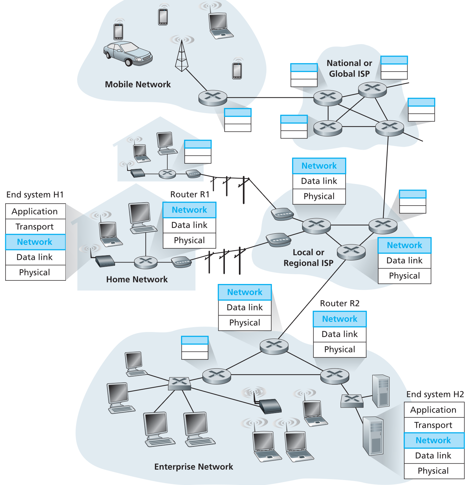

*Figure 4.1 ! The network layer*

Data link

| End system H1 Application Transport | Router R1 Network Data link | Physical |  |
| --- | --- | --- | --- |
| Network | Physical |  | Network |

**Local or** Data link **Regional ISP** Data link Physical Physical **Home Network**

**Network**

## 4.1.1 Forwarding and Routing

The role of the network layer is thus deceptively simple—to move packets from a sending host to a receiving host. To do so, two important network-layer functions can be identified:

- Forwarding. When a packet arrives at a router's input link, the router must move the packet to the appropriate output link. For example, a packet arriving from Host H1 to Router R1 must be forwarded to the next router on a path to H2. In Section 4.3, we'll look inside a router and examine how a packet is actually forwarded from an input link to an output link within a router.

- Routing. The network layer must determine the route or path taken by packets as they flow from a sender to a receiver. The algorithms that calculate these paths are referred to as **routing algorithms.** A routing algorithm would determine, for example, the path along which packets flow from H1 to H2. The terms *forwarding* and *routing* are often used interchangeably by authors dis-

cussing the network layer. We'll use these terms much more precisely in this book. *Forwarding* refers to the router-local action of transferring a packet from an input link interface to the appropriate output link interface. *Routing* refers to the network-wide process that determines the end-to-end paths that packets take from source to destination. Using a driving analogy, consider the trip from Pennsylvania to Florida undertaken by our traveler back in Section 1.3.1. During this trip, our driver passes through many interchanges en route to Florida. We can think of forwarding as the process of getting through a single interchange: A car enters the interchange from one road and determines which road it should take to leave the interchange. We can think of routing as the process of planning the trip from Pennsylvania to Florida: Before embarking on the trip, the driver has consulted a map and chosen one of many paths possible, with each path consisting of a series of road segments connected at interchanges.

Every router has a **forwarding table.** A router forwards a packet by examining the value of a field in the arriving packet's header, and then using this header value to index into the router's forwarding table. The value stored in the forwarding table entry for that header indicates the router's outgoing link interface to which that packet is to be forwarded. Depending on the network-layer protocol, the header value could be the destination address of the packet or an indication of the connection to which the packet belongs. Figure 4.2 provides an example. In Figure 4.2, a packet with a header field value of 0111 arrives to a router. The router indexes into its forwarding table and determines that the output link interface for this packet is interface 2. The router then internally forwards the packet to interface 2. In Section 4.3, we'll look inside a router and examine the forwarding function in much greater detail.

You might now be wondering how the forwarding tables in the routers are configured. This is a crucial issue, one that exposes the important interplay between

4.1 • INTRODUCTION **309**

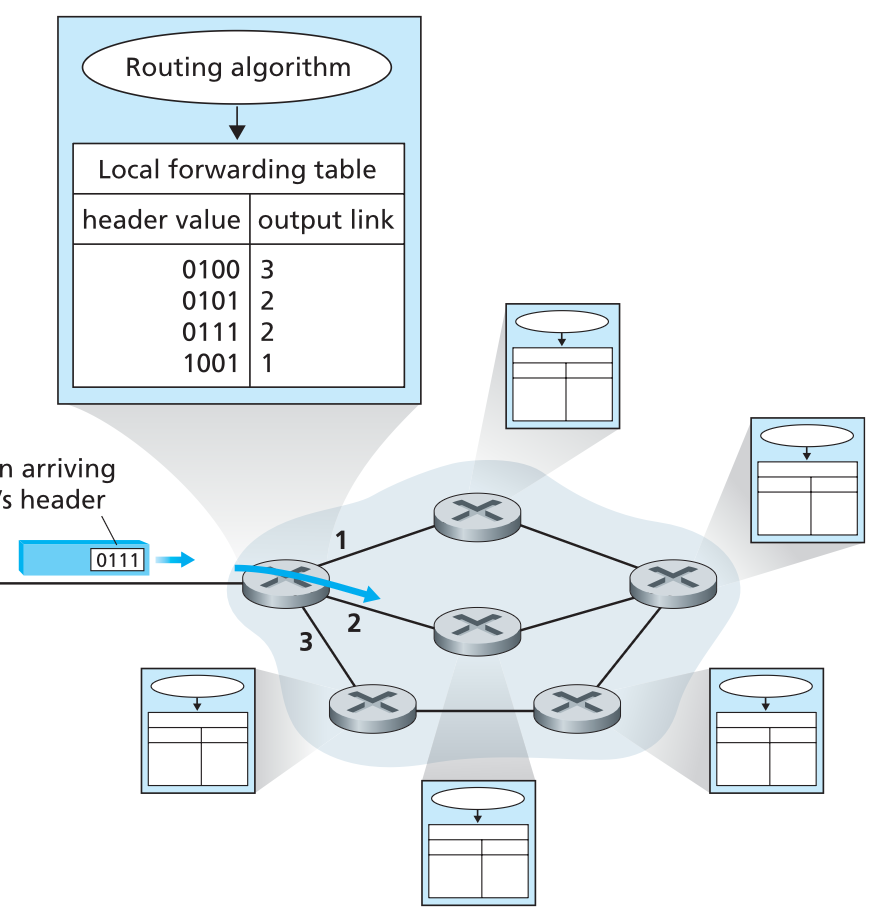

*Figure 4.2 ! Routing algorithms determine values in forwarding tables*

Value in arriving packet's header

routing and forwarding. As shown in Figure 4.2, the routing algorithm determines the values that are inserted into the routers' forwarding tables. The routing algorithm may be centralized (e.g., with an algorithm executing on a central site and downloading routing information to each of the routers) or decentralized (i.e., with a piece of the distributed routing algorithm running in each router). In either case, a router receives routing protocol messages, which are used to configure its forwarding table. The distinct and different purposes of the forwarding and routing functions can be further illustrated by considering the hypothetical (and unrealistic, but technically feasible) case of a network in which all forwarding tables are configured directly by human network operators physically present at the routers. In this case, *no* routing protocols would be required! Of course, the human operators would need to interact with each other to ensure that the forwarding tables were configured in such a way that packets reached their intended destinations. It's also likely that human configuration would be more error-prone and much slower to respond to changes in the network topology than a routing protocol. We're thus fortunate that all networks have both a forwarding *and* a routing function!

While we're on the topic of terminology, it's worth mentioning two other terms that are often used interchangeably, but that we will use more carefully. We'll reserve the term *packet switch* to mean a general packet-switching device that transfers a packet from input link interface to output link interface, according to the value in a field in the header of the packet. Some packet switches, called **link-layer switches** (examined in Chapter 5), base their forwarding decision on values in the fields of the linklayer frame; switches are thus referred to as link-layer (layer 2) devices. Other packet switches, called **routers,** base their forwarding decision on the value in the networklayer field. Routers are thus network-layer (layer 3) devices, but must also implement layer 2 protocols as well, since layer 3 devices require the services of layer 2 to implement their (layer 3) functionality. (To fully appreciate this important distinction, you might want to review Section 1.5.2, where we discuss network-layer datagrams and link-layer frames and their relationship.) To confuse matters, marketing literature often refers to "layer 3 switches" for routers with Ethernet interfaces, but these are really layer 3 devices. Since our focus in this chapter is on the network layer, we use the term *router* in place of *packet switch.* We'll even use the term *router* when talking about packet switches in virtual-circuit networks (soon to be discussed).

#### Connection Setup

We just said that the network layer has two important functions, forwarding and routing. But we'll soon see that in some computer networks there is actually a third important network-layer function, namely, **connection setup.** Recall from our study of TCP that a three-way handshake is required before data can flow from sender to receiver. This allows the sender and receiver to set up the needed state information (for example, sequence number and initial flow-control window size). In an analogous manner, some network-layer architectures—for example, ATM, frame relay, and MPLS (which we will study in Section 5.8)––require the routers along the chosen path from source to destination to handshake with each other in order to set up state before network-layer data packets within a given source-to-destination connection can begin to flow. In the network layer, this process is referred to as *connection setup.* We'll examine connection setup in Section 4.2.

## 4.1.2 Network Service Models

Before delving into the network layer, let's take the broader view and consider the different types of service that might be offered by the network layer. When the transport layer at a sending host transmits a packet into the network (that is, passes it down to the network layer at the sending host), can the transport layer rely on the network layer to deliver the packet to the destination? When multiple packets are sent, will they be delivered to the transport layer in the receiving host in the order in which they were sent? Will the amount of time between the sending of two sequential packet transmissions be the same as the amount of time between their reception? Will the network

4.1 • INTRODUCTION **311**

provide any feedback about congestion in the network? What is the abstract view (properties) of the channel connecting the transport layer in the sending and receiving hosts? The answers to these questions and others are determined by the service model provided by the network layer. The **network service model** defines the characteristics of end-to-end transport of packets between sending and receiving end systems. Let's now consider some possible services that the network layer could provide. In the sending host, when the transport layer passes a packet to the network layer, specific services that could be provided by the network layer include:

- Guaranteed delivery. This service guarantees that the packet will eventually arrive at its destination.

- Guaranteed delivery with bounded delay. This service not only guarantees delivery of the packet, but delivery within a specified host-to-host delay bound (for example, within 100 msec).

Furthermore, the following services could be provided to a *flow of packets* between a given source and destination:

- In-order packet delivery. This service guarantees that packets arrive at the destination in the order that they were sent.

- Guaranteed minimal bandwidth. This network-layer service emulates the behavior of a transmission link of a specified bit rate (for example, 1 Mbps) between sending and receiving hosts. As long as the sending host transmits bits (as part of packets) at a rate below the specified bit rate, then no packet is lost and each packet arrives within a prespecified host-to-host delay (for example, within 40 msec).

- Guaranteed maximum jitter. This service guarantees that the amount of time between the transmission of two successive packets at the sender is equal to the amount of time between their receipt at the destination (or that this spacing changes by no more than some specified value).

- Security services. Using a secret session key known only by a source and destination host, the network layer in the source host could encrypt the payloads of all datagrams being sent to the destination host. The network layer in the destination host would then be responsible for decrypting the payloads. With such a service, confidentiality would be provided to all transport-layer segments (TCP and UDP) between the source and destination hosts. In addition to confidentiality, the network layer could provide data integrity and source authentication services.

This is only a partial list of services that a network layer could provide—there are countless variations possible. The Internet's network layer provides a single service, known as **best-effort** **service.** From Table 4.1, it might appear that *best-effort service* is a euphemism for

| Network | Service | Bandwidth | No-Loss |  |  | Congestion |
| --- | --- | --- | --- | --- | --- | --- |
| Architecture | Model | Guarantee | Guarantee | Ordering | Timing | Indication |
| Internet | Best Effort | None | None | Any order | Not | None |

possible maintained ATM CBR Guaranteed Yes In order Maintained Congestion

constant rate will not occur ATM ABR Guaranteed None In order Not Congestion minimum maintained indication provided

**Table 4.1** ! Internet, ATM CBR, and ATM ABR service models

*no service at all.* With best-effort service, timing between packets is not guaranteed to be preserved, packets are not guaranteed to be received in the order in which they were sent, nor is the eventual delivery of transmitted packets guaranteed. Given this definition, a network that delivered *no* packets to the destination would satisfy the definition of best-effort delivery service. As we'll discuss shortly, however, there are sound reasons for such a minimalist network-layer service model.

Other network architectures have defined and implemented service models that go beyond the Internet's best-effort service. For example, the ATM network architecture [MFA Forum 2012, Black 1995] provides for multiple service models, meaning that different connections can be provided with different classes of service within the same network. A discussion of how an ATM network provides such services is well beyond the scope of this book; our aim here is only to note that alternatives do exist to the Internet's best-effort model. Two of the more important ATM service models are constant bit rate and available bit rate service:

- Constant bit rate (CBR) ATM network service. This was the first ATM service model to be standardized, reflecting early interest by the telephone companies in ATM and the suitability of CBR service for carrying real-time, constant bit rate audio and video traffic. The goal of CBR service is conceptually simple—to provide a flow of packets (known as cells in ATM terminology) with a virtual pipe whose properties are the same as if a dedicated fixed-bandwidth transmission link existed between sending and receiving hosts. With CBR service, a flow of ATM cells is carried across the network in such a way that a cell's end-to-end delay, the variability in a cell's end-to-end delay (that is, the jitter), and the fraction of cells that are lost or delivered late are all guaranteed to be less than specified values. These values are agreed upon by the sending host and the ATM network when the CBR connection is first established.

4.2 • VIRTUAL CIRCUIT AND DATAGRAM NETWORKS **313**

- Available bit rate (ABR) ATM network service. With the Internet offering socalled best-effort service, ATM's ABR might best be characterized as being a slightly-better-than-best-effort service. As with the Internet service model, cells may be lost under ABR service. Unlike in the Internet, however, cells cannot be reordered (although they may be lost), and a minimum cell transmission rate (MCR) is guaranteed to a connection using ABR service. If the network has enough free resources at a given time, a sender may also be able to send cells successfully at a higher rate than the MCR. Additionally, as we saw in Section 3.6, ATM ABR service can provide feedback to the sender (in terms of a congestion notification bit, or an explicit rate at which to send) that controls how the sender adjusts its rate between the MCR and an allowable peak cell rate.

## 4.2 Virtual Circuit and Datagram Networks

Recall from Chapter 3 that a transport layer can offer applications connectionless service or connection-oriented service between two processes. For example, the Internet's transport layer provides each application a choice between two services: UDP, a connectionless service; or TCP, a connection-oriented service. In a similar manner, a network layer can provide connectionless service or connection service between two hosts. Network-layer connection and connectionless services in many ways parallel transport-layer connection-oriented and connectionless services. For example, a network-layer connection service begins with handshaking between the source and destination hosts; and a network-layer connectionless service does not have any handshaking preliminaries. Although the network-layer connection and connectionless services have some parallels with transport-layer connection-oriented and connectionless services, there are crucial differences:

- In the network layer, these services are host-to-host services provided by the network layer for the transport layer. In the transport layer these services are processto-process services provided by the transport layer for the application layer.

- In all major computer network architectures to date (Internet, ATM, frame relay, and so on), the network layer provides either a host-to-host connectionless service or a host-to-host connection service, but not both. Computer networks that provide only a connection service at the network layer are called **virtual-circuit** **(VC) networks;** computer networks that provide only a connectionless service at the network layer are called **datagram networks.**

- The implementations of connection-oriented service in the transport layer and the connection service in the network layer are fundamentally different. We saw in the previous chapter that the transport-layer connection-oriented service is

implemented at the edge of the network in the end systems; we'll see shortly that the network-layer connection service is implemented in the routers in the network core as well as in the end systems.

Virtual-circuit and datagram networks are two fundamental classes of computer networks. They use very different information in making their forwarding decisions. Let's now take a closer look at their implementations.

## 4.2.1 Virtual-Circuit Networks

While the Internet is a datagram network, many alternative network architectures— including those of ATM and frame relay—are virtual-circuit networks and, therefore, use connections at the network layer. These network-layer connections are called **virtual circuits (VCs).** Let's now consider how a VC service can be implemented in a computer network.

AVC consists of (1) a path (that is, a series of links and routers) between the source and destination hosts, (2) VC numbers, one number for each link along the path, and (3) entries in the forwarding table in each router along the path. A packet belonging to a virtual circuit will carry a VC number in its header. Because a virtual circuit may have a different VC number on each link, each intervening router must replace the VC number of each traversing packet with a new VC number. The new VC number is obtained from the forwarding table.

To illustrate the concept, consider the network shown in Figure 4.3. The numbers next to the links of R1 in Figure 4.3 are the link interface numbers. Suppose now that Host A requests that the network establish a VC between itself and Host B. Suppose also that the network chooses the path A-R1-R2-B and assigns VC numbers 12, 22, and 32 to the three links in this path for this virtual circuit. In this case, when a packet in this VC leaves Host A, the value in the VC number field in the packet header is 12; when it leaves R1, the value is 22; and when it leaves R2, the value is 32.

How does the router determine the replacement VC number for a packet traversing the router? For a VC network, each router's forwarding table includes VC

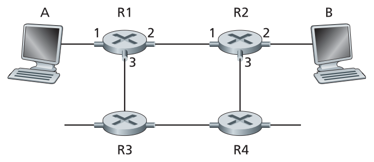

*Figure 4.3 ! A simple virtual circuit network*

number translation; for example, the forwarding table in R1 might look something like this:

Incoming Interface Incoming VC # Outgoing Interface Outgoing VC #  
1 12 2 22  
2 63 1 18  
3 7 2 17  
1 97 3 87  
... ... ... ...

Whenever a new VC is established across a router, an entry is added to the forwarding table. Similarly, whenever a VC terminates, the appropriate entries in each table along its path are removed.

You might be wondering why a packet doesn't just keep the same VC number on each of the links along its route. The answer is twofold. First, replacing the number from link to link reduces the length of the VC field in the packet header. Second, and more importantly, VC setup is considerably simplified by permitting a different VC number at each link along the path of the VC. Specifically, with multiple VC numbers, each link in the path can choose a VC number independently of the VC numbers chosen at other links along the path. If a common VC number were required for all links along the path, the routers would have to exchange and process a substantial number of messages to agree on a common VC number (e.g., one that is not being used by any other existing VC at these routers) to be used for a connection.

In a VC network, the network's routers must maintain **connection state infor-** **mation** for the ongoing connections. Specifically, each time a new connection is established across a router, a new connection entry must be added to the router's forwarding table; and each time a connection is released, an entry must be removed from the table. Note that even if there is no VC-number translation, it is still necessary to maintain connection state information that associates VC numbers with output interface numbers. The issue of whether or not a router maintains connection state information for each ongoing connection is a crucial one—one that we'll return to repeatedly in this book.

There are three identifiable phases in a virtual circuit:

- VC setup. During the setup phase, the sending transport layer contacts the network layer, specifies the receiver's address, and waits for the network to set up the VC. The network layer determines the path between sender and receiver, that is, the series of links and routers through which all packets of the VC will travel. The network layer also determines the VC number for each link along the path. Finally, the network layer adds an entry in the forwarding table in each router

along the path. During VC setup, the network layer may also reserve resources (for example, bandwidth) along the path of the VC.

- Data transfer. As shown in Figure 4.4, once the VC has been established, packets can begin to flow along the VC.

- VC teardown. This is initiated when the sender (or receiver) informs the network layer of its desire to terminate the VC. The network layer will then typically inform the end system on the other side of the network of the call termination and update the forwarding tables in each of the packet routers on the path to indicate that the VC no longer exists. There is a subtle but important distinction between VC setup at the network

layer and connection setup at the transport layer (for example, the TCP three-way handshake we studied in Chapter 3). Connection setup at the transport layer involves only the two end systems. During transport-layer connection setup, the two end systems alone determine the parameters (for example, initial sequence number and flow-control window size) of their transport-layer connection. Although the two end systems are aware of the transport-layer connection, the routers within the network are completely oblivious to it. On the other hand, with a VC network layer, *routers along the path between the two end systems are* *involved in VC setup, and each router is fully aware of all the VCs passing* *through it.*

The messages that the end systems send into the network to initiate or terminate a VC, and the messages passed between the routers to set up the VC (that is, to modify connection state in router tables) are known as **signaling messages,** and the protocols

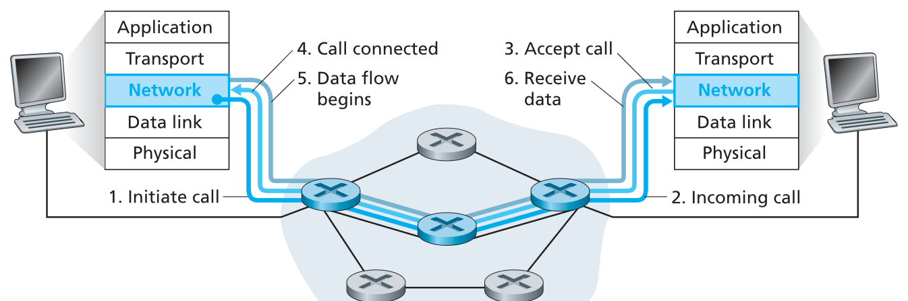

*Figure 4.4 ! Virtual-circuit setup*

Application Application

4. Call connected 3. Accept call

Transport Transport

5. Data flow 6. Receive

**Network** begins data **Network** Data link Data link

Physical Physical

1. Initiate call 2. Incoming call

used to exchange these messages are often referred to as **signaling protocols.** VC setup is shown pictorially in Figure 4.4. We'll not cover VC signaling protocols in this book; see [Black 1997] for a general discussion of signaling in connection-oriented networks and [ITU-T Q.2931 1995] for the specification of ATM's Q.2931 signaling protocol.

## 4.2.2 Datagram Networks

In a **datagram network,** each time an end system wants to send a packet, it stamps the packet with the address of the destination end system and then pops the packet into the network. As shown in Figure 4.5, there is no VC setup and routers do not maintain any VC state information (because there are no VCs!).

As a packet is transmitted from source to destination, it passes through a series of routers. Each of these routers uses the packet's destination address to forward the packet. Specifically, each router has a forwarding table that maps destination addresses to link interfaces; when a packet arrives at the router, the router uses the packet's destination address to look up the appropriate output link interface in the forwarding table. The router then intentionally forwards the packet to that output link interface.

To get some further insight into the lookup operation, let's look at a specific example. Suppose that all destination addresses are 32 bits (which just happens to be the length of the destination address in an IP datagram). A brute-force implementation of the forwarding table would have one entry for every possible destination address. Since there are more than 4 billion possible addresses, this option is totally out of the question.

Application Application

Transport Transport

**Network Network**

1. Send 2. Receive

Data link data data Data link Physical Physical

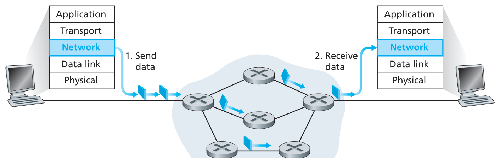

*Figure 4.5 ! Datagram network*

Now let's further suppose that our router has four links, numbered 0 through 3, and that packets are to be forwarded to the link interfaces as follows:

#### Destination Address Range Link Interface

11001000 00010111 00010000 00000000 through 0 11001000 00010111 00010111 11111111

11001000 00010111 00011000 00000000 through 1 11001000 00010111 00011000 11111111

11001000 00010111 00011001 00000000 through 2 11001000 00010111 00011111 11111111

otherwise 3

Clearly, for this example, it is not necessary to have 4 billion entries in the router's forwarding table. We could, for example, have the following forwarding table with just four entries:

#### Prefix Match Link Interface

11001000 00010111 00010 0 11001000 00010111 00011000 1 11001000 00010111 00011 2 otherwise 3

With this style of forwarding table, the router matches a **prefix** of the packet's destination address with the entries in the table; if there's a match, the router forwards the packet to a link associated with the match. For example, suppose the packet's destination address is 11001000 00010111 00010110 10100001; because the 21-bit prefix of this address matches the first entry in the table, the router forwards the packet to link interface 0. If a prefix doesn't match any of the first three entries, then the router forwards the packet to interface 3. Although this sounds simple enough, there's an important subtlety here. You may have noticed that it is possible for a destination address to match more than one entry. For example, the first 24 bits of the address 11001000 00010111 00011000 10101010 match the second entry in the table, and the first 21 bits of the address match the third entry in the table. When there are multiple matches, the router uses the **longest prefix matching rule;** that is, it finds the longest matching entry in the table and forwards the packet to the link

interface associated with the longest prefix match. We'll see exactly why this longest prefix-matching rule is used when we study Internet addressing in more detail in Section 4.4.

Although routers in datagram networks maintain no connection state information, they nevertheless maintain forwarding state information in their forwarding tables. However, the time scale at which this forwarding state information changes is relatively slow. Indeed, in a datagram network the forwarding tables are modified by the routing algorithms, which typically update a forwarding table every one-tofive minutes or so. In a VC network, a forwarding table in a router is modified whenever a new connection is set up through the router or whenever an existing connection through the router is torn down. This could easily happen at a microsecond timescale in a backbone, tier-1 router.

Because forwarding tables in datagram networks can be modified at any time, a series of packets sent from one end system to another may follow different paths through the network and may arrive out of order. [Paxson 1997] and [Jaiswal 2003] present interesting measurement studies of packet reordering and other phenomena in the public Internet.

## 4.2.3 Origins of VC and Datagram Networks

The evolution of datagram and VC networks reflects their origins. The notion of a virtual circuit as a central organizing principle has its roots in the telephony world, which uses real circuits. With call setup and per-call state being maintained at the routers within the network, a VC network is arguably more complex than a datagram network (although see [Molinero-Fernandez 2002] for an interesting comparison of the complexity of circuit- versus packet-switched networks). This, too, is in keeping with its telephony heritage. Telephone networks, by necessity, had their complexity within the network, since they were connecting dumb end-system devices such as rotary telephones. (For those too young to know, a rotary phone is an analog telephone with no buttons—only a dial.)

The Internet as a datagram network, on the other hand, grew out of the need to connect computers together. Given more sophisticated end-system devices, the Internet architects chose to make the network-layer service model as simple as possible. As we have already seen in Chapters 2 and 3, additional functionality (for example, in-order delivery, reliable data transfer, congestion control, and DNS name resolution) is then implemented at a higher layer, in the end systems. This inverts the model of the telephone network, with some interesting consequences:

- Since the resulting Internet network-layer service model makes minimal (no!) service guarantees, it imposes minimal requirements on the network layer. This makes it easier to interconnect networks that use very different link-layer technologies (for example, satellite, Ethernet, fiber, or radio) that have very different transmission rates and loss characteristics. We will address the interconnection of IP networks in detail in Section 4.4.

- As we saw in Chapter 2, applications such as e-mail, the Web, and even some network infrastructure services such as the DNS are implemented in hosts (servers) at the network edge. The ability to add a new service simply by attaching a host to the network and defining a new application-layer protocol (such as HTTP) has allowed new Internet applications such as the Web to be deployed in a remarkably short period of time.

## 4.3 What's Inside a Router?

Now that we've overviewed the network layer's services and functions, let's turn our attention to its **forwarding function—the** actual transfer of packets from a router's incoming links to the appropriate outgoing links at that router. We already took a brief look at a few aspects of forwarding in Section 4.2, namely, addressing and longest prefix matching. We mention here in passing that the terms *forwarding* and *switching* are often used interchangeably by computer-networking researchers and practitioners; we'll use both terms interchangeably in this textbook as well. Ahigh-level view of a generic router architecture is shown in Figure 4.6. Four router components can be identified:

- Input ports. An input port performs several key functions. It performs the physical layer function of terminating an incoming physical link at a router; this is shown in the leftmost box of the input port and the rightmost box of the output port in Figure 4.6. An input port also performs link-layer functions needed to interoperate with the link layer at the other side of the incoming link; this is represented by the middle boxes in the input and output ports. Perhaps most crucially, the lookup function is also performed at the input port; this will occur in the rightmost box of the input port. It is here that the forwarding table is consulted to determine the router output port to which an arriving packet will be forwarded via the switching fabric. Control packets (for example, packets carrying routing protocol information) are forwarded from an input port to the routing processor. Note that the term *port* here— referring to the physical input and output router interfaces—is distinctly different from the software ports associated with network applications and sockets discussed in Chapters 2 and 3.

- Switching fabric. The switching fabric connects the router's input ports to its output ports. This switching fabric is completely contained within the router— a network inside of a network router!

- Output ports. An output port stores packets received from the switching fabric and transmits these packets on the outgoing link by performing the necessary link-layer and physical-layer functions. When a link is bidirectional (that is,

4.3 • WHAT'S INSIDE A ROUTER? **321**

carries traffic in both directions), an output port will typically be paired with the input port for that link on the same line card (a printed circuit board containing one or more input ports, which is connected to the switching fabric).

- Routing processor. The routing processor executes the routing protocols (which we'll study in Section 4.6), maintains routing tables and attached link state information, and computes the forwarding table for the router. It also performs the network management functions that we'll study in Chapter 9.

Recall that in Section 4.1.1 we distinguished between a router's forwarding and routing functions. A router's input ports, output ports, and switching fabric together implement the forwarding function and are almost always implemented in hardware, as shown in Figure 4.6. These forwarding functions are sometimes collectively referred to as the **router forwarding plane.** To appreciate why a hardware implementation is needed, consider that with a 10 Gbps input link and a 64-byte IP datagram, the input port has only 51.2 ns to process the datagram before another datagram may arrive. If *N* ports are combined on a line card (as is often done in practice), the datagram-processing pipeline must operate *N* times faster—far too fast for software implementation. Forwarding plane hardware can be implemented either using a router vendor's own hardware designs, or constructed using purchased merchant-silicon chips (e.g., as sold by companies such as Intel and Broadcom).

While the forwarding plane operates at the nanosecond time scale, a router's control functions—executing the routing protocols, responding to attached links that

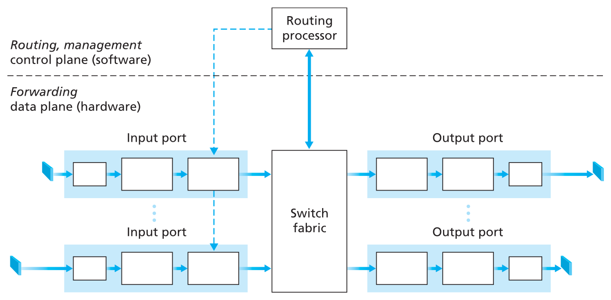

*Figure 4.6 ! Router architecture*

go up or down, and performing management functions such as those we'll study in Chapter 9—operate at the millisecond or second timescale. These **router control** **plane** functions are usually implemented in software and execute on the routing processor (typically a traditional CPU).

Before delving into the details of a router's control and data plane, let's return to our analogy of Section 4.1.1, where packet forwarding was compared to cars entering and leaving an interchange. Let's suppose that the interchange is a roundabout, and that before a car enters the roundabout, a bit of processing is required—the car stops at an entry station and indicates its final destination (not at the local roundabout, but the ultimate destination of its journey). An attendant at the entry station looks up the final destination, determines the roundabout exit that leads to that final destination, and tells the driver which roundabout exit to take. The car enters the roundabout (which may be filled with other cars entering from other input roads and heading to other roundabout exits) and eventually leaves at the prescribed roundabout exit ramp, where it may encounter other cars leaving the roundabout at that exit.

We can recognize the principal router components in Figure 4.6 in this analogy—the entry road and entry station correspond to the input port (with a lookup function to determine to local outgoing port); the roundabout corresponds to the switch fabric; and the roundabout exit road corresponds to the output port. With this analogy, it's instructive to consider where bottlenecks might occur. What happens if cars arrive blazingly fast (for example, the roundabout is in Germany or Italy!) but the station attendant is slow? How fast must the attendant work to ensure there's no backup on an entry road? Even with a blazingly fast attendant, what happens if cars traverse the roundabout slowly—can backups still occur? And what happens if most of the entering cars all want to leave the roundabout at the same exit ramp—can backups occur at the exit ramp or elsewhere? How should the roundabout operate if we want to assign priorities to different cars, or block certain cars from entering the roundabout in the first place? These are all analogous to critical questions faced by router and switch designers.

In the following subsections, we'll look at router functions in more detail. [Iyer 2008, Chao 2001; Chuang 2005; Turner 1988; McKeown 1997a; Partridge 1998] provide a discussion of specific router architectures. For concreteness, the ensuing discussion assumes a datagram network in which forwarding decisions are based on the packet's destination address (rather than a VC number in a virtual-circuit network). However, the concepts and techniques are quite similar for a virtualcircuit network.

## 4.3.1 Input Processing

Amore detailed view of input processing is given in Figure 4.7. As discussed above, the input port's line termination function and link-layer processing implement the physical and link layers for that individual input link. The lookup performed in the input port is central to the router's operation—it is here that the router uses the forwarding table to look up the output port to which an arriving packet will be

### CASE HISTORY

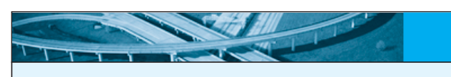

**CISCO SYSTEMS: DOMINATING THE NETWORK CORE**

As of this writing 2012, Cisco employs more than 65,000 people. How did this gorilla of a networking company come to be? It all started in 1984 in the living room of a Silicon Valley apartment.

Len Bosak and his wife Sandy Lerner were working at Stanford University when they had the idea to build and sell Internet routers to research and academic institutions, the primary adopters of the Internet at that time. Sandy Lerner came up with the name Cisco (an abbreviation for San Francisco), and she also designed the company's bridge logo. Corporate headquarters was their living room, and they financed the project with credit cards and moonlighting consulting jobs. At the end of 1986, Cisco's revenues reached $250,000 a month. At the end of 1987, Cisco succeeded in attracting venture capital— $2 million from Sequoia Capital in exchange for one-third of the company. Over the next few years, Cisco continued to grow and grab more and more market share. At the same time, relations between Bosak/Lerner and Cisco management became strained. Cisco went public in 1990; in the same year Lerner and Bosak left the company.

Over the years, Cisco has expanded well beyond the router market, selling security, wireless caching, Ethernet switch, datacenter infrastructure, video conferencing, and voice-over IP products and services. However, Cisco is facing increased international competition, including from Huawei, a rapidly growing Chinese network-gear company. Other sources of competition for Cisco in the router and switched Ethernet space include Alcatel-Lucent and Juniper.

forwarded via the switching fabric. The forwarding table is computed and updated by the routing processor, with a shadow copy typically stored at each input port. The forwarding table is copied from the routing processor to the line cards over a separate bus (e.g., a PCI bus) indicated by the dashed line from the routing processor to the input line cards in Figure 4.6. With a shadow copy, forwarding decisions can be made locally, at each input port, without invoking the centralized routing processor on a per-packet basis and thus avoiding a centralized processing bottleneck. Given the existence of a forwarding table, lookup is conceptually simple—we just search through the forwarding table looking for the longest prefix match, as described

|  | Data link | Lookup, fowarding, |  |
| --- | --- | --- | --- |
| Line | processing | queuing | Switch |
| termination | (protocol, |  | fabric |

decapsulation)

**Figure 4.7** ! Input port processing

in Section 4.2.2. But at Gigabit transmission rates, this lookup must be performed in nanoseconds (recall our earlier example of a 10 Gbps link and a 64-byte IP datagram). Thus, not only must lookup be performed in hardware, but techniques beyond a simple linear search through a large table are needed; surveys of fast lookup algorithms can be found in [Gupta 2001, Ruiz-Sanchez 2001]. Special attention must also be paid to memory access times, resulting in designs with embedded on-chip DRAM and faster SRAM (used as a DRAM cache) memories. Ternary Content Address Memories (TCAMs) are also often used for lookup. With a TCAM, a 32-bit IP address is presented to the memory, which returns the content of the forwarding table entry for that address in essentially constant time. The Cisco 8500 has a 64K CAM for each input port.

Once a packet's output port has been determined via the lookup, the packet can be sent into the switching fabric. In some designs, a packet may be temporarily blocked from entering the switching fabric if packets from other input ports are currently using the fabric. A blocked packet will be queued at the input port and then scheduled to cross the fabric at a later point in time. We'll take a closer look at the blocking, queuing, and scheduling of packets (at both input ports and output ports) in Section 4.3.4. Although "lookup" is arguably the most important action in input port processing, many other actions must be taken: (1) physical- and link-layer processing must occur, as discussed above; (2) the packet's version number, checksum and time-to-live field—all of which we'll study in Section 4.4.1—must be checked and the latter two fields rewritten; and (3) counters used for network management (such as the number of IP datagrams received) must be updated.

Let's close our discussion of input port processing by noting that the input port steps of looking up an IP address ("match") then sending the packet into the switching fabric ("action") is a specific case of a more general "match plus action" abstraction that is performed in many networked devices, not just routers. In link-layer switches (covered in Chapter 5), link-layer destination addresses are looked up and several actions may be taken in addition to sending the frame into the switching fabric towards the output port. In firewalls (covered in Chapter 8)—devices that filter out selected incoming packets—an incoming packet whose header matches a given criteria (e.g., a combination of source/destination IP addresses and transport-layer port numbers) may be prevented from being forwarded (action). In a network address translator (NAT, covered in Section 4.4), an incoming packet whose transport-layer port number matches a given value will have its port number rewritten before forwarding (action). Thus, the "match plus action" abstraction is both powerful and prevalent in network devices.

## 4.3.2 Switching

The switching fabric is at the very heart of a router, as it is through this fabric that the packets are actually switched (that is, forwarded) from an input port to an output port. Switching can be accomplished in a number of ways, as shown in Figure 4.8:

- Switching via memory. The simplest, earliest routers were traditional computers, with switching between input and output ports being done under direct control of

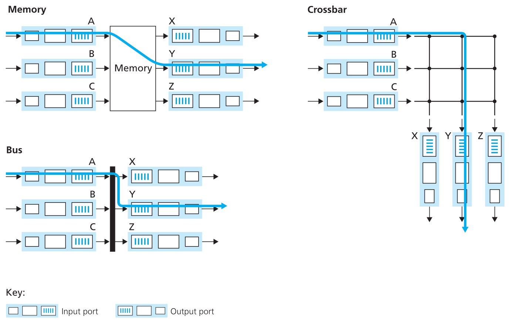

*Figure 4.8 ! Three switching techniques*

the CPU (routing processor). Input and output ports functioned as traditional I/O devices in a traditional operating system. An input port with an arriving packet first signaled the routing processor via an interrupt. The packet was then copied from the input port into processor memory. The routing processor then extracted the destination address from the header, looked up the appropriate output port in the forwarding table, and copied the packet to the output port's buffers. In this scenario, if the memory bandwidth is such that *B* packets per second can be written into, or read from, memory, then the overall forwarding throughput (the total rate at which packets are transferred from input ports to output ports) must be less than *B/2.* Note also that two packets cannot be forwarded at the same time, even if they have different destination ports, since only one memory read/write over the shared system bus can be done at a time.

Many modern routers switch via memory. A major difference from early routers, however, is that the lookup of the destination address and the storing of the packet into the appropriate memory location are performed by processing on the input line cards. In some ways, routers that switch via memory look very much like shared-memory multiprocessors, with the processing on a line card switching (writing) packets into the memory of the appropriate output port. Cisco's Catalyst 8500 series switches [Cisco 8500 2012] forward packets via a shared memory.

- Switching via a bus. In this approach, an input port transfers a packet directly to the output port over a shared bus, without intervention by the routing processor. This is typically done by having the input port pre-pend a switch-internal label (header) to the packet indicating the local output port to which this packet is being transferred and transmitting the packet onto the bus. The packet is received by all output ports, but only the port that matches the label will keep the packet. The label is then removed at the output port, as this label is only used within the switch to cross the bus. If multiple packets arrive to the router at the same time, each at a different input port, all but one must wait since only one packet can cross the bus at a time. Because every packet must cross the single bus, the switching speed of the router is limited to the bus speed; in our roundabout analogy, this is as if the roundabout could only contain one car at a time. Nonetheless, switching via a bus is often sufficient for routers that operate in small local area and enterprise networks. The Cisco 5600 [Cisco Switches 2012] switches packets over a 32 Gbps backplane bus.

- Switching via an interconnection network. One way to overcome the bandwidth limitation of a single, shared bus is to use a more sophisticated interconnection network, such as those that have been used in the past to interconnect processors in a multiprocessor computer architecture. A crossbar switch is an interconnection network consisting of 2N buses that connect *N* input ports to *N* output ports, as shown in Figure 4.8. Each vertical bus intersects each horizontal bus at a crosspoint, which can be opened or closed at any time by the switch fabric controller (whose logic is part of the switching fabric itself). When a packet arrives from port A and needs to be forwarded to port Y, the switch controller closes the crosspoint at the intersection of busses A and Y, and port A then sends the packet onto its bus, which is picked up (only) by bus Y. Note that a packet from port B can be forwarded to port X at the same time, since the A-to-Y and B-to-X packets use different input and output busses. Thus, unlike the previous two switching approaches, crossbar networks are capable of forwarding multiple packets in parallel. However, if two packets from two different input ports are destined to the same output port, then one will have to wait at the input, since only one packet can be sent over any given bus at a time. More sophisticated interconnection networks use multiple stages of switching elements to allow packets from different input ports to proceed towards the same output port at the same time through the switching fabric. See [Tobagi 1990] for a survey of switch architectures. Cisco 12000 family switches [Cisco 12000 2012] use an interconnection network.

## 4.3.3 Output Processing

Output port processing, shown in Figure 4.9, takes packets that have been stored in the output port's memory and transmits them over the output link. This includes selecting and de-queueing packets for transmission, and performing the needed linklayer and physical-layer transmission functions.

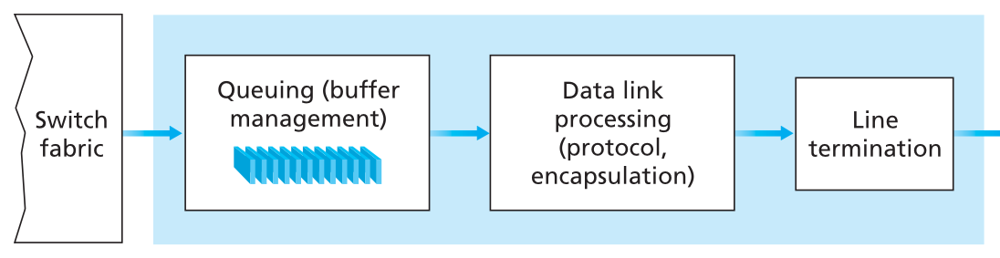

*Figure 4.9 ! Output port processing*

|  | Queuing (buffer | Data link |  |
| --- | --- | --- | --- |
| Switch | management) | processing | Line |
| fabric |  | (protocol, | termination |

encapsulation)

## 4.3.4 Where Does Queueing Occur?

If we consider input and output port functionality and the configurations shown in Figure 4.8, it's clear that packet queues may form at both the input ports *and* the output ports, just as we identified cases where cars may wait at the inputs and outputs of the traffic intersection in our roundabout analogy. The location and extent of queueing (either at the input port queues or the output port queues) will depend on the traffic load, the relative speed of the switching fabric, and the line speed. Let's now consider these queues in a bit more detail, since as these queues grow large, the router's memory can eventually be exhausted and **packet loss** will occur when no memory is available to store arriving packets. Recall that in our earlier discussions, we said that packets were "lost within the network" or "dropped at a router." It is here, at these queues within a router, where such packets are actually dropped and lost.

Suppose that the input and output line speeds (transmission rates) all have an identical transmission rate of $R_{line}$ packets per second, and that there are N input ports and *N* output ports. To further simplify the discussion, let's assume that all packets have the same fixed length, and the packets arrive to input ports in a synchronous manner. That is, the time to send a packet on any link is equal to the time to receive a packet on any link, and during such an interval of time, either zero or one packet can arrive on an input link. Define the switching fabric transfer rate $R_{switch}$ as the rate at which packets can be moved from input port to output port. If $R_{switch}$ is N times faster than $R_{line}$, then only negligible queuing will occur at the input ports. This is because even in the worst case, where all *N* input lines are receiving packets, and all packets are to be forwarded to the same output port, each batch of *N* packets (one packet per input port) can be cleared through the switch fabric before the next batch arrives.

But what can happen at the output ports? Let's suppose that $R_{switch}$ is still N times faster than $R_{line}$. Once again, packets arriving at each of the N input ports are destined to the same output port. In this case, in the time it takes to send a single packet onto the outgoing link, *N* new packets will arrive at this output port. Since the output port can transmit only a single packet in a unit of time (the packet transmission time), the *N* arriving packets will have to queue (wait) for transmission over the outgoing link. Then *N* more packets can possibly arrive in the time it takes to

transmit just one of the *N* packets that had just previously been queued. And so on. Eventually, the number of queued packets can grow large enough to exhaust available memory at the output port, in which case packets are dropped.

Output port queuing is illustrated in Figure 4.10. At time *t,* a packet has arrived at each of the incoming input ports, each destined for the uppermost outgoing port. Assuming identical line speeds and a switch operating at three times the line speed, one time unit later (that is, in the time needed to receive or send a packet), all three original packets have been transferred to the outgoing port and are queued awaiting transmission. In the next time unit, one of these three packets will have been transmitted over the outgoing link. In our example, two *new* packets have arrived at the incoming side of the switch; one of these packets is destined for this uppermost output port.

Given that router buffers are needed to absorb the fluctuations in traffic load, the natural question to ask is how *much* buffering is required. For many years, the rule of thumb [RFC 3439] for buffer sizing was that the amount of buffering *(B)* should be equal to an average round-trip time *(RTT,* say 250 msec) times the link capacity *(C).* This result is based on an analysis of the queueing dynamics of a relatively small number of TCP flows [Villamizar 1994]. Thus, a 10 Gbps link with an RTT of 250 msec would need an amount of buffering equal to *B = RTT* · *C* = 2.5 Gbits of buffers. Recent

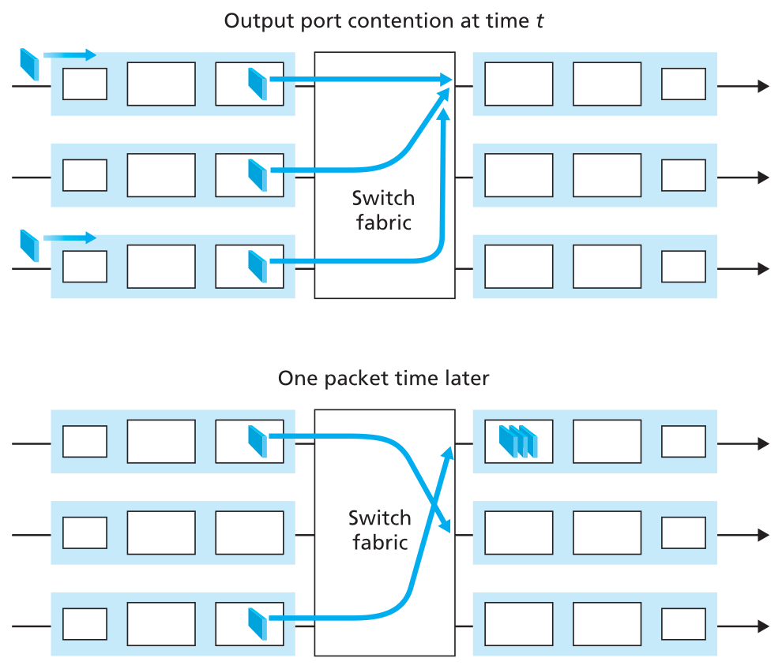

*Figure 4.10 ! Output port queuing*

theoretical and experimental efforts [Appenzeller 2004], however, suggest that when there are a large number of TCP flows *(N)* passing through a link, the amount of buffer-

*—*

ing needed is *B = RTT* ! *C/√N.* With a large number of flows typically passing through large backbone router links (see, e.g., [Fraleigh 2003]), the value of *N* can be large, with the decrease in needed buffer size becoming quite significant. [Appenzellar 2004; Wischik 2005; Beheshti 2008] provide very readable discussions of the buffer sizing problem from a theoretical, implementation, and operational standpoint.

Aconsequence of output port queuing is that a **packet scheduler** at the output port must choose one packet among those queued for transmission. This selection might be done on a simple basis, such as first-come-first-served (FCFS) scheduling, or a more sophisticated scheduling discipline such as weighted fair queuing (WFQ), which shares the outgoing link fairly among the different end-to-end connections that have packets queued for transmission. Packet scheduling plays a crucial role in providing **quality-of-service guarantees.** We'll thus cover packet scheduling extensively in Chapter 7. A discussion of output port packet scheduling disciplines is [Cisco Queue 2012].

Similarly, if there is not enough memory to buffer an incoming packet, a decision must be made to either drop the arriving packet (a policy known as **drop-tail)** or remove one or more already-queued packets to make room for the newly arrived packet. In some cases, it may be advantageous to drop (or mark the header of) a packet *before* the buffer is full in order to provide a congestion signal to the sender. A number of packet-dropping and -marking policies (which collectively have become known as **active queue management (AQM)** algorithms) have been proposed and analyzed [Labrador 1999, Hollot 2002]. One of the most widely studied and implemented AQM algorithms is the **Random Early Detection (RED)** algorithm. Under RED, a weighted average is maintained for the length of the output queue. If the average queue length is less than a minimum threshold, $min_{th}$, when a packet arrives, the packet is admitted to the queue. Conversely, if the queue is full or the average queue length is greater than a maximum threshold, $max_{th}$, when a packet arrives, the packet is marked or dropped. Finally, if the packet arrives to find an average queue length in the interval [$min_{th}$, $max_{th}$], the packet is marked or dropped with a probability that is typically some function of the average queue length, $min_{th}$, and $max_{th}$. A number of probabilistic marking/dropping functions have been proposed, and various versions of RED have been analytically modeled, simulated, and/or implemented. [Christiansen 2001] and [Floyd 2012] provide overviews and pointers to additional reading.

If the switch fabric is not fast enough (relative to the input line speeds) to transfer *all* arriving packets through the fabric without delay, then packet queuing can also occur at the input ports, as packets must join input port queues to wait their turn to be transferred through the switching fabric to the output port. To illustrate an important consequence of this queuing, consider a crossbar switching fabric and suppose that (1) all link speeds are identical, (2) that one packet can be transferred from any one input port to a given output port in the same amount of time it takes for a packet to be received on an input link, and (3) packets are moved from a given input queue to their

desired output queue in an FCFS manner. Multiple packets can be transferred in parallel, as long as their output ports are different. However, if two packets at the front of two input queues are destined for the same output queue, then one of the packets will be blocked and must wait at the input queue—the switching fabric can transfer only one packet to a given output port at a time.

Figure 4.11 shows an example in which two packets (darkly shaded) at the front of their input queues are destined for the same upper-right output port. Suppose that the switch fabric chooses to transfer the packet from the front of the upper-left queue. In this case, the darkly shaded packet in the lower-left queue must wait. But not only must this darkly shaded packet wait, so too must the lightly shaded packet that is queued behind that packet in the lower-left queue, even though there is *no* contention for the middle-right output port (the destination for the lightly shaded packet). This phenomenon is known as **head-of-the-line (HOL) blocking** in an

Key:

| destined for upper output | destined for middle output | destined for lower output |
| --- | --- | --- |
| port | port | port |

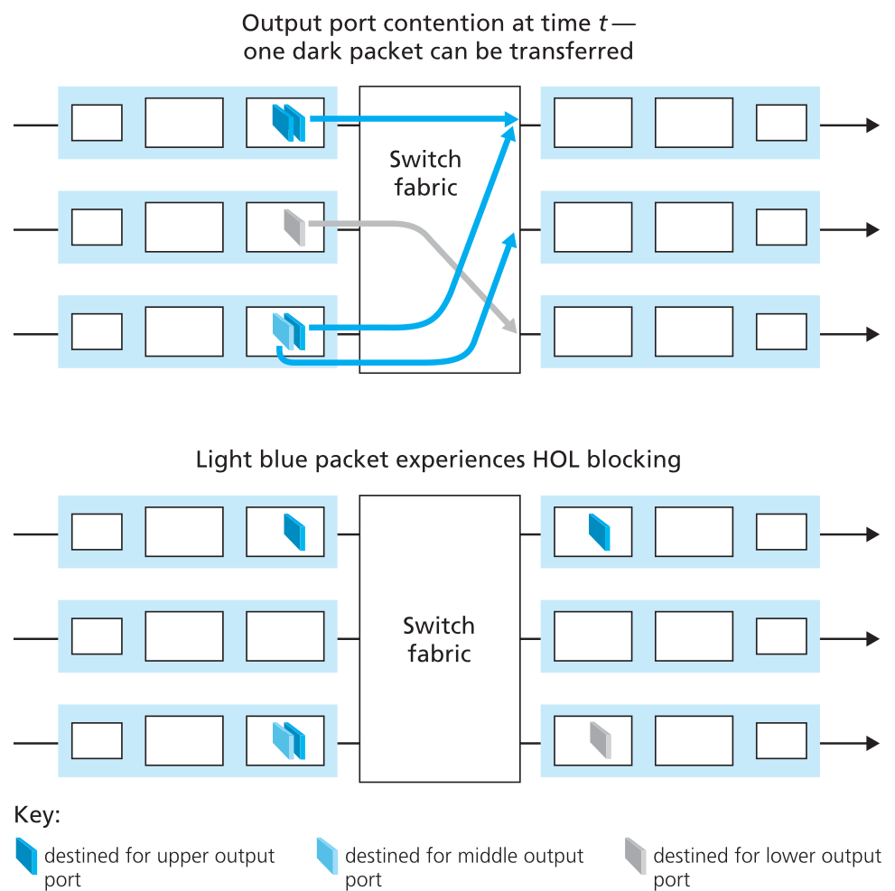

*Figure 4.11 ! HOL blocking at an input queued switch*

4.4 • THE INTERNET PROTOCOL (IP) **331**

input-queued switch—a queued packet in an input queue must wait for transfer through the fabric (even though its output port is free) because it is blocked by another packet at the head of the line. [Karol 1987] shows that due to HOL blocking, the input queue will grow to unbounded length (informally, this is equivalent to saying that significant packet loss will occur) under certain assumptions as soon as the packet arrival rate on the input links reaches only 58 percent of their capacity. A number of solutions to HOL blocking are discussed in [McKeown 1997b].

## 4.3.5 The Routing Control Plane

In our discussion thus far and in Figure 4.6, we've implicitly assumed that the routing control plane fully resides and executes in a routing processor within the router. The network-wide routing control plane is thus decentralized—with different pieces (e.g., of a routing algorithm) executing at different routers and interacting by sending control messages to each other. Indeed, today's Internet routers and the routing algorithms we'll study in Section 4.6 operate in exactly this manner. Additionally, router and switch vendors bundle their hardware data plane and software control plane together into closed (but inter-operable) platforms in a vertically integrated product.

Recently, a number of researchers [Caesar 2005a, Casado 2009, McKeown 2008] have begun exploring new router control plane architectures in which part of the control plane is implemented in the routers (e.g., local measurement/reporting of link state, forwarding table installation and maintenance) along with the data plane, and part of the control plane can be implemented externally to the router (e.g., in a centralized server, which could perform route calculation). A well-defined API dictates how these two parts interact and communicate with each other. These researchers argue that separating the software control plane from the hardware data plane (with a minimal router-resident control plane) can simplify routing by replacing distributed routing calculation with centralized routing calculation, and enable network innovation by allowing different customized control planes to operate over fast hardware data planes.

## 4.4 The Internet Protocol (IP): Forwarding and

## Addressing in the Internet

Our discussion of network-layer addressing and forwarding thus far has been without reference to any specific computer network. In this section, we'll turn our attention to how addressing and forwarding are done in the Internet. We'll see that Internet addressing and forwarding are important components of the Internet Protocol (IP). There are two versions of IP in use today. We'll first examine the widely deployed IP protocol version 4, which is usually referred to simply as IPv4

table ICMP protocol

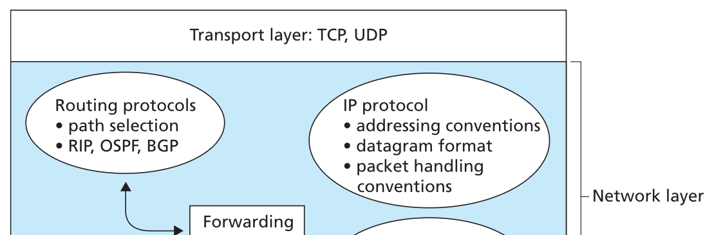

- error reporting

- router "signaling"

Link layer Physical layer

**Figure 4.12** ! A look inside the Internet's network layer

[RFC 791]. We'll examine IP version 6 [RFC 2460; RFC 4291], which has been proposed to replace IPv4, at the end of this section.

But before beginning our foray into IP, let's take a step back and consider the components that make up the Internet's network layer. As shown in Figure 4.12, the Internet's network layer has three major components. The first component is the IP protocol, the topic of this section. The second major component is the routing component, which determines the path a datagram follows from source to destination. We mentioned earlier that routing protocols compute the forwarding tables that are used to forward packets through the network. We'll study the Internet's routing protocols in Section 4.6. The final component of the network layer is a facility to report errors in datagrams and respond to requests for certain network-layer information. We'll cover the Internet's network-layer error- and information-reporting protocol, the Internet Control Message Protocol (ICMP), in Section 4.4.3.

## 4.4.1 Datagram Format

Recall that a network-layer packet is referred to as a *datagram.* We begin our study of IP with an overview of the syntax and semantics of the IPv4 datagram. You might be thinking that nothing could be drier than the syntax and semantics of a packet's bits. Nevertheless, the datagram plays a central role in the Internet—every networking student and professional needs to see it, absorb it, and master it. The

Header Version length

32 bits

Type of service Datagram length (bytes)

16-bit Identifier Flags 13-bit Fragmentation offset

Time-to-live Upper-layer protocol Header checksum

32-bit Source IP address

32-bit Destination IP address

Options (if any)

Data

**Figure 4.13** ! IPv4 datagram format

IPv4 datagram format is shown in Figure 4.13. The key fields in the IPv4 datagram are the following:

- Version number. These 4 bits specify the IP protocol version of the datagram. By looking at the version number, the router can determine how to interpret the remainder of the IP datagram. Different versions of IP use different datagram formats. The datagram format for the current version of IP, IPv4, is shown in Figure 4.13. The datagram format for the new version of IP (IPv6) is discussed at the end of this section.

- Header length. Because an IPv4 datagram can contain a variable number of options (which are included in the IPv4 datagram header), these 4 bits are needed to determine where in the IP datagram the data actually begins. Most IP datagrams do not contain options, so the typical IP datagram has a 20-byte header.

- Type of service. The type of service (TOS) bits were included in the IPv4 header to allow different types of IP datagrams (for example, datagrams particularly requiring low delay, high throughput, or reliability) to be distinguished from each other. For example, it might be useful to distinguish real-time datagrams (such as those used by an IP telephony application) from non-real-time traffic (for example, FTP). The specific level of service to be provided is a policy issue determined by the router's administrator. We'll explore the topic of differentiated service in Chapter 7.

- Datagram length. This is the total length of the IP datagram (header plus data), measured in bytes. Since this field is 16 bits long, the theoretical maximum size of the IP datagram is 65,535 bytes. However, datagrams are rarely larger than 1,500 bytes.

- Identifier, flags, fragmentation offset. These three fields have to do with so-called IP fragmentation, a topic we will consider in depth shortly. Interestingly, the new version of IP, IPv6, does not allow for fragmentation at routers.

- Time-to-live. The time-to-live (TTL) field is included to ensure that datagrams do not circulate forever (due to, for example, a long-lived routing loop) in the network. This field is decremented by one each time the datagram is processed by a router. If the TTL field reaches 0, the datagram must be dropped.

- Protocol. This field is used only when an IP datagram reaches its final destination. The value of this field indicates the specific transport-layer protocol to which the data portion of this IP datagram should be passed. For example, a value of 6 indicates that the data portion is passed to TCP, while a value of 17 indicates that the data is passed to UDP. For a list of all possible values, see [IANA Protocol Numbers 2012]. Note that the protocol number in the IP datagram has a role that is analogous to the role of the port number field in the transportlayer segment. The protocol number is the glue that binds the network and transport layers together, whereas the port number is the glue that binds the transport and application layers together. We'll see in Chapter 5 that the link-layer frame also has a special field that binds the link layer to the network layer.

- Header checksum. The header checksum aids a router in detecting bit errors in a received IP datagram. The header checksum is computed by treating each 2 bytes in the header as a number and summing these numbers using 1s complement arithmetic. As discussed in Section 3.3, the 1s complement of this sum, known as the Internet checksum, is stored in the checksum field. A router computes the header checksum for each received IP datagram and detects an error condition if the checksum carried in the datagram header does not equal the computed checksum. Routers typically discard datagrams for which an error has been detected. Note that the checksum must be recomputed and stored again at each router, as the TTL field, and possibly the options field as well, may change. An interesting discussion of fast algorithms for computing the Internet checksum is [RFC 1071]. A question often asked at this point is, why does TCP/IP perform error checking at both the transport and network layers? There are several reasons for this repetition. First, note that only the IP header is checksummed at the IP layer, while the TCP/UDP checksum is computed over the entire TCP/UDP segment. Second, TCP/UDP and IP do not necessarily both have to belong to the same protocol stack. TCP can, in principle, run over a different protocol (for example, ATM) and IP can carry data that will not be passed to TCP/UDP.

- Source and destination IP addresses. When a source creates a datagram, it inserts its IP address into the source IP address field and inserts the address of the

ultimate destination into the destination IP address field. Often the source host determines the destination address via a DNS lookup, as discussed in Chapter 2.

We'll discuss IP addressing in detail in Section 4.4.2.

- Options. The options fields allow an IP header to be extended. Header options were meant to be used rarely—hence the decision to save overhead by not including the information in options fields in every datagram header. However, the mere existence of options does complicate matters—since datagram headers can be of variable length, one cannot determine a priori where the data field will start. Also, since some datagrams may require options processing and others may not, the amount of time needed to process an IP datagram at a router can vary greatly. These considerations become particularly important for IP processing in high-performance routers and hosts. For these reasons and others, IP options were dropped in the IPv6 header, as discussed in Section 4.4.4.

- Data (payload). Finally, we come to the last and most important field—the rai- *son d'être* for the datagram in the first place! In most circumstances, the data field of the IP datagram contains the transport-layer segment (TCP or UDP) to be delivered to the destination. However, the data field can carry other types of data, such as ICMP messages (discussed in Section 4.4.3).

Note that an IP datagram has a total of 20 bytes of header (assuming no options). If the datagram carries a TCP segment, then each (nonfragmented) datagram carries a total of 40 bytes of header (20 bytes of IP header plus 20 bytes of TCP header) along with the application-layer message.

#### IP Datagram Fragmentation

We'll see in Chapter 5 that not all link-layer protocols can carry network-layer packets of the same size. Some protocols can carry big datagrams, whereas other protocols can carry only little packets. For example, Ethernet frames can carry up to 1,500 bytes of data, whereas frames for some wide-area links can carry no more than 576 bytes. The maximum amount of data that a link-layer frame can carry is called the maximum transmission unit (MTU). Because each IP datagram is encapsulated within the link-layer frame for transport from one router to the next router, the MTU of the link-layer protocol places a hard limit on the length of an IP datagram. Having a hard limit on the size of an IP datagram is not much of a problem. What is a problem is that each of the links along the route between sender and destination can use different link-layer protocols, and each of these protocols can have different MTUs.

To understand the forwarding issue better, imagine that *you* are a router that interconnects several links, each running different link-layer protocols with different MTUs. Suppose you receive an IP datagram from one link. You check your forwarding table to determine the outgoing link, and this outgoing link has an MTU that is smaller than the length of the IP datagram. Time to panic—how are you going to squeeze this oversized IP datagram into the payload field of the link-layer frame?

The solution is to fragment the data in the IP datagram into two or more smaller IP datagrams, encapsulate each of these smaller IP datagrams in a separate link-layer frame; and send these frames over the outgoing link. Each of these smaller datagrams is referred to as a **fragment.**

Fragments need to be reassembled before they reach the transport layer at the destination. Indeed, both TCP and UDP are expecting to receive complete, unfragmented segments from the network layer. The designers of IPv4 felt that reassembling datagrams in the routers would introduce significant complication into the protocol and put a damper on router performance. (If you were a router, would you want to be reassembling fragments on top of everything else you had to do?) Sticking to the principle of keeping the network core simple, the designers of IPv4 decided to put the job of datagram reassembly in the end systems rather than in network routers.

When a destination host receives a series of datagrams from the same source, it needs to determine whether any of these datagrams are fragments of some original, larger datagram. If some datagrams are fragments, it must further determine when it has received the last fragment and how the fragments it has received should be pieced back together to form the original datagram. To allow the destination host to perform these reassembly tasks, the designers of IP (version 4) put *identification,* *flag,* and *fragmentation offset* fields in the IP datagram header. When a datagram is created, the sending host stamps the datagram with an identification number as well as source and destination addresses. Typically, the sending host increments the identification number for each datagram it sends. When a router needs to fragment a datagram, each resulting datagram (that is, fragment) is stamped with the source address, destination address, and identification number of the original datagram. When the destination receives a series of datagrams from the same sending host, it can examine the identification numbers of the datagrams to determine which of the datagrams are actually fragments of the same larger datagram. Because IP is an unreliable service, one or more of the fragments may never arrive at the destination. For this reason, in order for the destination host to be absolutely sure it has received the last fragment of the original datagram, the last fragment has a flag bit set to 0, whereas all the other fragments have this flag bit set to 1. Also, in order for the destination host to determine whether a fragment is missing (and also to be able to reassemble the fragments in their proper order), the offset field is used to specify where the fragment fits within the original IP datagram.

Figure 4.14 illustrates an example. A datagram of 4,000 bytes (20 bytes of IP header plus 3,980 bytes of IP payload) arrives at a router and must be forwarded to a link with an MTU of 1,500 bytes. This implies that the 3,980 data bytes in the original datagram must be allocated to three separate fragments (each of which is also an IP datagram). Suppose that the original datagram is stamped with an identification number of 777. The characteristics of the three fragments are shown in Table 4.2. The values in Table 4.2 reflect the requirement that the amount of original payload data in all but the last fragment be a multiple of 8 bytes, and that the offset value be specified in units of 8-byte chunks.

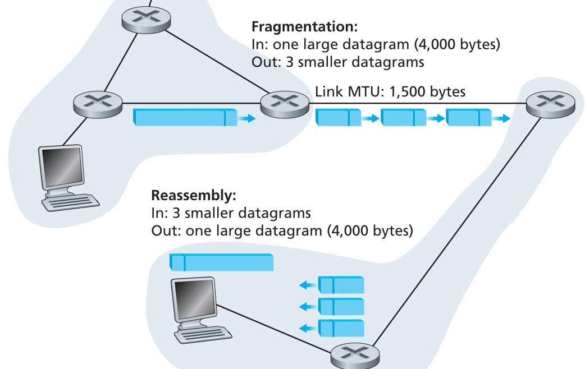

*Figure 4.14 ! IP fragmentation and reassembly*

At the destination, the payload of the datagram is passed to the transport layer only after the IP layer has fully reconstructed the original IP datagram. If one or more of the fragments does not arrive at the destination, the incomplete datagram is discarded and not passed to the transport layer. But, as we learned in the previous

| Fragment | Bytes | ID | Offset | Flag |
| --- | --- | --- | --- | --- |
| 1st fragment | 1,480 bytes in | identification " 777 | offset " 0 (meaning the data | flag " 1 (meaning |
|  | the data field of |  | should be inserted beginning | there is more) |

the IP datagram at byte 0) 2nd fragment 1,480 bytes identification " 777 offset " 185 (meaning the data flag " 1 (meaning of data should be inserted beginning at byte there is more)

1,480. Note that 185 · 8 " 1,480) 3rd fragment 1,020 bytes identification " 777 offset " 370 (meaning the data flag " 0 (meaning this (" 3,980–1,480–1,480) should be inserted beginning at byte is the last fragment) of data 2,960. Note that 370 · 8 " 2,960)

**Table 4.2** ! IP fragments

chapter, if TCP is being used at the transport layer, then TCP will recover from this loss by having the source retransmit the data in the original datagram.

We have just learned that IP fragmentation plays an important role in gluing together the many disparate link-layer technologies. But fragmentation also has its costs. First, it complicates routers and end systems, which need to be designed to accommodate datagram fragmentation and reassembly. Second, fragmentation can be used to create lethal DoS attacks, whereby the attacker sends a series of bizarre and unexpected fragments. A classic example is the Jolt2 attack, where the attacker sends a stream of small fragments to the target host, none of which has an offset of zero. The target can collapse as it attempts to rebuild datagrams out of the degenerate packets. Another class of exploits sends overlapping IP fragments, that is, fragments whose offset values are set so that the fragments do not align properly. Vulnerable operating systems, not knowing what to do with overlapping fragments, can crash [Skoudis 2006]. As we'll see at the end of this section, a new version of the IP protocol, IPv6, does away with fragmentation altogether, thereby streamlining IP packet processing and making IP less vulnerable to attack.

At this book's Web site, we provide a Java applet that generates fragments. You provide the incoming datagram size, the MTU, and the incoming datagram identification. The applet automatically generates the fragments for you. See http:// www.awl.com/kurose-ross.

## 4.4.2 IPv4 Addressing

We now turn our attention to IPv4 addressing. Although you may be thinking that addressing must be a straightforward topic, hopefully by the end of this chapter you'll be convinced that Internet addressing is not only a juicy, subtle, and interesting topic but also one that is of central importance to the Internet. Excellent treatments of IPv4 addressing are [3Com Addressing 2012] and the first chapter in [Stewart 1999].

Before discussing IP addressing, however, we'll need to say a few words about how hosts and routers are connected into the network. A host typically has only a single link into the network; when IP in the host wants to send a datagram, it does so over this link. The boundary between the host and the physical link is called an **interface.** Now consider a router and its interfaces. Because a router's job is to receive a datagram on one link and forward the datagram on some other link, a router necessarily has two or more links to which it is connected. The boundary between the router and any one of its links is also called an interface. A router thus has multiple interfaces, one for each of its links. Because every host and router is capable of sending and receiving IP datagrams, IP requires each host and router interface to have its own IP address. Thus, an IP address is technically associated with an interface, rather than with the host or router containing that interface.

Each IP address is 32 bits long (equivalently, 4 bytes), and there are thus a total of $2^{32}$ possible IP addresses. By approximating $2^{10}$ by $10^{3}$, it is easy to see that there

are about 4 billion possible IP addresses. These addresses are typically written in so-called **dotted-decimal notation,** in which each byte of the address is written in its decimal form and is separated by a period (dot) from other bytes in the address. For example, consider the IP address 193.32.216.9. The 193 is the decimal equivalent of the first 8 bits of the address; the 32 is the decimal equivalent of the second 8 bits of the address, and so on. Thus, the address 193.32.216.9 in binary notation is 11000001 00100000 11011000 00001001

Each interface on every host and router in the global Internet must have an IP address that is globally unique (except for interfaces behind NATs, as discussed at the end of this section). These addresses cannot be chosen in a willy-nilly manner, however. A portion of an interface's IP address will be determined by the subnet to which it is connected.

Figure 4.15 provides an example of IP addressing and interfaces. In this figure, one router (with three interfaces) is used to interconnect seven hosts. Take a close look at the IP addresses assigned to the host and router interfaces, as there are several things to notice. The three hosts in the upper-left portion of Figure 4.15, and the router interface to which they are connected, all have an IP address of the form 223.1.1.xxx. That is, they all have the same leftmost 24 bits in their IP address. The four interfaces are also interconnected to each other by a network *that contains no routers.* This network

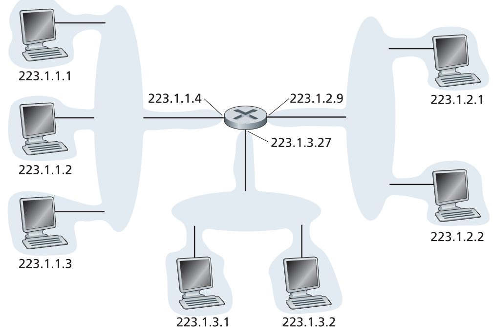

*Figure 4.15 ! Interface addresses and subnets*

could be interconnected by an Ethernet LAN, in which case the interfaces would be interconnected by an Ethernet switch (as we'll discuss in Chapter 5), or by a wireless access point (as we'll discuss in Chapter 6). We'll represent this routerless network connecting these hosts as a cloud for now, and dive into the internals of such networks in Chapters 5 and 6.

In IP terms, this network interconnecting three host interfaces and one router interface forms a **subnet** [RFC 950]. (A subnet is also called an *IP network* or simply a *network* in the Internet literature.) IP addressing assigns an address to this subnet: 223.1.1.0/24, where the /24 notation, sometimes known as a **subnet mask,** indicates that the leftmost 24 bits of the 32-bit quantity define the subnet address. The subnet 223.1.1.0/24 thus consists of the three host interfaces (223.1.1.1, 223.1.1.2, and 223.1.1.3) and one router interface (223.1.1.4). Any additional hosts attached to the 223.1.1.0/24 subnet would be *required* to have an address of the form 223.1.1.xxx. There are two additional subnets shown in Figure 4.15: the 223.1.2.0/24 network and the 223.1.3.0/24 subnet. Figure 4.16 illustrates the three IP subnets present in Figure 4.15.

The IP definition of a subnet is not restricted to Ethernet segments that connect multiple hosts to a router interface. To get some insight here, consider Figure 4.17, which shows three routers that are interconnected with each other by point-to-point links. Each router has three interfaces, one for each point-to-point link and one for the broadcast link that directly connects the router to a pair of hosts. What subnets are present here? Three subnets, 223.1.1.0/24, 223.1.2.0/24, and 223.1.3.0/24, are similar to the subnets we encountered in Figure 4.15. But note that there are three

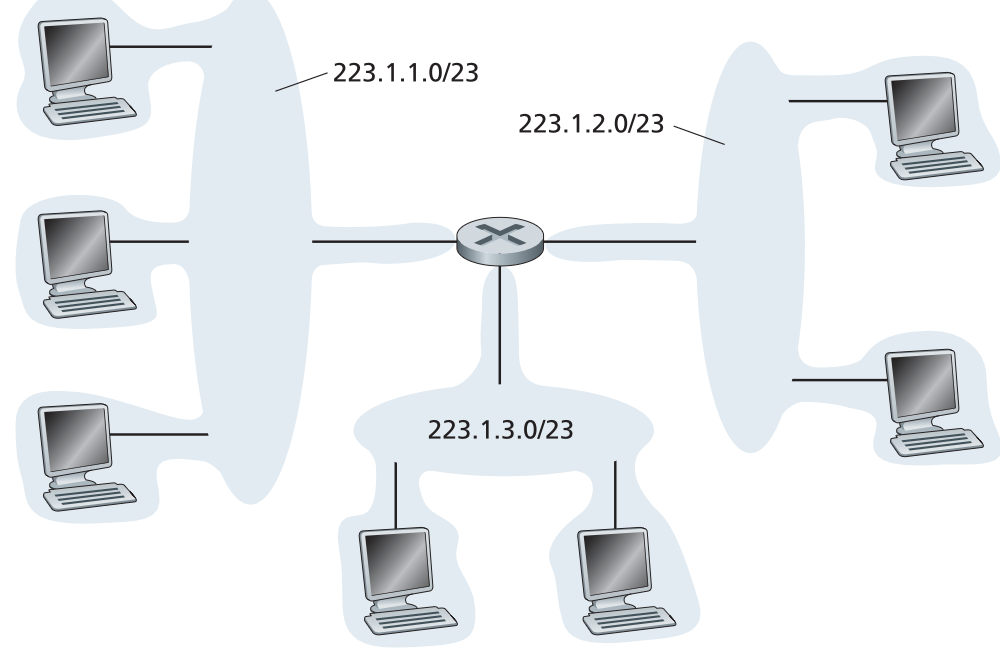

*Figure 4.16 ! Subnet addresses*

additional subnets in this example as well: one subnet, 223.1.9.0/24, for the interfaces that connect routers R1 and R2; another subnet, 223.1.8.0/24, for the interfaces that connect routers R2 and R3; and a third subnet, 223.1.7.0/24, for the interfaces that connect routers R3 and R1. For a general interconnected system of routers and hosts, we can use the following recipe to define the subnets in the system:

*To determine the subnets, detach each interface from its host or router, creating* *islands of isolated networks, with interfaces terminating the end points of the* *isolated networks. Each of these isolated networks is called a* ***subnet.***

If we apply this procedure to the interconnected system in Figure 4.17, we get six islands or subnets.

From the discussion above, it's clear that an organization (such as a company or academic institution) with multiple Ethernet segments and point-to-point links will have multiple subnets, with all of the devices on a given subnet having the same subnet address. In principle, the different subnets could have quite different subnet addresses. In practice, however, their subnet addresses often have much in common. To understand why, let's next turn our attention to how addressing is handled in the global Internet.

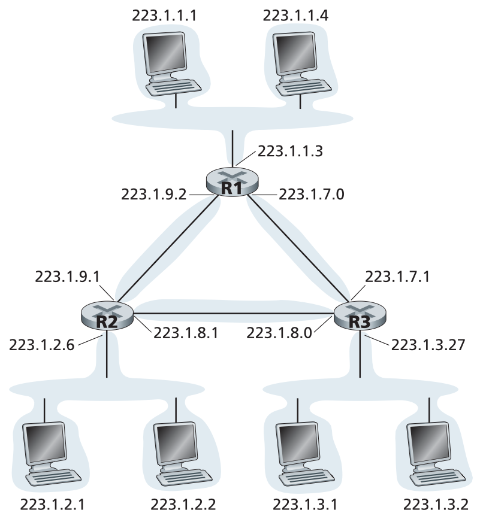

*Figure 4.17 ! Three routers interconnecting six subnets*

The Internet's address assignment strategy is known as **Classless Interdomain** **Routing (CIDR—pronounced** *cider)* [RFC 4632]. CIDR generalizes the notion of subnet addressing. As with subnet addressing, the 32-bit IP address is divided into two parts and again has the dotted-decimal form *a.b.c.d/x,* where *x* indicates the number of bits in the first part of the address.

The *x* most significant bits of an address of the form *a.b.c.d/x* constitute the network portion of the IP address, and are often referred to as the **prefix** (or *net-* *work prefix)of* the address. An organization is typically assigned a block of contiguous addresses, that is, a range of addresses with a common prefix (see the Principles in Practice sidebar). In this case, the IP addresses of devices within the organization will share the common prefix. When we cover the Internet's BGP

### PRINCIPLES IN PRACTICE


This example of an ISP that connects eight organizations to the Internet nicely illustrates how carefully allocated CIDRized addresses facilitate routing. Suppose, as shown in Figure 4.18, that the ISP (which we'll call Fly-By-Night-ISP) advertises to the outside world that it should be sent any datagrams whose first 20 address bits match 200.23.16.0/20. The rest of the world need not know that within the address block 200.23.16.0/20 there are in fact eight other organizations, each with its own subnets. This ability to use a single prefix to advertise multiple networks is often referred to as **address aggregation** (also **route aggregation** or **route summarization).**

Address aggregation works extremely well when addresses are allocated in blocks to ISPs and then from ISPs to client organizations. But what happens when addresses are not allocated in such a hierarchical manner? What would happen, for example, if Fly-By- Night-ISP acquires ISPs-R-Us and then has Organization 1 connect to the Internet through its subsidiary ISPs-R-Us? As shown in Figure 4.18, the subsidiary ISPs-R-Us owns the address block 199.31.0.0/16, but Organization 1's IP addresses are unfortunately outside of this address block. What should be done here? Certainly, Organization 1 could renumber all of its routers and hosts to have addresses within the ISPs-R-Us address block. But this is a costly solution, and Organization 1 might well be reassigned to another subsidiary in the future. The solution typically adopted is for Organization 1 to keep its IP addresses in 200.23.18.0/23. In this case, as shown in Figure 4.19, Fly-By-Night-ISP continues to advertise the address block 200.23.16.0/20 and ISPs-R-Us continues to advertise 199.31.0.0/16. However, ISPs-R-Us now also advertises the block of addresses for Organization 1, 200.23.18.0/23. When other routers in the larger Internet see the address blocks 200.23.16.0/20 (from Fly-By-Night-ISP) and 200.23.18.0/23 (from ISPs-R-Us) and want to route to an address in the block 200.23.18.0/23, they will use longest prefix matching (see Section 4.2.2), and route toward ISPs-R-Us, as it advertises the longest (most specific) address prefix that matches the destination address.

Organization 0 200.23.16.0/23

"Send me anything

Organization 1 with addresses

beginning

200.23.18.0/23

200.23.16.0/20"

Fly-By-Night-ISP Organization 2 200.23.20.0/23

Internet

Organization 7 200.23.30.0/23 "Send me anything

with addresses beginning 199.31.0.0/16"

ISPs-R-Us

**Figure 4.18** ! Hierarchical addressing and route aggregation

Organization 0 200.23.16.0/23

"Send me anything

Organization 2 with addresses

beginning

200.23.20.0/23

200.23.16.0/20"

Fly-By-Night-ISP Organization 7 200.23.30.0/23

"Send me anything with addresses Internet

Organization 1 beginning

199.31.0.0/16 or

200.23.18.0/23 200.23.18.0/23" ISPs-R-Us

**Figure 4.19** ! ISPs-R-Us has a more specific route to Organization 1

routing protocol in Section 4.6, we'll see that only these *x* leading prefix bits are considered by routers outside the organization's network. That is, when a router outside the organization forwards a datagram whose destination address is inside the organization, only the leading *x* bits of the address need be considered. This considerably reduces the size of the forwarding table in these routers, since a *sin-* *gle* entry of the form *a.b.c.d/x* will be sufficient to forward packets to *any* destination within the organization.

The remaining 32-x bits of an address can be thought of as distinguishing among the devices *within* the organization, all of which have the same network prefix. These are the bits that will be considered when forwarding packets at routers *within* the organization. These lower-order bits may (or may not) have an additional subnetting structure, such as that discussed above. For example, suppose the first 21 bits of the CIDRized address a.b.c.d/21 specify the organization's network prefix and are common to the IP addresses of all devices in that organization. The remaining 11 bits then identify the specific hosts in the organization. The organization's internal structure might be such that these 11 rightmost bits are used for subnetting within the organization, as discussed above. For example, a.b.c.d/24 might refer to a specific subnet within the organization.

Before CIDR was adopted, the network portions of an IP address were constrained to be 8, 16, or 24 bits in length, an addressing scheme known as **classful** **addressing,** since subnets with 8-, 16-, and 24-bit subnet addresses were known as class A, B, and C networks, respectively. The requirement that the subnet portion of an IP address be exactly 1, 2, or 3 bytes long turned out to be problematic for supporting the rapidly growing number of organizations with small and medium-sized subnets. A class C (/24) subnet could accommodate only up to $2^{8}$ – 2 = 254 hosts (two of the $2^{8}$ = 256 addresses are reserved for special use)—too small for many organizations. However, a class B (/16) subnet, which supports up to 65,634 hosts, was too large. Under classful addressing, an organization with, say, 2,000 hosts was typically allocated a class B (/16) subnet address. This led to a rapid depletion of the class B address space and poor utilization of the assigned address space. For example, the organization that used a class B address for its 2,000 hosts was allocated enough of the address space for up to 65,534 interfaces—leaving more than 63,000 addresses that could not be used by other organizations.

We would be remiss if we did not mention yet another type of IP address, the IP broadcast address 255.255.255.255. When a host sends a datagram with destination address 255.255.255.255, the message is delivered to all hosts on the same subnet. Routers optionally forward the message into neighboring subnets as well (although they usually don't).

Having now studied IP addressing in detail, we need to know how hosts and subnets get their addresses in the first place. Let's begin by looking at how an organization gets a block of addresses for its devices, and then look at how a device (such as a host) is assigned an address from within the organization's block of addresses.

#### Obtaining a Block of Addresses

In order to obtain a block of IP addresses for use within an organization's subnet, a network administrator might first contact its ISP, which would provide addresses from a larger block of addresses that had already been allocated to the ISP. For example, the ISP may itself have been allocated the address block 200.23.16.0/20. The ISP, in turn, could divide its address block into eight equal-sized contiguous address blocks and give one of these address blocks out to each of up to eight organ-

izations that are supported by this ISP, as shown below. (We have underlined the  
subnet part of these addresses for your convenience.)  
ISP's block 200.23.16.0/20 11001000 00010111 00010000 00000000  
Organization 0 200.23.16.0/23 11001000 00010111 00010000 00000000  
Organization 1 200.23.18.0/23 11001000 00010111 00010010 00000000  
Organization 2 200.23.20.0/23 11001000 00010111 00010100 00000000  
. . . . . . . . .

Organization 7 200.23.30.0/23 11001000 00010111 00011110 00000000

While obtaining a set of addresses from an ISP is one way to get a block of addresses, it is not the only way. Clearly, there must also be a way for the ISP itself to get a block of addresses. Is there a global authority that has ultimate responsibility for managing the IP address space and allocating address blocks to ISPs and other organizations? Indeed there is! IP addresses are managed under the authority of the Internet Corporation for Assigned Names and Numbers (ICANN) [ICANN 2012], based on guidelines set forth in [RFC 2050]. The role of the nonprofit ICANN organization [NTIA 1998] is not only to allocate IP addresses, but also to manage the DNS root servers. It also has the very contentious job of assigning domain names and resolving domain name disputes. The ICANN allocates addresses to regional Internet registries (for example, ARIN, RIPE, APNIC, and LACNIC, which together form the Address Supporting Organization of ICANN [ASO-ICANN 2012]), and handle the allocation/management of addresses within their regions.

#### Obtaining a Host Address: the Dynamic Host Configuration Protocol

Once an organization has obtained a block of addresses, it can assign individual IP addresses to the host and router interfaces in its organization. A system administrator will typically manually configure the IP addresses into the router (often remotely, with a network management tool). Host addresses can also be configured manually, but more often this task is now done using the **Dynamic Host Configu-** **ration Protocol (DHCP)** [RFC 2131]. DHCP allows a host to obtain (be allocated) an IP address automatically. A network administrator can configure DHCP so that a

given host receives the same IP address each time it connects to the network, or a host may be assigned a **temporary IP address** that will be different each time the host connects to the network. In addition to host IP address assignment, DHCP also allows a host to learn additional information, such as its subnet mask, the address of its first-hop router (often called the default gateway), and the address of its local DNS server.

Because of DHCP's ability to automate the network-related aspects of connecting a host into a network, it is often referred to as a **plug-and-play protocol.** This capability makes it *very* attractive to the network administrator who would otherwise have to perform these tasks manually! DHCP is also enjoying widespread use in residential Internet access networks and in wireless LANs, where hosts join and leave the network frequently. Consider, for example, the student who carries a laptop from a dormitory room to a library to a classroom. It is likely that in each location, the student will be connecting into a new subnet and hence will need a new IP address at each location. DHCP is ideally suited to this situation, as there are many users coming and going, and addresses are needed for only a limited amount of time. DHCP is similarly useful in residential ISP access networks. Consider, for example, a residential ISP that has 2,000 customers, but no more than 400 customers are ever online at the same time. In this case, rather than needing a block of 2,048 addresses, a DHCP server that assigns addresses dynamically needs only a block of 512 addresses (for example, a block of the form a.b.c.d/23). As the hosts join and leave, the DHCP server needs to update its list of available IP addresses. Each time a host joins, the DHCP server allocates an arbitrary address from its current pool of available addresses; each time a host leaves, its address is returned to the pool.

DHCP is a client-server protocol. A client is typically a newly arriving host wanting to obtain network configuration information, including an IP address for itself. In the simplest case, each subnet (in the addressing sense of Figure 4.17) will have a DHCP server. If no server is present on the subnet, a DHCP relay agent (typically a router) that knows the address of a DHCP server for that network is needed. Figure 4.20 shows a DHCP server attached to subnet 223.1.2/24, with the router serving as the relay agent for arriving clients attached to subnets 223.1.1/24 and 223.1.3/24. In our discussion below, we'll assume that a DHCP server is available on the subnet.

For a newly arriving host, the DHCP protocol is a four-step process, as shown in Figure 4.21 for the network setting shown in Figure 4.20. In this figure, yiaddr (as in "your Internet address") indicates the address being allocated to the newly arriving client. The four steps are:

- DHCP server discovery. The first task of a newly arriving host is to find a DHCP server with which to interact. This is done using a **DHCP discover message,** which a client sends within a UDP packet to port 67. The UDP packet is encapsulated in an IP datagram. But to whom should this datagram be sent? The host doesn't even know the IP address of the network to which it is attaching, much

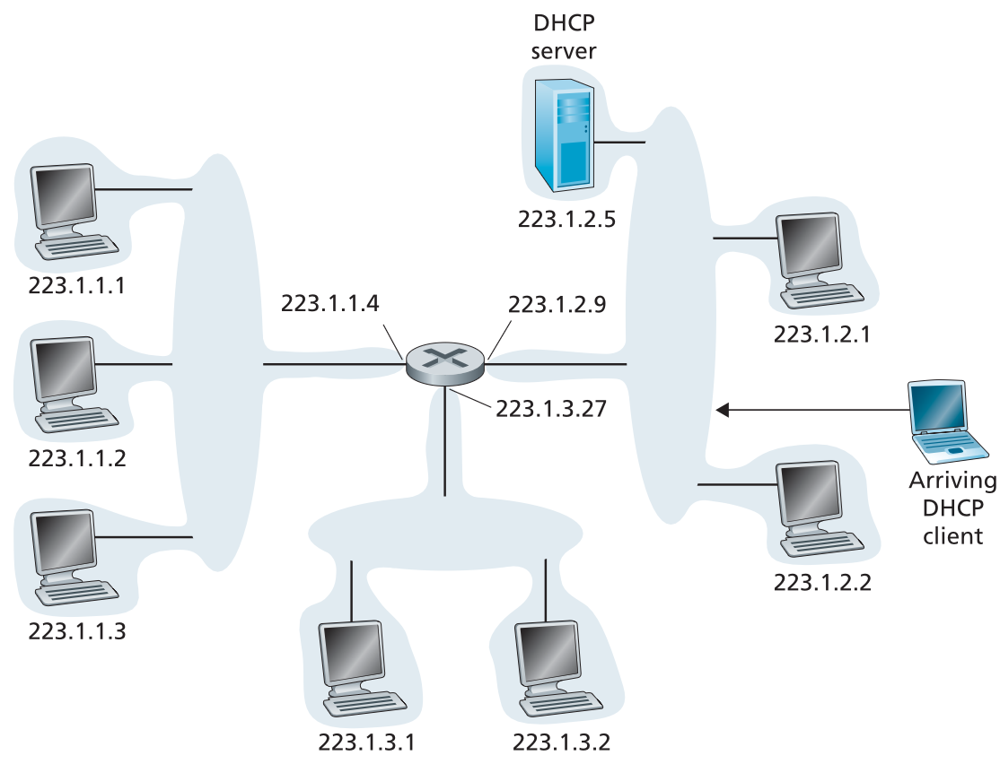

*Figure 4.20 ! DHCP client-server scenario*

less the address of a DHCP server for this network. Given this, the DHCP client creates an IP datagram containing its DHCP discover message along with the broadcast destination IP address of 255.255.255.255 and a "this host" source IP address of 0.0.0.0. The DHCP client passes the IP datagram to the link layer, which then broadcasts this frame to all nodes attached to the subnet (we will cover the details of link-layer broadcasting in Section 5.4).

- DHCP server offer(s). ADHCPserver receiving a DHCPdiscover message responds to the client with a **DHCP offer message** that is broadcast to all nodes on the subnet, again using the IP broadcast address of 255.255.255.255. (You might want to think about why this server reply must also be broadcast). Since several DHCP servers can be present on the subnet, the client may find itself in the enviable position of being able to choose from among several offers. Each server offer message contains the transaction ID of the received discover message, the proposed IP address for the client, the network mask, and an IP **address** **lease time—the** amount of time for which the IP address will be valid. It is common for the server to set the lease time to several hours or days [Droms 2002].


*Figure 4.21 ! DHCP client-server interaction*

- DHCP request. The newly arriving client will choose from among one or more server offers and respond to its selected offer with a **DHCP request message,** echoing back the configuration parameters.

- DHCP ACK. The server responds to the DHCP request message with a DHCP **ACK message,** confirming the requested parameters. Once the client receives the DHCP ACK, the interaction is complete and the

client can use the DHCP-allocated IP address for the lease duration. Since a client

may want to use its address beyond the lease's expiration, DHCP also provides a mechanism that allows a client to renew its lease on an IP address.

The value of DHCP's plug-and-play capability is clear, considering the fact that the alternative is to manually configure a host's IP address. Consider the student who moves from classroom to library to dorm room with a laptop, joins a new subnet, and thus obtains a new IP address at each location. It is unimaginable that a system administrator would have to reconfigure laptops at each location, and few students (except those taking a computer networking class!) would have the expertise to configure their laptops manually. From a mobility aspect, however, DHCP does have shortcomings. Since a new IP address is obtained from DHCP each time a node connects to a new subnet, a TCP connection to a remote application cannot be maintained as a mobile node moves between subnets. In Chapter 6, we will examine mobile IP—a recent extension to the IP infrastructure that allows a mobile node to use a single permanent address as it moves between subnets. Additional details about DHCP can be found in [Droms 2002] and [dhc 2012]. An open source reference implementation of DHCP is available from the Internet Systems Consortium [ISC 2012].

#### Network Address Translation (NAT)

Given our discussion about Internet addresses and the IPv4 datagram format, we're now well aware that every IP-capable device needs an IP address. With the proliferation of small office, home office (SOHO) subnets, this would seem to imply that whenever a SOHO wants to install a LAN to connect multiple machines, a range of addresses would need to be allocated by the ISP to cover all of the SOHO's machines. If the subnet grew bigger (for example, the kids at home have not only their own computers, but have smartphones and networked Game Boys as well), a larger block of addresses would have to be allocated. But what if the ISP had already allocated the contiguous portions of the SOHO network's current address range? And what typical homeowner wants (or should need) to know how to manage IP addresses in the first place? Fortunately, there is a simpler approach to address allocation that has found increasingly widespread use in such scenarios: **network** **address translation (NAT)** [RFC 2663; RFC 3022; Zhang 2007].

Figure 4.22 shows the operation of a NAT-enabled router. The NAT-enabled router, residing in the home, has an interface that is part of the home network on the right of Figure 4.22. Addressing within the home network is exactly as we have seen above—all four interfaces in the home network have the same subnet address of 10.0.0/24. The address space 10.0.0.0/8 is one of three portions of the IP address space that is reserved in [RFC 1918] for a private network or a **realm** with private addresses, such as the home network in Figure 4.22. A *realm with private addresses* refers to a network whose addresses only have meaning to devices within that network. To see why this is important, consider the fact that there are hundreds of

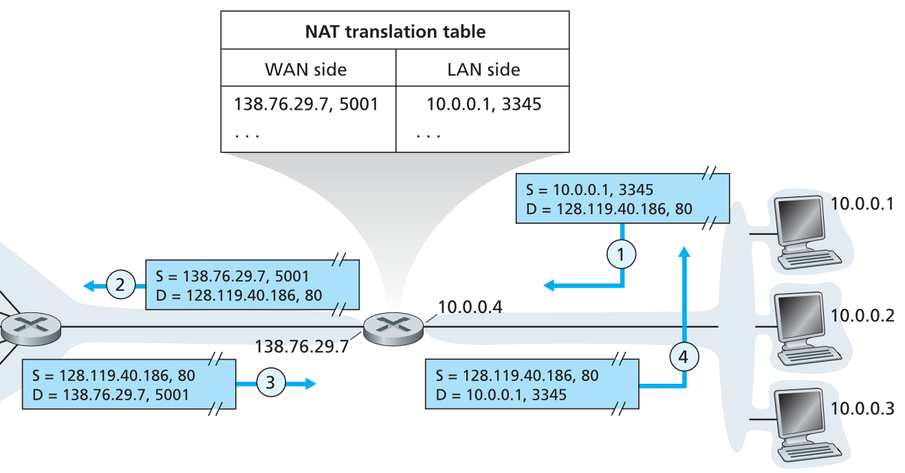

*Figure 4.22 ! Network address translation*

thousands of home networks, many using the same address space, 10.0.0.0/24. Devices within a given home network can send packets to each other using 10.0.0.0/24 addressing. However, packets forwarded *beyond* the home network into the larger global Internet clearly cannot use these addresses (as either a source or a destination address) because there are hundreds of thousands of networks using this block of addresses. That is, the 10.0.0.0/24 addresses can only have meaning within the given home network. But if private addresses only have meaning within a given network, how is addressing handled when packets are sent to or received from the global Internet, where addresses are necessarily unique? The answer lies in understanding NAT.

The NAT-enabled router does not *look* like a router to the outside world. Instead the NAT router behaves to the outside world as a *single* device with a *single* IP address. In Figure 4.22, all traffic leaving the home router for the larger Internet has a source IP address of 138.76.29.7, and all traffic entering the home router must have a destination address of 138.76.29.7. In essence, the NAT-enabled router is hiding the details of the home network from the outside world. (As an aside, you might wonder where the home network computers get their addresses and where the router gets its single IP address. Often, the answer is the same—DHCP! The router gets its address from the ISP's DHCP server, and the router runs a DHCP server to provide addresses to computers within the NAT-DHCP-router-controlled home network's address space.)

If all datagrams arriving at the NAT router from the WAN have the same destination IP address (specifically, that of the WAN-side interface of the NAT router), then how does the router know the internal host to which it should forward a given datagram? The trick is to use a **NAT translation table** at the NAT router, and to include port numbers as well as IP addresses in the table entries.

Consider the example in Figure 4.22. Suppose a user sitting in a home network behind host 10.0.0.1 requests a Web page on some Web server (port 80) with IP address 128.119.40.186. The host 10.0.0.1 assigns the (arbitrary) source port number 3345 and sends the datagram into the LAN. The NAT router receives the datagram, generates a new source port number 5001 for the datagram, replaces the source IP address with its WAN-side IP address 138.76.29.7, and replaces the original source port number 3345 with the new source port number 5001. When generating a new source port number, the NAT router can select any source port number that is not currently in the NAT translation table. (Note that because a port number field is 16 bits long, the NAT protocol can support over 60,000 simultaneous connections with a single WAN-side IP address for the router!) NAT in the router also adds an entry to its NAT translation table. The Web server, blissfully unaware that the arriving datagram containing the HTTP request has been manipulated by the NAT router, responds with a datagram whose destination address is the IP address of the NAT router, and whose destination port number is 5001. When this datagram arrives at the NAT router, the router indexes the NAT translation table using the destination IP address and destination port number to obtain the appropriate IP address (10.0.0.1) and destination port number (3345) for the browser in the home network. The router then rewrites the datagram's destination address and destination port number, and forwards the datagram into the home network.

NAT has enjoyed widespread deployment in recent years. But we should mention that many purists in the IETF community loudly object to NAT. First, they argue, port numbers are meant to be used for addressing processes, not for addressing hosts. (This violation can indeed cause problems for servers running on the home network, since, as we have seen in Chapter 2, server processes wait for incoming requests at well-known port numbers.) Second, they argue, routers are supposed to process packets only up to layer 3. Third, they argue, the NAT protocol violates the so-called end-to-end argument; that is, hosts should be talking directly with each other, without interfering nodes modifying IP addresses and port numbers. And fourth, they argue, we should use IPv6 (see Section 4.4.4) to solve the shortage of IP addresses, rather than recklessly patching up the problem with a stopgap solution like NAT. But like it or not, NAT has become an important component of the Internet.

Yet another major problem with NAT is that it interferes with P2P applications, including P2P file-sharing applications and P2P Voice-over-IP applications. Recall from Chapter 2 that in a P2P application, any participating Peer A should be able to initiate a TCP connection to any other participating Peer B. The essence of the problem is that if Peer B is behind a NAT, it cannot act as a server and accept TCP

connections. As we'll see in the homework problems, this NAT problem can be circumvented if Peer A is not behind a NAT. In this case, Peer A can first contact Peer B through an intermediate Peer C, which is not behind a NAT and to which B has established an ongoing TCP connection. Peer A can then ask Peer B, via Peer C, to initiate a TCP connection directly back to Peer A. Once the direct P2P TCP connection is established between Peers A and B, the two peers can exchange messages or files. This hack, called **connection reversal,** is actually used by many P2P applications for **NAT traversal.** If both Peer A and Peer B are behind their own NATs, the situation is a bit trickier but can be handled using application relays, as we saw with Skype relays in Chapter 2.

#### UPnP

NAT traversal is increasingly provided by Universal Plug and Play (UPnP), which is a protocol that allows a host to discover and configure a nearby NAT [UPnP Forum 2012]. UPnP requires that both the host and the NAT be UPnP compatible. With UPnP, an application running in a host can request a NAT mapping between its *(private IP address, private port number)* and the *(public IP address, public port* *number)* for some requested public port number. If the NAT accepts the request and creates the mapping, then nodes from the outside can initiate TCP connections to *(public IP address, public port number).* Furthermore, UPnP lets the application know the value of *(public IP address, public port number),* so that the application can advertise it to the outside world.

As an example, suppose your host, behind a UPnP-enabled NAT, has private address 10.0.0.1 and is running BitTorrent on port 3345. Also suppose that the public IP address of the NAT is 138.76.29.7. Your BitTorrent application naturally wants to be able to accept connections from other hosts, so that it can trade chunks with them. To this end, the BitTorrent application in your host asks the NAT to create a "hole" that maps (10.0.0.1, 3345) to (138.76.29.7, 5001). (The public port number 5001 is chosen by the application.) The BitTorrent application in your host could also advertise to its tracker that it is available at (138.76.29.7, 5001). In this manner, an external host running BitTorrent can contact the tracker and learn that your BitTorrent application is running at (138.76.29.7, 5001). The external host can send a TCP SYN packet to (138.76.29.7, 5001). When the NAT receives the SYN packet, it will change the destination IP address and port number in the packet to (10.0.0.1, 3345) and forward the packet through the NAT.

In summary, UPnP allows external hosts to initiate communication sessions to NATed hosts, using either TCP or UDP. NATs have long been a nemesis for P2P applications; UPnP, providing an effective and robust NAT traversal solution, may be their savior. Our discussion of NAT and UPnP here has been necessarily brief. For more detailed discussions of NAT see [Huston 2004, Cisco NAT 2012].

## 4.4.3 Internet Control Message Protocol (ICMP)

Recall that the network layer of the Internet has three main components: the IP protocol, discussed in the previous section; the Internet routing protocols (including RIP, OSPF, and BGP), which are covered in Section 4.6; and ICMP, which is the subject of this section.

ICMP, specified in [RFC 792], is used by hosts and routers to communicate network-layer information to each other. The most typical use of ICMP is for error reporting. For example, when running a Telnet, FTP, or HTTP session, you may have encountered an error message such as "Destination network unreachable." This message had its origins in ICMP. At some point, an IP router was unable to find a path to the host specified in your Telnet, FTP, or HTTP application. That router created and sent a type-3 ICMP message to your host indicating the error.

ICMP is often considered part of IP but architecturally it lies just above IP, as ICMP messages are carried inside IP datagrams. That is, ICMP messages are carried as IP payload, just as TCP or UDP segments are carried as IP payload. Similarly, when a host receives an IP datagram with ICMP specified as the upper-layer protocol, it demultiplexes the datagram's contents to ICMP, just as it would demultiplex a datagram's content to TCP or UDP.

ICMP messages have a type and a code field, and contain the header and the first 8 bytes of the IP datagram that caused the ICMP message to be generated in the first place (so that the sender can determine the datagram that caused the error). Selected ICMP message types are shown in Figure 4.23. Note that ICMP messages are used not only for signaling error conditions.

The well-known ping program sends an ICMP type 8 code 0 message to the specified host. The destination host, seeing the echo request, sends back a type 0 code 0 ICMP echo reply. Most TCP/IP implementations support the ping server directly in the operating system; that is, the server is not a process. Chapter 11 of [Stevens 1990] provides the source code for the ping client program. Note that the client program needs to be able to instruct the operating system to generate an ICMP message of type 8 code 0.

Another interesting ICMP message is the source quench message. This message is seldom used in practice. Its original purpose was to perform congestion control— to allow a congested router to send an ICMP source quench message to a host to force that host to reduce its transmission rate. We have seen in Chapter 3 that TCP has its own congestion-control mechanism that operates at the transport layer, without the use of network-layer feedback such as the ICMP source quench message.

In Chapter 1 we introduced the Traceroute program, which allows us to trace a route from a host to any other host in the world. Interestingly, Traceroute is implemented with ICMP messages. To determine the names and addresses of the routers between source and destination, Traceroute in the source sends a series of ordinary IP datagrams to the destination. Each of these datagrams carries a UDP segment with an unlikely UDP port number. The first of these datagrams has a TTL of 1, the

| ICMP Type | Code | Description |
| --- | --- | --- |
| 0 | 0 | echo reply (to ping) |
| 3 | 0 | destination network unreachable |
| 3 | 1 | destination host unreachable |
| 3 | 2 | destination protocol unreachable |
| 3 | 3 | destination port unreachable |
| 3 | 6 | destination network unknown |
| 3 | 7 | destination host unknown |
| 4 | 0 | source quench (congestion control) |
| 8 | 0 | echo request |
| 9 | 0 | router advertisement |
| 10 | 0 | router discovery |
| 11 | 0 | TTL expired |
| 12 | 0 | IP header bad |
| Figure 4.23 | ! ICMP message types |  |

second of 2, the third of 3, and so on. The source also starts timers for each of the datagrams. When the *nth* datagram arrives at the *nth* router, the *nth* router observes that the TTL of the datagram has just expired. According to the rules of the IP protocol, the router discards the datagram and sends an ICMP warning message to the source (type 11 code 0). This warning message includes the name of the router and its IP address. When this ICMP message arrives back at the source, the source obtains the round-trip time from the timer and the name and IP address of the *nth* router from the ICMP message.

How does a Traceroute source know when to stop sending UDP segments? Recall that the source increments the TTL field for each datagram it sends. Thus, one of the datagrams will eventually make it all the way to the destination host. Because this datagram contains a UDP segment with an unlikely port number, the destination host sends a port unreachable ICMP message (type 3 code 3) back to the source. When the source host receives this particular ICMP message, it knows it does not need to send additional probe packets. (The standard Traceroute program actually sends sets of three packets with the same TTL; thus the Traceroute output provides three results for each TTL.)


### FOCUS ON SECURITY

**INSPECTING DATAGRAMS: FIREWALLS AND INTRUSION DETECTION** **SYSTEMS**

Suppose you are assigned the task of administering a home, departmental, university, or corporate network. Attackers, knowing the IP address range of your network, can easily send IP datagrams to addresses in your range. These datagrams can do all kinds of devious things, including mapping your network with ping sweeps and port scans, crashing vulnerable hosts with malformed packets, flooding servers with a deluge of ICMP packets, and infecting hosts by including malware in the packets. As the network administrator, what are you going to do about all those bad guys out there, each capable of sending malicious packets into your network? Two popular defense mechanisms to malicious packet attacks are firewalls and intrusion detection systems (IDSs).

As a network administrator, you may first try installing a firewall between your network and the Internet. (Most access routers today have firewall capability.) Firewalls inspect the datagram and segment header fields, denying suspicious datagrams entry into the internal network. For example, a firewall may be configured to block all ICMP echo request packets, thereby preventing an attacker from doing a traditional ping sweep across your IP address range. Firewalls can also block packets based on source and destination IP addresses and port numbers. Additionally, firewalls can be configured to track TCP connections, granting entry only to datagrams that belong to approved connections.

Additional protection can be provided with an IDS. An IDS, typically situated at the network boundary, performs "deep packet inspection," examining not only header fields but also the payloads in the datagram (including application-layer data). An IDS has a database of packet signatures that are known to be part of attacks. This database is automatically updated as new attacks are discovered. As packets pass through the IDS, the IDS attempts to match header fields and payloads to the signatures in its signature database. If such a match is found, an alert is created. An intrusion prevention system (IPS) is similar to an IDS, except that it actually blocks packets in addition to creating alerts. In Chapter 8, we'll explore firewalls and IDSs in more detail.

Can firewalls and IDSs fully shield your network from all attacks? The answer is clearly no, as attackers continually find new attacks for which signatures are not yet available. But firewalls and traditional signature-based IDSs are useful in protecting your network from known attacks.

In this manner, the source host learns the number and the identities of routers that lie between it and the destination host and the round-trip time between the two hosts. Note that the Traceroute client program must be able to instruct the operating system to generate UDP datagrams with specific TTL values and must also be able to be notified by its operating system when ICMP messages arrive. Now that you understand how Traceroute works, you may want to go back and play with it some more.

## 4.4.4 IPv6

In the early 1990s, the Internet Engineering Task Force began an effort to develop a successor to the IPv4 protocol. A prime motivation for this effort was the realization that the 32-bit IP address space was beginning to be used up, with new subnets and IP nodes being attached to the Internet (and being allocated unique IP addresses) at a breathtaking rate. To respond to this need for a large IP address space, a new IP protocol, IPv6, was developed. The designers of IPv6 also took this opportunity to tweak and augment other aspects of IPv4, based on the accumulated operational experience with IPv4.

The point in time when IPv4 addresses would be completely allocated (and hence no new networks could attach to the Internet) was the subject of considerable debate. The estimates of the two leaders of the IETF's Address Lifetime Expectations working group were that addresses would become exhausted in 2008 and 2018, respectively [Solensky 1996]. In February 2011, IANA allocated out the last remaining pool of unassigned IPv4 addresses to a regional registry. While these registries still have available IPv4 addresses within their pool, once these addresses are exhausted, there are no more available address blocks that can be allocated from a central pool [Huston 2011a]. Although the mid-1990s estimates of IPv4 address depletion suggested that a considerable amount of time might be left until the IPv4 address space was exhausted, it was realized that considerable time would be needed to deploy a new technology on such an extensive scale, and so the Next Generation IP (IPng) effort [Bradner 1996; RFC 1752] was begun. The result of this effort was the specification of IP version 6 (IPv6) [RFC 2460] which we'll discuss below. (An often-asked question is what happened to IPv5? It was initially envisioned that the ST-2 protocol would become IPv5, but ST-2 was later dropped.)Excellent sources of information about IPv6 are [Huitema 1998, IPv6 2012].

#### IPv6 Datagram Format

The format of the IPv6 datagram is shown in Figure 4.24. The most important changes introduced in IPv6 are evident in the datagram format:

- Expanded addressing capabilities. IPv6 increases the size of the IP address from 32 to 128 bits. This ensures that the world won't run out of IP addresses. Now, every grain of sand on the planet can be IP-addressable. In addition to unicast and multicast addresses, IPv6 has introduced a new type of address, called an **anycast address,** which allows a datagram to be delivered to any one of a group of hosts. (This feature could be used, for example, to send an HTTP GET to the nearest of a number of mirror sites that contain a given document.)

- Astreamlined 40-byte header. As discussed below, a number of IPv4 fields have been dropped or made optional. The resulting 40-byte fixed-length header allows

32 bits

Version Traffic class Flow label Payload length Next hdr Hop limit

Source address

(128 bits)

Destination address

(128 bits) Data

**Figure 4.24** ! IPv6 datagram format

for faster processing of the IP datagram. A new encoding of options allows for more flexible options processing.

- Flow labeling and priority. IPv6 has an elusive definition of a flow. RFC 1752 and RFC 2460 state that this allows "labeling of packets belonging to particular flows for which the sender requests special handling, such as a nondefault quality of service or real-time service." For example, audio and video transmission might likely be treated as a flow. On the other hand, the more traditional applications, such as file transfer and e-mail, might not be treated as flows. It is possible that the traffic carried by a high-priority user (for example, someone paying for better service for their traffic) might also be treated as a flow. What is clear, however, is that the designers of IPv6 foresee the eventual need to be able to differentiate among the flows, even if the exact meaning of a flow has not yet been determined. The IPv6 header also has an 8-bit traffic class field. This field, like the TOS field in IPv4, can be used to give priority to certain datagrams within a flow, or it can be used to give priority to datagrams from certain applications (for example, ICMP) over datagrams from other applications (for example, network news). As noted above, a comparison of Figure 4.24 with Figure 4.13 reveals the sim-

pler, more streamlined structure of the IPv6 datagram. The following fields are defined in IPv6:

- Version. This 4-bit field identifies the IP version number. Not surprisingly, IPv6 carries a value of 6 in this field. Note that putting a 4 in this field does not create a valid IPv4 datagram. (If it did, life would be a lot simpler—see the discussion below regarding the transition from IPv4 to IPv6.)

- Traffic class. This 8-bit field is similar in spirit to the TOS field we saw in IPv4.

- Flow label. As discussed above, this 20-bit field is used to identify a flow of datagrams.

- Payload length. This 16-bit value is treated as an unsigned integer giving the number of bytes in the IPv6 datagram following the fixed-length, 40-byte datagram header.

- Next header. This field identifies the protocol to which the contents (data field) of this datagram will be delivered (for example, to TCP or UDP). The field uses the same values as the protocol field in the IPv4 header.

- Hop limit. The contents of this field are decremented by one by each router that forwards the datagram. If the hop limit count reaches zero, the datagram is discarded.

- Source and destination addresses. The various formats of the IPv6 128-bit address are described in RFC 4291.

- Data. This is the payload portion of the IPv6 datagram. When the datagram reaches its destination, the payload will be removed from the IP datagram and passed on to the protocol specified in the next header field. The discussion above identified the purpose of the fields that are included in the

IPv6 datagram. Comparing the IPv6 datagram format in Figure 4.24 with the IPv4 datagram format that we saw in Figure 4.13, we notice that several fields appearing in the IPv4 datagram are no longer present in the IPv6 datagram:

- Fragmentation/Reassembly. IPv6 does not allow for fragmentation and reassembly at intermediate routers; these operations can be performed only by the source and destination. If an IPv6 datagram received by a router is too large to be forwarded over the outgoing link, the router simply drops the datagram and sends a "Packet Too Big" ICMP error message (see below) back to the sender. The sender can then resend the data, using a smaller IP datagram size. Fragmentation and reassembly is a time-consuming operation; removing this functionality from the routers and placing it squarely in the end systems considerably speeds up IP forwarding within the network.

- Header checksum. Because the transport-layer (for example, TCP and UDP) and link-layer (for example, Ethernet) protocols in the Internet layers perform checksumming, the designers of IP probably felt that this functionality was sufficiently redundant in the network layer that it could be removed. Once again, fast processing of IP packets was a central concern. Recall from our discussion of IPv4 in Section 4.4.1 that since the IPv4 header contains a TTL field (similar to the hop limit field in IPv6), the IPv4 header checksum needed to be recomputed at every router. As with fragmentation and reassembly, this too was a costly operation in IPv4.

- Options. An options field is no longer a part of the standard IP header. However, it has not gone away. Instead, the options field is one of the possible next headers pointed to from within the IPv6 header. That is, just as TCP or UDP protocol headers can be the next header within an IP packet, so too can an options field. The removal of the options field results in a fixed-length, 40- byte IP header.

Recall from our discussion in Section 4.4.3 that the ICMP protocol is used by IP nodes to report error conditions and provide limited information (for example, the echo reply to a ping message) to an end system. A new version of ICMP has been defined for IPv6 in RFC 4443. In addition to reorganizing the existing ICMP type and code definitions, ICMPv6 also added new types and codes required by the new IPv6 functionality. These include the "Packet Too Big" type, and an "unrecognized IPv6 options" error code. In addition, ICMPv6 subsumes the functionality of the Internet Group Management Protocol (IGMP) that we'll study in Section 4.7. IGMP, which is used to manage a host's joining and leaving of multicast groups, was previously a separate protocol from ICMP in IPv4.

#### Transitioning from IPv4 to IPv6

Now that we have seen the technical details of IPv6, let us consider a very practical matter: How will the public Internet, which is based on IPv4, be transitioned to IPv6? The problem is that while new IPv6-capable systems can be made backwardcompatible, that is, can send, route, and receive IPv4 datagrams, already deployed IPv4-capable systems are not capable of handling IPv6 datagrams. Several options are possible [Huston 2011b].

One option would be to declare a flag day—a given time and date when all Internet machines would be turned off and upgraded from IPv4 to IPv6. The last major technology transition (from using NCP to using TCP for reliable transport service) occurred almost 25 years ago. Even back then [RFC 801], when the Internet was tiny and still being administered by a small number of "wizards," it was realized that such a flag day was not possible. A flag day involving hundreds of millions of machines and millions of network administrators and users is even more unthinkable today. RFC 4213 describes two approaches (which can be used either alone or together) for gradually integrating IPv6 hosts and routers into an IPv4 world (with the long-term goal, of course, of having all IPv4 nodes eventually transition to IPv6).

Probably the most straightforward way to introduce IPv6-capable nodes is a **dual-stack** approach, where IPv6 nodes also have a complete IPv4 implementation. Such a node, referred to as an IPv6/IPv4 node in RFC 4213, has the ability to send and receive both IPv4 and IPv6 datagrams. When interoperating with an IPv4 node, an IPv6/IPv4 node can use IPv4 datagrams; when interoperating with an IPv6 node, it can speak IPv6. IPv6/IPv4 nodes must have both IPv6 and IPv4 addresses. They

must furthermore be able to determine whether another node is IPv6-capable or IPv4-only. This problem can be solved using the DNS (see Chapter 2), which can return an IPv6 address if the node name being resolved is IPv6-capable, or otherwise return an IPv4 address. Of course, if the node issuing the DNS request is only IPv4-capable, the DNS returns only an IPv4 address.

In the dual-stack approach, if either the sender or the receiver is only IPv4- capable, an IPv4 datagram must be used. As a result, it is possible that two IPv6- capable nodes can end up, in essence, sending IPv4 datagrams to each other. This is illustrated in Figure 4.25. Suppose Node A is IPv6-capable and wants to send an IP datagram to Node F, which is also IPv6-capable. Nodes A and B can exchange an IPv6 datagram. However, Node B must create an IPv4 datagram to send to C. Certainly, the data field of the IPv6 datagram can be copied into the data field of the IPv4 datagram and appropriate address mapping can be done. However, in performing the conversion from IPv6 to IPv4, there will be IPv6-specific fields in the IPv6 datagram (for example, the flow identifier field) that have no counterpart in IPv4. The information in these fields will be lost. Thus, even though E and F can exchange IPv6 datagrams, the arriving IPv4 datagrams at E from D do not contain all of the fields that were in the original IPv6 datagram sent from A.

An alternative to the dual-stack approach, also discussed in RFC 4213, is known as **tunneling.** Tunneling can solve the problem noted above, allowing, for example, E to receive the IPv6 datagram originated by A. The basic idea behind tunneling is the following. Suppose two IPv6 nodes (for example, B and E in Figure 4.25) want to interoperate using IPv6 datagrams but are connected to each other by intervening IPv4 routers. We refer to the intervening set of IPv4 routers between two IPv6 routers as a **tunnel,** as illustrated in Figure 4.26. With tunneling, the IPv6 node on the sending side of the tunnel (for example, B) takes the *entire* IPv6 datagram and puts it in the data (payload) field of an IPv4 datagram.

| IPv6 | IPv6 | IPv4 | IPv4 | IPv6 | IPv6 |
| --- | --- | --- | --- | --- | --- |
| A | B | C | D | E | F |

*data data* *A* to *B:* IPv6 *B* to *C:* IPv4 *D* to *E:* IPv4 *E* to *F:* IPv6

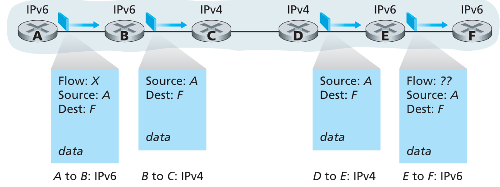

*Figure 4.25 ! A dual-stack approach*


*Figure 4.26 ! Tunneling*

This IPv4 datagram is then addressed to the IPv6 node on the receiving side of the tunnel (for example, E) and sent to the first node in the tunnel (for example, C). The intervening IPv4 routers in the tunnel route this IPv4 datagram among themselves, just as they would any other datagram, blissfully unaware that the IPv4 datagram itself contains a complete IPv6 datagram. The IPv6 node on the receiving side of the tunnel eventually receives the IPv4 datagram (it is the destination of the IPv4 datagram!), determines that the IPv4 datagram contains an IPv6 datagram, extracts the IPv6 datagram, and then routes the IPv6 datagram exactly as it would if it had received the IPv6 datagram from a directly connected IPv6 neighbor.

We end this section by noting that while the adoption of IPv6 was initially slow to take off [Lawton 2001], momentum has been building recently. See [Huston 2008b] for discussion of IPv6 deployment as of 2008; see [NIST IPv6 2012] for a snapshort of US IPv6 deployment. The proliferation of devices such as IPenabled phones and other portable devices provides an additional push for more

widespread deployment of IPv6. Europe's Third Generation Partnership Program [3GPP 2012] has specified IPv6 as the standard addressing scheme for mobile multimedia.

One important lesson that we can learn from the IPv6 experience is that it is enormously difficult to change network-layer protocols. Since the early 1990s, numerous new network-layer protocols have been trumpeted as the next major revolution for the Internet, but most of these protocols have had limited penetration to date. These protocols include IPv6, multicast protocols (Section 4.7), and resource reservation protocols (Chapter 7). Indeed, introducing new protocols into the network layer is like replacing the foundation of a house—it is difficult to do without tearing the whole house down or at least temporarily relocating the house's residents. On the other hand, the Internet has witnessed rapid deployment of new protocols at the application layer. The classic examples, of course, are the Web, instant messaging, and P2P file sharing. Other examples include audio and video streaming and distributed games. Introducing new application-layer protocols is like adding a new layer of paint to a house—it is relatively easy to do, and if you choose an attractive color, others in the neighborhood will copy you. In summary, in the future we can expect to see changes in the Internet's network layer, but these changes will likely occur on a time scale that is much slower than the changes that will occur at the application layer.

### 4.4.5 A Brief Foray into IP Security

Section 4.4.3 covered IPv4 in some detail, including the services it provides and how those services are implemented. While reading through that section, you may have noticed that there was no mention of any security services. Indeed, IPv4 was designed in an era (the 1970s) when the Internet was primarily used among mutually-trusted networking researchers. Creating a computer network that integrated a multitude of link-layer technologies was already challenging enough, without having to worry about security.

But with security being a major concern today, Internet researchers have moved on to design new network-layer protocols that provide a variety of security services. One of these protocols is IPsec, one of the more popular secure network-layer protocols and also widely deployed in Virtual Private Networks (VPNs). Although IPsec and its cryptographic underpinnings are covered in some detail in Chapter 8, we provide a brief, high-level introduction into IPsec services in this section.

IPsec has been designed to be backward compatible with IPv4 and IPv6. In particular, in order to reap the benefits of IPsec, we don't need to replace the protocol stacks in *all* the routers and hosts in the Internet. For example, using the transport mode (one of two IPsec "modes"), if two hosts want to securely communicate, IPsec needs to be available only in those two hosts. All other routers and hosts can continue to run vanilla IPv4.

For concreteness, we'll focus on IPsec's transport mode here. In this mode, two hosts first establish an IPsec session between themselves. (Thus IPsec is connectionoriented!) With the session in place, all TCP and UDP segments sent between the

4.5 • ROUTING ALGORITHMS **363**

two hosts enjoy the security services provided by IPsec. On the sending side, the transport layer passes a segment to IPsec. IPsec then encrypts the segment, appends additional security fields to the segment, and encapsulates the resulting payload in an ordinary IP datagram. (It's actually a little more complicated than this, as we'll see in Chapter 8.) The sending host then sends the datagram into the Internet, which transports it to the destination host. There, IPsec decrypts the segment and passes the unencrypted segment to the transport layer.

The services provided by an IPsec session include:

- Cryptographic agreement. Mechanisms that allow the two communicating hosts to agree on cryptographic algorithms and keys.

- Encryption of IP datagram payloads. When the sending host receives a segment from the transport layer, IPsec encrypts the payload. The payload can only be decrypted by IPsec in the receiving host.

- Data integrity. IPsec allows the receiving host to verify that the datagram's header fields and encrypted payload were not modified while the datagram was en route from source to destination.

- Origin authentication. When a host receives an IPsec datagram from a trusted source (with a trusted key—see Chapter 8), the host is assured that the source IP address in the datagram is the actual source of the datagram. When two hosts have an IPsec session established between them, all TCP and

UDP segments sent between them will be encrypted and authenticated. IPsec therefore provides blanket coverage, securing all communication between the two hosts for all network applications.

Acompany can use IPsec to communicate securely in the nonsecure public Internet. For illustrative purposes, we'll just look at a simple example here. Consider a company that has a large number of traveling salespeople, each possessing a company laptop computer. Suppose the salespeople need to frequently consult sensitive company information (for example, pricing and product information) that is stored on a server in the company's headquarters. Further suppose that the salespeople also need to send sensitive documents to each other. How can this be done with IPsec? As you might guess, we install IPsec in the server and in all of the salespeople's laptops. With IPsec installed in these hosts, whenever a salesperson needs to communicate with the server or with another salesperson, the communication session will be secure.

## 4.5 Routing Algorithms

So far in this chapter, we've mostly explored the network layer's forwarding function. We learned that when a packet arrives to a router, the router indexes a forwarding table and determines the link interface to which the packet is to be directed. We also learned that routing algorithms, operating in network routers, exchange and

compute the information that is used to configure these forwarding tables. The interplay between routing algorithms and forwarding tables was shown in Figure 4.2. Having explored forwarding in some depth we now turn our attention to the other major topic of this chapter, namely, the network layer's critical routing function. Whether the network layer provides a datagram service (in which case different packets between a given source-destination pair may take different routes) or a VC service (in which case all packets between a given source and destination will take the same path), the network layer must nonetheless determine the path that packets take from senders to receivers. We'll see that the job of routing is to determine good paths (equivalently, routes), from senders to receivers, through the network of routers.

Typically a host is attached directly to one router, the **default router** for the host (also called the **first-hop router** for the host). Whenever a host sends a packet, the packet is transferred to its default router. We refer to the default router of the source host as the **source router** and the default router of the destination host as the **destination router.** The problem of routing a packet from source host to destination host clearly boils down to the problem of routing the packet from source router to destination router, which is the focus of this section.

The purpose of a routing algorithm is then simple: given a set of routers, with links connecting the routers, a routing algorithm finds a "good" path from source router to destination router. Typically, a good path is one that has the least cost. We'll see, however, that in practice, real-world concerns such as policy issues (for example, a rule such as "router *x,* belonging to organization *Y,* should not forward any packets originating from the network owned by organization *Z")* also come into play to complicate the conceptually simple and elegant algorithms whose theory underlies the practice of routing in today's networks.

Agraph is used to formulate routing problems. Recall that a **graph** *G = (N,E)* is a set *N* of nodes and a collection *E* of edges, where each edge is a pair of nodes from *N.* In the context of network-layer routing, the nodes in the graph represent routers—the points at which packet-forwarding decisions are made—and the edges connecting these nodes represent the physical links between these routers. Such a graph abstraction of a computer network is shown in Figure 4.27. To view some graphs representing real network maps, see [Dodge 2012, Cheswick 2000]; for a discussion of how well different graph-based models model the Internet, see [Zegura 1997, Faloutsos 1999, Li 2004].

As shown in Figure 4.27, an edge also has a value representing its cost. Typically, an edge's cost may reflect the physical length of the corresponding link (for example, a transoceanic link might have a higher cost than a short-haul terrestrial link), the link speed, or the monetary cost associated with a link. For our purposes, we'll simply take the edge costs as a given and won't worry about how they are determined. For any edge *(x,y)* in *E,* we denote *c(x,y)* as the cost of the edge between nodes *x* and *y.* If the pair *(x,y)* does not belong to *E,* we set *c(x,y) =* ∞. Also, throughout we consider only undirected graphs (i.e., graphs whose edges do not have a direction), so that edge *(x,y)* is the same as edge *(y,x)* and that *c(x,y) = c(y,x).* Also, a node *y* is said to be a **neighbor** of node *x* if *(x,y)* belongs to *E.*

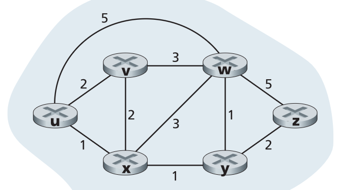

*Figure 4.27 ! Abstract graph model of a computer network*

Given that costs are assigned to the various edges in the graph abstraction, a natural goal of a routing algorithm is to identify the least costly paths between sources and destinations. To make this problem more precise, recall that a **path** in a graph *G =* (N,E) is a sequence of nodes ($x_{1}$, $x_{2}$,..., $x_{p}$) such that each of the pairs ($x_{1}$,$x_{2}$), ($x_{2}$,$x_{3}$),...,($x_{p-1}$,$x_{p}$) are edges in E. The cost of a path ($x_{1}$,$x_{2}$,..., $x_{p}$) is simply the sum of all the edge costs along the path, that is, c($x_{1}$,$x_{2}$) + c($x_{2}$,$x_{3}$) + ...+ c($x_{p-1}$,$x_{p}$). Given any two nodes *x* and *y,* there are typically many paths between the two nodes, with each path having a cost. One or more of these paths is a **least-cost path.** The least-cost problem is therefore clear: Find a path between the source and destination that has least cost. In Figure 4.27, for example, the least-cost path between source node *u* and destination node *w* is *(u, x, y, w)* with a path cost of 3. Note that if all edges in the graph have the same cost, the least-cost path is also the **shortest path** (that is, the path with the smallest number of links between the source and the destination).

As a simple exercise, try finding the least-cost path from node *u* to *z* in Figure 4.27 and reflect for a moment on how you calculated that path. If you are like most people, you found the path from *u* to *z* by examining Figure 4.27, tracing a few routes from *u* to *z,* and somehow convincing yourself that the path you had chosen had the least cost among all possible paths. (Did you check all of the 17 possible paths between *u* and *z?* Probably not!) Such a calculation is an example of a centralized routing algorithm—the routing algorithm was run in one location, your brain, with complete information about the network. Broadly, one way in which we can classify routing algorithms is according to whether they are global or decentralized.

- A global routing algorithm computes the least-cost path between a source and destination using complete, global knowledge about the network. That is, the algorithm takes the connectivity between all nodes and all link costs as inputs. This then requires that the algorithm somehow obtain this information before actually performing the calculation. The calculation itself can be run at one site

(a centralized global routing algorithm) or replicated at multiple sites. The key distinguishing feature here, however, is that a global algorithm has complete information about connectivity and link costs. In practice, algorithms with global state information are often referred to as **link-state (LS) algorithms,** since the algorithm must be aware of the cost of each link in the network. We'll study LS algorithms in Section 4.5.1.

- In a decentralized routing algorithm, the calculation of the least-cost path is carried out in an iterative, distributed manner. No node has complete information about the costs of all network links. Instead, each node begins with only the knowledge of the costs of its own directly attached links. Then, through an iterative process of calculation and exchange of information with its neighboring nodes (that is, nodes that are at the other end of links to which it itself is attached), a node gradually calculates the least-cost path to a destination or set of destinations. The decentralized routing algorithm we'll study below in Section 4.5.2 is called a distance-vector (DV) algorithm, because each node maintains a vector of estimates of the costs (distances) to all other nodes in the network. Asecond broad way to classify routing algorithms is according to whether they

are static or dynamic. In **static routing algorithms,** routes change very slowly over time, often as a result of human intervention (for example, a human manually editing a router's forwarding table). **Dynamic routing algorithms** change the routing paths as the network traffic loads or topology change. A dynamic algorithm can be run either periodically or in direct response to topology or link cost changes. While dynamic algorithms are more responsive to network changes, they are also more susceptible to problems such as routing loops and oscillation in routes.

Athird way to classify routing algorithms is according to whether they are loadsensitive or load-insensitive. In a **load-sensitive algorithm,** link costs vary dynamically to reflect the current level of congestion in the underlying link. If a high cost is associated with a link that is currently congested, a routing algorithm will tend to choose routes around such a congested link. While early ARPAnet routing algorithms were load-sensitive [McQuillan 1980], a number of difficulties were encountered [Huitema 1998]. Today's Internet routing algorithms (such as RIP, OSPF, and BGP) are **load-insensitive,** as a link's cost does not explicitly reflect its current (or recent past) level of congestion.

## 4.5.1 The Link-State (LS) Routing Algorithm

Recall that in a link-state algorithm, the network topology and all link costs are known, that is, available as input to the LS algorithm. In practice this is accomplished by having each node broadcast link-state packets to *all* other nodes in the network, with each link-state packet containing the identities and costs of its attached links. In practice (for example, with the Internet's OSPF routing protocol, discussed in Section 4.6.1) this is often accomplished by a **link-state broadcast**

algorithm [Perlman 1999]. We'll cover broadcast algorithms in Section 4.7. The result of the nodes' broadcast is that all nodes have an identical and complete view of the network. Each node can then run the LS algorithm and compute the same set of least-cost paths as every other node.

The link-state routing algorithm we present below is known as *Dijkstra's algo-* *rithm,* named after its inventor. A closely related algorithm is Prim's algorithm; see [Cormen 2001] for a general discussion of graph algorithms. Dijkstra's algorithm computes the least-cost path from one node (the source, which we will refer to as *u)* to all other nodes in the network. Dijkstra's algorithm is iterative and has the property that after the *kth* iteration of the algorithm, the least-cost paths are known to *k* destination nodes, and among the least-cost paths to all destination nodes, these *k* paths will have the *k* smallest costs. Let us define the following notation:

- D(v): cost of the least-cost path from the source node to destination v as of this iteration of the algorithm.

- p(v): previous node (neighbor of v) along the current least-cost path from the source to *v.*

- N# : subset of nodes; v is in N# if the least-cost path from the source to v is definitively known. The global routing algorithm consists of an initialization step followed by a

loop. The number of times the loop is executed is equal to the number of nodes in the network. Upon termination, the algorithm will have calculated the shortest paths from the source node *u* to every other node in the network.

#### Link-State (LS) Algorithm for Source Node u

## 1 Initialization:

```
2 N' = {u}
3 for all nodes v
4 if v is a neighbor of u
5 then D(v) = c(u,v)
6 else D(v) = ∞
7
```

## 8 Loop

```
9 find w not in N' such that D(w) is a minimum
10 add w to N'
11 update D(v) for each neighbor v of w and not in N':
12 D(v) = min( D(v), D(w) + c(w,v) )
13 /* new cost to v is either old cost to v or known
14 least path cost to w plus cost from w to v */
```

$$15 until N'= N$$

As an example, let's consider the network in Figure 4.27 and compute the

least-cost paths from *u* to all possible destinations. A tabular summary of the VideoNoteDijkstra's algorithm: algorithm's computation is shown in Table 4.3, where each line in the table gives discussion and example the values of the algorithm's variables at the end of the iteration. Let's consider the few first steps in detail.

- In the initialization step, the currently known least-cost paths from u to its directly attached neighbors, *v, x,* and *w,* are initialized to 2, 1, and 5, respectively. Note in particular that the cost to *w* is set to 5 (even though we will soon see that a lesser-cost path does indeed exist) since this is the cost of the direct (one hop) link from *u* to *w.* The costs to *y* and *z* are set to infinity because they are not directly connected to *u.*

- In the first iteration, we look among those nodes not yet added to the set N# and find that node with the least cost as of the end of the previous iteration. That node is *x,* with a cost of 1, and thus *x* is added to the set *N#.* Line 12 of the LS algorithm is then performed to update *D(v)* for all nodes *v,* yielding the results shown in the second line (Step 1) in Table 4.3. The cost of the path to *v* is unchanged. The cost of the path to *w* (which was 5 at the end of the initialization) through node *x* is found to have a cost of 4. Hence this lower-cost path is selected and *w's* predecessor along the shortest path from *u* is set to *x.* Similarly, the cost to *y* (through *x)* is computed to be 2, and the table is updated accordingly.

- In the second iteration, nodes v and y are found to have the least-cost paths (2), and we break the tie arbitrarily and add *y* to the set *N#* so that *N#* now contains *u,* *x,* and *y.* The cost to the remaining nodes not yet in *N#,* that is, nodes *v, w,* and *z,* are updated via line 12 of the LS algorithm, yielding the results shown in the third row in the Table 4.3.

- And so on. . . . When the LS algorithm terminates, we have, for each node, its predecessor

along the least-cost path from the source node. For each predecessor, we also

| step | N' | D(v),p(v) | D(w),p(w) | D(x),p(x) | D(y),p(y) | D(z),p(z) |
| --- | --- | --- | --- | --- | --- | --- |
| 0 | u | 2,u | 5,u | 1,u | ∞ | ∞ |
| 1 | ux | 2,u | 4,x |  | 2,x | ∞ |
| 2 | uxy | 2,u | 3,y |  |  | 4,y |
| 3 | uxyv |  | 3,y |  |  | 4,y |
| 4 | uxyvw |  |  |  |  | 4,y |

5 uxyvwz

**Table 4.3** ! Running the link-state algorithm on the network in Figure 4.27

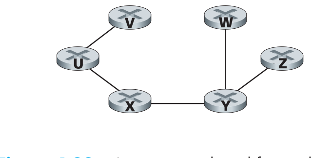

*Figure 4.28 ! Least cost path and forwarding table for nodule u*

have *its* predecessor, and so in this manner we can construct the entire path from the source to all destinations. The forwarding table in a node, say node *u,* can then be constructed from this information by storing, for each destination, the next-hop node on the least-cost path from *u* to the destination. Figure 4.28 shows the resulting least-cost paths and forwarding table in *u* for the network in Figure 4.27.

What is the computational complexity of this algorithm? That is, given *n* nodes (not counting the source), how much computation must be done in the worst case to find the least-cost paths from the source to all destinations? In the first iteration, we need to search through all *n* nodes to determine the node, *w,* not in *N#* that has the minimum cost. In the second iteration, we need to check *n* – 1 nodes to determine the minimum cost; in the third iteration *n* – 2 nodes, and so on. Overall, the total number of nodes we need to search through over all the iterations is *n(n* + 1)/2, and thus we say that the preceding implementation of the LS algorithm has worst-case complexity of order n squared: O($n^{2}$). (A more sophisticated implementation of this algorithm, using a data structure known as a heap, can find the minimum in line 9 in logarithmic rather than linear time, thus reducing the complexity.)

Before completing our discussion of the LS algorithm, let us consider a pathology that can arise. Figure 4.29 shows a simple network topology where link costs are equal to the load carried on the link, for example, reflecting the delay that would be experienced. In this example, link costs are not symmetric; that is, *c(u,v)* equals *c(v,u)* only if the load carried on both directions on the link *(u,v)* is the same. In this example, node *z* originates a unit of traffic destined for *w,* node *x* also originates a unit of traffic destined for *w,* and node *y* injects an amount of traffic equal to *e,* also destined for *w.* The initial routing is shown in Figure 4.29(a) with the link costs corresponding to the amount of traffic carried.

When the LS algorithm is next run, node *y* determines (based on the link costs shown in Figure 4.29(a)) that the clockwise path to *w* has a cost of 1, while the counterclockwise path to *w* (which it had been using) has a cost of 1 + *e.* Hence *y's*

Destination Link **V W** v (u, v)

w (u, x) **U Z** x (u, x)

y (u, x) **X Y** z (u, x)

e e

c. x, y, z detect better path d. x, y, z, detect better path **to** ***w,*** **counterclockwise to** ***w,*** **clockwise**

least-cost path to *w* is now clockwise. Similarly, *x* determines that its new least-cost path to *w* is also clockwise, resulting in costs shown in Figure 4.29(b). When the LS algorithm is run next, nodes *x, y,* and *z* all detect a zero-cost path to *w* in the counterclockwise direction, and all route their traffic to the counterclockwise routes. The next time the LS algorithm is run, *x, y,* and *z* all then route their traffic to the clockwise routes.

What can be done to prevent such oscillations (which can occur in any algorithm, not just an LS algorithm, that uses a congestion or delay-based link metric)? One solution would be to mandate that link costs not depend on the amount of traffic carried—an unacceptable solution since one goal of routing is to avoid

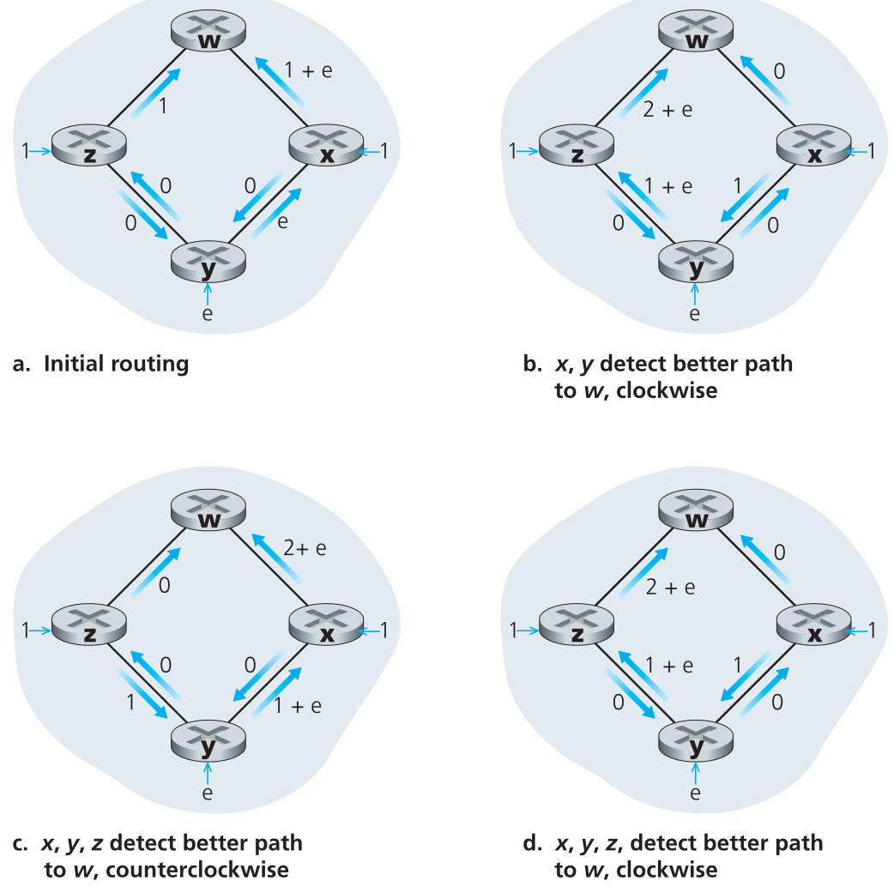

*Figure 4.29 ! Oscillations with congestion-sensitive routing*

highly congested (for example, high-delay) links. Another solution is to ensure that not all routers run the LS algorithm at the same time. This seems a more reasonable solution, since we would hope that even if routers ran the LS algorithm with the same periodicity, the execution instance of the algorithm would not be the same at each node. Interestingly, researchers have found that routers in the Internet can self-synchronize among themselves [Floyd Synchronization 1994]. That is, even though they initially execute the algorithm with the same period but at different instants of time, the algorithm execution instance can eventually become, and remain, synchronized at the routers. One way to avoid such selfsynchronization is for each router to randomize the time it sends out a link advertisement.

Having studied the LS algorithm, let's consider the other major routing algorithm that is used in practice today—the distance-vector routing algorithm.

## 4.5.2 The Distance-Vector (DV) Routing Algorithm

Whereas the LS algorithm is an algorithm using global information, the **distance-** **vector (DV)** algorithm is iterative, asynchronous, and distributed. It is *distributed* in that each node receives some information from one or more of its *directly* *attached* neighbors, performs a calculation, and then distributes the results of its calculation back to its neighbors. It is *iterative* in that this process continues on until no more information is exchanged between neighbors. (Interestingly, the algorithm is also self-terminating—there is no signal that the computation should stop; it just stops.) The algorithm is *asynchronous* in that it does not require all of the nodes to operate in lockstep with each other. We'll see that an asynchronous, iterative, self-terminating, distributed algorithm is much more interesting and fun than a centralized algorithm!

Before we present the DV algorithm, it will prove beneficial to discuss an important relationship that exists among the costs of the least-cost paths. Let $d_{x}$(y) be the cost of the least-cost path from node *x* to node *y.* Then the least costs are related by the celebrated Bellman-Ford equation, namely,

$$d_{x}(y) = min_{v}\{c(x,v) + d_{v}(y)\}, \tag{4.1}$$

where the $min_{v}$ in the equation is taken over all of x's neighbors. The Bellman-Ford equation is rather intuitive. Indeed, after traveling from *x* to *v,* if we then take the least-cost path from v to y, the path cost will be c(x,v) + $d_{v}$(y). Since we must begin by traveling to some neighbor *v,* the least cost from *x* to *y* is the minimum of *c(x,v)* + $d_{v}$(y) taken over all neighbors v.

But for those who might be skeptical about the validity of the equation, let's check it for source node *u* and destination node *z* in Figure 4.27. The source node *u*

has three neighbors: nodes *v, x,* and *w.* By walking along various paths in the graph, it is easy to see that $d_{v}$(z) = 5, $d_{x}$(z) = 3, and $d_{w}$(z) = 3. Plugging these values into Equation 4.1, along with the costs c(u,v) = 2, c(u,x) = 1, and c(u,w) = 5, gives $d_{u}$(z) = min{2 + 5, 5 + 3, 1 + 3} = 4, which is obviously true and which is exactly what the Dijskstra algorithm gave us for the same network. This quick verification should help relieve any skepticism you may have.

The Bellman-Ford equation is not just an intellectual curiosity. It actually has significant practical importance. In particular, the solution to the Bellman-Ford equation provides the entries in node x's forwarding table. To see this, let v* be any neighboring node that achieves the minimum in Equation 4.1. Then, if node *x* wants to send a packet to node *y* along a least-cost path, it should first forward the packet to node v*. Thus, node x's forwarding table would specify node v* as the next-hop router for the ultimate destination *y.* Another important practical contribution of the Bellman-Ford equation is that it suggests the form of the neighbor-to-neighbor communication that will take place in the DV algorithm.

The basic idea is as follows. Each node x begins with $D_{x}$(y), an estimate of the cost of the least-cost path from itself to node y, for all nodes in N. Let $D_{x}$ = [$D_{x}$(y): y in *N]* be node *x's* distance vector, which is the vector of cost estimates from *x* to all other nodes, *y,* in *N.* With the DV algorithm, each node *x* maintains the following routing information:

- For each neighbor v, the cost c(x,v) from x to directly attached neighbor, v

- Node x's distance vector, that is, Dx = [Dx(y): y in N], containing x's estimate of its cost to all destinations, *y,* in *N*

- The distance vectors of each of its neighbors, that is, Dv = [Dv(y): y in N] for each neighbor *v* of *x*

In the distributed, asynchronous algorithm, from time to time, each node sends a copy of its distance vector to each of its neighbors. When a node *x* receives a new distance vector from any of its neighbors *v,* it saves *v's* distance vector, and then uses the Bellman-Ford equation to update its own distance vector as follows:

$D_{x}$(y) " $min_{v}${c(x,v) + $D_{v}$(y)} for each node y in N

If node *x's* distance vector has changed as a result of this update step, node *x* will then send its updated distance vector to each of its neighbors, which can in turn update their own distance vectors. Miraculously enough, as long as all the nodes continue to exchange their distance vectors in an asynchronous fashion, each cost estimate $D_{x}$(y) converges to $d_{x}$(y), the actual cost of the least-cost path from node x to node *y* [Bertsekas 1991]!

#### Distance-Vector (DV) Algorithm

At each node, *x:*

## 1 Initialization:

2 for all destinations y in N:

3 $D_{x}$(y) = c(x,y) /* if y is not a neighbor then c(x,y) = ∞ */

4 for each neighbor w 5 6 7 8

9 loop

```
10
11
12
13
14
15
16
17
18
         Dw(y) = ? for all destinations y in N
      for each neighbor w
         send distance vector Dx = [Dx(y): y in N] to w

      wait (until I see a link cost change to some neighbor w or
            until I receive a distance vector from some neighbor w)

      for each y in N:
         Dx(y) = minv{c(x,v) + Dv(y)}
      if Dx(y) changed for any destination y
         send distance vector Dx = [Dx(y): y in N] to all neighbors
```

19 forever

In the DV algorithm, a node *x* updates its distance-vector estimate when it either sees a cost change in one of its directly attached links or receives a distancevector update from some neighbor. But to update its own forwarding table for a given destination *y,* what node *x* really needs to know is not the shortest-path distance to y but instead the neighboring node v*(y) that is the next-hop router along the shortest path to y. As you might expect, the next-hop router v*(y) is the neighbor *v* that achieves the minimum in Line 14 of the DV algorithm. (If there are multiple neighbors v that achieve the minimum, then v*(y) can be any of the minimizing neighbors.) Thus, in Lines 13–14, for each destination *y,* node *x* also determines v*(y) and updates its forwarding table for destination y.

Recall that the LS algorithm is a global algorithm in the sense that it requires each node to first obtain a complete map of the network before running the Dijkstra algorithm. The DV algorithm is *decentralized* and does not use such global information. Indeed, the only information a node will have is the costs of the links to its directly attached neighbors and information it receives from these neighbors. Each node waits for an update from any neighbor (Lines 10–11), calculates its new distance vector when receiving an update (Line 14), and distributes its new distance

vector to its neighbors (Lines 16–17). DV-like algorithms are used in many routing protocols in practice, including the Internet's RIP and BGP, ISO IDRP, Novell IPX, and the original ARPAnet.

Figure 4.30 illustrates the operation of the DV algorithm for the simple threenode network shown at the top of the figure. The operation of the algorithm is illustrated in a synchronous manner, where all nodes simultaneously receive distance vectors from their neighbors, compute their new distance vectors, and inform their neighbors if their distance vectors have changed. After studying this example, you

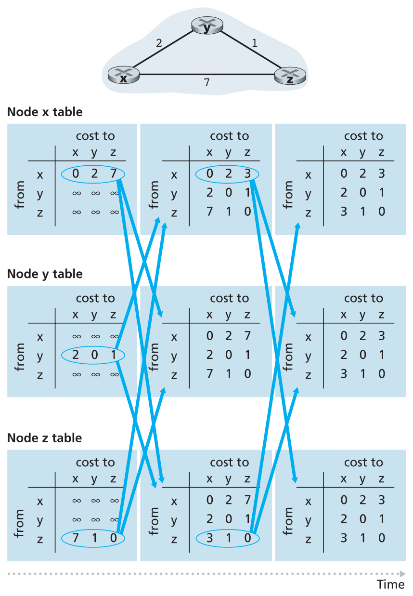

*Figure 4.30 ! Distance-vector (DV) algorithm*

should convince yourself that the algorithm operates correctly in an asynchronous manner as well, with node computations and update generation/reception occurring at any time.

The leftmost column of the figure displays three initial **routing tables** for each of the three nodes. For example, the table in the upper-left corner is node *x's* initial routing table. Within a specific routing table, each row is a distance vector—specifically, each node's routing table includes its own distance vector and that of each of its neighbors. Thus, the first row in node x's initial routing table is $D_{x}$ = [$D_{x}$(x), $D_{x}$(y), $D_{x}$(z)] = [0, 2, 7]. The second and third rows in this table are the most recently received distance vectors from nodes *y* and *z,* respectively. Because at initialization node *x* has not received anything from node *y* or *z,* the entries in the second and third rows are initialized to infinity.

After initialization, each node sends its distance vector to each of its two neighbors. This is illustrated in Figure 4.30 by the arrows from the first column of tables to the second column of tables. For example, node x sends its distance vector $D_{x}$ = [0, 2, 7] to both nodes *y* and *z.* After receiving the updates, each node recomputes its own distance vector. For example, node *x* computes

$$D_{x}(x) = 0$$

$D_{x}$(y) = min{c(x,y) + $D_{y}$(y), c(x,z) + $D_{z}$(y)} = min{2 + 0, 7 + 1} = 2

$D_{x}$(z) = min{c(x,y) + $D_{y}$(z), c(x,z) + $D_{z}$(z)} = min{2 + 1, 7 + 0} = 3

The second column therefore displays, for each node, the node's new distance vector along with distance vectors just received from its neighbors. Note, for example, that node x's estimate for the least cost to node z, $D_{x}$(z), has changed from 7 to 3. Also note that for node *x,* neighboring node *y* achieves the minimum in line 14 of the DV algorithm; thus at this stage of the algorithm, we have at node x that v*(y) =

$$y and v*(z) = y.$$

After the nodes recompute their distance vectors, they again send their updated distance vectors to their neighbors (if there has been a change). This is illustrated in Figure 4.30 by the arrows from the second column of tables to the third column of tables. Note that only nodes *x* and *z* send updates: node *y's* distance vector didn't change so node *y* doesn't send an update. After receiving the updates, the nodes then recompute their distance vectors and update their routing tables, which are shown in the third column.

The process of receiving updated distance vectors from neighbors, recomputing routing table entries, and informing neighbors of changed costs of the least-cost path to a destination continues until no update messages are sent. At this point, since no update messages are sent, no further routing table calculations will occur and the algorithm will enter a quiescent state; that is, all nodes will be performing the wait in Lines 10–11 of the DV algorithm. The algorithm remains in the quiescent state until a link cost changes, as discussed next.

#### Distance-Vector Algorithm: Link-Cost Changes and Link Failure

When a node running the DV algorithm detects a change in the link cost from itself to a neighbor (Lines 10–11), it updates its distance vector (Lines 13–14) and, if there's a change in the cost of the least-cost path, informs its neighbors (Lines 16–17) of its new distance vector. Figure 4.31(a) illustrates a scenario where the link cost from *y* to *x* changes from 4 to 1. We focus here only on *y'and z's* distance table entries to destination *x.* The DV algorithm causes the following sequence of events to occur:

- At time t0, y detects the link-cost change (the cost has changed from 4 to 1), updates its distance vector, and informs its neighbors of this change since its distance vector has changed.

- At time t1, z receives the update from y and updates its table. It computes a new least cost to *x* (it has decreased from a cost of 5 to a cost of 2) and sends its new distance vector to its neighbors.

- At time t2, y receives z's update and updates its distance table. y's least costs do not change and hence *y* does not send any message to *z.* The algorithm comes to a quiescent state.

Thus, only two iterations are required for the DV algorithm to reach a quiescent state. The good news about the decreased cost between *x* and *y* has propagated quickly through the network.

Let's now consider what can happen when a link cost *increases.* Suppose that the link cost between *x* and *y* increases from 4 to 60, as shown in Figure 4.31(b).

1. Before the link cost changes, Dy(x) = 4, Dy(z) = 1, Dz(y) = 1, and Dz(x) = 5. At time $t_{0}$, y detects the link-cost change (the cost has changed from 4 to 60). y computes its new minimum-cost path to *x* to have a cost of $D_{y}$(x) = min{c(y,x) + $D_{x}$(x), c(y,z) + $D_{z}$(x)} = min{60 + 0, 1 + 5} = 6

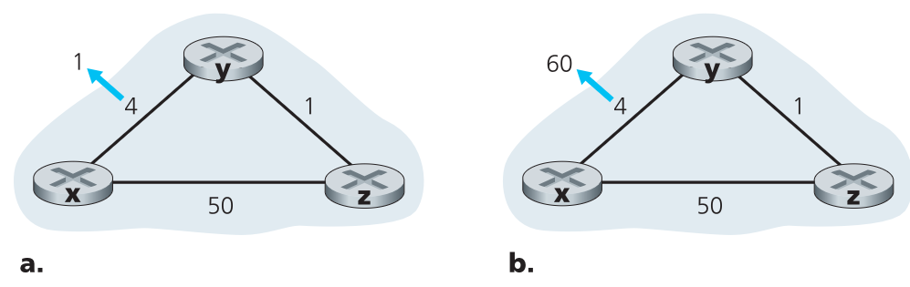

*Figure 4.31 ! Changes in link cost*

Of course, with our global view of the network, we can see that this new cost via *z* is *wrong.* But the only information node *y* has is that its direct cost to *x* is 60 and that *z* has last told *y* that *z* could get to *x* with a cost of 5. So in order to get to *x, y* would now route through *z,* fully expecting that *z* will be able to get to x with a cost of 5. As of $t_{1}$ we have a routing loop—in order to get to x, y routes through *z,* and *z* routes through *y.* A routing loop is like a black hole—a packet destined for x arriving at y or z as of $t_{1}$ will bounce back and forth between these two nodes forever (or until the forwarding tables are changed).

2. Since node y has computed a new minimum cost to x, it informs z of its new distance vector at time $t_{1}$.

3. Sometime after t1, z receives y's new distance vector, which indicates that y's minimum cost to *x* is 6. *z* knows it can get to *y* with a cost of 1 and hence computes a new least cost to x of $D_{z}$(x) = min{50 + 0,1 + 6} = 7. Since z's least cost to x has increased, it then informs y of its new distance vector at $t_{2}$.

4. In a similar manner, after receiving z's new distance vector, y determines $D_{y}$(x) = 8 and sends z its distance vector. z then determines $D_{z}$(x) = 9 and sends *y* its distance vector, and so on.

How long will the process continue? You should convince yourself that the loop will persist for 44 iterations (message exchanges between *y* and *z)—until z* eventually computes the cost of its path via *y* to be greater than 50. At this point, *z* will (finally!) determine that its least-cost path to *x* is via its direct connection to *x. y* will then route to *x* via *z.* The result of the bad news about the increase in link cost has indeed traveled slowly! What would have happened if the link cost *c(y,*

x) had changed from 4 to 10,000 and the cost c(z, x) had been 9,999? Because of

such scenarios, the problem we have seen is sometimes referred to as the countto-infinity problem.

#### Distance-Vector Algorithm: Adding Poisoned Reverse

The specific looping scenario just described can be avoided using a technique known as *poisoned reverse.* The idea is simple—if *z* routes through *y* to get to destination *x,* then *z* will advertise to *y* that its distance to *x* is infinity, that is, *z* will advertise to y that $D_{z}$(x) = ∞ (even though z knows $D_{z}$(x) = 5 in truth). z will continue telling this little white lie to *y* as long as it routes to *x* via *y.* Since *y* believes that *z* has no path to *x, y* will never attempt to route to *x* via *z,* as long as *z* continues to route to *x* via *y* (and lies about doing so).

Let's now see how poisoned reverse solves the particular looping problem we encountered before in Figure 4.31(b). As a result of the poisoned reverse, *y's* distance table indicates $D_{z}$(x) = ∞. When the cost of the (x, y) link changes from 4 to 60 at time $t_{0}$, y updates its table and continues to route directly to x, albeit at a higher cost of 60, and informs z of its new cost to x, that is, $D_{y}$(x) = 60. After receiving the

update at $t_{1}$, z immediately shifts its route to x to be via the direct (z, x) link at a cost of 50. Since this is a new least-cost path to *x,* and since the path no longer passes through y, z now informs y that $D_{z}$(x) = 50 at $t_{2}$. After receiving the update from z, y updates its distance table with $D_{y}$(x) = 51. Also, since z is now on y's least-cost path to x, y poisons the reverse path from z to x by informing z at time $t_{3}$ that $D_{y}$(x) = ∞ (even though y knows that $D_{y}$(x) = 51 in truth). Does poisoned reverse solve the general count-to-infinity problem? It does not. You should convince yourself that loops involving three or more nodes (rather than simply two immediately neighboring nodes) will not be detected by the poisoned reverse technique.

#### A Comparison of LS and DV Routing Algorithms

The DV and LS algorithms take complementary approaches towards computing routing. In the DV algorithm, each node talks to *only* its directly connected neighbors, but it provides its neighbors with least-cost estimates from itself to *all* the nodes (that it knows about) in the network. In the LS algorithm, each node talks with *all* other nodes (via broadcast), but it tells them *only* the costs of its directly connected links. Let's conclude our study of LS and DV algorithms with a quick comparison of some of their attributes. Recall that *N* is the set of nodes (routers) and *E* is the set of edges (links).

- Message complexity. We have seen that LS requires each node to know the cost of each link in the network. This requires O(|N| |E|) messages to be sent. Also, whenever a link cost changes, the new link cost must be sent to all nodes. The DV algorithm requires message exchanges between directly connected neighbors at each iteration. We have seen that the time needed for the algorithm to converge can depend on many factors. When link costs change, the DV algorithm will propagate the results of the changed link cost only if the new link cost results in a changed least-cost path for one of the nodes attached to that link.

- Speed of convergence. We have seen that our implementation of LS is an O(|N|2) algorithm requiring O(|N| |E|)) messages. The DV algorithm can converge slowly and can have routing loops while the algorithm is converging. DV also suffers from the count-to-infinity problem.

- Robustness. What can happen if a router fails, misbehaves, or is sabotaged? Under LS, a router could broadcast an incorrect cost for one of its attached links (but no others). A node could also corrupt or drop any packets it received as part of an LS broadcast. But an LS node is computing only its own forwarding tables; other nodes are performing similar calculations for themselves. This means route calculations are somewhat separated under LS, providing a degree of robustness. Under DV, a node can advertise incorrect least-cost paths to any or all destinations. (Indeed, in 1997, a malfunctioning router in a small ISP

provided national backbone routers with erroneous routing information. This caused other routers to flood the malfunctioning router with traffic and caused large portions of the Internet to become disconnected for up to several hours [Neumann 1997].) More generally, we note that, at each iteration, a node's calculation in DV is passed on to its neighbor and then indirectly to its neighbor's neighbor on the next iteration. In this sense, an incorrect node calculation can be diffused through the entire network under DV.

In the end, neither algorithm is an obvious winner over the other; indeed, both algorithms are used in the Internet.

#### Other Routing Algorithms

The LS and DV algorithms we have studied are not only widely used in practice, they are essentially the *only* routing algorithms used in practice today in the Internet. Nonetheless, many routing algorithms have been proposed by researchers over the past 30 years, ranging from the extremely simple to the very sophisticated and complex. A broad class of routing algorithms is based on viewing packet traffic as flows between sources and destinations in a network. In this approach, the routing problem can be formulated mathematically as a constrained optimization problem known as a network flow problem [Bertsekas 1991]. Yet another set of routing algorithms we mention here are those derived from the telephony world. These **circuit-switched routing algorithms** are of interest to packet-switched data networking in cases where per-link resources (for example, buffers, or a fraction of the link bandwidth) are to be reserved for each connection that is routed over the link. While the formulation of the routing problem might appear quite different from the least-cost routing formulation we have seen in this chapter, there are a number of similarities, at least as far as the path-finding algorithm (routing algorithm) is concerned. See [Ash 1998; Ross 1995; Girard 1990] for a detailed discussion of this research area.

## 4.5.3 Hierarchical Routing

In our study of LS and DV algorithms, we've viewed the network simply as a collection of interconnected routers. One router was indistinguishable from another in the sense that all routers executed the same routing algorithm to compute routing paths through the entire network. In practice, this model and its view of a homogenous set of routers all executing the same routing algorithm is a bit simplistic for at least two important reasons:

- Scale. As the number of routers becomes large, the overhead involved in computing, storing, and communicating routing information (for example,

LS updates or least-cost path changes) becomes prohibitive. Today's public Internet consists of hundreds of millions of hosts. Storing routing information at each of these hosts would clearly require enormous amounts of memory. The overhead required to broadcast LS updates among all of the routers in the public Internet would leave no bandwidth left for sending data packets! A distance-vector algorithm that iterated among such a large number of routers would surely never converge. Clearly, something must be done to reduce the complexity of route computation in networks as large as the public Internet.

- Administrative autonomy. Although researchers tend to ignore issues such as a company's desire to run its routers as it pleases (for example, to run whatever routing algorithm it chooses) or to hide aspects of its network's internal organization from the outside, these are important considerations. Ideally, an organization should be able to run and administer its network as it wishes, while still being able to connect its network to other outside networks.

Both of these problems can be solved by organizing routers into **autonomous sys-** **tems (ASs),** with each AS consisting of a group of routers that are typically under the same administrative control (e.g., operated by the same ISP or belonging to the same company network). Routers within the same AS all run the same routing algorithm (for example, an LS or DV algorithm) and have information about each other—exactly as was the case in our idealized model in the preceding section. The routing algorithm running within an autonomous system is called an **intra-** **autonomous system routing protocol.** It will be necessary, of course, to connect ASs to each other, and thus one or more of the routers in an AS will have the added task of being responsible for forwarding packets to destinations outside the AS; these routers are called **gateway routers.**

Figure 4.32 provides a simple example with three ASs: AS1, AS2, and AS3. In this figure, the heavy lines represent direct link connections between pairs of routers. The thinner lines hanging from the routers represent subnets that are directly connected to the routers. AS1 has four routers—1a, 1b, 1c, and 1d— which run the intra-AS routing protocol used within AS1. Thus, each of these four routers knows how to forward packets along the optimal path to any destination within AS1. Similarly, autonomous systems AS2 and AS3 each have three routers. Note that the intra-AS routing protocols running in AS1, AS2, and AS3 need not be the same. Also note that the routers 1b, 1c, 2a, and 3a are all gateway routers.

It should now be clear how the routers in an AS determine routing paths for source-destination pairs that are internal to the AS. But there is still a big missing piece to the end-to-end routing puzzle. How does a router, within some AS, know how to route a packet to a destination that is outside the AS? It's easy to answer this question if the AS has only one gateway router that connects to only one other AS. In this case, because the AS's intra-AS routing algorithm has determined the least-cost path from each internal router to the gateway router, each

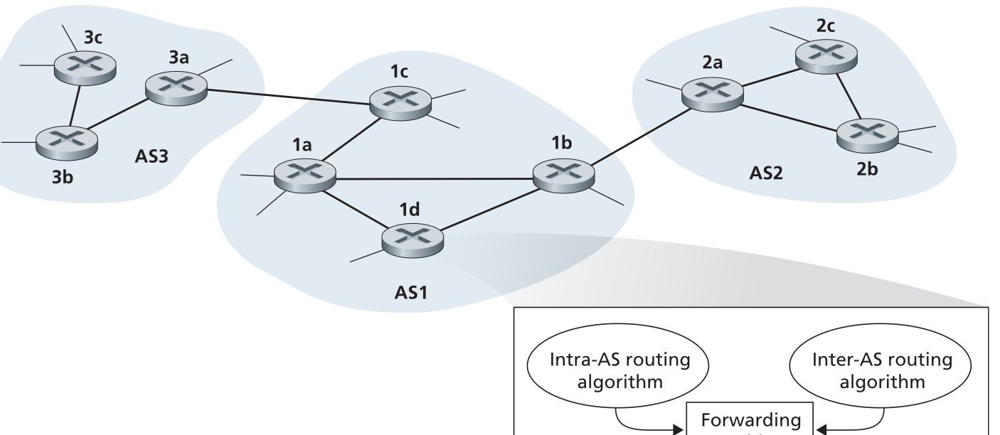

*Figure 4.32 ! An example of interconnected autonomous systems*

**3b AS2 2b**

table

internal router knows how it should forward the packet. The gateway router, upon receiving the packet, forwards the packet on the one link that leads outside the AS. The AS on the other side of the link then takes over the responsibility of routing the packet to its ultimate destination. As an example, suppose router 2b in Figure 4.32 receives a packet whose destination is outside of AS2. Router 2b will then forward the packet to either router 2a or 2c, as specified by router 2b's forwarding table, which was configured by AS2's intra-AS routing protocol. The packet will eventually arrive to the gateway router 2a, which will forward the packet to 1b. Once the packet has left 2a, AS2's job is done with this one packet.

So the problem is easy when the source AS has only one link that leads outside the AS. But what if the source AS has two or more links (through two or more gateway routers) that lead outside the AS? Then the problem of knowing where to forward the packet becomes significantly more challenging. For example, consider a router in AS1 and suppose it receives a packet whose destination is outside the AS. The router should clearly forward the packet to one of its two gateway routers, 1b or 1c, but which one? To solve this problem, AS1 needs (1) to learn which destinations are reachable via AS2 and which destinations are reachable via AS3, and (2) to propagate this reachability information to all the routers within AS1, so that each router can configure its forwarding table to handle external-AS destinations. These

two tasks—obtaining reachability information from neighboring ASs and propagating the reachability information to all routers internal to the AS—are handled by the **inter-AS routing protocol.** Since the inter-AS routing protocol involves communication between two ASs, the two communicating ASs must run the same inter-AS routing protocol. In fact, in the Internet all ASs run the same inter-AS routing protocol, called BGP4, which is discussed in the next section. As shown in Figure 4.32, each router receives information from an intra-AS routing protocol and an inter-AS routing protocol, and uses the information from both protocols to configure its forwarding table.

As an example, consider a subnet *x* (identified by its CIDRized address), and suppose that AS1 learns from the inter-AS routing protocol that subnet *x* is reachable from AS3 but is *not* reachable from AS2. AS1 then propagates this information to all of its routers. When router 1d learns that subnet *x* is reachable from AS3, and hence from gateway 1c, it then determines, from the information provided by the intra-AS routing protocol, the router interface that is on the least-cost path from router 1d to gateway router 1c. Say this is interface *I.* The router 1d can then put the entry *(x, I)* into its forwarding table. (This example, and others presented in this section, gets the general ideas across but is a simplification of what really happens in the Internet. In the next section we'll provide a more detailed description, albeit more complicated, when we discuss BGP.)

Following up on the previous example, now suppose that AS2 and AS3 connect to other ASs, which are not shown in the diagram. Also suppose that AS1 learns from the inter-AS routing protocol that subnet *x* is reachable both from AS2, via gateway 1b, and from AS3, via gateway 1c. AS1 would then propagate this information to all its routers, including router 1d. In order to configure its forwarding table, router 1d would have to determine to which gateway router, 1b or 1c, it should direct packets that are destined for subnet *x.* One approach, which is often employed in practice, is to use **hot-potato routing.** In hot-potato routing, the AS gets rid of the packet (the hot potato) as quickly as possible (more precisely, as inexpensively as possible). This is done by having a router send the packet to the gateway router that has the smallest router-to-gateway cost among all gateways with a path to the destination. In the context of the current example, hot-potato routing, running in 1d, would use information from the intra-AS routing protocol to determine the path costs to 1b and 1c, and then choose the path with the least cost. Once this path is chosen, router 1d adds an entry for subnet *x* in its forwarding table. Figure 4.33 summarizes the actions taken at router 1d for adding the new entry for *x* to the forwarding table.

When an AS learns about a destination from a neighboring AS, the AS can advertise this routing information to some of its other neighboring ASs. For example, suppose AS1 learns from AS2 that subnet *x* is reachable via AS2. AS1 could then tell AS3 that *x* is reachable via AS1. In this manner, if AS3 needs to route a packet destined to *x,* AS3 would forward the packet to AS1, which would in turn forward the packet to AS2. As we'll see in our discussion of BGP, an AS has quite a bit of

4.6 • ROUTING IN THE INTERNET **383**

|  | Use routing info from |  | Determine from |
| --- | --- | --- | --- |
| Learn from inter-AS | intra-AS protocol to | Hot potato routing: | forwarding table the |
| protocol that subnet | determine costs of | Choose the gateway | interface I that leads |
| x is reachable via | least-cost paths to | that has the | to least-cost gateway. |
| multiple gateways. | each of the gateways. | smallest least cost. | Enter (x,I) in forwarding table. |

**Figure 4.33** ! Steps in adding an outside-AS destination in a router's forwarding table

flexibility in deciding which destinations it advertises to its neighboring ASs. This is a *policy* decision, typically depending more on economic issues than on technical issues.

Recall from Section 1.5 that the Internet consists of a hierarchy of interconnected ISPs. So what is the relationship between ISPs and ASs? You might think that the routers in an ISP, and the links that interconnect them, constitute a single AS. Although this is often the case, many ISPs partition their network into multiple ASs. For example, some tier-1 ISPs use one AS for their entire network; others break up their ISP into tens of interconnected ASs.

In summary, the problems of scale and administrative authority are solved by defining autonomous systems. Within an AS, all routers run the same intra-AS routing protocol. Among themselves, the ASs run the same inter-AS routing protocol. The problem of scale is solved because an intra-AS router need only know about routers within its AS. The problem of administrative authority is solved since an organization can run whatever intra-AS routing protocol it chooses; however, each pair of connected ASs needs to run the same inter-AS routing protocol to exchange reachability information.

In the following section, we'll examine two intra-AS routing protocols (RIP and OSPF) and the inter-AS routing protocol (BGP) that are used in today's Internet. These case studies will nicely round out our study of hierarchical routing.

## 4.6 Routing in the Internet

Having studied Internet addressing and the IP protocol, we now turn our attention to the Internet's routing protocols; their job is to determine the path taken by a datagram between source and destination. We'll see that the Internet's routing protocols embody many of the principles we learned earlier in this chapter. The link-state and distance-vector approaches studied in Sections 4.5.1 and 4.5.2 and the notion of an autonomous system considered in Section 4.5.3 are all central to how routing is done in today's Internet.

Recall from Section 4.5.3 that an autonomous system (AS) is a collection of routers under the same administrative and technical control, and that all run the same routing protocol among themselves. Each AS, in turn, typically contains multiple subnets (where we use the term subnet in the precise, addressing sense in Section 4.4.2).

## 4.6.1 Intra-AS Routing in the Internet: RIP

An intra-AS routing protocol is used to determine how routing is performed within an autonomous system (AS). Intra-AS routing protocols are also known as **interior** **gateway protocols.** Historically, two routing protocols have been used extensively for routing within an autonomous system in the Internet: the **Routing Information** **Protocol (RIP)** and **Open Shortest Path First (OSPF).** A routing protocol closely related to OSPF is the **IS-IS** protocol [RFC 1142, Perlman 1999]. We first discuss RIP and then consider OSPF.

RIP was one of the earliest intra-AS Internet routing protocols and is still in widespread use today. It traces its origins and its name to the Xerox Network Systems (XNS) architecture. The widespread deployment of RIP was due in great part to its inclusion in 1982 in the Berkeley Software Distribution (BSD) version of UNIX supporting TCP/IP. RIP version 1 is defined in [RFC 1058], with a backwardcompatible version 2 defined in [RFC 2453].

RIP is a distance-vector protocol that operates in a manner very close to the idealized DV protocol we examined in Section 4.5.2. The version of RIP specified in RFC 1058 uses hop count as a cost metric; that is, each link has a cost of 1. In the DV algorithm in Section 4.5.2, for simplicity, costs were defined between pairs of routers. In RIP (and also in OSPF), costs are actually from source router to a destination subnet. RIP uses the term *hop,* which is the number of subnets traversed along the shortest path from source router to destination subnet, including the destination subnet. Figure 4.34 illustrates an AS with six leaf subnets. The table in the figure indicates the number of hops from the source A to each of the leaf subnets.

The maximum cost of a path is limited to 15, thus limiting the use of RIP to autonomous systems that are fewer than 15 hops in diameter. Recall that in DV protocols, neighboring routers exchange distance vectors with each other. The distance vector for any one router is the current estimate of the shortest path distances from that router to the subnets in the AS. In RIP, routing updates are exchanged between neighbors approximately every 30 seconds using a **RIP response message.** The response message sent by a router or host contains a list of up to 25 destination subnets within the AS, as well as the sender's distance to each of those subnets. Response messages are also known as **RIP** **advertisements.**

Let's take a look at a simple example of how RIP advertisements work. Consider the portion of an AS shown in Figure 4.35. In this figure, lines connecting the routers denote subnets. Only selected routers *(A, B, C,* and *D)* and subnets *(w, x, y,*

| u |  | v | Destination | Hops |
| --- | --- | --- | --- | --- |
| A | B |  | u | 1 |
|  |  | w | v | 2 |

|  |  |  | w | 2 |
| --- | --- | --- | --- | --- |
|  |  | x | x | 3 |
| C | D |  | y | 3 |
|  |  | y | z | 2 |

z

**Figure 4.34** ! Number of hops from source router A to various subnets

and *z)* are labeled. Dotted lines indicate that the AS continues on; thus this autonomous system has many more routers and links than are shown.

Each router maintains a RIP table known as a **routing table.** A router's routing table includes both the router's distance vector and the router's forwarding table. Figure 4.36 shows the routing table for router *D.* Note that the routing table has three columns. The first column is for the destination subnet, the second column indicates the identity of the next router along the shortest path to the destination subnet, and the third column indicates the number of hops (that is, the number of subnets that have to be traversed, including the destination subnet) to get to the destination subnet along the shortest path. For this example, the table indicates that to send a datagram from router *D* to destination subnet *w,* the datagram should first be forwarded to neighboring router *A;* the table also indicates that destination subnet *w* is two hops away along the shortest path. Similarly, the table indicates that subnet *z* is seven hops away via router *B.* In principle, a routing table will have one row for each subnet in the AS, although RIP version 2 allows subnet entries to be aggregated using route aggregation techniques similar to those we examined in

z

w x y **A D B**

**C**

**Figure 4.35** ! A portion of an autonomous system

Destination Subnet Next Router Number of Hops to Destination w A 2 y B 2 z B 7 x — 1 . . . . . . . . . . . .

**Figure 4.36** ! Routing table in router D before receiving advertisement from router A

Section 4.4. The table in Figure 4.36, and the subsequent tables to come, are only partially complete.

Now suppose that 30 seconds later, router *D* receives from router *A* the advertisement shown in Figure 4.37. Note that this advertisement is nothing other than the routing table information from router *A!* This information indicates, in particular, that subnet *z* is only four hops away from router *A.* Router *D,* upon receiving this advertisement, merges the advertisement (Figure 4.37) with the old routing table (Figure 4.36). In particular, router *D* learns that there is now a path through router *A* to subnet *z* that is shorter than the path through router *B.* Thus, router *D* updates its routing table to account for the shorter shortest path, as shown in Figure 4.38. How is it, you might ask, that the shortest path to subnet *z* has become shorter? Possibly, the decentralized distance-vector algorithm is still in the process of converging (see Section 4.5.2), or perhaps new links and/or routers were added to the AS, thus changing the shortest paths in the AS.

Let's next consider a few of the implementation aspects of RIP. Recall that RIP routers exchange advertisements approximately every 30 seconds. If a router does not hear from its neighbor at least once every 180 seconds, that neighbor is considered to be no longer reachable; that is, either the neighbor has died or the

Destination Subnet Next Router Number of Hops to Destination z C 4 w — 1 x — 1 . . . . . . . . . . . .

**Figure 4.37** ! Advertisement from router A

Destination Subnet Next Router Number of Hops to Destination w A 2 y B 2 z A 5 . . . . . . . . . . . .

**Figure 4.38** ! Routing table in router D after receiving advertisement from router A

connecting link has gone down. When this happens, RIP modifies the local routing table and then propagates this information by sending advertisements to its neighboring routers (the ones that are still reachable). A router can also request information about its neighbor's cost to a given destination using RIP's request message. Routers send RIP request and response messages to each other over UDP using port number 520. The UDP segment is carried between routers in a standard IP datagram. The fact that RIP uses a transport-layer protocol (UDP) on top of a networklayer protocol (IP) to implement network-layer functionality (a routing algorithm) may seem rather convoluted (it is!). Looking a little deeper at how RIP is implemented will clear this up.

Figure 4.39 sketches how RIP is typically implemented in a UNIX system, for example, a UNIX workstation serving as a router. A process called *routed* (pronounced "route dee") executes RIP, that is, maintains routing information and exchanges messages with *routed* processes running in neighboring routers. Because RIP is implemented as an application-layer process (albeit a very special one that is able to

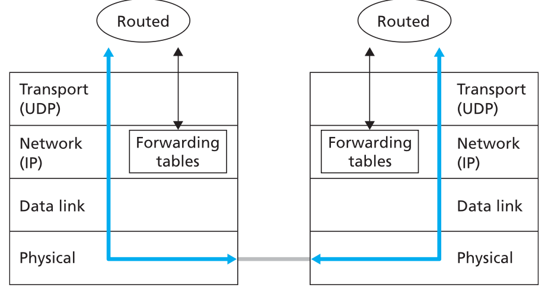

*Figure 4.39 ! Implementation of RIP as the routed daemon*

manipulate the routing tables within the UNIX kernel), it can send and receive messages over a standard socket and use a standard transport protocol. As shown, RIP is implemented as an application-layer protocol (see Chapter 2) running over UDP. If you're interested in looking at an implementation of RIP (or the OSPF and BGP protocols that we will study shortly), see [Quagga 2012].

## 4.6.2 Intra-AS Routing in the Internet: OSPF

Like RIP, OSPF routing is widely used for intra-AS routing in the Internet. OSPF and its closely related cousin, IS-IS, are typically deployed in upper-tier ISPs whereas RIP is deployed in lower-tier ISPs and enterprise networks. The Open in OSPF indicates that the routing protocol specification is publicly available (for example, as opposed to Cisco's EIGRP protocol). The most recent version of OSPF, version 2, is defined in RFC 2328, a public document.

OSPF was conceived as the successor to RIP and as such has a number of advanced features. At its heart, however, OSPF is a link-state protocol that uses flooding of link-state information and a Dijkstra least-cost path algorithm. With OSPF, a router constructs a complete topological map (that is, a graph) of the entire autonomous system. The router then locally runs Dijkstra's shortest-path algorithm to determine a shortest-path tree to all *subnets,* with itself as the root node. Individual link costs are configured by the network administrator (see Principles and Practice: Setting OSPF Weights). The administrator might choose to set all link costs to 1, thus achieving minimum-hop routing, or might choose to set the link weights to be inversely proportional to link capacity in order to discourage traffic from using low-bandwidth links. OSPF does not mandate a policy for how link weights are set (that is the job of the network administrator), but instead provides the mechanisms (protocol) for determining least-cost path routing for the given set of link weights.

With OSPF, a router broadcasts routing information to *all* other routers in the autonomous system, not just to its neighboring routers. A router broadcasts linkstate information whenever there is a change in a link's state (for example, a change in cost or a change in up/down status). It also broadcasts a link's state periodically (at least once every 30 minutes), even if the link's state has not changed. RFC 2328 notes that "this periodic updating of link state advertisements adds robustness to the link state algorithm." OSPF advertisements are contained in OSPF messages that are carried directly by IP, with an upper-layer protocol of 89 for OSPF. Thus, the OSPF protocol must itself implement functionality such as reliable message transfer and link-state broadcast. The OSPF protocol also checks that links are operational (via a HELLO message that is sent to an attached neighbor) and allows an OSPF router to obtain a neighboring router's database of network-wide link state.

Some of the advances embodied in OSPF include the following:

- Security. Exchanges between OSPF routers (for example, link-state updates) can be authenticated. With authentication, only trusted routers can participate

in the OSPF protocol within an AS, thus preventing malicious intruders (or networking students taking their newfound knowledge out for a joyride) from injecting incorrect information into router tables. By default, OSPF packets between routers are not authenticated and could be forged. Two types of authentication can be configured—simple and MD5 (see Chapter 8 for a discussion on MD5 and authentication in general). With simple authentication, the same password is configured on each router. When a router sends an OSPF packet, it includes the password in plaintext. Clearly, simple authentication is not very secure. MD5 authentication is based on shared secret keys that are configured in all the routers. For each OSPF packet that it sends, the router computes the MD5 hash of the content of the OSPF packet appended with the secret key. (See the discussion of message authentication codes in Chapter 7.) Then the router includes the resulting hash value in the OSPF packet. The receiving router, using the preconfigured secret key, will compute an MD5 hash of the packet and compare it with the hash value that the packet carries, thus verifying the packet's authenticity. Sequence numbers are also used with MD5 authentication to protect against replay attacks.

- Multiple same-cost paths. When multiple paths to a destination have the same cost, OSPF allows multiple paths to be used (that is, a single path need not be chosen for carrying all traffic when multiple equal-cost paths exist).

- Integrated support for unicast and multicast routing. Multicast OSPF (MOSPF) [RFC 1584] provides simple extensions to OSPF to provide for multicast routing (a topic we cover in more depth in Section 4.7.2). MOSPF uses the existing OSPF link database and adds a new type of link-state advertisement to the existing OSPF link-state broadcast mechanism.

- Support for hierarchy within a single routing domain. Perhaps the most significant advance in OSPF is the ability to structure an autonomous system hierarchically. Section 4.5.3 has already looked at the many advantages of hierarchical routing structures. We cover the implementation of OSPF hierarchical routing in the remainder of this section. An OSPF autonomous system can be configured hierarchically into areas. Each

area runs its own OSPF link-state routing algorithm, with each router in an area broadcasting its link state to all other routers in that area. Within each area, one or more **area border routers** are responsible for routing packets outside the area. Lastly, exactly one OSPF area in the AS is configured to be the **backbone** area. The primary role of the backbone area is to route traffic between the other areas in the AS. The backbone always contains all area border routers in the AS and may contain nonborder routers as well. Inter-area routing within the AS requires that the packet be first routed to an area border router (intra-area routing), then routed through the backbone to the area border router that is in the destination area, and then routed to the final destination.

### PRINCIPLES IN PRACTICE


**SETTING OSPF LINK WEIGHTS**

Our discussion of link-state routing has implicitly assumed that link weights are set, a routing algorithm such as OSPF is run, and traffic flows according to the routing tables computed by the LS algorithm. In terms of cause and effect, the link weights are given (i.e., they come first) and result (via Dijkstra's algorithm) in routing paths that minimize overall cost. In this viewpoint, link weights reflect the cost of using a link (e.g., if link weights are inversely proportional to capacity, then the use of high-capacity links would have smaller weights and thus be more attractive from a routing standpoint) and Disjkstra's algorithm serves to minimize overall cost.

In practice, the cause and effect relationship between link weights and routing paths may be reversed, with network operators configuring link weights in order to obtain routing paths that achieve certain traffic engineering goals [Fortz 2000, Fortz 2002]. For example, suppose a network operator has an estimate of traffic flow entering the network at each ingress point and destined for each egress point. The operator may then want to put in place a specific routing of ingress-to-egress flows that minimizes the maximum utilization over all of the network's links. But with a routing algorithm such as OSPF, the operator's main "knobs" for tuning the routing of flows through the network are the link weights. Thus, in order to achieve the goal of minimizing the maximum link utilization, the operator must find the set of link weights that achieves this goal. This is a reversal of the cause and effect relationship—the desired routing of flows is known, and the OSPF link weights must be found such that the OSPF routing algorithm results in this desired routing of flows.

OSPF is a relatively complex protocol, and our coverage here has been necessarily brief; [Huitema 1998; Moy 1998; RFC 2328] provide additional details.

## 4.6.3 Inter-AS Routing: BGP

We just learned how ISPs use RIP and OSPF to determine optimal paths for sourcedestination pairs that are internal to the same AS. Let's now examine how paths are determined for source-destination pairs that span multiple ASs. The **Border Gate-** **way Protocol** version 4, specified in RFC 4271 (see also [RFC 4274), is the *de facto* standard inter-AS routing protocol in today's Internet. It is commonly referred to as BGP4 or simply as **BGP.** As an inter-AS routing protocol (see Section 4.5.3), BGP provides each AS a means to

1. Obtain subnet reachability information from neighboring ASs.

2. Propagate the reachability information to all routers internal to the AS.

3. Determine "good" routes to subnets based on the reachability information and on AS policy.

Most importantly, BGP allows each subnet to advertise its existence to the rest of the Internet. A subnet screams "I exist and I am here," and BGP makes sure that all the ASs in the Internet know about the subnet and how to get there. If it weren't for BGP, each subnet would be isolated—alone and unknown by the rest of the Internet.

#### BGP Basics

BGP is extremely complex; entire books have been devoted to the subject and many issues are still not well understood [Yannuzzi 2005]. Furthermore, even after having read the books and RFCs, you may find it difficult to fully master BGP without hav- VideoNote

**Gluing the Internet**

ing practiced BGP for many months (if not years) as a designer or administrator $of^{together}$ an upper-tier ISP. Nevertheless, because BGP is an absolutely critical protocol for the Internet—in essence, it is the protocol that glues the whole thing together—we need to acquire at least a rudimentary understanding of how it works. We begin by describing how BGP might work in the context of the simple example network we studied earlier in Figure 4.32. In this description, we build on our discussion of hierarchical routing in Section 4.5.3; we encourage you to review that material.

In BGP, pairs of routers exchange routing information over semipermanent TCP connections using port 179. The semi-permanent TCP connections for the network in Figure 4.32 are shown in Figure 4.40. There is typically one such BGP TCP connection for each link that directly connects two routers in two different ASs; thus, in Figure 4.40, there is a TCP connection between gateway routers 3a and 1c and another TCP connection between gateway routers 1b and 2a. There are also semipermanent BGP TCP connections between routers within an AS. In particular, Figure 4.40 displays a common configuration of one TCP connection for each pair of routers internal to an AS, creating a mesh of TCP connections within each AS. For each TCP connection, the two routers at the end of the connection are called **BGP peers,** and the TCP connection along with all the BGP messages sent over the

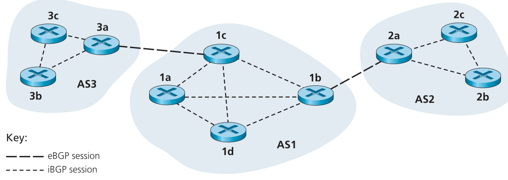

*Figure 4.40 ! eBGP and iBGP sessions*

**AS3** **3b AS2 2b**

### PRINCIPLES IN PRACTICE


**OBTAINING INTERNET PRESENCE: PUTTING THE PUZZLE TOGETHER**

Suppose you have just created a small that has a number of servers, including a public Web server that describes your company's products and services, a mail server from which your employees obtain their email messages, and a DNS server. Naturally, you would like the entire world to be able to surf your Web site in order to learn about your exciting products and services. Moreover, you would like your employees to be able to send and receive email to potential customers throughout the world.

To meet these goals, you first need to obtain Internet connectivity, which is done by contracting with, and connecting to, a local ISP. Your company will have a gateway router, which will be connected to a router in your local ISP. This connection might be a DSL connection through the existing telephone infrastructure, a leased line to the ISP's router, or one of the many other access solutions described in Chapter 1. Your local ISP will also provide you with an IP address range, e.g., a /24 address range consisting of 256 addresses. Once you have your physical connectivity and your IP address range, you will assign one of the IP addresses (in your address range) to your Web server, one to your mail server, one to your DNS server, one to your gateway router, and other IP addresses to other servers and networking devices in your company's network.

In addition to contracting with an ISP, you will also need to contract with an Internet registrar to obtain a domain name for your company, as described in Chapter 2. For example, if your company's name is, say, Xanadu Inc., you will naturally try to obtain the domain name xanadu.com. Your company must also obtain presence in the DNS system. Specifically, because outsiders will want to contact your DNS server to obtain the IP addresses of your servers, you will also need to provide your registrar with the IP address of your DNS server. Your registrar will then put an entry for your DNS server (domain name and corresponding IP address) in the .com top-level-domain servers, as described in Chapter 2. After this step is completed, any user who knows your domain name (e.g., xanadu.com) will be able to obtain the IP address of your DNS server via the DNS system.

So that people can discover the IP addresses of your Web server, in your DNS server you will need to include entries that map the host name of your Web server (e.g., www.xanadu.com) to its IP address. You will want to have similar entries for other publicly available servers in your company, including your mail server. In this manner, if Alice wants to browse your Web server, the DNS system will contact your DNS server, find the IP address of your Web server, and give it to Alice. Alice can then establish a TCP connection directly with your Web server.

However, there still remains one other necessary and crucial step to allow outsiders from around the world access your Web server. Consider what happens when Alice, who knows the IP address of your Web server, sends an IP datagram (e.g., a TCP SYN segment) to that IP address. This datagram will be routed through the Internet, visiting a series of routers in many different ASes, and eventually reach your Web server. When

any one of the routers receives the datagram, it is going to look for an entry in its

forwarding table to determine on which outgoing port it should forward the datagram.

Therefore, each of the routers needs to know about the existence of your company's

/24 prefix (or some aggregate entry). How does a router become aware of your

company's prefix? As we have just seen, it becomes aware of it from BGP! Specifically,

when your company contracts with a local ISP and gets assigned a prefix (i.e., an

address range), your local ISP will use BGP to advertise this prefix to the ISPs to which

it connects. Those ISPs will then, in turn, use BGP to propagate the advertisement.

Eventually, all Internet routers will know about your prefix (or about some aggregate that

includes your prefix) and thus be able to appropriately forward datagrams destined to

your Web and mail servers.

connection is called a **BGP session.** Furthermore, a BGP session that spans two ASs is called an **external BGP (eBGP) session,** and a BGP session between routers in the same AS is called an **internal BGP (iBGP) session.** In Figure 4.40, the eBGP sessions are shown with the long dashes; the iBGP sessions are shown with the short dashes. Note that BGP session lines in Figure 4.40 do not always correspond to the physical links in Figure 4.32.

BGP allows each AS to learn which destinations are reachable via its neighboring ASs. In BGP, destinations are not hosts but instead are CIDRized **prefixes,** with each prefix representing a subnet or a collection of subnets. Thus, for example, suppose there are four subnets attached to AS2: 138.16.64/24, 138.16.65/24, 138.16.66/24, and 138.16.67/24. Then AS2 could aggregate the prefixes for these four subnets and use BGP to advertise the single prefix to 138.16.64/22 to AS1. As another example, suppose that only the first three of those four subnets are in AS2 and the fourth subnet, 138.16.67/24, is in AS3. Then, as described in the Principles and Practice in Section 4.4.2, because routers use longest-prefix matching for forwarding datagrams, AS3 could advertise to AS1 the more specific prefix 138.16.67/24 and AS2 could *still* advertise to AS1 the aggregated prefix 138.16.64/22.

Let's now examine how BGP would distribute prefix reachability information over the BGP sessions shown in Figure 4.40. As you might expect, using the eBGP session between the gateway routers 3a and 1c, AS3 sends AS1 the list of prefixes that are reachable from AS3; and AS1 sends AS3 the list of prefixes that are reachable from AS1. Similarly, AS1 and AS2 exchange prefix reachability information through their gateway routers 1b and 2a. Also as you may expect, when a gateway router (in any AS) receives eBGP-learned prefixes, the gateway router uses its iBGP sessions to distribute the prefixes to the other routers in the AS. Thus, all the routers in AS1 learn about AS3 prefixes, including the gateway router 1b. The gateway router 1b (in AS1) can therefore re-advertise AS3's prefixes to AS2. When a router (gateway or not) learns about a new prefix, it creates an entry for the prefix in its forwarding table, as described in Section 4.5.3.

#### Path Attributes and BGP Routes

Having now a preliminary understanding of BGP, let's get a little deeper into it (while still brushing some of the less important details under the rug!). In BGP, an autonomous system is identified by its globally unique **autonomous system num-** **ber (ASN)** [RFC 1930]. (Technically, not every AS has an ASN. In particular, a socalled stub AS that carries only traffic for which it is a source or destination will not typically have an ASN; we ignore this technicality in our discussion in order to better see the forest for the trees.) AS numbers, like IP addresses, are assigned by ICANN regional registries [ICANN 2012]. When a router advertises a prefix across a BGP session, it includes with the prefix a number of **BGP attributes.** In BGP jargon, a prefix along with its attributes is called a **route.** Thus, BGP peers advertise routes to each other. Two of the more important attributes are AS-PATH and NEXT-HOP:

- AS-PATH. This attribute contains the ASs through which the advertisement for the prefix has passed. When a prefix is passed into an AS, the AS adds its ASN to the AS- PATH attribute. For example, consider Figure 4.40 and suppose that prefix 138.16.64/24 is first advertised from AS2 to AS1; if AS1 then advertises the prefix to AS3, AS-PATH would be AS2 AS1. Routers use the AS-PATH attribute to detect and prevent looping advertisements; specifically, if a router sees that its AS is contained in the path list, it will reject the advertisement. As we'll soon discuss, routers also use the AS-PATH attribute in choosing among multiple paths to the same prefix.

- Providing the critical link between the inter-AS and intra-AS routing protocols, the NEXT-HOP attribute has a subtle but important use. *The NEXT-HOP is the router* *interface that begins the AS-PATH.* To gain insight into this attribute, let's again refer to Figure 4.40. Consider what happens when the gateway router 3a in AS3 advertises a route to gateway router 1c in AS1 using eBGP. The route includes the advertised prefix, which we'll call *x,* and an AS-PATH to the prefix. This advertisement also includes the NEXT-HOP, which is the IP address of the router 3a interface that leads to 1c. (Recall that a router has multiple IP addresses, one for each of its interfaces.) Now consider what happens when router 1d learns about this route from iBGP. After learning about this route to *x,* router 1d may want to forward packets to *x* along the route, that is, router 1d may want to include the entry *(x, l)* in its forwarding table, where *l* is its interface that begins the least-cost path from 1d towards the gateway router 1c. To determine *l,* 1d provides the IP address in the NEXT-HOP attribute to its intra-AS routing module. Note that the intra-AS routing algorithm has determined the least-cost path to all subnets attached to the routers in AS1, including to the subnet for the link between 1c and 3a. From this least-cost path from 1d to the 1c-3a subnet, 1d determines its router interface *l* that begins this path and then adds the entry *(x, l)* to its forwarding table. Whew! In summary, the NEXT-HOP attribute is used by routers to properly configure their forwarding tables.

- Figure 4.41 illustrates another situation where the NEXT-HOP is needed. In this figure, AS1 and AS2 are connected by two peering links. A router in AS1 could learn

Two peering links between AS2 and AS1

Router learns **AS1**

about a route to *x*

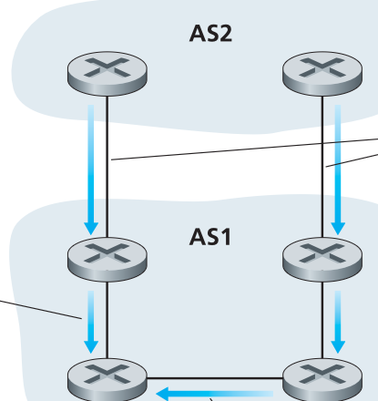

Router learns about another route to *x*

Key:

Route advertisements message for destination *x*

**Figure 4.41** ! NEXT-HOP attributes in advertisements are used to determine which peering link to use

about two different routes to the same prefix *x.* These two routes could have the same AS-PATH to *x,* but could have different NEXT-HOP values corresponding to the different peering links. Using the NEXT-HOP values and the intra-AS routing algorithm, the router can determine the cost of the path to each peering link, and then apply hot-potato routing (see Section 4.5.3) to determine the appropriate interface.

BGP also includes attributes that allow routers to assign preference metrics to the routes, and an attribute that indicates how the prefix was inserted into BGP at the origin AS. For a full discussion of route attributes, see [Griffin 2012; Stewart 1999; Halabi 2000; Feamster 2004; RFC 4271].

When a gateway router receives a route advertisement, it uses its **import policy** to decide whether to accept or filter the route and whether to set certain attributes such as the router preference metrics. The import policy may filter a route because the AS may not want to send traffic over one of the ASs in the route's AS-PATH. The gateway router may also filter a route because it already knows of a preferable route to the same prefix.

#### BGP Route Selection

As described earlier in this section, BGP uses eBGP and iBGP to distribute routes to all the routers within ASs. From this distribution, a router may learn about more than one route to any one prefix, in which case the router must select one of the

possible routes. The input into this route selection process is the set of all routes that have been learned and accepted by the router. If there are two or more routes to the same prefix, then BGP sequentially invokes the following elimination rules until one route remains:

- Routes are assigned a local preference value as one of their attributes. The local preference of a route could have been set by the router or could have been learned by another router in the same AS. This is a policy decision that is left up to the AS's network administrator. (We will shortly discuss BGP policy issues in some detail.) The routes with the highest local preference values are selected.

- From the remaining routes (all with the same local preference value), the route with the shortest AS-PATH is selected. If this rule were the only rule for route selection, then BGP would be using a DV algorithm for path determination, where the distance metric uses the number of AS hops rather than the number of router hops.

- From the remaining routes (all with the same local preference value and the same AS-PATH length), the route with the closest NEXT-HOP router is selected. Here, closest means the router for which the cost of the least-cost path, determined by the intra-AS algorithm, is the smallest. As discussed in Section 4.5.3, this process is called hot-potato routing.

- If more than one route still remains, the router uses BGP identifiers to select the route; see [Stewart 1999].

The elimination rules are even more complicated than described above. To avoid nightmares about BGP, it's best to learn about BGP selection rules in small doses!

### PRINCIPLES IN PRACTICE


**PUTTING IT ALL TOGETHER: HOW DOES AN ENTRY GET INTO A ROUTER'S** **FORWARDING TABLE?**

Recall that an entry in a router's forwarding table consists of a prefix (e.g., 138.16.64/22) and a corresponding router output port (e.g., port 7). When a packet arrives to the router, the packet's destination IP address is compared with the prefixes in the forwarding table to find the one with the longest prefix match. The packet is then forwarded (within the router) to the router port associated with that prefix. Let's now summarize how a routing entry (prefix and associated port) gets entered into a forwarding table. This simple exercise will tie together a lot of what we just learned about routing and forwarding. To make things interesting, let's assume that the prefix is a "foreign prefix," that is, it does not belong to the router's AS but to some other AS.

In order for a prefix to get entered into the router's forwarding table, the router has to first become aware of the prefix (corresponding to a subnet or an aggregation of subnets). As we have just learned, the router becomes aware of the prefix via a BGP route

advertisement. Such an advertisement may be sent to it over an eBGP session (from a router in another AS) or over an iBGP session (from a router in the same AS).

After the router becomes aware of the prefix, it needs to determine the appropriate output port to which datagrams destined to that prefix will be forwarded, before it can enter that prefix in its forwarding table. If the router receives more than one route advertisement for this prefix, the router uses the BGP route selection process, as described earlier in this subsection, to find the "best" route for the prefix. Suppose such a best route has been selected. As described earlier, the selected route includes a NEXT-HOP attribute, which is the IP address of the first router outside the router's AS along this best route. As described above, the router then uses its intra-AS routing protocol (typically OSPF) to determine the shortest path to the NEXT-HOP router. The router finally determines the port number to associate with the prefix by identifying the first link along that shortest path. The router can then (finally!) enter the prefix-port pair into its forwarding table! The forwarding table computed by the routing processor (see Figure 4.6) is then pushed to the router's input port line cards.

#### Routing Policy

Let's illustrate some of the basic concepts of BGP routing policy with a simple example. Figure 4.42 shows six interconnected autonomous systems: A, B, C, W, X, and Y. It is important to note that A, B, C, W, X, and Y are ASs, not routers. Let's assume that autonomous systems W, X, and Y are stub networks and that A, B, and C are backbone provider networks. We'll also assume that A, B, and C, all peer with each other, and provide full BGP information to their customer networks. All traffic entering a **stub** **network** must be destined for that network, and all traffic leaving a stub network must have originated in that network. W and Y are clearly stub networks. X is a **multi-** **homed stub network,** since it is connected to the rest of the network via two different providers (a scenario that is becoming increasingly common in practice). However, like W and Y, X itself must be the source/destination of all traffic leaving/entering X. But how will this stub network behavior be implemented and enforced? How will X be prevented from forwarding traffic between B and C? This can easily be

Key:

B

Provider W A X network

Customer C network

Y

**Figure 4.42** ! A simple BGP scenario

### PRINCIPLES IN PRACTICE


**WHY ARE THERE DIFFERENT INTER-AS AND INTRA-AS** **ROUTING PROTOCOLS?**

Having now studied the details of specific inter-AS and intra-AS routing protocols deployed in today's Internet, let's conclude by considering perhaps the most fundamental question we could ask about these protocols in the first place (hopefully, you have been wondering this all along, and have not lost the forest for the trees!): Why are different inter-AS and intra- AS routing protocols used? The answer to this question gets at the heart of the differences between the goals of routing within an AS and among ASs:

- Policy. Among ASs, policy issues dominate. It may well be important that traffic originating in a given AS not be able to pass through another specific AS. Similarly, a given AS may well want to control what transit traffic it carries between other ASs. We have seen that BGP carries path attributes and provides for controlled distribution of routing information so that such policy-based routing decisions can be made. Within an AS, everything is nominally under the same administrative control, and thus policy issues play a much less important role in choosing routes within the AS.

- Scale. The ability of a routing algorithm and its data structures to scale to handle routing to/among large numbers of networks is a critical issue in inter-AS routing. Within an AS, scalability is less of a concern. For one thing, if a single administrative domain becomes too large, it is always possible to divide it into two ASs and perform inter-AS routing between the two new ASs. (Recall that OSPF allows such a hierarchy to be built by splitting an AS into areas.)

- Performance. Because inter-AS routing is so policy oriented, the quality (for example, performance) of the routes used is often of secondary concern (that is, a longer or more costly route that satisfies certain policy criteria may well be taken over a route that is shorter but does not meet that criteria). Indeed, we saw that among ASs, there is not even the notion of cost (other than AS hop count) associated with routes. Within a single AS, however, such policy concerns are of less importance, allowing routing to focus more on the level of performance realized on a route.

accomplished by controlling the manner in which BGP routes are advertised. In particular, X will function as a stub network if it advertises (to its neighbors B and C) that it has no paths to any other destinations except itself. That is, even though X may know of a path, say XCY, that reaches network Y, it will *not* advertise this path to B. Since B is unaware that X has a path to Y, B would never forward traffic destined to Y (or C) via X. This simple example illustrates how a selective route advertisement policy can be used to implement customer/provider routing relationships.

4.7 • BROADCAST AND MULTICAST ROUTING **399**

Let's next focus on a provider network, say AS B. Suppose that B has learned (from A) that A has a path AW to W. B can thus install the route BAW into its routing information base. Clearly, B also wants to advertise the path BAW to its customer, X, so that X knows that it can route to W via B. But should B advertise the path BAW to C? If it does so, then C could route traffic to W via CBAW. If A, B, and C are all backbone providers, than B might rightly feel that it should not have to shoulder the burden (and cost!) of carrying transit traffic between A and C. B might rightly feel that it is A's and C's job (and cost!) to make sure that C can route to/from A's customers via a direct connection between A and C. There are currently no official standards that govern how backbone ISPs route among themselves. However, a rule of thumb followed by commercial ISPs is that any traffic flowing across an ISP's backbone network must have either a source or a destination (or both) in a network that is a customer of that ISP; otherwise the traffic would be getting a free ride on the ISP's network. Individual peering agreements (that would govern questions such as those raised above) are typically negotiated between pairs of ISPs and are often confidential; [Huston 1999a] provides an interesting discussion of peering agreements. For a detailed description of how routing policy reflects commercial relationships among ISPs, see [Gao 2001; Dmitiropoulos 2007]. For a discussion of BGP routing polices from an ISP standpoint, see [Caesar 2005b].

As noted above, BGP is the *de facto* standard for inter-AS routing for the public Internet. To see the contents of various BGP routing tables (large!) extracted from routers in tier-1 ISPs, see <http://www.routeviews.org>. BGP routing tables often contain tens of thousands of prefixes and corresponding attributes. Statistics about the size and characteristics of BGP routing tables are presented in [Potaroo 2012].

This completes our brief introduction to BGP. Understanding BGP is important because it plays a central role in the Internet. We encourage you to see the references [Griffin 2012; Stewart 1999; Labovitz 1997; Halabi 2000; Huitema 1998; Gao 2001; Feamster 2004; Caesar 2005b; Li 2007] to learn more about BGP.

## 4.7 Broadcast and Multicast Routing

Thus far in this chapter, our focus has been on routing protocols that support unicast (i.e., point-to-point) communication, in which a single source node sends a packet to a single destination node. In this section, we turn our attention to broadcast and multicast routing protocols. In **broadcast routing,** the network layer provides a service of delivering a packet sent from a source node to all other nodes in the network; **multicast routing** enables a single source node to send a copy of a packet to a subset of the other network nodes. In Section 4.7.1 we'll consider broadcast routing algorithms and their embodiment in routing protocols. We'll examine multicast routing in Section 4.7.2.

## 4.7.1 Broadcast Routing Algorithms

Perhaps the most straightforward way to accomplish broadcast communication is for the sending node to send a separate copy of the packet to each destination, as shown in Figure 4.43(a). Given *N* destination nodes, the source node simply makes *N* copies of the packet, addresses each copy to a different destination, and then transmits the *N* copies to the *N* destinations using unicast routing. This **N-way-** **unicast** approach to broadcasting is simple—no new network-layer routing protocol, packet-duplication, or forwarding functionality is needed. There are, however, several drawbacks to this approach. The first drawback is its inefficiency. If the source node is connected to the rest of the network via a single link, then *N* separate copies of the (same) packet will traverse this single link. It would clearly be more efficient to send only a single copy of a packet over this first hop and then have the node at the other end of the first hop make and forward any additional needed copies. That is, it would be more efficient for the network nodes themselves (rather than just the source node) to create duplicate copies of a packet. For example, in Figure 4.43(b), only a single copy of a packet traverses the R1-R2 link. That packet is then duplicated at R2, with a single copy being sent over links R2-R3 and R2-R4.

The additional drawbacks of *N-way-unicast* are perhaps more subtle, but no less important. An implicit assumption of *N-way-unicast* is that broadcast recipients, and their addresses, are known to the sender. But how is this information obtained? Most likely, additional protocol mechanisms (such as a broadcast membership or destination-registration protocol) would be required. This would add more overhead and, importantly, additional complexity to a protocol that had initially seemed quite simple. A final drawback of *N-way-unicast* relates to the purposes for which broadcast is to be used. In Section 4.5, we learned that link-state routing protocols use broadcast to disseminate the link-state information that is used to compute unicast routes. Clearly, in situations where broadcast is used to create and update unicast routes, it would be unwise (at best!) to rely on the unicast routing infrastructure to achieve broadcast.

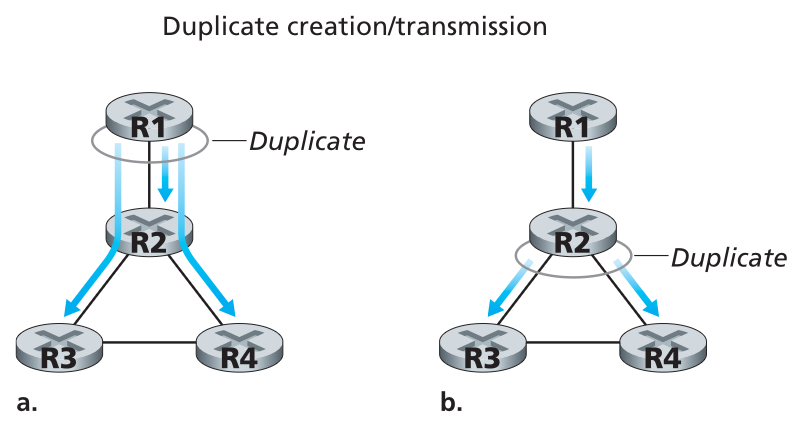

*Figure 4.43 ! Source-duplication versus in-network duplication*

Given the several drawbacks of *N-way-unicast* broadcast, approaches in which the network nodes themselves play an active role in packet duplication, packet forwarding, and computation of the broadcast routes are clearly of interest. We'll examine several such approaches below and again adopt the graph notation introduced in Section 4.5. We again model the network as a graph, *G = (N,E),* where *N* is a set of nodes and a collection *E* of edges, where each edge is a pair of nodes from

N. We'll be a bit sloppy with our notation and use N to refer to both the set of nodes,

as well as the cardinality *(|N|)* or size of that set when there is no confusion.

#### Uncontrolled Flooding

The most obvious technique for achieving broadcast is a **flooding** approach in which the source node sends a copy of the packet to all of its neighbors. When a node receives a broadcast packet, it duplicates the packet and forwards it to all of its neighbors (except the neighbor from which it received the packet). Clearly, if the graph is connected, this scheme will eventually deliver a copy of the broadcast packet to all nodes in the graph. Although this scheme is simple and elegant, it has a fatal flaw (before you read on, see if you can figure out this fatal flaw): If the graph has cycles, then one or more copies of each broadcast packet will cycle indefinitely. For example, in Figure 4.43, R2 will flood to R3, R3 will flood to R4, R4 will flood to R2, and R2 will flood (again!) to R3, and so on. This simple scenario results in the endless cycling of two broadcast packets, one clockwise, and one counterclockwise. But there can be an even more calamitous fatal flaw: When a node is connected to more than two other nodes, it will create and forward multiple copies of the broadcast packet, each of which will create multiple copies of itself (at other nodes with more than two neighbors), and so on. This **broadcast storm,** resulting from the endless multiplication of broadcast packets, would eventually result in so many broadcast packets being created that the network would be rendered useless. (See the homework questions at the end of the chapter for a problem analyzing the rate at which such a broadcast storm grows.)

#### Controlled Flooding

The key to avoiding a broadcast storm is for a node to judiciously choose when to flood a packet and (e.g., if it has already received and flooded an earlier copy of a packet) when not to flood a packet. In practice, this can be done in one of several ways.

In **sequence-number-controlled flooding,** a source node puts its address (or other unique identifier) as well as a **broadcast sequence number** into a broadcast packet, then sends the packet to all of its neighbors. Each node maintains a list of the source address and sequence number of each broadcast packet it has already received, duplicated, and forwarded. When a node receives a broadcast packet, it first checks whether the packet is in this list. If so, the packet is dropped; if not, the

packet is duplicated and forwarded to all the node's neighbors (except the node from which the packet has just been received). The Gnutella protocol, discussed in Chapter 2, uses sequence-number-controlled flooding to broadcast queries in its overlay network. (In Gnutella, message duplication and forwarding is performed at the application layer rather than at the network layer.)

Asecond approach to controlled flooding is known as **reverse path forwarding** **(RPF)** [Dalal 1978], also sometimes referred to as reverse path broadcast (RPB). The idea behind RPF is simple, yet elegant. When a router receives a broadcast packet with a given source address, it transmits the packet on all of its outgoing links (except the one on which it was received) only if the packet arrived on the link that is on its own shortest unicast path back to the source. Otherwise, the router simply discards the incoming packet without forwarding it on any of its outgoing links. Such a packet can be dropped because the router knows it either will receive or has already received a copy of this packet on the link that is on its own shortest path back to the sender. (You might want to convince yourself that this will, in fact, happen and that looping and broadcast storms will not occur.) Note that RPF does not use unicast routing to actually deliver a packet to a destination, nor does it require that a router know the complete shortest path from itself to the source. RPF need only know the next neighbor on its unicast shortest path to the sender; it uses this neighbor's identity only to determine whether or not to flood a received broadcast packet.

Figure 4.44 illustrates RPF. Suppose that the links drawn with thick lines represent the least-cost paths from the receivers to the source *(A).* Node *A* initially broadcasts a source-A packet to nodes *C* and *B.* Node *B* will forward the source-A packet it has received from *A* (since *A* is on its least-cost path to *A)* to both *C* and *D. B* will ignore (drop, without forwarding) any source-A packets it receives from any other

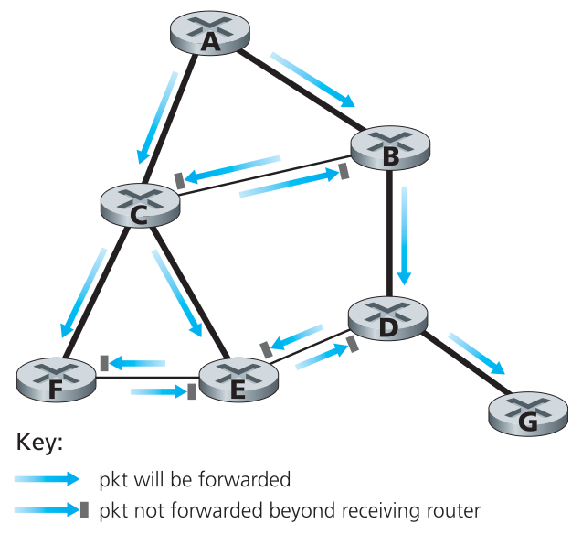

*Figure 4.44 ! Reverse path forwarding*

nodes (for example, from routers *C* or *D).* Let us now consider node *C,* which will receive a source-A packet directly from *A* as well as from *B.* Since *B* is not on *C's* own shortest path back to *A, C* will ignore any source-A packets it receives from *B.* On the other hand, when *C* receives a source-A packet directly from *A,* it will forward the packet to nodes *B, E,* and *F.*

#### Spanning-Tree Broadcast

While sequence-number-controlled flooding and RPF avoid broadcast storms, they do not completely avoid the transmission of redundant broadcast packets. For example, in Figure 4.44, nodes *B, C, D, E,* and *F* receive either one or two redundant packets. Ideally, every node should receive only one copy of the broadcast packet. Examining the tree consisting of the nodes connected by thick lines in Figure 4.45(a), you can see that if broadcast packets were forwarded only along links within this tree, each and every network node would receive exactly one copy of the broadcast packet—exactly the solution we were looking for! This tree is an example of a **spanning tree—a** tree that contains each and every node in a graph. More formally, a spanning tree of a graph *G* = *(N,E)* is a graph *G#* = *(N,E#)* such that *E#* is a subset of *E, G#* is connected, *G#* contains no cycles, and *G#* contains all the original nodes in *G.* If each link has an associated cost and the cost of a tree is the sum of the link costs, then a spanning tree whose cost is the minimum of all of the graph's spanning trees is called (not surprisingly) a **minimum spanning tree.**

Thus, another approach to providing broadcast is for the network nodes to first construct a spanning tree. When a source node wants to send a broadcast packet, it sends the packet out on all of the incident links that belong to the spanning tree. A node receiving a broadcast packet then forwards the packet to all its neighbors in the

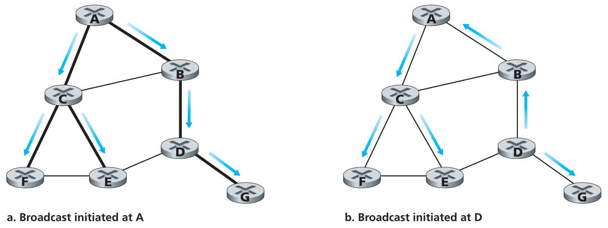

*Figure 4.45 ! Broadcast along a spanning tree*

**D D** **F E F E**

**G G**

a. Broadcast initiated at A b. Broadcast initiated at D

spanning tree (except the neighbor from which it received the packet). Not only does spanning tree eliminate redundant broadcast packets, but once in place, the spanning tree can be used by any node to begin a broadcast, as shown in Figures 4.45(a) and 4.45(b). Note that a node need not be aware of the entire tree; it simply needs to know which of its neighbors in *G* are spanning-tree neighbors.

The main complexity associated with the spanning-tree approach is the creation and maintenance of the spanning tree. Numerous distributed spanning-tree algorithms have been developed [Gallager 1983, Gartner 2003]. We consider only one simple algorithm here. In the **center-based approach** to building a spanning tree, a center node (also known as a **rendezvous point** or a **core)** is defined. Nodes then unicast tree-join messages addressed to the center node. A tree-join message is forwarded using unicast routing toward the center until it either arrives at a node that already belongs to the spanning tree or arrives at the center. In either case, the path that the tree-join message has followed defines the branch of the spanning tree between the edge node that initiated the tree-join message and the center. One can think of this new path as being grafted onto the existing spanning tree.

Figure 4.46 illustrates the construction of a center-based spanning tree. Suppose that node *E* is selected as the center of the tree. Suppose that node *F* first joins the tree and forwards a tree-join message to *E.* The single link *EF* becomes the initial spanning tree. Node *B* then joins the spanning tree by sending its tree-join message to *E.* Suppose that the unicast path route to *E* from *B* is via *D.* In this case, the tree-join message results in the path *BDE* being grafted onto the spanning tree. Node *A* next joins the spanning group by forwarding its tree-join message towards *E.* If *A's* unicast path to *E* is through *B,* then since *B* has already joined the spanning tree, the arrival of *A's* tree-join message at *B* will result in the *AB* link being immediately grafted onto the spanning tree. Node *C* joins the spanning tree next by forwarding its tree-join message directly to *E.* Finally, because the unicast routing from *G* to *E*

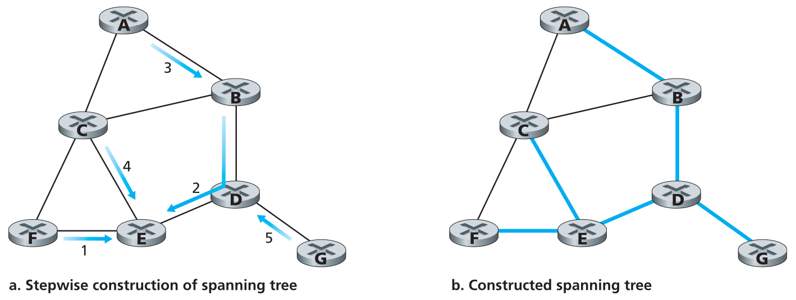

*Figure 4.46 ! Center-based construction of a spanning tree*

**D D** **F E** 5 **F E** 1 **G G**

a. Stepwise construction of spanning tree b. Constructed spanning tree

must be via node *D,* when *G* sends its tree-join message to *E,* the *GD* link is grafted onto the spanning tree at node *D.*

#### Broadcast Algorithms in Practice

Broadcast protocols are used in practice at both the application and network layers. Gnutella [Gnutella 2009] uses application-level broadcast in order to broadcast queries for content among Gnutella peers. Here, a link between two distributed application-level peer processes in the Gnutella network is actually a TCP connection. Gnutella uses a form of sequence-number-controlled flooding in which a 16- bit identifier and a 16-bit payload descriptor (which identifies the Gnutella message type) are used to detect whether a received broadcast query has been previously received, duplicated, and forwarded. Gnutella also uses a time-to-live (TTL) field to limit the number of hops over which a flooded query will be forwarded. When a Gnutella process receives and duplicates a query, it decrements the TTL field before forwarding the query. Thus, a flooded Gnutella query will only reach peers that are within a given number (the initial value of TTL) of application-level hops from the query initiator. Gnutella's flooding mechanism is thus sometimes referred to as *limited-scope flooding.*

Aform of sequence-number-controlled flooding is also used to broadcast link-state advertisements (LSAs) in the OSPF [RFC 2328, Perlman 1999] routing algorithm, and in the Intermediate-System-to-Intermediate-System (IS-IS) routing algorithm [RFC 1142, Perlman 1999]. OSPF uses a 32-bit sequence number, as well as a 16-bit age field to identify LSAs. Recall that an OSPF node broadcasts LSAs for its attached links periodically, when a link cost to a neighbor changes, or when a link goes up/down. LSA sequence numbers are used to detect duplicate LSAs, but also serve a second important function in OSPF. With flooding, it is possible for an LSA generated by the source at time *t* to arrive *after* a newer LSA that was generated by the same source at time *t + d.* The sequence numbers used by the source node allow an older LSA to be distinguished from a newer LSA. The age field serves a purpose similar to that of a TTL value. The initial age field value is set to zero and is incremented at each hop as it is flooded, and is also incremented as it sits in a router's memory waiting to be flooded. Although we have only briefly described the LSA flooding algorithm here, we note that designing LSA broadcast protocols can be very tricky business indeed. [RFC 789; Perlman 1999] describe an incident in which incorrectly transmitted LSAs by two malfunctioning routers caused an early version of an LSA flooding algorithm to take down the entire ARPAnet!

## 4.7.2 Multicast

We've seen in the previous section that with broadcast service, packets are delivered to each and every node in the network. In this section we turn our attention to **multicast** service, in which a multicast packet is delivered to only a *subset* of network nodes. A number of emerging network applications require the delivery of packets from one or more senders to a group of receivers. These applications include

bulk data transfer (for example, the transfer of a software upgrade from the software developer to users needing the upgrade), streaming continuous media (for example, the transfer of the audio, video, and text of a live lecture to a set of distributed lecture participants), shared data applications (for example, a whiteboard or teleconferencing application that is shared among many distributed participants), data feeds (for example, stock quotes), Web cache updating, and interactive gaming (for example, distributed interactive virtual environments or multiplayer games).

In multicast communication, we are immediately faced with two problems— how to identify the receivers of a multicast packet and how to address a packet sent to these receivers. In the case of unicast communication, the IP address of the receiver (destination) is carried in each IP unicast datagram and identifies the single recipient; in the case of broadcast, *all* nodes need to receive the broadcast packet, so no destination addresses are needed. But in the case of multicast, we now have multiple receivers. Does it make sense for each multicast packet to carry the IP addresses of all of the multiple recipients? While this approach might be workable with a small number of recipients, it would not scale well to the case of hundreds or thousands of receivers; the amount of addressing information in the datagram would swamp the amount of data actually carried in the packet's payload field. Explicit identification of the receivers by the sender also requires that the sender know the identities and addresses of all of the receivers. We will see shortly that there are cases where this requirement might be undesirable.

For these reasons, in the Internet architecture (and other network architectures such as ATM [Black 1995]), a multicast packet is addressed using **address indirec-** **tion.** That is, a single identifier is used for the group of receivers, and a copy of the packet that is addressed to the group using this single identifier is delivered to all of the multicast receivers associated with that group. In the Internet, the single identifier that represents a group of receivers is a class D multicast IP address. The group of receivers associated with a class D address is referred to as a **multicast group.** The multicast group abstraction is illustrated in Figure 4.47. Here, four hosts (shown in shaded color) are associated with the multicast group address of 226.17.30.197 and will receive all datagrams addressed to that multicast address. The difficulty that we must still address is the fact that each host has a unique IP unicast address that is completely independent of the address of the multicast group in which it is participating.

While the multicast group abstraction is simple, it raises a host (pun intended) of questions. How does a group get started and how does it terminate? How is the group address chosen? How are new hosts added to the group (either as senders or receivers)? Can anyone join a group (and send to, or receive from, that group) or is group membership restricted and, if so, by whom? Do group members know the identities of the other group members as part of the network-layer protocol? How do the network nodes interoperate with each other to deliver a multicast datagram to all group members? For the Internet, the answers to all of these questions involve the Internet Group Management Protocol [RFC 3376]. So, let us next briefly consider IGMP and then return to these broader questions.

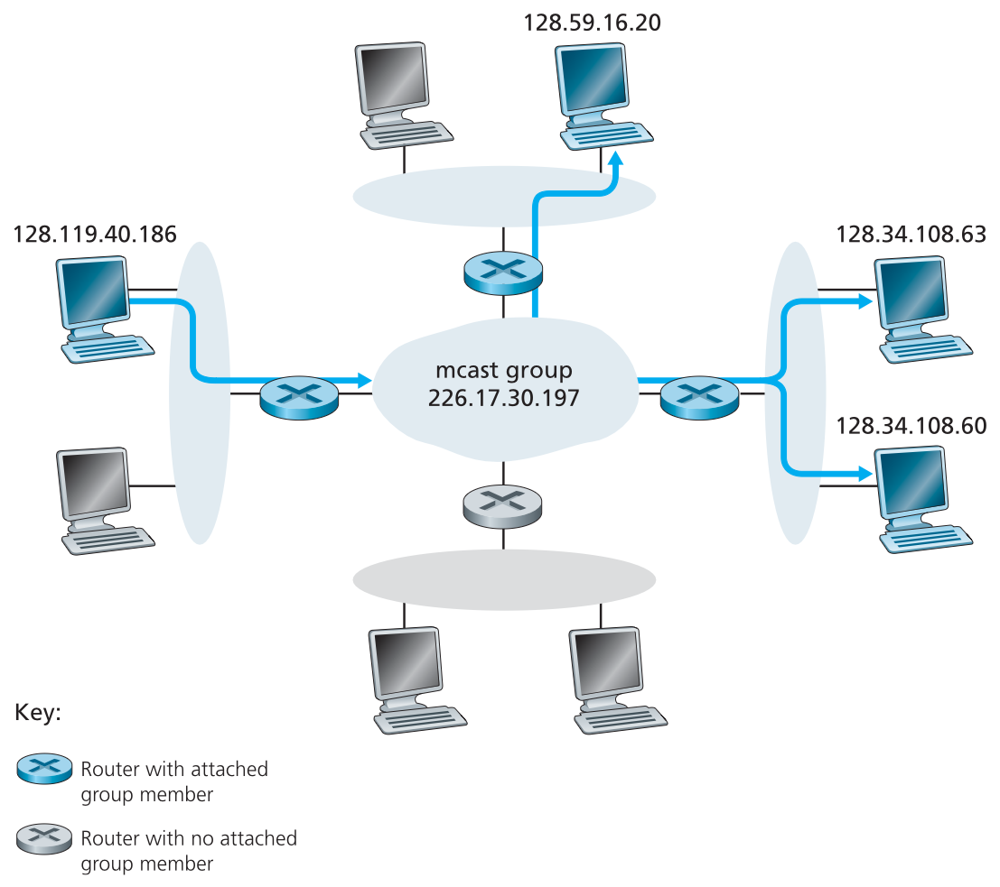

*Figure 4.47 ! The multicast group: A datagram addressed to the group is delivered to all members of the multicast group*

#### Internet Group Management Protocol

The IGMP protocol version 3 [RFC 3376] operates between a host and its directly attached router (informally, we can think of the directly attached router as the firsthop router that a host would see on a path to any other host outside its own local network, or the last-hop router on any path to that host), as shown in Figure 4.48. Figure 4.48 shows three first-hop multicast routers, each connected to its attached hosts via one outgoing local interface. This local interface is attached to a LAN in this example, and while each LAN has multiple attached hosts, at most a few of these hosts will typically belong to a given multicast group at any given time.

IGMP provides the means for a host to inform its attached router that an application running on the host wants to join a specific multicast group. Given that the scope of IGMP interaction is limited to a host and its attached router, another protocol is clearly required to coordinate the multicast routers (including the attached routers) throughout

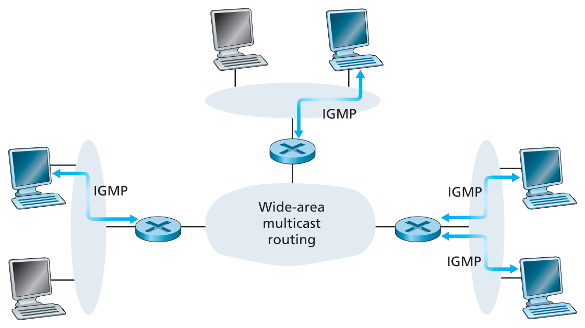

*Figure 4.48 ! The two components of network-layer multicast in the Internet: IGMP and multicast routing protocols*

the Internet, so that multicast datagrams are routed to their final destinations. This latter functionality is accomplished by network-layer multicast routing algorithms, such as those we will consider shortly. Network-layer multicast in the Internet thus consists of two complementary components: IGMP and multicast routing protocols.

IGMP has only three message types. Like ICMP, IGMP messages are carried (encapsulated) within an IP datagram, with an IP protocol number of 2. The membership_query message is sent by a router to all hosts on an attached interface (for example, to all hosts on a local area network) to determine the set of all multicast groups that have been joined by the hosts on that interface. Hosts respond to a membership_query message with an IGMP membership_report message. membership_report messages can also be generated by a host when an application first joins a multicast group without waiting for a membership_query message from the router. The final type of IGMP message is the leave_group message. Interestingly, this message is optional. But if it is optional, how does a router detect when a host leaves the multicast group? The answer to this question is that the router *infers* that a host is no longer in the multicast group if it no longer responds to a membership_query message with the given group address. This is an example of what is sometimes called **soft state** in an Internet protocol. In a softstate protocol, the state (in this case of IGMP, the fact that there are hosts joined to a given multicast group) is removed via a timeout event (in this case, via a periodic membership_query message from the router) if it is not explicitly refreshed (in this case, by a membership_report message from an attached host).

The term soft state was coined by Clark [Clark 1988], who described the notion of periodic state refresh messages being sent by an end system, and suggested that

with such refresh messages, state could be lost in a crash and then automatically restored by subsequent refresh messages—all transparently to the end system and without invoking any explicit crash-recovery procedures:

*". . . the state information would not be critical in maintaining the desired* *type of service associated with the flow. Instead, that type of service would* *be enforced by the end points, which would periodically send messages to* *ensure that the proper type of service was being associated with the flow. In* *this way, the state information associated with the flow could be lost in a* *crash without permanent disruption of the service features being used. I call* *this concept "soft state," and it may very well permit us to achieve our pri-* *mary goals of survivability and flexibility. . ."*

It has been argued that soft-state protocols result in simpler control than hardstate protocols, which not only require state to be explicitly added and removed, but also require mechanisms to recover from the situation where the entity responsible for removing state has terminated prematurely or failed. Interesting discussions of soft state can be found in [Raman 1999; Ji 2003; Lui 2004].

#### Multicast Routing Algorithms

The **multicast routing problem** is illustrated in Figure 4.49. Hosts joined to the multicast group are shaded in color; their immediately attached router is also shaded in color. As shown in Figure 4.49, only a subset of routers (those with attached hosts that are joined to the multicast group) actually needs to receive the multicast traffic. In Figure 4.49, only routers *A, B, E,* and *F* need to receive the multicast traffic. Since none of the hosts attached to router *D* are joined to the multicast group and since router *C* has no attached hosts, neither *C* nor *D* needs to receive the multicast group traffic. The goal of multicast routing, then, is to find a tree of links that connects all of the routers that have attached hosts belonging to the multicast group. Multicast packets will then be routed along this tree from the sender to all of the hosts belonging to the multicast tree. Of course, the tree may contain routers that do not have attached hosts belonging to the multicast group (for example, in Figure 4.49, it is impossible to connect routers *A, B, E,* and *F* in a tree without involving either router *C* or *D).*

In practice, two approaches have been adopted for determining the multicast routing tree, both of which we have already studied in the context of broadcast routing, and so we will only mention them in passing here. The two approaches differ according to whether a single group-shared tree is used to distribute the traffic for *all* senders in the group, or whether a source-specific routing tree is constructed for each individual sender.

- Multicast routing using a group-shared tree. As in the case of spanning-tree broadcast, multicast routing over a group-shared tree is based on building a tree that includes all edge routers with attached hosts belonging to the multicast group. In practice, a center-based approach is used to construct the multicast routing tree, with edge routers with attached hosts belonging to the multicast group sending

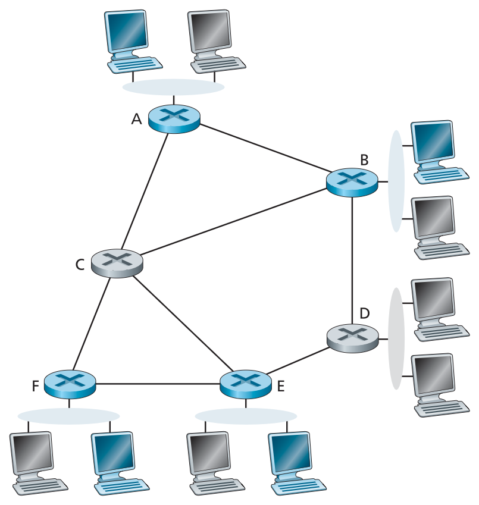

*Figure 4.49 ! Multicast hosts, their attached routers, and other routers*

(via unicast) join messages addressed to the center node. As in the broadcast case, a join message is forwarded using unicast routing toward the center until it either arrives at a router that already belongs to the multicast tree or arrives at the center. All routers along the path that the join message follows will then forward received multicast packets to the edge router that initiated the multicast join. A critical question for center-based tree multicast routing is the process used to select the center. Center-selection algorithms are discussed in [Wall 1980; Thaler 1997; Estrin 1997].

- Multicast routing using a source-based tree. While group-shared tree multicast routing constructs a single, shared routing tree to route packets from *all* senders, the second approach constructs a multicast routing tree for *each* source in the multicast group. In practice, an RPF algorithm (with source node *x)* is used to construct a multicast forwarding tree for multicast datagrams originating at source *x.* The RPF broadcast algorithm we studied earlier requires a bit of tweaking for use in multicast. To see why, consider router *D* in Figure 4.50. Under broadcast RPF, it would forward packets to router *G,* even though router *G* has no attached hosts that are joined to the multicast group. While this is not so bad for this case where *D* has only a single downstream router, *G,* imagine what would happen if there were thousands of routers downstream from *D!* Each of these thousands of routers would receive unwanted multicast packets.

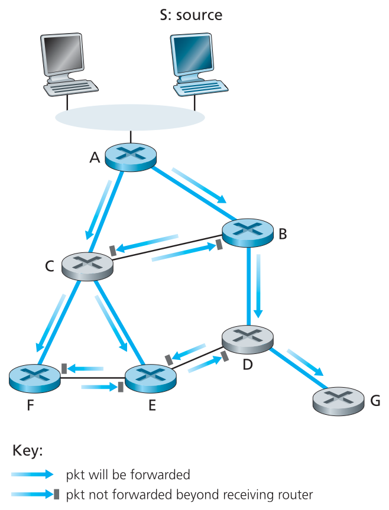

*Figure 4.50 ! Reverse path forwarding, the multicast case*

(This scenario is not as far-fetched as it might seem. The initial MBone [Casner 1992; Macedonia 1994], the first global multicast network, suffered from precisely this problem at first.). The solution to the problem of receiving unwanted multicast packets under RPF is known as **pruning.** A multicast router that receives multicast packets and has no attached hosts joined to that group will send a prune message to its upstream router. If a router receives prune messages from each of its downstream routers, then it can forward a prune message upstream.

#### Multicast Routing in the Internet

The first multicast routing protocol used in the Internet was the **Distance-Vector Mul-** **ticast Routing Protocol (DVMRP)** [RFC 1075]. DVMRP implements source-based trees with reverse path forwarding and pruning. DVMRP uses an RPF algorithm with pruning, as discussed above. Perhaps the most widely used Internet multicast routing protocol is the **Protocol-Independent Multicast (PIM) routing protocol,** which explicitly recognizes two multicast distribution scenarios. In dense mode [RFC 3973], multicast group members are densely located; that is, many or most of the routers in the area need to be involved in routing multicast datagrams. PIM dense mode is a flood-and-prune reverse path forwarding technique similar in spirit to DVMRP.

In sparse mode [RFC 4601], the number of routers with attached group members is small with respect to the total number of routers; group members are widely dispersed. PIM sparse mode uses rendezvous points to set up the multicast distribution tree. In **source-specific multicast (SSM)** [RFC 3569, RFC 4607], only a single sender is allowed to send traffic into the multicast tree, considerably simplifying tree construction and maintenance.

When PIM and DVMP are used within a domain, the network operator can configure IP multicast routers within the domain, in much the same way that intradomain unicast routing protocols such as RIP, IS-IS, and OSPF can be configured. But what happens when multicast routes are needed between different domains? Is there a multicast equivalent of the inter-domain BGP protocol? The answer is (literally) yes. [RFC 4271] defines multiprotocol extensions to BGP to allow it to carry routing information for other protocols, including multicast information. The Multicast Source Discovery Protocol (MSDP) [RFC 3618, RFC 4611] can be used to connect together rendezvous points in different PIM sparse mode domains. An excellent overview of the current state of multicast routing in the Internet is [RFC 5110].

Let us close our discussion of IP multicast by noting that IP multicast has yet to take off in a big way. For interesting discussions of the Internet multicast service model and deployment issues, see [Diot 2000, Sharma 2003]. Nonetheless, in spite of the lack of widespread deployment, network-level multicast is far from "dead." Multicast traffic has been carried for many years on Internet 2, and the networks with which it peers [Internet2 Multicast 2012]. In the United Kingdom, the BBC is engaged in trials of content distribution via IP multicast [BBC Multicast 2012]. At the same time, application-level multicast, as we saw with PPLive in Chapter 2 and in other peer-to-peer systems such as End System Multicast [Chu 2002], provides multicast distribution of content among peers using application-layer (rather than network-layer) multicast protocols. Will future multicast services be primarily implemented in the network layer (in the network core) or in the application layer (at the network's edge)? While the current craze for content distribution via peer-to-peer approaches tips the balance in favor of application-layer multicast at least in the nearterm future, progress continues to be made in IP multicast, and sometimes the race ultimately goes to the slow and steady.

## 4.8 Summary

In this chapter, we began our journey into the network core. We learned that the network layer involves each and every host and router in the network. Because of this, network-layer protocols are among the most challenging in the protocol stack.

We learned that a router may need to process millions of flows of packets between different source-destination pairs at the same time. To permit a router to process such a large number of flows, network designers have learned over the years that the router's tasks should be as simple as possible. Many measures can be taken


HOMEWORK PROBLEMS AND QUESTIONS **413**

to make the router's job easier, including using a datagram network layer rather than a virtual-circuit network layer, using a streamlined and fixed-sized header (as in IPv6), eliminating fragmentation (also done in IPv6), and providing the one and only best-effort service. Perhaps the most important trick here is *not* to keep track of individual flows, but instead base routing decisions solely on hierarchically structured destination addresses in the datagrams. It is interesting to note that the postal service has been using this approach for many years.

In this chapter, we also looked at the underlying principles of routing algorithms. We learned how routing algorithms abstract the computer network to a graph with nodes and links. With this abstraction, we can exploit the rich theory of shortest-path routing in graphs, which has been developed over the past 40 years in the operations research and algorithms communities. We saw that there are two broad approaches: a centralized (global) approach, in which each node obtains a complete map of the network and independently applies a shortest-path routing algorithm; and a decentralized approach, in which individual nodes have only a partial picture of the entire network, yet the nodes work together to deliver packets along the shortest routes. We also studied how hierarchy is used to deal with the problem of scale by partitioning large networks into independent administrative domains called autonomous systems (ASs). Each AS independently routes its datagrams through the AS, just as each country independently routes its postal mail through the country. We learned how centralized, decentralized, and hierarchical approaches are embodied in the principal routing protocols in the Internet: RIP, OSPF, and BGP. We concluded our study of routing algorithms by considering broadcast and multicast routing.

Having completed our study of the network layer, our journey now takes us one step further down the protocol stack, namely, to the link layer. Like the network layer, the link layer is also part of the network core. But we will see in the next chapter that the link layer has the much more localized task of moving packets between nodes on the same link or LAN. Although this task may appear on the surface to be trivial compared with that of the network layer's tasks, we will see that the link layer involves a number of important and fascinating issues that can keep us busy for a long time.

## Homework Problems and Questions

### Chapter 4 Review Questions

SECTIONS 4.1–4.2

R1. Let's review some of the terminology used in this textbook. Recall that the name of a transport-layer packet is *segment* and that the name of a link-layer packet is *frame.* What is the name of a network-layer packet? Recall that both routers and link-layer switches are called *packet switches.* What is the fundamental difference between a router and link-layer switch? Recall that we use the term *routers* for both datagram networks and VC networks.

---

## Repeated content (headers / footers / watermarks)

> The following appeared on most pages and was moved out of the body to keep reading order clean — kept here, not deleted.

- 306 CHAPTER 4 • THE NETWORK LAYER · 308 CHAPTER 4 • THE NETWORK LAYER · 310 CHAPTER 4 • THE NETWORK LAYER · 312 CHAPTER 4 • THE NETWORK LAYER · 314 CHAPTER 4 • THE NETWORK LAYER · 316 CHAPTER 4 • THE NETWORK LAYER · 318 CHAPTER 4 • THE NETWORK LAYER · 320 CHAPTER 4 • THE NETWORK LAYER · 322 CHAPTER 4 • THE NETWORK LAYER · 324 CHAPTER 4 • THE NETWORK LAYER · 326 CHAPTER 4 • THE NETWORK LAYER · 328 CHAPTER 4 • THE NETWORK LAYER · 330 CHAPTER 4 • THE NETWORK LAYER · 332 CHAPTER 4 • THE NETWORK LAYER · 334 CHAPTER 4 • THE NETWORK LAYER · 336 CHAPTER 4 • THE NETWORK LAYER · 338 CHAPTER 4 • THE NETWORK LAYER · 340 CHAPTER 4 • THE NETWORK LAYER · 342 CHAPTER 4 • THE NETWORK LAYER · 344 CHAPTER 4 • THE NETWORK LAYER · 346 CHAPTER 4 • THE NETWORK LAYER · 348 CHAPTER 4 • THE NETWORK LAYER · 350 CHAPTER 4 • THE NETWORK LAYER · 352 CHAPTER 4 • THE NETWORK LAYER · 354 CHAPTER 4 • THE NETWORK LAYER · 356 CHAPTER 4 • THE NETWORK LAYER · 358 CHAPTER 4 • THE NETWORK LAYER · 360 CHAPTER 4 • THE NETWORK LAYER · 362 CHAPTER 4 • THE NETWORK LAYER · 364 CHAPTER 4 • THE NETWORK LAYER · 366 CHAPTER 4 • THE NETWORK LAYER · 368 CHAPTER 4 • THE NETWORK LAYER · 370 CHAPTER 4 • THE NETWORK LAYER · 372 CHAPTER 4 • THE NETWORK LAYER · 374 CHAPTER 4 • THE NETWORK LAYER · 376 CHAPTER 4 • THE NETWORK LAYER · 378 CHAPTER 4 • THE NETWORK LAYER · 380 CHAPTER 4 • THE NETWORK LAYER · 382 CHAPTER 4 • THE NETWORK LAYER · 384 CHAPTER 4 • THE NETWORK LAYER · 386 CHAPTER 4 • THE NETWORK LAYER · 388 CHAPTER 4 • THE NETWORK LAYER · 390 CHAPTER 4 • THE NETWORK LAYER · 392 CHAPTER 4 • THE NETWORK LAYER · 394 CHAPTER 4 • THE NETWORK LAYER · 396 CHAPTER 4 • THE NETWORK LAYER · 398 CHAPTER 4 • THE NETWORK LAYER · 400 CHAPTER 4 • THE NETWORK LAYER · 402 CHAPTER 4 • THE NETWORK LAYER · 404 CHAPTER 4 • THE NETWORK LAYER · 406 CHAPTER 4 • THE NETWORK LAYER · 408 CHAPTER 4 • THE NETWORK LAYER · 410 CHAPTER 4 • THE NETWORK LAYER · 412 CHAPTER 4 • THE NETWORK LAYER  *(pp.2, 4, 6, 8, 10, 12, 14, 16, 18, 20, 22, 24, 26, 28, 30, 32, 34, 36, 38, 40, 42, 44, 46, 48, 50, 52, 54, 56, 58, 60, 62, 64, 66, 68, 70, 72, 74, 76, 78, 80, 82, 84, 86, 88, 90, 92, 94, 96, 98, 100, 102, 104, 106, 108)*
- 4.2 • VIRTUAL CIRCUIT AND DATAGRAM NETWORKS 313 · 4.2 • VIRTUAL CIRCUIT AND DATAGRAM NETWORKS 315 · 4.2 • VIRTUAL CIRCUIT AND DATAGRAM NETWORKS 317 · 4.2 • VIRTUAL CIRCUIT AND DATAGRAM NETWORKS 319  *(pp.9, 11, 13, 15)*
- 4.3 • WHAT'S INSIDE A ROUTER? 321 · 4.3 • WHAT'S INSIDE A ROUTER? 323 · 4.3 • WHAT'S INSIDE A ROUTER? 325 · 4.3 • WHAT'S INSIDE A ROUTER? 327 · 4.3 • WHAT'S INSIDE A ROUTER? 329  *(pp.17, 19, 21, 23, 25)*
- 4.4 • THE INTERNET PROTOCOL (IP) 331 · 4.4 • THE INTERNET PROTOCOL (IP) 333 · 4.4 • THE INTERNET PROTOCOL (IP) 335 · 4.4 • THE INTERNET PROTOCOL (IP) 337 · 4.4 • THE INTERNET PROTOCOL (IP) 339 · 4.4 • THE INTERNET PROTOCOL (IP) 341 · 4.4 • THE INTERNET PROTOCOL (IP) 343 · 4.4 • THE INTERNET PROTOCOL (IP) 345 · 4.4 • THE INTERNET PROTOCOL (IP) 347 · 4.4 • THE INTERNET PROTOCOL (IP) 349 · 4.4 • THE INTERNET PROTOCOL (IP) 351 · 4.4 • THE INTERNET PROTOCOL (IP) 353 · 4.4 • THE INTERNET PROTOCOL (IP) 355 · 4.4 • THE INTERNET PROTOCOL (IP) 357 · 4.4 • THE INTERNET PROTOCOL (IP) 359 · 4.4 • THE INTERNET PROTOCOL (IP) 361  *(pp.27, 29, 31, 33, 35, 37, 39, 41, 43, 45, 47, 49, 51, 53, 55, 57)*
- 4.5 • ROUTING ALGORITHMS 363 · 4.5 • ROUTING ALGORITHMS 365 · 4.5 • ROUTING ALGORITHMS 367 · 4.5 • ROUTING ALGORITHMS 369 · 4.5 • ROUTING ALGORITHMS 371 · 4.5 • ROUTING ALGORITHMS 373 · 4.5 • ROUTING ALGORITHMS 375 · 4.5 • ROUTING ALGORITHMS 377 · 4.5 • ROUTING ALGORITHMS 379 · 4.5 • ROUTING ALGORITHMS 381  *(pp.59, 61, 63, 65, 67, 69, 71, 73, 75, 77)*
- 4.6 • ROUTING IN THE INTERNET 383 · 4.6 • ROUTING IN THE INTERNET 385 · 4.6 • ROUTING IN THE INTERNET 387 · 4.6 • ROUTING IN THE INTERNET 389 · 4.6 • ROUTING IN THE INTERNET 391 · 4.6 • ROUTING IN THE INTERNET 393 · 4.6 • ROUTING IN THE INTERNET 395 · 4.6 • ROUTING IN THE INTERNET 397  *(pp.79, 81, 83, 85, 87, 89, 91, 93)*
- 4.7 • BROADCAST AND MULTICAST ROUTING 399 · 4.7 • BROADCAST AND MULTICAST ROUTING 401 · 4.7 • BROADCAST AND MULTICAST ROUTING 403 · 4.7 • BROADCAST AND MULTICAST ROUTING 405 · 4.7 • BROADCAST AND MULTICAST ROUTING 407 · 4.7 • BROADCAST AND MULTICAST ROUTING 409 · 4.7 • BROADCAST AND MULTICAST ROUTING 411  *(pp.95, 97, 99, 101, 103, 105, 107)*
- fromfromfrom  *(p.70)*