# 5

# CHAPTER

# The Network Layer: Control

# Plane

In this chapter, we'll complete our journey through the network layer by covering the **control-plane** component of the network layer—the *network-wide* logic that controls not only how a datagram is routed along an end-to-end path from the source host to the destination host, but also how network-layer components and services are configured and managed. In Section 5.2, we'll cover traditional routing algorithms for computing least cost paths in a graph; these algorithms are the basis for two widely deployed Internet routing protocols: OSPF and BGP, that we'll cover in Sections 5.3 and 5.4, respectively. As we'll see, OSPF is a routing protocol that operates within a single ISP's network. BGP is a routing protocol that serves to interconnect all of the networks in the Internet; BGP is thus often referred to as the "glue" that holds the Internet together. Traditionally, control-plane routing protocols have been implemented together with data-plane forwarding functions, monolithically, within a router. As we learned in the introduction to Chapter 4, software-defined networking (SDN) makes a clear separation between the data and control planes, implementing control-plane functions in a separate "controller" service that is distinct, and remote, from the forwarding components of the routers it controls. We'll cover SDN controllers in Section 5.5.

In Sections 5.6 and 5.7, we'll cover some of the nuts and bolts of managing an IP network: ICMP (the Internet Control Message Protocol) and SNMP (the Simple Network Management Protocol).

**377**

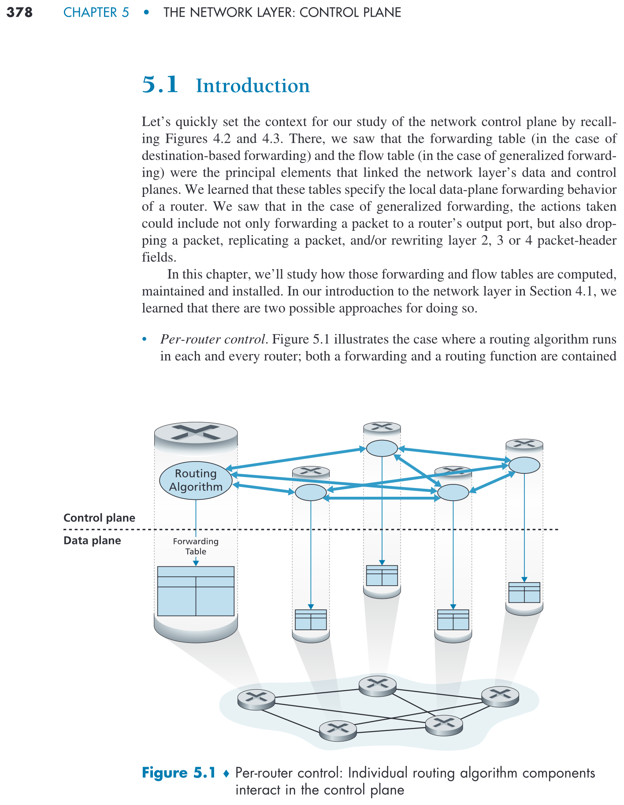

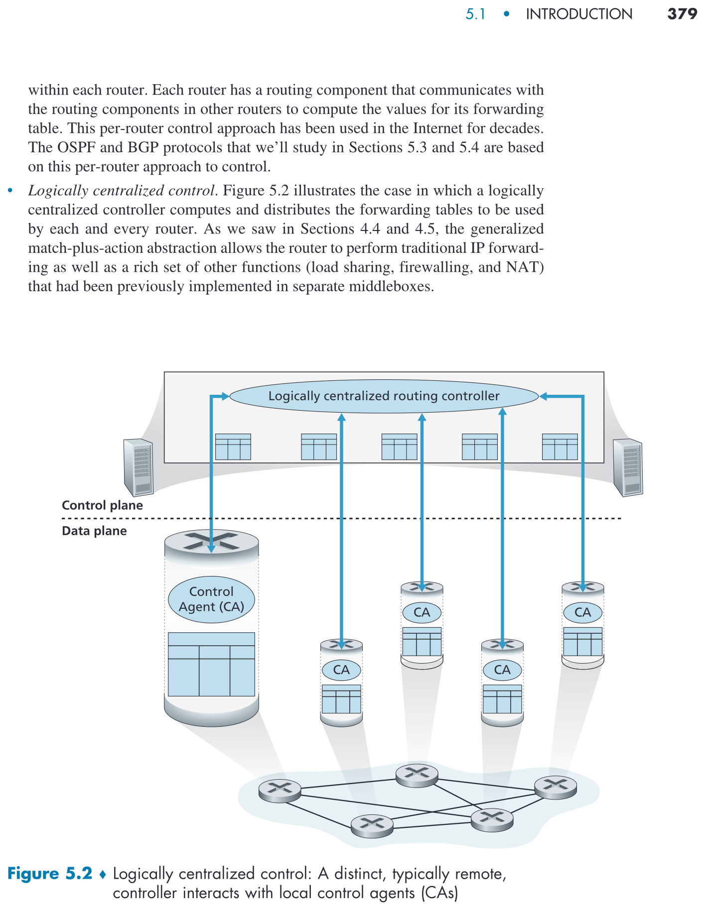

**380** CHAPTER 5 • THE NETWORK LAYER: CONTROL PLANE

The controller interacts with a control agent (CA) in each of the routers via a well-defined protocol to configure and manage that router's flow table. Typically, the CA has minimum functionality; its job is to communicate with the controller, and to do as the controller commands. Unlike the routing algorithms in Figure 5.1, the CAs do not directly interact with each other nor do they actively take part in computing the forwarding table. This is a key distinction between per-router control and logically centralized control.

By "logically centralized" control [Levin 2012] we mean that the routing control service is accessed as if it were a single central service point, even though the service is likely to be implemented via multiple servers for fault-tolerance, and performance scalability reasons. As we will see in Section 5.5, SDN adopts this notion of a logically centralized controller—an approach that is finding increased use in production deployments. Google uses SDN to control the routers in its internal B4 global wide-area network that interconnects its data centers [Jain 2013]. SWAN [Hong 2013], from Microsoft Research, uses a logically centralized controller to manage routing and forwarding between a wide area network and a data center network. Major ISP deployments, including COM- CAST's ActiveCore and Deutsche Telecom's Access 4.0 are actively integrating SDN into their networks. And as we'll see in Chapter 8, SDN control is central to 4G/5G cellular networking as well. [AT&T 2019] notes, " … SDN, isn't a vision, a goal, or a promise. It's a reality. By the end of next year, 75% of our network functions will be fully virtualized and software-controlled." China Telecom and China Unicom are using SDN both within data centers and between data centers [Li 2015].

## 5.2 Routing Algorithms

In this section, we'll study **routing algorithms,** whose goal is to determine good paths (equivalently, routes), from senders to receivers, through the network of routers. Typically, a "good" path is one that has the least cost. We'll see that in practice, however, real-world concerns such as policy issues (for example, a rule such as "router *x,* belonging to organization *Y,* should not forward any packets originating from the network owned by organization *Z")* also come into play. We note that whether the network control plane adopts a per-router control approach or a logically centralized approach, there must always be a well-defined sequence of routers that a packet will cross in traveling from sending to receiving host. Thus, the routing algorithms that compute these paths are of fundamental importance, and another candidate for our top-10 list of fundamentally important networking concepts. A graph is used to formulate routing problems. Recall that a **graph** *G* = *(N, E)* is a set *N* of nodes and a collection *E* of edges, where each edge is a pair of nodes from *N.* In the context of network-layer routing, the nodes in the graph represent

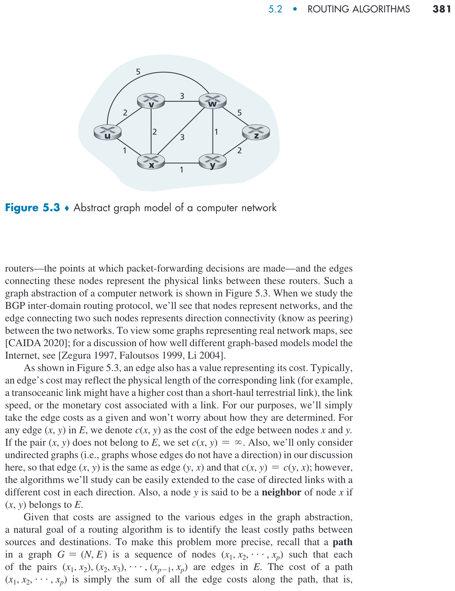

c($x_{1}$, $x_{2}$) + c($x_{2}$, $x_{3}$) + g+ c($x_{p-1,}$ $x_{p}$). Given any two nodes x and y, there are typically many paths between the two nodes, with each path having a cost. One or more of these paths is a **least-cost path.** The least-cost problem is therefore clear: Find a path between the source and destination that has least cost. In Figure 5.3, for example, the least-cost path between source node *u* and destination node *w* is *(u, x, y, w)* with a path cost of 3. Note that if all edges in the graph have the same cost, the leastcost path is also the **shortest path** (that is, the path with the smallest number of links between the source and the destination). As a simple exercise, try finding the least-cost path from node *u* to *z* in Figure 5.3 and reflect for a moment on how you calculated that path. If you are like most people, you found the path from *u* to *z* by examining Figure 5.3, tracing a few routes from *u* to *z,* and somehow convincing yourself that the path you had chosen had the least cost among all possible paths. (Did you check all of the 17 possible paths between *u* and *z?* Probably not!) Such a calculation is an example of a centralized routing algorithm—the routing algorithm was run in one location, your brain, with complete information about the network. Broadly, one way in which we can classify routing algorithms is according to whether they are centralized or decentralized.

- A centralized routing algorithm computes the least-cost path between a source and destination using complete, global knowledge about the network. That is, the algorithm takes the connectivity between all nodes and all link costs as inputs. This then requires that the algorithm somehow obtain this information before actually performing the calculation. The calculation itself can be run at one site (e.g., a logically centralized controller as in Figure 5.2) or could be replicated in the routing component of each and every router (e.g., as in Figure 5.1). The key distinguishing feature here, however, is that the algorithm has complete information about connectivity and link costs. Algorithms with global state information are often referred to as **link-state (LS) algorithms,** since the algorithm must be aware of the cost of each link in the network. We'll study LS algorithms in Section 5.2.1.

- In a decentralized routing algorithm, the calculation of the least-cost path is carried out in an iterative, distributed manner by the routers. No node has complete information about the costs of all network links. Instead, each node begins with only the knowledge of the costs of its own directly attached links. Then, through an iterative process of calculation and exchange of information with its neighboring nodes, a node gradually calculates the least-cost path to a destination or set of destinations. The decentralized routing algorithm we'll study below in Section 5.2.2 is called a distance-vector (DV) algorithm, because each node maintains a vector of estimates of the costs (distances) to all other nodes in the network. Such decentralized algorithms, with interactive message exchange between

5.2 • ROUTING ALGORITHMS **383**

neighboring routers is perhaps more naturally suited to control planes where the routers interact directly with each other, as in Figure 5.1.

A second broad way to classify routing algorithms is according to whether they are static or dynamic. In **static routing algorithms,** routes change very slowly over time, often as a result of human intervention (for example, a human manually editing a link costs). **Dynamic routing algorithms** change the routing paths as the network traffic loads or topology change. A dynamic algorithm can be run either periodically or in direct response to topology or link cost changes. While dynamic algorithms are more responsive to network changes, they are also more susceptible to problems such as routing loops and route oscillation.

A third way to classify routing algorithms is according to whether they are loadsensitive or load-insensitive. In a **load-sensitive algorithm,** link costs vary dynamically to reflect the current level of congestion in the underlying link. If a high cost is associated with a link that is currently congested, a routing algorithm will tend to choose routes around such a congested link. While early ARPAnet routing algorithms were load-sensitive [McQuillan 1980], a number of difficulties were encountered [Huitema 1998]. Today's Internet routing algorithms (such as RIP, OSPF, and BGP) are **load-insensitive,** as a link's cost does not explicitly reflect its current (or recent past) level of congestion.

## 5.2.1 The Link-State (LS) Routing Algorithm

Recall that in a link-state algorithm, the network topology and all link costs are known, that is, available as input to the LS algorithm. In practice, this is accomplished by having each node broadcast link-state packets to *all* other nodes in the network, with each link-state packet containing the identities and costs of its attached links. In practice (for example, with the Internet's OSPF routing protocol, discussed in Section 5.3), this is often accomplished by a **link-state** **broadcast** algorithm [Perlman 1999]. The result of the nodes' broadcast is that all nodes have an identical and complete view of the network. Each node can then run the LS algorithm and compute the same set of least-cost paths as every other node.

The link-state routing algorithm we present below is known as *Dijkstra's* *algorithm,* named after its inventor. A closely related algorithm is Prim's algorithm; see [Cormen 2001] for a general discussion of graph algorithms. Dijkstra's algorithm computes the least-cost path from one node (the source, which we will refer to as *u)* to all other nodes in the network. Dijkstra's algorithm is iterative and has the property that after the *kth* iteration of the algorithm, the least-cost paths are known to *k* destination nodes, and among the least-cost paths to all destination

nodes, these *k* paths will have the *k* smallest costs. Let us define the following notation:

- D(v): cost of the least-cost path from the source node to destination v as of this iteration of the algorithm.

- p(v): previous node (neighbor of v) along the current least-cost path from the source to *v.*

- N′: subset of nodes; v is in N′ if the least-cost path from the source to v is definitively known. The centralized routing algorithm consists of an initialization step followed by

a loop. The number of times the loop is executed is equal to the number of nodes in the network. Upon termination, the algorithm will have calculated the shortest paths from the source node *u* to every other node in the network.

#### Link-State (LS) Algorithm for Source Node u

## 1 Initialization:

```
2 N' = {u}
3 for all nodes v
4 if v is a neighbor of u
5 then D(v) = c(u,v)
6 else D(v) = ∞
7
```

## 8 Loop

```
9 find w not in N' such that D(w) is a minimum
10 add w to N'
11 update D(v) for each neighbor v of w and not in N':
12 D(v) = min(D(v), D(w)+ c(w,v) )
13 /* new cost to v is either old cost to v or known
14 least path cost to w plus cost from w to v */
```

$$15 until N'= N$$

As an example, let's consider the network in Figure 5.3 and compute the leastcost paths from *u* to all possible destinations. A tabular summary of the algorithm's computation is shown in Table 5.1, where each line in the table gives the values of the algorithm's variables at the end of the iteration. Let's consider the few first steps in detail.

- In the initialization step, the currently known least-cost paths from u to its directly attached neighbors, *v, x,* and *w,* are initialized to 2, 1, and 5, respectively. Note in

5.2 • ROUTING ALGORITHMS **385**

| step | N' | D(v), p(v) | D(w), p(w) | D(x), p(x) | D(y), p(y) | D(z), p(z) |
| --- | --- | --- | --- | --- | --- | --- |
| 0 | u | 2, u | 5, u | 1,u | ∞ | ∞ |
| 1 | ux | 2, u | 4, x |  | 2, x | ∞ |
| 2 | uxy | 2, u | 3, y |  |  | 4, y |
| 3 | uxyv |  | 3, y |  |  | 4, y |
| 4 | uxyvw |  |  |  |  | 4, y |

5 uxyvwz

**Table 5.1** ♦ Running the link-state algorithm on the network in Figure 5.3

particular that the cost towis set to 5 (even though we will soon see that a lesser-cost path does indeed exist) since this is the cost of the direct (one hop) link from *u* to

w. The costs to y and z are set to infinity because they are not directly connected

to *u.*

- In the first iteration, we look among those nodes not yet added to the set N′ and find that node with the least cost as of the end of the previous iteration. That node is *x,* with a cost of 1, and thus *x* is added to the set *N′.* Line 12 of the LS algorithm is then performed to update *D(v)* for all nodes *v,* yielding the results shown in the second line (Step 1) in Table 5.1. The cost of the path to *v* is unchanged. The cost of the path to *w* (which was 5 at the end of the initialization) through node *x* is found to have a cost of 4. Hence this lower-cost path is selected and *w's* predecessor along the shortest path from *u* is set to *x.* Similarly, the cost to *y* (through *x)* is computed to be 2, and the table is updated accordingly.

- In the second iteration, nodes v and y are found to have the least-cost paths (2), and we break the tie arbitrarily and add *y* to the set *N′* so that *N′* now contains *u,* *x,* and *y.* The cost to the remaining nodes not yet in *N′,* that is, nodes *v, w,* and *z,* are updated via line 12 of the LS algorithm, yielding the results shown in the third row in Table 5.1.

- And so on . . . When the LS algorithm terminates, we have, for each node, its predecessor

along the least-cost path from the source node. For each predecessor, we also have *its* predecessor, and so in this manner we can construct the entire path from the source to all destinations. The forwarding table in a node, say node *u,* can then be constructed from this information by storing, for each destination, the next-hop node on the leastcost path from *u* to the destination. Figure 5.4 shows the resulting least-cost paths and forwarding table in *u* for the network in Figure 5.3.

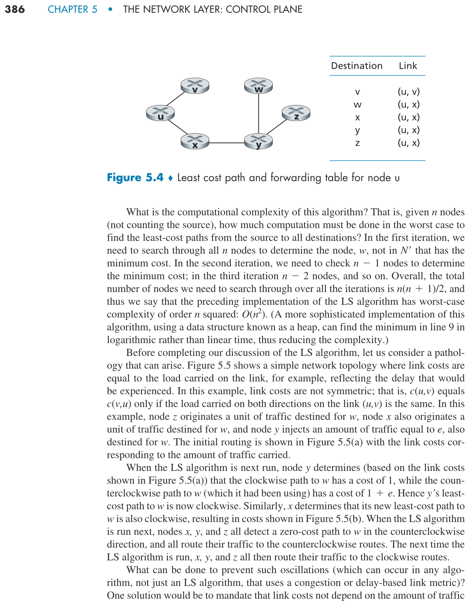

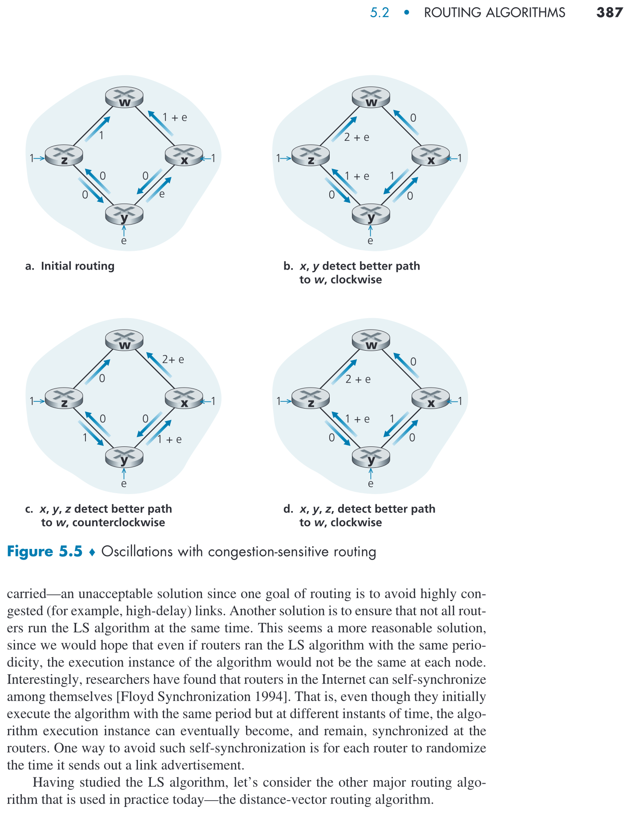

## 5.2.2 The Distance-Vector (DV) Routing Algorithm

Whereas the LS algorithm is an algorithm using global information, the **distance-** **vector (DV)** algorithm is iterative, asynchronous, and distributed. It is *distributed* in that each node receives some information from one or more of its *directly attached* neighbors, performs a calculation, and then distributes the results of its calculation back to its neighbors. It is *iterative* in that this process continues on until no more information is exchanged between neighbors. (Interestingly, the algorithm is also self-terminating—there is no signal that the computation should stop; it just stops.) The algorithm is *asynchronous* in that it does not require all of the nodes to operate in lockstep with each other. We'll see that an asynchronous, iterative, self-terminating, distributed algorithm is much more interesting and fun than a centralized algorithm!

Before we present the DV algorithm, it will prove beneficial to discuss an important relationship that exists among the costs of the least-cost paths. Let $d_{x}$(y) be the cost of the least-cost path from node *x* to node *y.* Then the least costs are related by the celebrated Bellman-Ford equation, namely,

$$d_{x}(y) = min_{v}5c(x, v) + d_{v}(y)6, \tag{5.1}$$

where the $min_{v}$ in the equation is taken over all of x's neighbors. The Bellman- Ford equation is rather intuitive. Indeed, after traveling from *x* to *v,* if we then take the least-cost path from v to y, the path cost will be c(x, v) + $d_{v}$(y). Since we must begin by traveling to some neighbor *v,* the least cost from *x* to *y* is the minimum of c(x, v) + $d_{v}$(y) taken over all neighbors v.

But for those who might be skeptical about the validity of the equation, let's check it for source node *u* and destination node *z* in Figure 5.3. The source node *u* has three neighbors: nodes *v, x,* and *w.* By walking along various paths in the graph, it is easy to see that $d_{v}$(z) = 5, $d_{x}$(z) = 3, and $d_{w}$(z) = 3. Plugging these values into Equation 5.1, along with the costs *c(u, v)* = 2, *c(u, x)* = 1, and *c(u, w)* = 5, gives $d_{u}$(z) = min52 + 5, 5 + 3, 1 + 36 = 4, which is obviously true and which is exactly what the Dijskstra algorithm gave us for the same network. This quick verification should help relieve any skepticism you may have.

The Bellman-Ford equation is not just an intellectual curiosity. It actually has significant practical importance: the solution to the Bellman-Ford equation provides the entries in node x's forwarding table. To see this, let v* be any neighboring node that achieves the minimum in Equation 5.1. Then, if node *x* wants to send a packet to node *y* along a least-cost path, it should first forward the packet to node v*. Thus, node x's forwarding table would specify node v* as the next-hop router for the ultimate destination y. Another important practical contribution of the Bellman-Ford equation is that it suggests the form of the neighbor-to-neighbor communication that will take place in the DV algorithm.

The basic idea is as follows. Each node x begins with $D_{x}$(y), an estimate of the cost of the least-cost path from itself to node y, for all nodes,y, inN. Let $D_{x}$ = [$D_{x}$(y): y in N] be nodex's distance vector, which is the vector of cost estimates fromxto all other nodes, *y,* inN. With the DV algorithm, each nodex maintains the following routing information:

5.2 • ROUTING ALGORITHMS **389**

- For each neighbor v, the cost c(x,v) from x to directly attached neighbor, v

- Node x's distance vector, that is, Dx = [Dx(y): y in N], containing x's estimate of its cost to all destinations, *y,* in *N*

- The distance vectors of each of its neighbors, that is, Dv = [Dv(y): y in N] for each neighbor *v* of *x*

In the distributed, asynchronous algorithm, from time to time, each node sends a copy of its distance vector to each of its neighbors. When a node *x* receives a new distance vector from any of its neighbors *w,* it saves *w's* distance vector, and then uses the Bellman-Ford equation to update its own distance vector as follows:

$D_{x}$(y) = $min_{v}$5c(x, v) + $D_{v}$(y)6 for each node y in N

If node *x's* distance vector has changed as a result of this update step, node *x* will then send its updated distance vector to each of its neighbors, which can in turn update their own distance vectors. Miraculously enough, as long as all the nodes continue to exchange their distance vectors in an asynchronous fashion, each cost estimate

$D_{x}$(y) converges to $d_{x}$(y), the actual cost of the least-cost path from node x to node y

[Bertsekas 1991]!

#### Distance-Vector (DV) Algorithm

At each node, *x:*

## 1 Initialization:

2 for all destinations y in N: 3 4 5 6 7 8

9 **loop**

10 11 12 13 14 15

16 **if**

```
17
18
        Dx(y)= c(x,y)/* if y is not a neighbor then c(x,y)= ∞ */
     for each neighbor w
        Dw(y) = ? for all destinations y in N
     for each neighbor w
        send distance vector Dx = [Dx(y): y in N] to w

      wait (until I see a link cost change to some neighbor w or
              until I receive a distance vector from some neighbor w)

      for each y in N:
          Dx(y) = minv{c(x,v) + Dv(y)}
     Dx(y) changed for any destination y
         send distance vector Dx = [Dx(y): y in N] to all neighbors
```

19 **forever**

In the DV algorithm, a node *x* updates its distance-vector estimate when it either sees a cost change in one of its directly attached links or receives a distance-vector update from some neighbor. But to update its own forwarding table for a given destination *y,* what node *x* really needs to know is not the shortest-path distance to *y* but instead the neighboring node v*(y) that is the next-hop router along the shortest path to y. As you might expect, the next-hop router v*(y) is the neighbor v that achieves the minimum in Line 14 of the DV algorithm. (If there are multiple neighbors *v* that achieve the minimum, then v*(y) can be any of the minimizing neighbors.) Thus, in Lines 13–14, for each destination y, node x also determines v*(y) and updates its forwarding table for destination *y.*

Recall that the LS algorithm is a centralized algorithm in the sense that it requires each node to first obtain a complete map of the network before running the Dijkstra algorithm. The DV algorithm is *decentralized* and does not use such global information. Indeed, the only information a node will have is the costs of the links to its directly attached neighbors and information it receives from these neighbors. Each node waits for an update from any neighbor (Lines 10–11), calculates its new distance vector when receiving an update (Line 14), and distributes its new distance vector to its neighbors (Lines 16–17). DV-like algorithms are used in many routing protocols in practice, including the Internet's RIP and BGP, ISO IDRP, Novell IPX, and the original ARPAnet.

Figure 5.6 illustrates the operation of the DV algorithm for the simple threenode network shown at the top of the figure. The operation of the algorithm is illustrated in a synchronous manner, where all nodes simultaneously receive distance vectors from their neighbors, compute their new distance vectors, and inform their neighbors if their distance vectors have changed. After studying this example, you should convince yourself that the algorithm operates correctly in an asynchronous manner as well, with node computations and update generation/reception occurring at any time.

The leftmost column of the figure displays three initial **routing tables** for each of the three nodes. For example, the table in the upper-left corner is node *x's* initial routing table. Within a specific routing table, each row is a distance vector— specifically, each node's routing table includes its own distance vector and that of each of its neighbors. Thus, the first row in node *x's* initial routing table is $D_{x}$ = [$D_{x}$(x), $D_{x}$(y), $D_{x}$(z)] = [0, 2, 7]. The second and third rows in this table are the most recently received distance vectors from nodes *y* and *z,* respectively. Because at initialization node *x* has not received anything from node *y* or *z,* the entries in the second and third rows are initialized to infinity.

After initialization, each node sends its distance vector to each of its two neighbors. This is illustrated in Figure 5.6 by the arrows from the first column of tables to the second column of tables. For example, node x sends its distance vector $D_{x}$ = [0, 2, 7] to both nodes *y* and *z.* After receiving the updates, each node recomputes its own distance vector. For example, node *x* computes

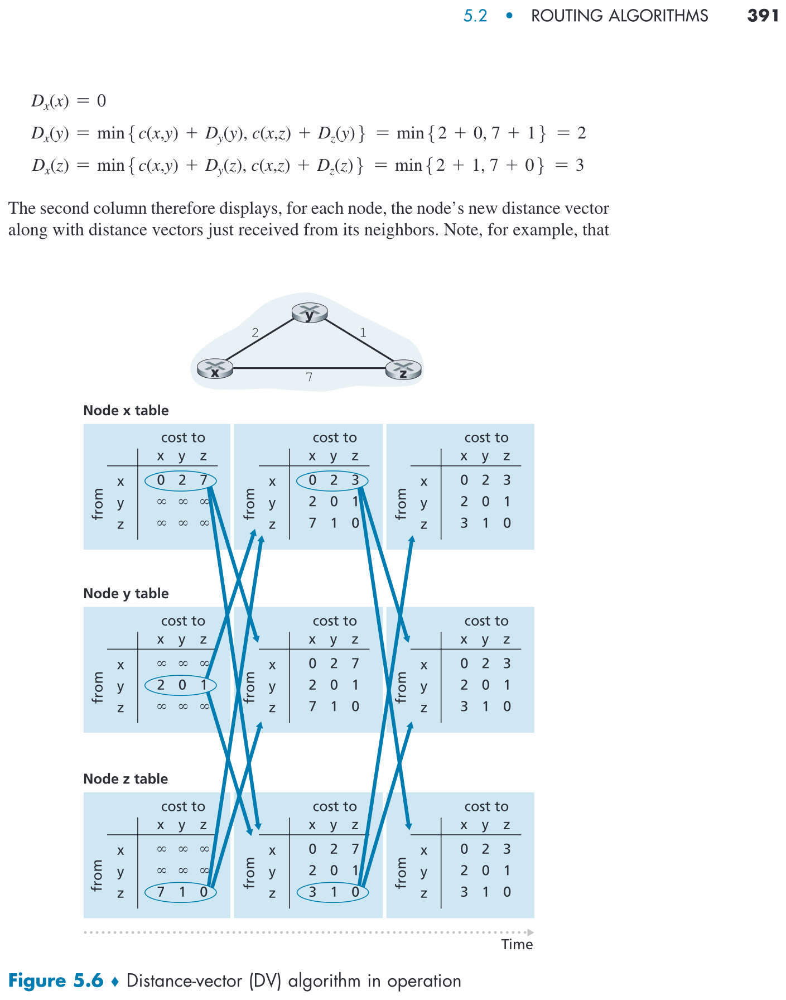

node x's estimate for the least cost to node z, $D_{x}$(z), has changed from 7 to 3. Also note that for node *x,* neighboring node *y* achieves the minimum in line 14 of the DV algorithm; thus, at this stage of the algorithm, we have at node x that v*(y) = y and

$$v*(z) = y.$$

After the nodes recompute their distance vectors, they again send their updated distance vectors to their neighbors (if there has been a change). This is illustrated in Figure 5.6 by the arrows from the second column of tables to the third column of tables. Note that only nodes *x* and *z* send updates: node *y's* distance vector didn't change so node *y* doesn't send an update. After receiving the updates, the nodes then recompute their distance vectors and update their routing tables, which are shown in the third column.

The process of receiving updated distance vectors from neighbors, recomputing routing table entries, and informing neighbors of changed costs of the least-cost path to a destination continues until no update messages are sent. At this point, since no update messages are sent, no further routing table calculations will occur and the algorithm will enter a quiescent state; that is, all nodes will be performing the wait in Lines 10–11 of the DV algorithm. The algorithm remains in the quiescent state until a link cost changes, as discussed next.

#### Distance-Vector Algorithm: Link-Cost Changes and Link Failure

When a node running the DV algorithm detects a change in the link cost from itself to a neighbor (Lines 10–11), it updates its distance vector (Lines 13–14) and, if there's a change in the cost of the least-cost path, informs its neighbors (Lines 16–17) of its new distance vector. Figure 5.7(a) illustrates a scenario where the link cost from *y* to *x* changes from 4 to 1. We focus here only on *y'* and *z's* distance table entries to destination *x.* The DV algorithm causes the following sequence of events to occur:

- At time t0, y detects the link-cost change (the cost has changed from 4 to 1), updates its distance vector, and informs its neighbors of this change since its distance vector has changed.

- At time t1, z receives the update from y and updates its table. It computes a new least cost to *x* (it has decreased from a cost of 5 to a cost of 2) and sends its new distance vector to its neighbors.

- At time t2, y receives z's update and updates its distance table. y's least costs do not change and hence *y* does not send any message to *z.* The algorithm comes to a quiescent state.

Thus, only two iterations are required for the DV algorithm to reach a quiescent state. The good news about the decreased cost between *x* and *y* has propagated quickly through the network.

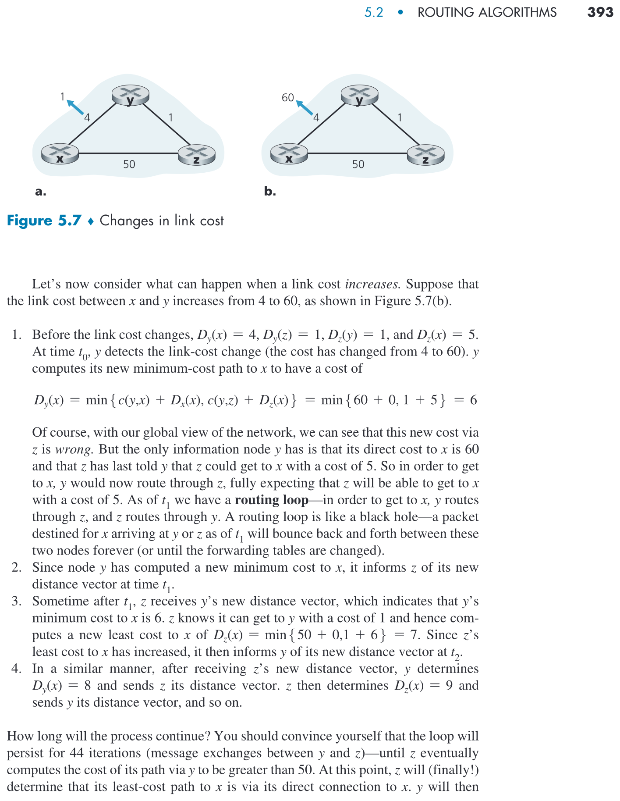

route to *x* via *z.* The result of the bad news about the increase in link cost has indeed traveled slowly! What would have happened if the link cost *c(y, x)* had changed from 4 to 10,000 and the cost *c(z, x)* had been 9,999? Because of such scenarios, the problem we have seen is sometimes referred to as the count-to-infinity problem.

#### Distance-Vector Algorithm: Adding Poisoned Reverse

The specific looping scenario just described can be avoided using a technique known as *poisoned reverse.* The idea is simple—if *z* routes through *y* to get to destination *x,* then *z* will advertise to *y* that its distance to *x* is infinity, that is, *z* will advertise to *y* that $D_{z}$(x) = ∞ (even though z knows $D_{z}$(x) = 5 in truth). z will continue telling this little white lie to *y* as long as it routes to *x* via *y.* Since *y* believes that *z* has no path to *x, y* will never attempt to route to *x* via *z,* as long as *z* continues to route to *x* via *y* (and lies about doing so).

Let's now see how poisoned reverse solves the particular looping problem we encountered before in Figure 5.5(b). As a result of the poisoned reverse, *y's* distance table indicates $D_{z}$(x) = ∞. When the cost of the (x, y) link changes from 4 to 60 at time $t_{0}$, y updates its table and continues to route directly to x, albeit at a higher cost of 60, and informs z of its new cost to x, that is, $D_{y}$(x) = 60. After receiving the update at $t_{1}$, z immediately shifts its route to x to be via the direct (z, x) link at a cost of 50. Since this is a new least-cost path to *x,* and since the path no longer passes through y, z now informs y that $D_{z}$(x) = 50 at $t_{2}$. After receiving the update from z, y updates its distance table with $D_{y}$(x) = 51. Also, since z is now on y's leastcost path to x, y poisons the reverse path from z to x by informing z at time $t_{3}$ that $D_{y}$(x) = ∞ (even though y knows that $D_{y}$(x) = 51 in truth).

Does poisoned reverse solve the general count-to-infinity problem? It does not. You should convince yourself that loops involving three or more nodes (rather than simply two immediately neighboring nodes) will not be detected by the poisoned reverse technique.

#### A Comparison of LS and DV Routing Algorithms

The DV and LS algorithms take complementary approaches toward computing routing. In the DV algorithm, each node talks to *only* its directly connected neighbors, but it provides its neighbors with least-cost estimates from itself to *all* the nodes (that it knows about) in the network. The LS algorithm requires global information. Consequently, when implemented in each and every router, for example, as in Figures 4.2 and 5.1, each node would need to communicate with *all* other nodes (via broadcast), but it tells them *only* the costs of its directly connected links. Let's conclude our study of LS and DV algorithms with a quick comparison of some of their attributes. Recall that *N* is the set of nodes (routers) and *E* is the set of edges (links).

- Message complexity. We have seen that LS requires each node to know the cost of each link in the network. This requires O(|N| |E|) messages to be sent.

5.3 • INTRA-AS ROUTING IN THE INTERNET: OSPF **395**

Also, whenever a link cost changes, the new link cost must be sent to all nodes. The DV algorithm requires message exchanges between directly connected neighbors at each iteration. We have seen that the time needed for the algorithm to converge can depend on many factors. When link costs change, the DV algorithm will propagate the results of the changed link cost only if the new link cost results in a changed least-cost path for one of the nodes attached to that link.

- Speed of convergence. We have seen that our implementation of LS is an O(|N|2) algorithm requiring O(|N| |E|)) messages. The DV algorithm can converge slowly and can have routing loops while the algorithm is converging. DV also suffers from the count-to-infinity problem.

- Robustness. What can happen if a router fails, misbehaves, or is sabotaged? Under LS, a router could broadcast an incorrect cost for one of its attached links (but no others). A node could also corrupt or drop any packets it received as part of an LS broadcast. But an LS node is computing only its own forwarding tables; other nodes are performing similar calculations for themselves. This means route calculations are somewhat separated under LS, providing a degree of robustness. Under DV, a node can advertise incorrect least-cost paths to any or all destinations. (Indeed, in 1997, a malfunctioning router in a small ISP provided national backbone routers with erroneous routing information. This caused other routers to flood the malfunctioning router with traffic and caused large portions of the Internet to become disconnected for up to several hours [Neumann 1997].) More generally, we note that, at each iteration, a node's calculation in DV is passed on to its neighbor and then indirectly to its neighbor's neighbor on the next iteration. In this sense, an incorrect node calculation can be diffused through the entire network under DV.

In the end, neither algorithm is an obvious winner over the other; indeed, both algorithms are used in the Internet.

## 5.3 Intra-AS Routing in the Internet: OSPF

In our study of routing algorithms so far, we've viewed the network simply as a collection of interconnected routers. One router was indistinguishable from another in the sense that all routers executed the same routing algorithm to compute routing paths through the entire network. In practice, this model and its view of a homogenous set of routers all executing the same routing algorithm is simplistic for two important reasons:

- Scale.As the number of routers becomes large, the overhead involved in communicating, computing, and storing routing information becomes prohibitive. Today's

Internet consists of hundreds of millions of routers. Storing routing information for possible destinations at each of these routers would clearly require enormous amounts of memory. The overhead required to broadcast connectivity and link cost updates among all of the routers would be huge! A distance-vector algorithm that iterated among such a large number of routers would surely never converge.

Clearly, something must be done to reduce the complexity of route computation in a network as large as the Internet.

- Administrative autonomy. As described in Section 1.3, the Internet is a network of ISPs, with each ISP consisting of its own network of routers. An ISP generally desires to operate its network as it pleases (for example, to run whatever routing algorithm it chooses within its network) or to hide aspects of its network's internal organization from the outside. Ideally, an organization should be able to operate and administer its network as it wishes, while still being able to connect its network to other outside networks.

Both of these problems can be solved by organizing routers into **autonomous** **systems (ASs),** with each AS consisting of a group of routers that are under the same administrative control. Often the routers in an ISP, and the links that interconnect them, constitute a single AS. Some ISPs, however, partition their network into multiple ASs. In particular, some tier-1 ISPs use one gigantic AS for their entire network, whereas others break up their ISP into tens of interconnected ASs. An autonomous system is identified by its globally unique autonomous system number (ASN) [RFC 1930]. AS numbers, like IP addresses, are assigned by ICANN regional registries [ICANN 2020].

Routers within the same AS all run the same routing algorithm and have information about each other. The routing algorithm running within an autonomous system is called an **intra-autonomous system routing protocol.**

#### Open Shortest Path First (OSPF)

OSPF routing and its closely related cousin, IS-IS, are widely used for intra-AS routing in the Internet. The Open in OSPF indicates that the routing protocol specification is publicly available (for example, as opposed to Cisco's EIGRP protocol, which was only recently became open [Savage 2015], after roughly 20 years as a Cisco-proprietary protocol). The most recent version of OSPF, version 2, is defined in [RFC 2328], a public document.

OSPF is a link-state protocol that uses flooding of link-state information and a Dijkstra's least-cost path algorithm. With OSPF, each router constructs a complete topological map (that is, a graph) of the entire autonomous system. Each router then locally runs Dijkstra's shortest-path algorithm to determine a shortest-path tree to all *subnets,* with itself as the root node. Individual link costs are configured by the network administrator (see sidebar, Principles and Practice:

5.3 • INTRA-AS ROUTING IN THE INTERNET: OSPF **397**

### PRINCIPLES IN PRACTICE


**SETTING OSPF LINK WEIGHTS**

Our discussion of link-state routing has implicitly assumed that link weights are set, a routing algorithm such as OSPF is run, and traffic flows according to the routing tables computed by the LS algorithm. In terms of cause and effect, the link weights are given (i.e., they come first) and result (via Dijkstra's algorithm) in routing paths that minimize overall cost. In this viewpoint, link weights reflect the cost of using a link (for example, if link weights are inversely proportional to capacity, then the use of high-capacity links would have smaller weight and thus be more attractive from a routing standpoint) and Dijsktra's algorithm serves to minimize overall cost.

In practice, the cause and effect relationship between link weights and routing paths may be reversed, with network operators configuring link weights in order to obtain routing paths that achieve certain traffic engineering goals [Fortz 2000, Fortz 2002]. For example, suppose a network operator has an estimate of traffic flow entering the network at each ingress point and destined for each egress point. The operator may then want to put in place a specific routing of ingress-to-egress flows that minimizes the maximum utilization over all of the network's links. But with a routing algorithm such as OSPF, the operator's main "knobs" for tuning the routing of flows through the network are the link weights. Thus, in order to achieve the goal of minimizing the maximum link utilization, the operator must find the set of link weights that achieves this goal. This is a reversal of the cause and effect relationship—the desired routing of flows is known, and the OSPF link weights must be found such that the OSPF routing algorithm results in this desired routing of flows.

Setting OSPF Weights). The administrator might choose to set all link costs to 1, thus achieving minimum-hop routing, or might choose to set the link weights to be inversely proportional to link capacity in order to discourage traffic from using low-bandwidth links. OSPF does not mandate a policy for how link weights are set (that is the job of the network administrator), but instead provides the mechanisms (protocol) for determining least-cost path routing for the given set of link weights.

With OSPF, a router broadcasts routing information to *all* other routers in the autonomous system, not just to its neighboring routers. A router broadcasts link-state information whenever there is a change in a link's state (for example, a change in cost or a change in up/down status). It also broadcasts a link's state periodically (at least once every 30 minutes), even if the link's state has not changed. RFC 2328 notes that "this periodic updating of link state advertisements adds robustness to the link state algorithm." OSPF advertisements are contained in OSPF messages that are

carried directly by IP, with an upper-layer protocol of 89 for OSPF. Thus, the OSPF protocol must itself implement functionality such as reliable message transfer and link-state broadcast. The OSPF protocol also checks that links are operational (via a HELLO message that is sent to an attached neighbor) and allows an OSPF router to obtain a neighboring router's database of network-wide link state.

Some of the advances embodied in OSPF include the following:

- Security. Exchanges between OSPF routers (for example, link-state updates) can be authenticated. With authentication, only trusted routers can participate in the OSPF protocol within an AS, thus preventing malicious intruders (or networking students taking their newfound knowledge out for a joyride) from injecting incorrect information into router tables. By default, OSPF packets between routers are not authenticated and could be forged. Two types of authentication can be configured—simple and MD5 (see Chapter 8 for a discussion on MD5 and authentication in general). With simple authentication, the same password is configured on each router. When a router sends an OSPF packet, it includes the password in plaintext. Clearly, simple authentication is not very secure. MD5 authentication is based on shared secret keys that are configured in all the routers. For each OSPF packet that it sends, the router computes the MD5 hash of the content of the OSPF packet appended with the secret key. (See the discussion of message authentication codes in Chapter 8.) Then the router includes the resulting hash value in the OSPF packet. The receiving router, using the preconfigured secret key, will compute an MD5 hash of the packet and compare it with the hash value that the packet carries, thus verifying the packet's authenticity. Sequence numbers are also used with MD5 authentication to protect against replay attacks.

- Multiple same-cost paths. When multiple paths to a destination have the same cost, OSPF allows multiple paths to be used (that is, a single path need not be chosen for carrying all traffic when multiple equal-cost paths exist).

- Integrated support for unicast and multicast routing. Multicast OSPF (MOSPF) [RFC 1584] provides simple extensions to OSPF to provide for multicast routing. MOSPF uses the existing OSPF link database and adds a new type of link-state advertisement to the existing OSPF link-state broadcast mechanism.

- Support for hierarchy within a single AS. An OSPF autonomous system can be configured hierarchically into areas. Each area runs its own OSPF link-state routing algorithm, with each router in an area broadcasting its link state to all other routers in that area. Within each area, one or more area border routers are responsible for routing packets outside the area. Lastly, exactly one OSPF area in the AS is configured to be the backbone area. The primary role of the backbone area is to route traffic between the other areas in the AS. The backbone always contains all area border routers in the AS and may contain non-border routers as well. Inter-area routing within the AS requires that the packet be first

5.4 • ROUTING AMONG THE ISPS: BGP **399**

routed to an area border router (intra-area routing), then routed through the backbone to the area border router that is in the destination area, and then routed to the final destination.

OSPF is a relatively complex protocol, and our coverage here has been necessarily brief; [Huitema 1998; Moy 1998; RFC 2328] provide additional details.

## 5.4 Routing Among the ISPs: BGP

We just learned that OSPF is an example of an intra-AS routing protocol. When routing a packet between a source and destination within the same AS, the route the packet follows is entirely determined by the intra-AS routing protocol. How- VideoNote

**Gluing the Internet**

ever, to route a packet across multiple ASs, say from a smartphone in Timbuktu to Together: BGP a server in a datacenter in Silicon Valley, we need an **inter-autonomous system** **routing protocol.** Since an inter-AS routing protocol involves coordination among multiple ASs, communicating ASs must run the same inter-AS routing protocol. In fact, in the Internet, all ASs run the same inter-AS routing protocol, called the Border Gateway Protocol, more commonly known as **BGP** [RFC 4271; Stewart 1999].

BGP is arguably the most important of all the Internet protocols (the only other contender would be the IP protocol that we studied in Section 4.3), as it is the protocol that glues the thousands of ISPs in the Internet together. As we will soon see, BGP is a decentralized and asynchronous protocol in the vein of distance-vector routing described in Section 5.2.2. Although BGP is a complex and challenging protocol, to understand the Internet on a deep level, we need to become familiar with its underpinnings and operation. The time we devote to learning BGP will be well worth the effort.

## 5.4.1 The Role of BGP

To understand the responsibilities of BGP, consider an AS and an arbitrary router in that AS. Recall that every router has a forwarding table, which plays the central role in the process of forwarding arriving packets to outbound router links. As we have learned, for destinations that are within the same AS, the entries in the router's forwarding table are determined by the AS's intra-AS routing protocol. But what about destinations that are outside of the AS? This is precisely where BGP comes to the rescue.

In BGP, packets are not routed to a specific destination address, but instead to CIDRized prefixes, with each prefix representing a subnet or a collection of subnets.

In the world of BGP, a destination may take the form 138.16.68/22, which for this example includes 1,024 IP addresses. Thus, a router's forwarding table will have entries of the form *(x, I),* where *x* is a prefix (such as 138.16.68/22) and *I* is an interface number for one of the router's interfaces.

As an inter-AS routing protocol, BGP provides each router a means to:

1. Obtain prefix reachability information from neighboring ASs. In particular, BGP allows each subnet to advertise its existence to the rest of the Internet. A subnet screams, "I exist and I am here," and BGP makes sure that all the routers in the Internet know about this subnet. If it weren't for BGP, each subnet would be an isolated island—alone, unknown and unreachable by the rest of the Internet.

2. Determine the "best" routes to the prefixes. A router may learn about two or more different routes to a specific prefix. To determine the best route, the router will locally run a BGP route-selection procedure (using the prefix reachability information it obtained via neighboring routers). The best route will be determined based on policy as well as the reachability information.

Let us now delve into how BGP carries out these two tasks.

## 5.4.2 Advertising BGP Route Information

Consider the network shown in Figure 5.8. As we can see, this simple network has three autonomous systems: AS1, AS2, and AS3. As shown, AS3 includes a subnet with prefix x. For each AS, each router is either a **gateway router** or an **internal** **router.** A gateway router is a router on the edge of an AS that directly connects to one or more routers in other ASs. An **internal router** connects only to hosts and routers within its own AS. In AS1, for example, router 1c is a gateway router; routers 1a, 1b, and 1d are internal routers.

Let's consider the task of advertising reachability information for prefix x to all of the routers shown in Figure 5.8. At a high level, this is straightforward. First, AS3 sends a BGP message to AS2, saying that x exists and is in AS3; let's denote this message as "AS3 x". Then AS2 sends a BGP message to AS1, saying that x exists and that you can get to x by first passing through AS2 and then going to AS3; let's denote that message as "AS2 AS3 x". In this manner, each of the autonomous systems will not only learn about the existence of x, but also learn about a path of autonomous systems that leads to x.

Although the discussion in the above paragraph about advertising BGP reachability information should get the general idea across, it is not precise in the sense that autonomous systems do not actually send messages to each other, but instead routers do. To understand this, let's now re-examine the example in Figure 5.8. In BGP,

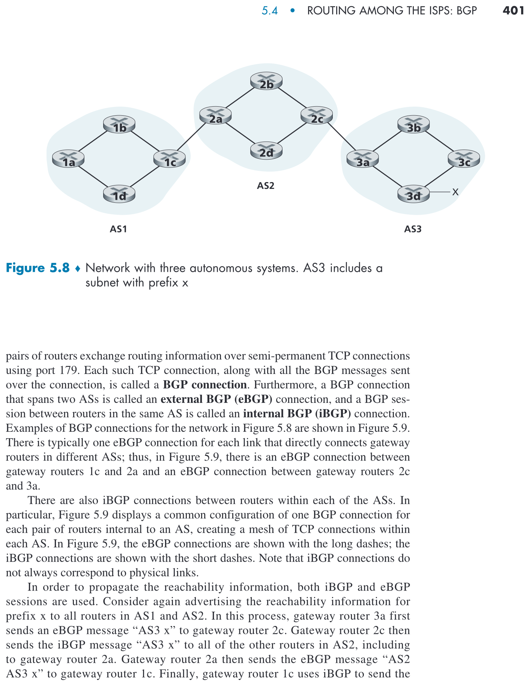

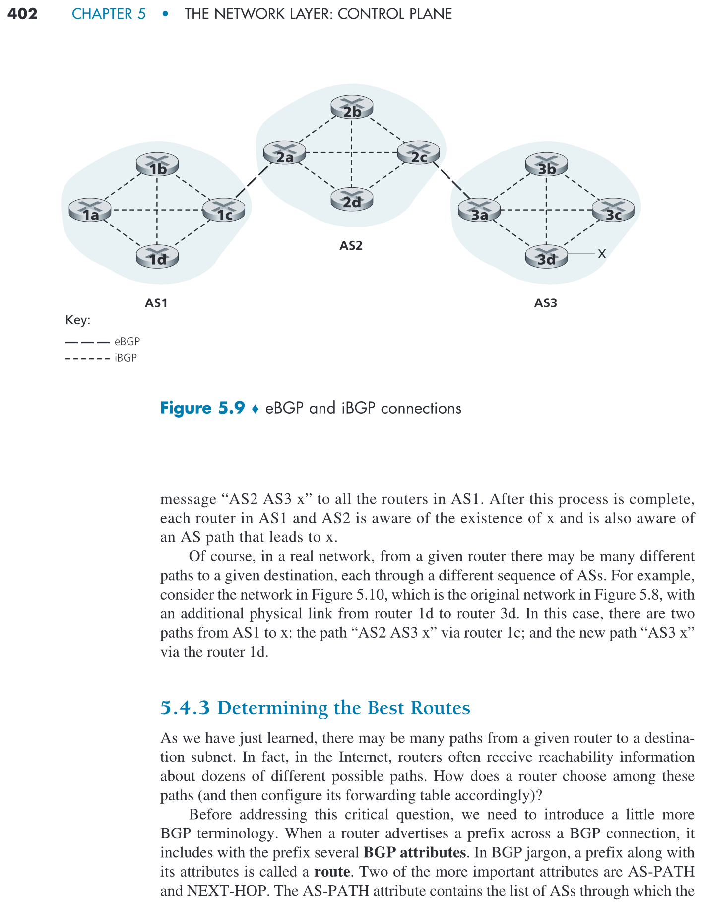

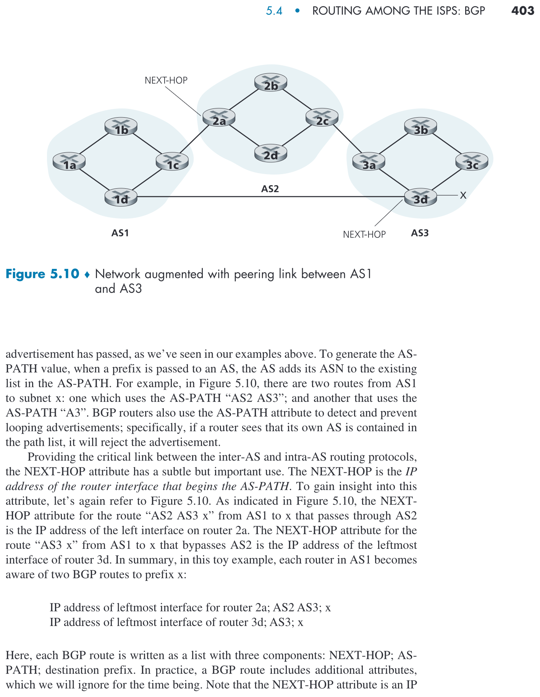

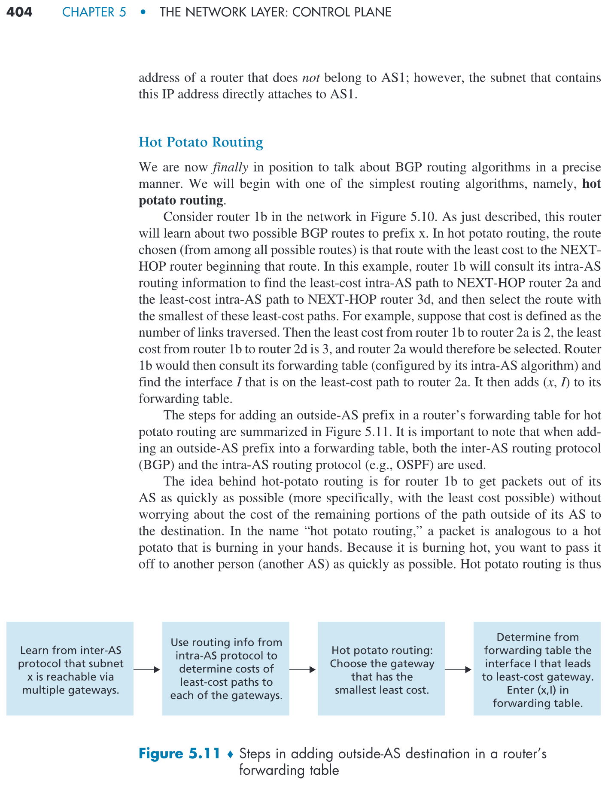

5.4 • ROUTING AMONG THE ISPS: BGP **405**

a selfish algorithm—it tries to reduce the cost in its own AS while ignoring the other components of the end-to-end costs outside its AS. Note that with hot potato routing, two routers in the same AS may choose two different AS paths to the same prefix. For example, we just saw that router 1b would send packets through AS2 to reach

x. However, router 1d would bypass AS2 and send packets directly to AS3 to reach x.

#### Route-Selection Algorithm

In practice, BGP uses an algorithm that is more complicated than hot potato routing, but nevertheless incorporates hot potato routing. For any given destination prefix, the input into BGP's route-selection algorithm is the set of all routes to that prefix that have been learned and accepted by the router. If there is only one such route, then BGP obviously selects that route. If there are two or more routes to the same prefix, then BGP sequentially invokes the following elimination rules until one route remains:

1. A route is assigned a local preference value as one of its attributes (in addition to the AS-PATH and NEXT-HOP attributes). The local preference of a route could have been set by the router or could have been learned from another router in the same AS. The value of the local preference attribute is a policy decision that is left entirely up to the AS's network administrator. (We will shortly discuss BGP policy issues in some detail.) The routes with the highest local preference values are selected.

2. From the remaining routes (all with the same highest local preference value), the route with the shortest AS-PATH is selected. If this rule were the only rule for route selection, then BGP would be using a DV algorithm for path determination, where the distance metric uses the number of AS hops rather than the number of router hops.

3. From the remaining routes (all with the same highest local preference value and the same AS-PATH length), hot potato routing is used, that is, the route with the closest NEXT-HOP router is selected.

4. If more than one route still remains, the router uses BGP identifiers to select the route; see [Stewart 1999]. As an example, let's again consider router 1b in Figure 5.10. Recall that there

are exactly two BGP routes to prefix x, one that passes through AS2 and one that bypasses AS2. Also recall that if hot potato routing on its own were used, then BGP would route packets through AS2 to prefix x. But in the above route-selection algorithm, rule 2 is applied before rule 3, causing BGP to select the route that bypasses AS2, since that route has a shorter AS PATH. So we see that with the above routeselection algorithm, BGP is no longer a selfish algorithm—it first looks for routes with short AS paths (thereby likely reducing end-to-end delay).

As noted above, BGP is the *de facto* standard for inter-AS routing for the Internet. To see the contents of various BGP routing tables (large!) extracted from

routers in tier-1 ISPs, see <http://www.routeviews.org>. BGP routing tables often contain over half a million routes (that is, prefixes and corresponding attributes). Statistics about the size and characteristics of BGP routing tables are presented in [Huston 2019b].

## 5.4.4 IP-Anycast

In addition to being the Internet's inter-AS routing protocol, BGP is often used to implement the IP-anycast service [RFC 1546, RFC 7094], which is commonly used in DNS. To motivate IP-anycast, consider that in many applications, we are interested in (1) replicating the same content on different servers in many different dispersed geographical locations, and (2) having each user access the content from the server that is closest. For example, a CDN may replicate videos and other objects on servers in different countries. Similarly, the DNS system can replicate DNS records on DNS servers throughout the world. When a user wants to access this replicated content, it is desirable to point the user to the "nearest" server with the replicated content. BGP's route-selection algorithm provides an easy and natural mechanism for doing so.

To make our discussion concrete, let's describe how a CDN might use IPanycast. As shown in Figure 5.12, during the IP-anycast configuration stage, the CDN company assigns the *same* IP address to each of its servers, and uses standard BGP to advertise this IP address from each of the servers. When a BGP router receives multiple route advertisements for this IP address, it treats these advertisements as providing different paths to the same physical location (when, in fact, the advertisements are for different paths to different physical locations). When configuring its routing table, each router will locally use the BGP route-selection algorithm to pick the "best" (for example, closest, as determined by AS-hop counts) route to that IP address. For example, if one BGP route (corresponding to one location) is only one AS hop away from the router, and all other BGP routes (corresponding to other locations) are two or more AS hops away, then the BGP router would choose to route packets to the location that is one hop away. After this initial BGP address-advertisement phase, the CDN can do its main job of distributing content. When a client requests the video, the CDN returns to the client the common IP address used by the geographically dispersed servers, no matter where the client is located. When the client sends a request to that IP address, Internet routers then forward the request packet to the "closest" server, as defined by the BGP route-selection algorithm.

Although the above CDN example nicely illustrates how IP-anycast can be used, in practice, CDNs generally choose not to use IP-anycast because BGP routing changes can result in different packets of the same TCP connection arriving at different instances of the Web server. But IP-anycast is extensively used by the DNS system to direct DNS queries to the closest root DNS server. Recall from Section 2.4, there are currently 13 IP addresses for root DNS servers. But corresponding to each of these addresses, there are multiple DNS root servers, with some of these addresses having

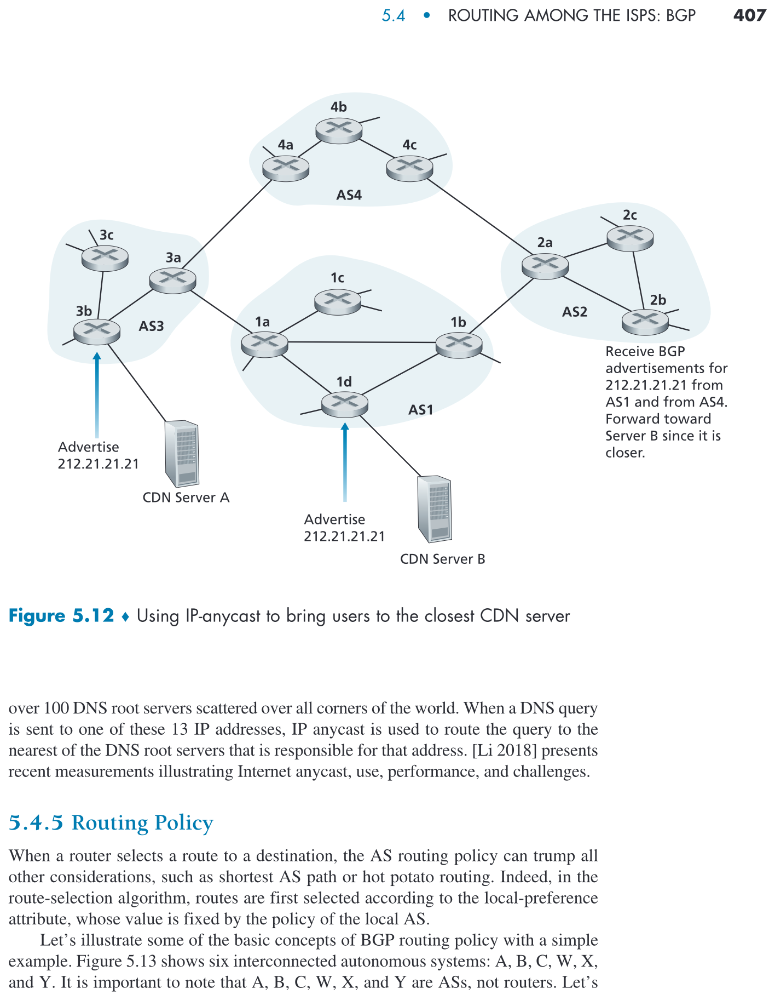

Key:

B

Provider W A X network

Customer C network

Y

**Figure 5.13** ♦ A simple BGP policy scenario

assume that autonomous systems W, X, and Y are access ISPs and that A, B, and C are backbone provider networks. We'll also assume that A, B, and C, directly send traffic to each other, and provide full BGP information to their customer networks. All traffic entering an ISP access network must be destined for that network, and all traffic leaving an ISP access network must have originated in that network. W and Y are clearly access ISPs. X is a **multi-homed access ISP,** since it is connected to the rest of the network via two different providers (a scenario that is becoming increasingly common in practice). However, like W and Y, X itself must be the source/destination of all traffic leaving/entering X. But how will this stub network behavior be implemented and enforced? How will X be prevented from forwarding traffic between B and C? This can easily be accomplished by controlling the manner in which BGP routes are advertised. In particular, X will function as an access ISP network if it advertises (to its neighbors B and C) that it has no paths to any other destinations except itself. That is, even though X may know of a path, say XCY, that reaches network Y, it will not advertise this path to B. Since B is unaware that X has a path to Y, B would never forward traffic destined to Y (or C) via X. This simple example illustrates how a selective route advertisement policy can be used to implement customer/provider routing relationships.

Let's next focus on a provider network, say AS B. Suppose that B has learned (from A) that A has a path AW to W. B can thus install the route AW into its routing information base. Clearly, B also wants to advertise the path BAW to its customer, X, so that X knows that it can route to W via B. But should B advertise the path BAW to C? If it does so, then C could route traffic to W via BAW. If A, B, and C are all backbone providers, than B might rightly feel that it should not have to shoulder the burden (and cost!) of carrying transit traffic between A and C. B might rightly feel that it is A's and C's job (and cost!) to make sure that C can route to/from A's customers via a direct connection between A and C. There are currently no official standards that govern how backbone ISPs route among themselves. However, a rule of thumb followed by commercial ISPs is that any traffic flowing across an ISP's backbone network must have either a source or a destination (or both) in a network that is a customer of that ISP; otherwise the traffic would be getting a free ride on the ISP's network. Individual peering agreements (that would govern questions such

5.4 • ROUTING AMONG THE ISPS: BGP **409**

### PRINCIPLES IN PRACTICE


**WHY ARE THERE DIFFERENT INTER-AS AND INTRA-AS ROUTING** **PROTOCOLS?**

Having now studied the details of specific inter-AS and intra-AS routing protocols deployed in today's Internet, let's conclude by considering perhaps the most fundamental question we could ask about these protocols in the first place (hopefully, you have been wondering this all along, and have not lost the forest for the trees!): Why are different inter-AS and intra-AS routing protocols used? The answer to this question gets at the heart of the differences between the goals of routing within an AS and among ASs:

- Policy. Among ASs, policy issues dominate. It may well be important that traffic originating in a given AS not be able to pass through another specific AS. Similarly, a given AS may well want to control what transit traffic it carries between other ASs. We have seen that BGP carries path attributes and provides for controlled distribution of routing information so that such policy-based routing decisions can be made. Within an AS, everything is nominally under the same administrative control, and thus policy issues play a much less important role in choosing routes within the AS.

- Scale. The ability of a routing algorithm and its data structures to scale to handle routing to/among large numbers of networks is a critical issue in inter-AS routing. Within an AS, scalability is less of a concern. For one thing, if a single ISP becomes too large, it is always possible to divide it into two ASs and perform inter-AS routing between the two new ASs. (Recall that OSPF allows such a hierarchy to be built by splitting an AS into areas.)

- Performance. Because inter-AS routing is so policy oriented, the quality (for example, performance) of the routes used is often of secondary concern (that is, a longer or more costly route that satisfies certain policy criteria may well be taken over a route that is shorter but does not meet that criteria). Indeed, we saw that among ASs, there is not even the notion of cost (other than AS hop count) associated with routes. Within a single AS, however, such policy concerns are of less importance, allowing routing to focus more on the level of performance realized on a route.

as those raised above) are typically negotiated between pairs of ISPs and are often confidential; [Huston 1999a; Huston 2012] provide an interesting discussion of peering agreements. For a detailed description of how routing policy reflects commercial relationships among ISPs, see [Gao 2001; Dmitiropoulos 2007]. For a discussion of BGP routing polices from an ISP standpoint, see [Caesar 2005b].

This completes our brief introduction to BGP. Understanding BGP is important because it plays a central role in the Internet. We encourage you to see the references [Stewart 1999; Huston 2019a; Labovitz 1997; Halabi 2000; Huitema 1998; Gao 2001; Feamster 2004; Caesar 2005b; Li 2007] to learn more about BGP.

## 5.4.6 Putting the Pieces Together: Obtaining

### Internet Presence

Although this subsection is not about BGP *per se,* it brings together many of the protocols and concepts we've seen thus far, including IP addressing, DNS, and BGP.

Suppose you have just created a small company that has a number of servers, including a public Web server that describes your company's products and services, a mail server from which your employees obtain their e-mail messages, and a DNS server. Naturally, you would like the entire world to be able to visit your Web site in order to learn about your exciting products and services. Moreover, you would like your employees to be able to send and receive e-mail to potential customers throughout the world.

To meet these goals, you first need to obtain Internet connectivity, which is done by contracting with, and connecting to, a local ISP. Your company will have a gateway router, which will be connected to a router in your local ISP. This connection might be a DSL connection through the existing telephone infrastructure, a leased line to the ISP's router, or one of the many other access solutions described in Chapter 1. Your local ISP will also provide you with an IP address range, for example, a /24 address range consisting of 256 addresses. Once you have your physical connectivity and your IP address range, you will assign one of the IP addresses (in your address range) to your Web server, one to your mail server, one to your DNS server, one to your gateway router, and other IP addresses to other servers and networking devices in your company's network.

In addition to contracting with an ISP, you will also need to contract with an Internet registrar to obtain a domain name for your company, as described in Chapter 2. For example, if your company's name is, say, Xanadu Inc., you will naturally try to obtain the domain name xanadu.com. Your company must also obtain presence in the DNS system. Specifically, because outsiders will want to contact your DNS server to obtain the IP addresses of your servers, you will also need to provide your registrar with the IP address of your DNS server. Your registrar will then put an entry for your DNS server (domain name and corresponding IP address) in the .com top-level-domain servers, as described in Chapter 2. After this step is completed, any user who knows your domain name (e.g., xanadu.com) will be able to obtain the IP address of your DNS server via the DNS system.

So that people can discover the IP addresses of your Web server, in your DNS server you will need to include entries that map the host name of your Web server (e.g., www.xanadu.com) to its IP address. You will want to have similar entries for

5.5 • THE SDN CONTROL PLANE **411**

other publicly available servers in your company, including your mail server. In this manner, if Alice wants to browse your Web server, the DNS system will contact your DNS server, find the IP address of your Web server, and give it to Alice. Alice can then establish a TCP connection directly with your Web server.

However, there still remains one other necessary and crucial step to allow outsiders from around the world to access your Web server. Consider what happens when Alice, who knows the IP address of your Web server, sends an IP datagram (e.g., a TCP SYN segment) to that IP address. This datagram will be routed through the Internet, visiting a series of routers in many different ASs, and eventually reach your Web server. When any one of the routers receives the datagram, it is going to look for an entry in its forwarding table to determine on which outgoing port it should forward the datagram. Therefore, each of the routers needs to know about the existence of your company's /24 prefix (or some aggregate entry). How does a router become aware of your company's prefix? As we have just seen, it becomes aware of it from BGP! Specifically, when your company contracts with a local ISP and gets assigned a prefix (i.e., an address range), your local ISP will use BGP to advertise your prefix to the ISPs to which it connects. Those ISPs will then, in turn, use BGP to propagate the advertisement. Eventually, all Internet routers will know about your prefix (or about some aggregate that includes your prefix) and thus be able to appropriately forward datagrams destined to your Web and mail servers.

## 5.5 The SDN Control Plane

In this section, we'll dive into the SDN control plane—the network-wide logic that controls packet forwarding among a network's SDN-enabled devices, as well as the configuration and management of these devices and their services. Our study here builds on our earlier discussion of generalized SDN forwarding in Section 4.4, so you might want to first review that section, as well as Section 5.1 of this chapter, before continuing on. As in Section 4.4, we'll again adopt the terminology used in the SDN literature and refer to the network's forwarding devices as "packet switches" (or just switches, with "packet" being understood), since forwarding decisions can be made on the basis of network-layer source/destination addresses, link-layer source/destination addresses, as well as many other values in transport-, network-, and link-layer packet-header fields.

Four key characteristics of an SDN architecture can be identified [Kreutz 2015]:

- Flow-based forwarding. Packet forwarding by SDN-controlled switches can be based on any number of header field values in the transport-layer, network-layer, or link-layer header. We saw in Section 4.4 that the OpenFlow1.0 abstraction allows forwarding based on eleven different header field values. This contrasts

sharply with the traditional approach to router-based forwarding that we studied in Sections 5.2–5.4, where forwarding of IP datagrams was based solely on a datagram's destination IP address. Recall from Figure 5.2 that packet forwarding rules are specified in a switch's flow table; it is the job of the SDN control plane to compute, manage and install flow table entries in all of the network's switches.

- Separation of data plane and control plane. This separation is shown clearly in Figures 5.2 and 5.14. The data plane consists of the network's switches— relatively simple (but fast) devices that execute the "match plus action" rules in their flow tables. The control plane consists of servers and software that determine and manage the switches' flow tables.

- Network control functions: external to data-plane switches. Given that the "S" in SDN is for "software," it's perhaps not surprising that the SDN control plane is implemented in software. Unlike traditional routers, however, this software executes on servers that are both distinct and remote from the network's switches. As shown in Figure 5.14, the control plane itself consists of two components—an SDN controller (or network operating system [Gude 2008]) and a set of network-control applications. The controller maintains accurate network state information (e.g., the state of remote links, switches, and hosts); provides this information to the networkcontrol applications running in the control plane; and provides the means through which these applications can monitor, program, and control the underlying network devices. Although the controller in Figure 5.14 is shown as a single central server, in practice the controller is only logically centralized; it is typically implemented on several servers that provide coordinated, scalable performance and high availability.

- A programmable network. The network is programmable through the networkcontrol applications running in the control plane. These applications represent the "brains" of the SDN control plane, using the APIs provided by the SDN controller to specify and control the data plane in the network devices. For example, a routing network-control application might determine the end-end paths between sources and destinations (for example, by executing Dijkstra's algorithm using the nodestate and link-state information maintained by the SDN controller). Another network application might perform access control, that is, determine which packets are to be blocked at a switch, as in our third example in Section 4.4.3. Yet another application might have switches forward packets in a manner that performs server load balancing (the second example we considered in Section 4.4.3). From this discussion, we can see that SDN represents a significant "unbundling"

of network functionality—data plane switches, SDN controllers, and network-control applications are separate entities that may each be provided by different vendors and organizations. This contrasts with the pre-SDN model in which a switch/router (together with its embedded control plane software and protocol implementations) was monolithic, vertically integrated, and sold by a single vendor. This unbundling

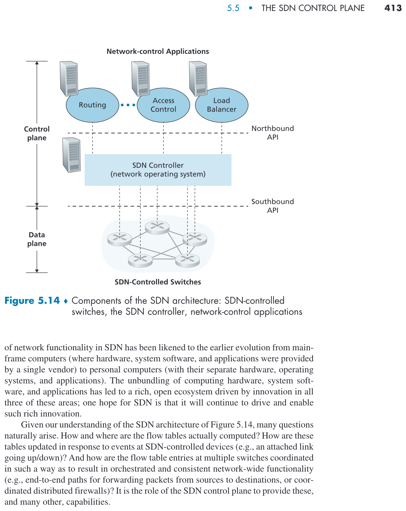

## 5.5.1 The SDN Control Plane: SDN Controller and SDN Network-control Applications

Let's begin our discussion of the SDN control plane in the abstract, by considering the generic capabilities that the control plane must provide. As we'll see, this abstract, "first principles" approach will lead us to an overall architecture that reflects how SDN control planes have been implemented in practice. As noted above, the SDN control plane divides broadly into two components— the SDN controller and the SDN network-control applications. Let's explore the controller first. Many SDN controllers have been developed since the earliest SDN controller [Gude 2008]; see [Kreutz 2015] for an extremely thorough survey. Figure 5.15 provides a more detailed view of a generic SDN controller. A controller's functionality can be broadly organized into three layers. Let's consider these layers in an uncharacteristically bottom-up fashion:

- A communication layer: communicating between the SDN controller and con- *trolled network devices.* Clearly, if an SDN controller is going to control the operation of a remote SDN-enabled switch, host, or other device, a protocol is needed to transfer information between the controller and that device. In addition, a device must be able to communicate locally-observed events to the controller (for example, a message indicating that an attached link has gone up or down, that a device has just joined the network, or a heartbeat indicating that a device is up and operational). These events provide the SDN controller with an up-todate view of the network's state. This protocol constitutes the lowest layer of the controller architecture, as shown in Figure 5.15. The communication between the controller and the controlled devices cross what has come to be known as the controller's "southbound" interface. In Section 5.5.2, we'll study OpenFlow—a specific protocol that provides this communication functionality. OpenFlow is implemented in most, if not all, SDN controllers.

- A network-wide state-management layer. The ultimate control decisions made by the SDN control plane—for example, configuring flow tables in all switches to achieve the desired end-end forwarding, to implement load balancing, or to implement a particular firewalling capability—will require that the controller have upto-date information about state of the networks' hosts, links, switches, and other SDN-controlled devices. A switch's flow table contains counters whose values might also be profitably used by network-control applications; these values should thus be available to the applications. Since the ultimate aim of the control plane is to determine flow tables for the various controlled devices, a controller might also maintain a copy of these tables. These pieces of information all constitute examples of the network-wide "state" maintained by the SDN controller.

- The interface to the network-control application layer. The controller interacts with network-control applications through its "northbound" interface. This API

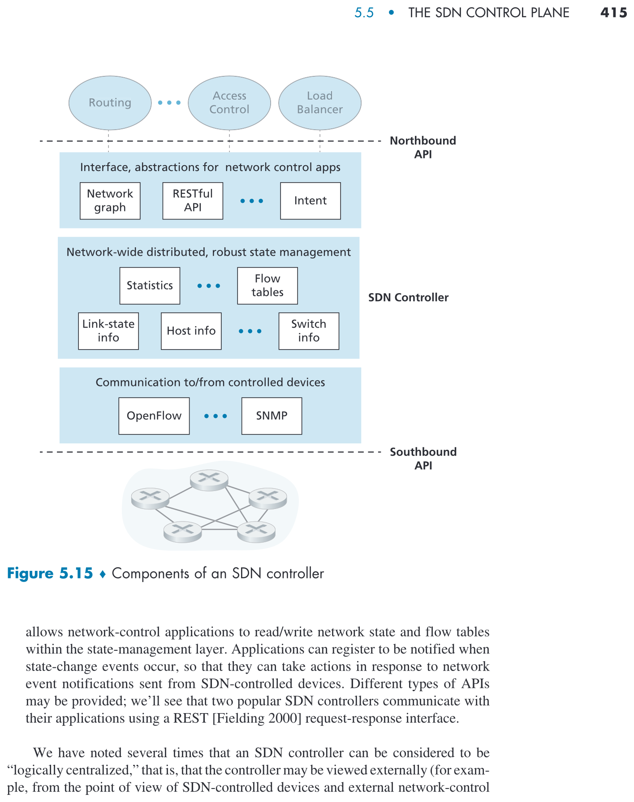

applications) as a single, monolithic service. However, these services and the databases used to hold state information are implemented in practice by a *distributed* set of servers for fault tolerance, high availability, or for performance reasons. With controller functions being implemented by a *set* of servers, the semantics of the controller's internal operations (e.g., maintaining logical time ordering of events, consistency, consensus, and more) must be considered [Panda 2013]. Such concerns are common across many different distributed systems; see [Lamport 1989, Lampson 1996] for elegant solutions to these challenges. Modern controllers such as Open- Daylight [OpenDaylight 2020] and ONOS [ONOS 2020] (see sidebar) have placed considerable emphasis on architecting a logically centralized but physically distributed controller platform that provides scalable services and high availability to the controlled devices and network-control applications alike.

The architecture depicted in Figure 5.15 closely resembles the architecture of the originally proposed NOX controller in 2008 [Gude 2008], as well as that of today's OpenDaylight [OpenDaylight 2020] and ONOS [ONOS 2020] SDN controllers (see sidebar). We'll cover an example of controller operation in Section 5.5.3. First, however, let's examine the OpenFlow protocol, the earliest and now one of several protocols that can be used for communication between an SDN controller and a controlled device, which lies in the controller's communication layer.

## 5.5.2 OpenFlow Protocol

The OpenFlow protocol [OpenFlow 2009, ONF 2020] operates between an SDN controller and an SDN-controlled switch or other device implementing the Open- Flow API that we studied earlier in Section 4.4. The OpenFlow protocol operates over TCP, with a default port number of 6653.

Among the important messages flowing from the controller to the controlled switch are the following:

- Configuration. This message allows the controller to query and set a switch's configuration parameters.

- Modify-State. This message is used by a controller to add/delete or modify entries in the switch's flow table, and to set switch port properties.

- Read-State. This message is used by a controller to collect statistics and counter values from the switch's flow table and ports.

- Send-Packet. This message is used by the controller to send a specific packet out of a specified port at the controlled switch. The message itself contains the packet to be sent in its payload. Among the messages flowing from the SDN-controlled switch to the controller

are the following:

- Flow-Removed. This message informs the controller that a flow table entry has been removed, for example by a timeout or as the result of a receivedmodify-statemessage.


5.5 • THE SDN CONTROL PLANE **417**

- Port-status. This message is used by a switch to inform the controller of a change in port status.

- Packet-in. Recall from Section 4.4 that a packet arriving at a switch port and not matching any flow table entry is sent to the controller for additional processing. Matched packets may also be sent to the controller, as an action to be taken on a match. The *packet-in* message is used to send such packets to the controller.

Additional OpenFlow messages are defined in [OpenFlow 2009, ONF 2020].

### PRINCIPLES IN PRACTICE

**GOOGLE'S SOFTWARE-DEFINED GLOBAL NETWORK**

Recall from the case study in Section 2.6 that Google deploys a dedicated wide-area network (WAN) that interconnects its data centers and server clusters (in IXPs and ISPs). This network, called B4, has a Google-designed SDN control plane built on OpenFlow. Google's network is able to drive WAN links at near 70% utilization over the long run (a two to three fold increase over typical link utilizations) and split application flows among multiple paths based on application priority and existing flow demands [Jain 2013].

The Google B4 network is particularly it well-suited for SDN: *(i)* Google controls all devices from the edge servers in IXPs and ISPs to routers in their network core; *(ii)* the most bandwidth-intensive applications are large-scale data copies between sites that can defer to higher-priority interactive applications during times of resource congestion; *(iii)* with only a few dozen data centers being connected, centralized control is feasible.

Google's B4 network uses custom-built switches, each implementing a slightly extended version of OpenFlow, with a local Open Flow Agent (OFA) that is similar in spirit to the control agent we encountered in Figure 5.2. Each OFA in turn connects to an Open Flow Controller (OFC) in the network control server (NCS), using a separate "out of band" network, distinct from the network that carries data-center traffic between data centers. The OFC thus provides the services used by the NCS to communicate with its controlled switches, similar in spirit to the lowest layer in the SDN architecture shown in Figure 5.15. In B4, the OFC also performs state management functions, keeping node and link status in a Network Information Base (NIB). Google's implementation of the OFC is based on the ONIX SDN controller [Koponen 2010]. Two routing protocols, BGP (for routing between the data centers) and IS-IS (a close relative of OSPF, for routing within a data center), are implemented. Paxos [Chandra 2007] is used to execute hot replicas of NCS components to protect against failure.

A traffic engineering network-control application, sitting logically above the set of network control servers, interacts with these servers to provide global, network-wide bandwidth provisioning for groups of application flows. With B4, SDN made an important leap forward into the operational networks of a global network provider. See [Jain 2013; Hong 2018] for a detailed description of B4.

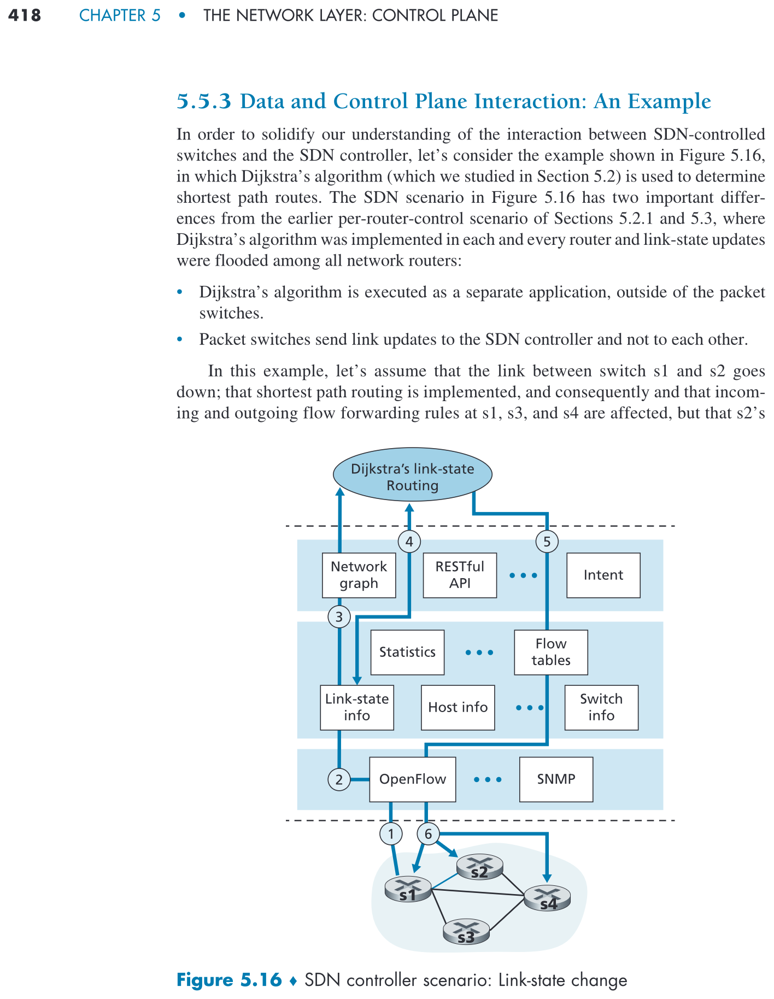

5.5 • THE SDN CONTROL PLANE **419**

operation is unchanged. Let's also assume that OpenFlow is used as the communication layer protocol, and that the control plane performs no other function other than link-state routing.

1. Switch s1, experiencing a link failure between itself and s2, notifies the SDN controller of the link-state change using the OpenFlow *port-status* message.

2. The SDN controller receives the OpenFlow message indicating the link-state change, and notifies the link-state manager, which updates a link-state database.

3. The network-control application that implements Dijkstra's link-state routing has previously registered to be notified when link state changes. That application receives the notification of the link-state change.

4. The link-state routing application interacts with the link-state manager to get updated link state; it might also consult other components in the state-management layer. It then computes the new least-cost paths.

5. The link-state routing application then interacts with the flow table manager, which determines the flow tables to be updated.

6. The flow table manager then uses the OpenFlow protocol to update flow table entries at affected switches—s1 (which will now route packets destined to s2 via s4), s2 (which will now begin receiving packets from s1 via intermediate switch s4), and s4 (which must now forward packets from s1 destined to s2).

This example is simple but illustrates how the SDN control plane provides controlplane services (in this case, network-layer routing) that had been previously implemented with per-router control exercised in each and every network router. One can now easily appreciate how an SDN-enabled ISP could easily switch from least-cost path routing to a more hand-tailored approach to routing. Indeed, since the controller can tailor the flow tables as it pleases, it can implement *any* form of forwarding that it pleases—simply by changing its application-control software. This ease of change should be contrasted to the case of a traditional per-router control plane, where software in all routers (which might be provided to the ISP by multiple independent vendors) must be changed.

## 5.5.4 SDN: Past and Future

Although the intense interest in SDN is a relatively recent phenomenon, the technical roots of SDN, and the separation of the data and control planes in particular, go back considerably further. In 2004, [Feamster 2004, Lakshman 2004, RFC 3746] all argued for the separation of the network's data and control planes. [van der Merwe 1998] describes a control framework for ATM networks [Black 1995] with multiple controllers, each controlling a number of ATM switches. The Ethane project [Casado 2007] pioneered the notion of a network of simple flow-based Ethernet switches with match-plus-action flow tables, a centralized controller that managed flow

admission and routing, and the forwarding of unmatched packets from the switch to the controller. A network of more than 300 Ethane switches was operational in

2007. Ethane quickly evolved into the OpenFlow project, and the rest (as the saying

goes) is history!

Numerous research efforts are aimed at developing future SDN architectures and capabilities. As we have seen, the SDN revolution is leading to the disruptive replacement of dedicated monolithic switches and routers (with both data and control planes) by simple commodity switching hardware and a sophisticated software control plane. A generalization of SDN known as network functions virtualization (NFV) (which we discussed earlier in Section 4.5) similarly aims at disruptive replacement of sophisticated middleboxes (such as middleboxes with dedicated hardware and proprietary software for media caching/service) with simple commodity servers, switching, and storage. A second area of important research seeks to extend SDN concepts from the intra-AS setting to the inter-AS setting [Gupta 2014].

### PRINCIPLES IN PRACTICE


**SDN CONTROLLER CASE STUDIES: THE OPENDAYLIGHT** **AND ONOS CONTROLLERS**

In the earliest days of SDN, there was a single SDN protocol (OpenFlow [McKeown 2008; OpenFlow 2009]) and a single SDN controller (NOX [Gude 2008]). Since then, the number of SDN controllers in particular has grown significantly [Kreutz 2015]. Some SDN controllers are company-specific and proprietary, particularly when used to control internal proprietary networks (e.g., within or among a company's data centers). But many more controllers are open-source and implemented in a variety of programming languages [Erickson 2013]. Most recently, the OpenDaylight controller [OpenDaylight 2020] and the ONOS controller [ONOS 2020] have found considerable industry support. They are both open-source and are being developed in partnership with the Linux Foundation.

**The OpenDaylight Controller**

Figure 5.17 presents a simplified view of the OpenDaylight (ODL) controller platform

[OpenDaylight 2020, Eckel 2017].

ODL's Basic Network Functions are at the heart of the controller, and correspond closely to the network-wide state management capabilities that we encountered in Figure 5.15. The Service Abstraction Layer (SAL) is the controller's nerve center, allowing controller components and applications to invoke each other's services, access configuration and operational data, and to subscribe to events they generate. The SAL also provides a uniform abstract interface to specific protocols operating between the ODL controller and the controlled devices. These protocols include OpenFlow (which we covered in Section 4.5),

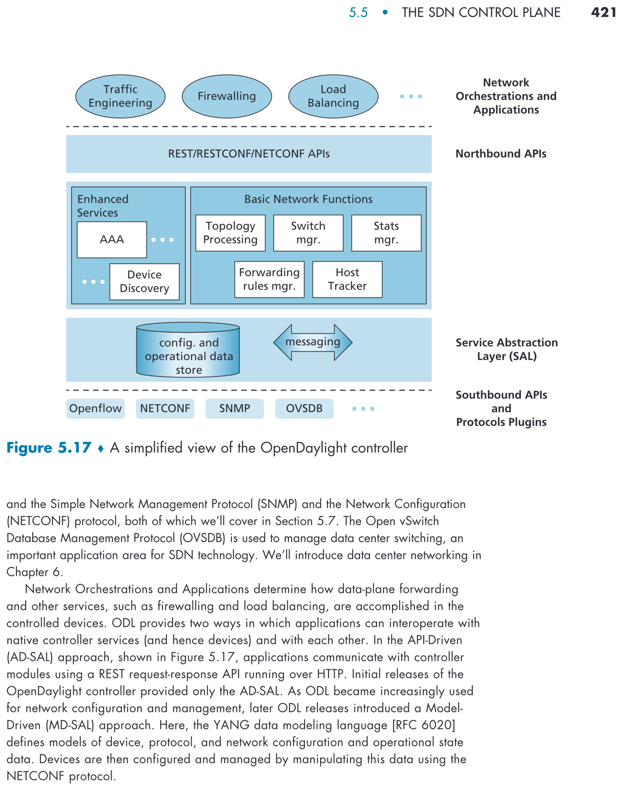

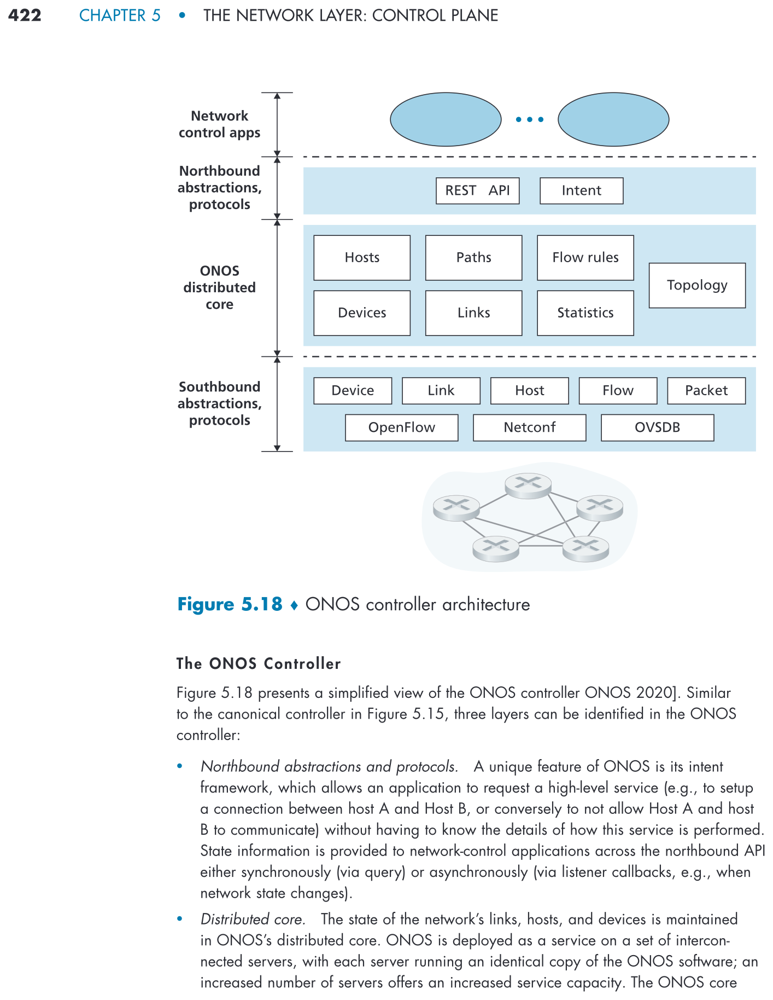

5.6 • ICMP: THE INTERNET CONTROL MESSAGE PROTOCOL **423** provides the mechanisms for service replication and coordination among instances,

providing the applications above and the network devices below with the abstraction

of logically centralized core services.

- Southbound abstractions and protocols. The southbound abstractions mask the heterogeneity of the underlying hosts, links, switches, and protocols, allowing the distributed core to be both device and protocol agnostic. Because of this abstraction, the southbound interface below the distributed core is logically higher than in our canonical controller in Figure 5.14 or the ODL controller in Figure 5.17.

## 5.6 ICMP: The Internet Control Message Protocol

The Internet Control Message Protocol (ICMP), specified in [RFC 792], is used by hosts and routers to communicate network-layer information to each other. The most typical use of ICMP is for error reporting. For example, when running an HTTP session, you may have encountered an error message such as "Destination network unreachable." This message had its origins in ICMP. At some point, an IP router was unable to find a path to the host specified in your HTTP request. That router created and sent an ICMP message to your host indicating the error.

ICMP is often considered part of IP, but architecturally it lies just above IP, as ICMP messages are carried inside IP datagrams. That is, ICMP messages are carried as IP payload, just as TCP or UDP segments are carried as IP payload. Similarly, when a host receives an IP datagram with ICMP specified as the upper-layer protocol (an upper-layer protocol number of 1), it demultiplexes the datagram's contents to ICMP, just as it would demultiplex a datagram's content to TCP or UDP.

ICMP messages have a type and a code field, and contain the header and the first 8 bytes of the IP datagram that caused the ICMP message to be generated in the first place (so that the sender can determine the datagram that caused the error). Selected ICMP message types are shown in Figure 5.19. Note that ICMP messages are used not only for signaling error conditions.

The well-known ping program sends an ICMP type 8 code 0 message to the specified host. The destination host, seeing the echo request, sends back a type 0 code 0 ICMP echo reply. Most TCP/IP implementations support the ping server directly in the operating system; that is, the server is not a process. Chapter 11 of [Stevens 1990] provides the source code for the ping client program. Note that the client program needs to be able to instruct the operating system to generate an ICMP message of type 8 code 0.

Another interesting ICMP message is the source quench message. This message is seldom used in practice. Its original purpose was to perform congestion control—to allow a congested router to send an ICMP source quench message to a host to force

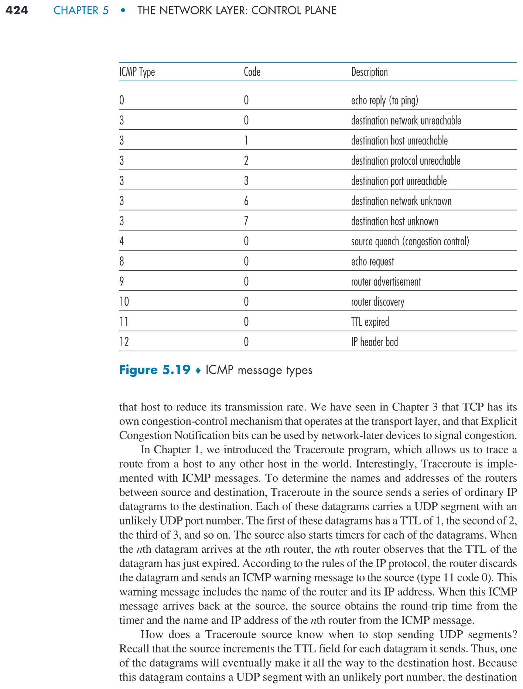

5.7 • NETWORK MANAGEMENT AND SNMP, NETCONF/YANG **425**

host sends a port unreachable ICMP message (type 3 code 3) back to the source. When the source host receives this particular ICMP message, it knows it does not need to send additional probe packets. (The standard Traceroute program actually sends sets of three packets with the same TTL; thus, the Traceroute output provides three results for each TTL.)

In this manner, the source host learns the number and the identities of routers that lie between it and the destination host and the round-trip time between the two hosts. Note that the Traceroute client program must be able to instruct the operating system to generate UDP datagrams with specific TTL values and must also be able to be notified by its operating system when ICMP messages arrive. Now that you understand how Traceroute works, you may want to go back and play with it some more.

A new version of ICMP has been defined for IPv6 in RFC 4443. In addition to reorganizing the existing ICMP type and code definitions, ICMPv6 also added new types and codes required by the new IPv6 functionality. These include the "Packet Too Big" type and an "unrecognized IPv6 options" error code.

## 5.7 Network Management and SNMP,

## NETCONF/YANG

Having now made our way to the end of our study of the network layer, with only the link-layer before us, we're well aware that a network consists of many complex, interacting pieces of hardware and software—from the links, switches, routers, hosts, and other devices that comprise the physical components of the network to the many protocols that control and coordinate these devices. When hundreds or thousands of such components are brought together by an organization to form a network, the job of the network administrator to keep the network "up and running" is surely a challenge. We saw in Section 5.5 that the logically centralized controller can help with this process in an SDN context. But the challenge of network management has been around long before SDN, with a rich set of network management tools and approaches that help the network administrator monitor, manage, and control the network. We'll study these tools and techniques in this section, as well as new tools and techniques that have co-evolved along with SDN.

An often-asked question is "What is network management?" A well-conceived, single-sentence (albeit a rather long run-on sentence) definition of network management from [Saydam 1996] is:

*Network management includes the deployment, integration, and coordination of* *the hardware, software, and human elements to monitor, test, poll, configure, ana-* *lyze, evaluate, and control the network and element resources to meet the real-time,* *operational performance, and Quality of Service requirements at a reasonable cost.*

Given this broad definition, we'll cover only the rudiments of network management in this section—the architecture, protocols, and data used by a network

administrator in performing their task. We'll not cover the administrator's decisionmaking processes, where topics such as fault identification [Labovitz 1997; Steinder 2002; Feamster 2005; Wu 2005; Teixeira 2006], anomaly detection [Lakhina 2005; Barford 2009], network design/engineering to meet contracted Service Level Agreements (SLA's) [Huston 1999a], and more come into consideration. Our focus is thus purposefully narrow; the interested reader should consult these references, the excellent overviews in [Subramanian 2000; Schonwalder 2010; Claise 2019], and the more detailed treatment of network management available on the Web site for this text.

## 5.7.1 The Network Management Framework

Figure 5.20 shows the key components of network management:

- Managing server. The managing server is an application, typically with network **managers** (humans) in the loop, running in a centralized network management station in the network operations center (NOC). The managing server is the locus of activity for network management: it controls the collection, processing, analysis, and dispatching of network management information and commands. It is here that actions are initiated to configure, monitor, and control the network's managed devices. In practice, a network may have several such managing servers.

- Managed device. A managed device is a piece of network equipment (including its software) that resides on a managed network. A managed device might be a host, router, switch, middlebox, modem, thermometer, or other network-connected device. The device itself will have many manageable components (e.g., a network interface is but one component of a host or router), and configuration parameters for these hardware and software components (e.g., an intra-AS routing protocol, such as OSPF).

- Data.Each managed device will have data, also known as "state," associated with it. There are several different types of data. **Configuration data** is device information explicitly configured by the network manager, for example, a manager-assigned/ configured IP address or interface speed for a device interface. **Operational data** is information that the device acquires as it operates, for example, the list of immediate neighbors in OSPF protocol. **Device statistics** are status indicators and counts that are updated as the device operators (e.g., the number of dropped packets on an interface, or the device's cooling fan speed). The network manager can query remote device data, and in some cases, control the remote device by writing device data values, as discussed below. As shown in Figure 5.17, the managing server also maintains its own copy of configuration, operational and statistics data from its managed devices as well as network-wide data (e.g., the network's topology).

- Network management agent. The network management agent is a software process running in the managed device that communicates with the managing server, taking local actions at the managed device under the command and control of the managing server. The network management agent is similar to the routing agent that we saw in Figure 5.2.

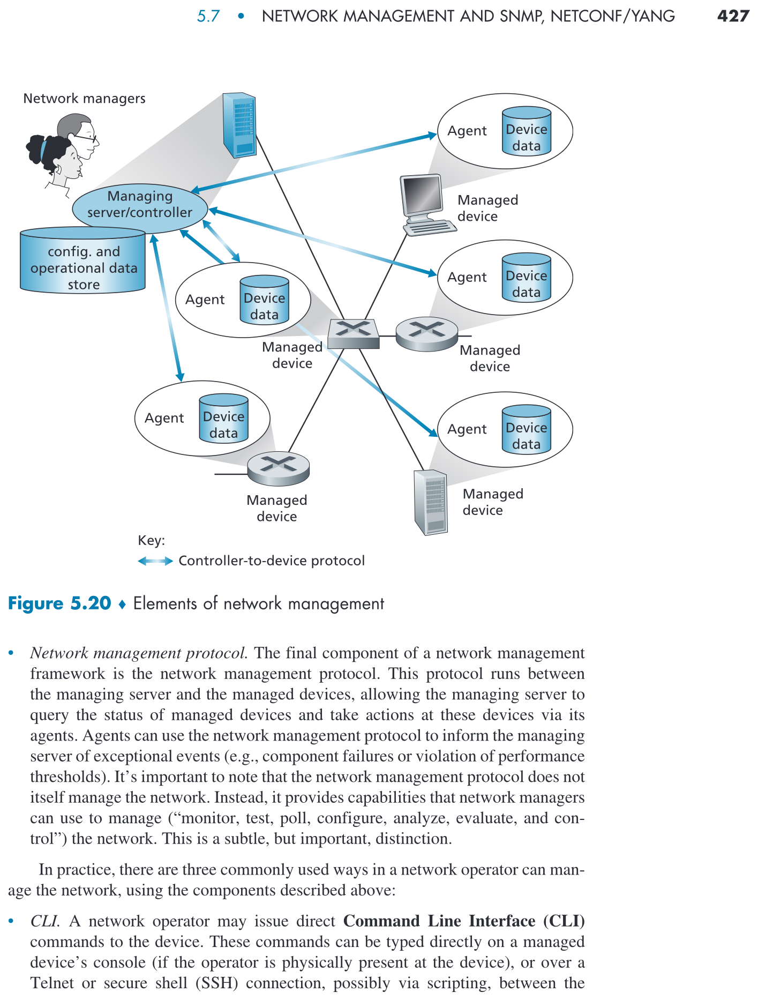

managing server/controller and the managed device. CLI commands are vendorand device-specific and can be rather arcane. While seasoned network wizards may be able to use CLI to flawlessly configure network devices, CLI use is prone to errors, and it is difficult to automate or efficiently scale for large networks. Consumer-oriented network devices, such as your wireless home router, may export a management menu that you (the network manager!) can access via HTTP to configure that device. While this approach may work well for single, simple devices and is less error-prone than CLI, it also doesn't scale to larger-sized networks.

- SNMP/MIB. In this approach, the network operator can query/set the data contained in a device's **Management Information Base (MIB)** objects using the **Simple Network Management Protocol (SNMP).** Some MIBs are device- and vendor-specific, while other MIBs (e.g., the number of IP datagrams discarded at a router due to errors in an IP datagram header, or the number of UDP segments received at a host) are device-agnostic, providing abstraction and generality. A network operator would most typically use this approach to query and monitor operational state and device statistics, and then use CLI to actively control/configure the device. We note, importantly, that both approaches manage devices *individually.* We'll cover the SNMP and MIBs, which have been in use since the late 1980s, in Section 5.7.2 below. A network-management workshop convened by the Internet Architecture Board in 2002 [RFC 3535] noted not only the value of the SNMP/ MIB approach for device monitoring but also noted its shortcomings, particularly for device configuration and network management at scale. This gave rise to the most recent approach for network management, using NETCONF and YANG.

- NETCONF/YANG. The NETCONF/YANG approach takes a more abstract, network-wide, and holistic view toward network management, with a much stronger emphasis on configuration management, including specifying correctness constraints and providing atomic management operations over multiple controlled devices. **YANG** [RFC 6020] is a data modeling language used to model configuration and operational data. The **NETCONF** protocol [RFC 6241] is used to communicate YANG-compatible actions and data to/from/among remote devices. We briefly encountered NETCONF and YANG in our case study of OpenDaylight Controller in Figure 5.17 and will study them in Section 5.7.3 below.

## 5.7.2 The Simple Network Management Protocol (SNMP)

### and the Management Information Base (MIB)

The **Simple Network Management Protocol** version 3 (SNMPv3) [RFC 3410] is an application-layer protocol used to convey network-management control and information messages between a managing server and an agent executing on behalf of that managing server. The most common usage of SNMP is in a request-response mode in which an SNMP managing server sends a request to an SNMP agent, who

receives the request, performs some action, and sends a reply to the request. Typically, a request will be used to query (retrieve) or modify (set) MIB object values associated with a managed device. A second common usage of SNMP is for an agent to send an unsolicited message, known as a trap message, to a managing server. Trap messages are used to notify a managing server of an exceptional situation (e.g., a link interface going up or down) that has resulted in changes to MIB object values.

MIB objects are specified in a data description language known as SMI (Structure of Management Information) [RFC 2578; RFC 2579; RFC 2580], a rather oddly named component of the network management framework whose name gives no hint of its functionality. A formal definition language is used to ensure that the syntax and semantics of the network management data are well defined and unambiguous. Related MIB objects are gathered into MIB modules. As of late 2019, there are more than 400 MIBrelated RFCs and a much larger number of vendor-specific (private) MIB modules.

SNMPv3 defines seven types of messages, known generically as protocol data units—PDUs—as shown in Table 5.2 and described below. The format of the PDU is shown in Figure 5.21.

- The GetRequest, GetNextRequest, and GetBulkRequest PDUs are all sent from a managing server to an agent to request the value of one or more

| SNMPv3 PDU Type | Sender-receiver | Description |
| --- | --- | --- |
| GetRequest | manager-to-agent | get value of one or more MIB object instances |
| GetNextRequest | manager-to-agent | get value of next MIB object instance in list or table |
| GetBulkRequest | manager-to-agent | get values in large block of data, for example, values |
|  |  | in a large table |
| InformRequest | manager-to-manager | inform remote managing entity of MIB values remote |
|  |  | to its access |
| SetRequest | manager-to-agent | set value of one or more MIB object instances |
| Response | agent-to-manager or | generated in response to |

manager-to-manager GetRequest,

GetNextRequest, GetBulkRequest,

SetRequest PDU, or

InformRequest SNMPv2-Trap agent-to-manager inform manager of an exceptional event #

**Table 5.2** ♦ SNMPv3 PDU types

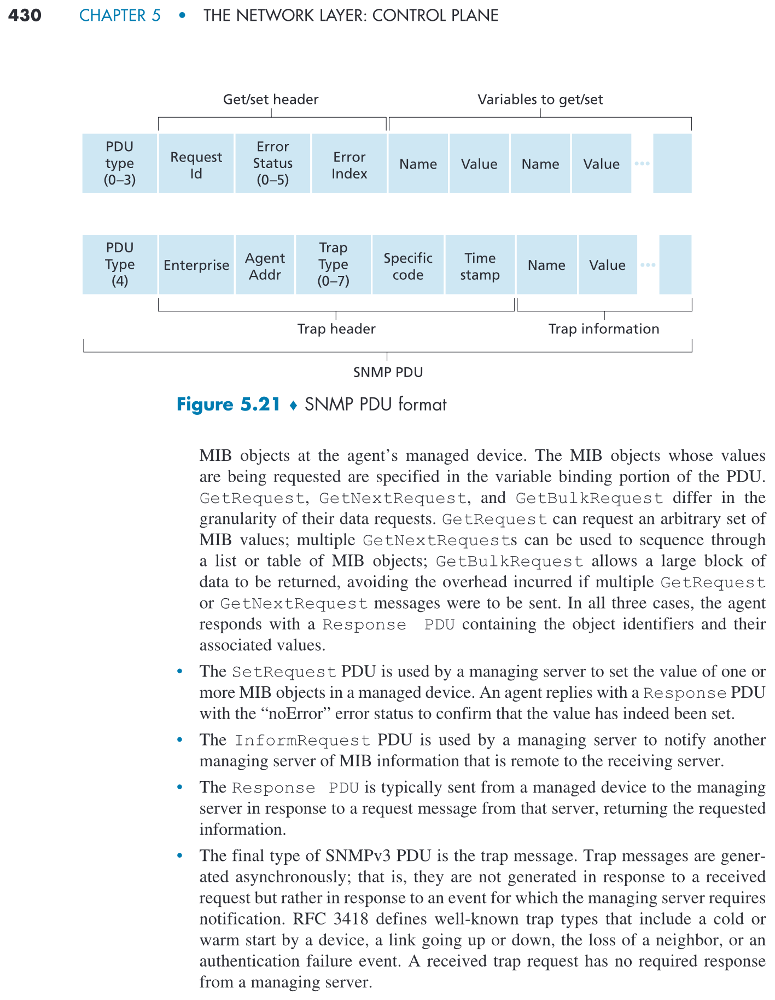

Given the request-response nature of SNMP, it is worth noting here that although SNMP PDUs can be carried via many different transport protocols, the SNMP PDU is typically carried in the payload of a UDP datagram. Indeed, RFC 3417 states that UDP is "the preferred transport mapping." However, since UDP is an unreliable transport protocol, there is no guarantee that a request, or its response, will be received at the intended destination. The request ID field of the PDU (see Figure 5.21) is used by the managing server to number its requests to an agent; the agent's response takes its request ID from that of the received request. Thus, the request ID field can be used by the managing server to detect lost requests or replies. It is up to the managing server to decide whether to retransmit a request if no corresponding response is received after a given amount of time. In particular, the SNMP standard does not mandate any particular procedure for retransmission, or even if retransmission is to be done in the first place. It only requires that the managing server "needs to act responsibly in respect to the frequency and duration of retransmissions." This, of course, leads one to wonder how a "responsible" protocol should act!

SNMP has evolved through three versions. The designers of SNMPv3 have said that "SNMPv3 can be thought of as SNMPv2 with additional security and administration capabilities" [RFC 3410]. Certainly, there are changes in SNMPv3 over SNMPv2, but nowhere are those changes more evident than in the area of administration and security. The central role of security in SNMPv3 was particularly important, since the lack of adequate security resulted in SNMP being used primarily for monitoring rather than control (for example, SetRequest is rarely used in SNMPv1). Once again, we see that security—a topic we'll cover in detail in Chapter 8 — is of critical concern, but once again a concern whose importance had been realized perhaps a bit late and only then "added on."

#### The Management Information Base (MIB)

We learned earlier that a managed device's operational state data (and to some extent its configuration data) in the SNMP/MIB approach to network management are represented as objects that are gathered together into an MIB for that device. An MIB object might be a counter, such as the number of IP datagrams discarded at a router due to errors in an IP datagram header; or the number of carrier sense errors in an Ethernet interface card; descriptive information such as the version of the software running on a DNS server; status information such as whether a particular device is functioning correctly; or protocol-specific information such as a routing path to a destination. Related MIB objects are gathered into MIB modules. There are over 400 MIB modules defined in various IETC RFC's; there are many more device- and vendor-specific MIBs. [RFC 4293] specifies the MIB module that defines managed objects (including ipSystemStatsInDelivers) for managing implementations of the Internet Protocol (IP) and its associated Internet Control Message Protocol (ICMP). [RFC 4022] specifies the MIB module for TCP, and [RFC 4113] specifies the MIB module for UDP.

While MIB-related RFCs make for rather tedious and dry reading, it is nonetheless instructive (i.e., like eating vegetables, it is "good for you") to consider an example of a MIB object, The ipSystem-StatsInDelivers object-type definition from [RFC 4293] defines a 32-bit read-only counter that keeps track of the number of IP datagrams that were received at the managed device and were successfully delivered to an upper-layer protocol. In the example below, Counter32 is one of the basic data types defined in the SMI.

```
ipSystemStatsInDelivers OBJECT-TYPE
    SYNTAX Counter32
    MAX-ACCESS read-only
    STATUS current
    DESCRIPTION
       "The total number of datagrams successfully de-
       livered to IPuser-protocols (including ICMP).
       When tracking interface statistics, the coun-
       ter of the interface to which these datagrams
       were addressed is incremented. This interface
       might not be the same as the input interface
       for some of the datagrams.
       Discontinuities in the value of this counter can
       occur at re-initialization of the management
       system, and at other times as indicated by the
       value of ipSystemStatsDiscontinuityTime."
 ::= { ipSystemStatsEntry 18 }
```

## 5.7.3 The Network Configuration Protocol (NETCONF)

### and YANG

The NETCONF protocol operates between the managing server and the managed network devices, providing messaging to *(i)* retrieve, set, and modify configuration data at managed devices; *(ii)* to query operational data and statistics at managed devices; and *(iii)* to subscribe to notifications generated by managed devices. The managing server actively controls a managed device by sending it configurations, which are specified in a structured XML document, and activating a configuration at the managed device. NETCONF uses a remote procedure call (RPC) paradigm, where protocol messages are also encoded in XML and exchanged between the managing server and a managed device over a secure, connection-oriented session such as the TLS (Transport Layer Security) protocol (discussed in Chapter 8) over TCP.

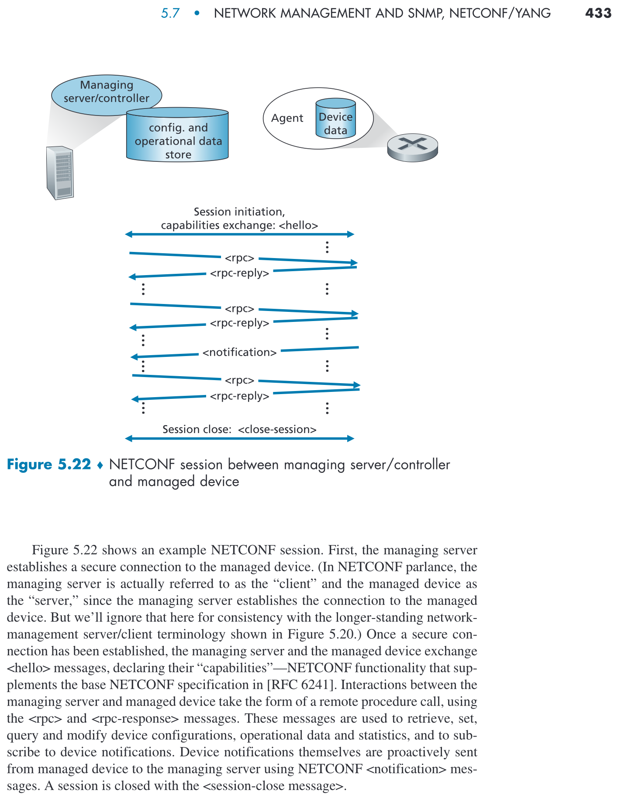

Table 5.3 shows a number of the important NETCONF operations that a managing server can perform at a managed device. As in the case of SNMP, we see operations for retrieving operational state data (<get>), and for event notification. However, the <get-config>, <edit-config>, <lock> and <unlock> operation demonstrate NETCONF's particular emphasis on device configuration. Using the basic operations shown in Table 5.3, it is also possible to create a *set* of more sophisticated network management transactions that either complete atomically (i.e., as a group) and successfully on a *set* of devices, or are fully reversed and leave the devices in their pre-transaction state. Such multi-device transactions—"enabl[ing] operators to concentrate on the *configuration* of the network as a whole rather than individual devices" was an important operator requirement put forth in [RFC 3535].

A full description of NETCONF is beyond our scope here; [RFC 6241, RFC 5277, Claise 2019; Schonwalder 2010] provide more in-depth coverage.

But since this is the first time we've seen protocol messages formatted as an XML document (rather than the traditional message with header fields and message body, e.g., as shown in Figure 5.21 for the SNMP PDU), let's conclude our brief study of NETCONF with two examples.

In the first example, the XML document sent from the managing server to the managed device is a NETCONF <get> command requesting all device configuration

NETCONF Operation Description

<get-config> Retrieve all or part of a given configuration. A device may have multiple

configurations. There is always a running/ configuration that describes the devices current (running) configuration.

<get> Retrieve all or part of both configuration state and operational state data.

<edit-config> Change all or part of a specified configuration at the managed device. If

the running/configuration is specified, then the device's current (running) configuration will be changed. If the managed device was able to satisfy the request, an <rpc-reply> is sent containing an <ok> element; otherwise <rpcerror> response is returned. On error, the device's configuration state can be roll-ed-back to its previous state.

<lock>, <unlock> The <lock> (<unlock>) operation allows the managing server to lock

(unlock) the entire configuration datastore system of a managed device. Locks are intended to be short-lived and allow a client to make a change without fear of interaction with other NETCONF, SNMP, or CLIs commands from other sources.

<create-subscription> , This operation initiates an event notification subscription that will send <notification> asynchronous event <notification> for specified events of interest from the

managed device to the managing server, until the subscription is terminated.

**Table 5.3** ♦ Selected NETCONF operations

and operational data. With this command, the server can learn about the device's configuration.

```
01 <?xml version="1.0" encoding="UTF-8"?>
02 <rpc message-id="101"
03 xmlns="urn:ietf:params:xml:ns:netconf:base:1.0">
04 <get/>
05 </rpc>
```

Although few people can completely parse XML directly, we see that the NET- CONF command is relatively human-readable, and is much more reminiscent of HTTP and HTML than the protocol message formats that we saw for SNMP PDU format in Figure 5.21. The RPC message itself spans lines 02–05 (we have added line numbers here for pedagogical purposes). The RPC has a message ID value of 101, declared in line 02, and contains a single NETCONF <get> command. The reply from the device contains a matching ID number (101), and all of the device's configuration data (in XML format, of course), starting in line 04, ultimately with a closing </rpc-reply>.

```
01 <?xml version="1.0" encoding="UTF-8"?>
02 <rpc-reply message-id="101"
03 xmlns="urn:ietf:params:xml:ns:netconf:base:1.0">
04 <!-- . . . all configuration data returned... -->
 . . .
</rpc-reply>
```

In the second example below, adapted from [RFC 6241], the XML document sent from the managing server to the managed device sets the Maximum Transmission Unit (MTU) of an interface named "Ethernet0/0" to 1500 bytes:

```
01 <?xml version="1.0" encoding="UTF-8"?>
02 <rpc message-id="101"
03 xmlns="urn:ietf:params:xml:ns:netconf:base:1.0">
04 <edit-config>
05 <target>
06 <running/>
07 </target>
08 <config>
```

09 <top xmlns="<http://example.com/schema/>

```
         1.2/config">
10 <interface>
11 <name>Ethernet0/0</name>
12 <mtu>1500</mtu>
13 </interface>
14 </top>
15 </config>
16 </edit-config>
17 </rpc>
```

The RPC message itself spans lines 02–17, has a message ID value of 101, and contains a single NETCONF <edit-config> command, spanning lines 04–15. Line 06 indicates that the running device configuration at the managed device will be changed. Lines 11 and 12 specify the MTU size to be set of the Ethernet0/0 interface.

Once the managed device has changed the interface's MTU size in the configuration, it responds back to the managing server with an OK reply (line 04 below), again within an XML document:

```
01 <?xml version="1.0" encoding="UTF-8"?>
02 <rpc-reply message-id="101"
03 xmlns="urn:ietf:params:xml:ns:netconf:base:1.0">
04 <ok/>
05 </rpc-reply>
```

#### YANG

YANG is the data modeling language used to precisely specify the structure, syntax, and semantics of network management data used by NETCONF, in much the same way that the SMI is used to specify MIBs in SNMP. All YANG definitions are contained in modules, and an XML document describing a device and its capabilities can be generated from a YANG module.

YANG features a small set of built-in data types (as in the case of SMI) and also allows data modelers to express constraints that must be satisfied by a valid NET- CONF configuration—a powerful aid in helping ensure that NETCONF configurations satisfy specified correctness and consistency constraints. YANG is also used to specify NETCONF notifications.

A fuller discussion of YANG is beyond our scope here. For more information, we refer the interested reader to the excellent book [Claise 2019].

## 5.8 Summary

We have now completed our two-chapter journey into the network core—a journey that began with our study of the network layer's data plane in Chapter 4 and finished here with our study of the network layer's control plane. We learned that the control plane is the network-wide logic that controls not only how a datagram is forwarded among routers along an end-to-end path from the source host to the destination host, but also how network-layer components and services are configured and managed.

We learned that there are two broad approaches towards building a control plane: traditional *per-router control* (where a routing algorithm runs in each and every router and the routing component in the router communicates with the routing components in other routers) and *software-defined networking* (SDN) control (where a logically centralized controller computes and distributes the forwarding tables to be used by each and every router). We studied two fundamental routing algorithms for computing least cost paths in a graph—link-state routing and distance-vector routing—in Section 5.2;

HOMEWORK PROBLEMS AND QUESTIONS **437**

these algorithms find application in both per-router control and in SDN control. These algorithms are the basis for two widely deployed Internet routing protocols, OSPF and BGP, that we covered in Sections 5.3 and 5.4. We covered the SDN approach to the network-layer control plane in Section 5.5, investigating SDN network-control applications, the SDN controller, and the OpenFlow protocol for communicating between the controller and SDN-controlled devices. In Sections 5.6 and 5.7, we covered some of the nuts and bolts of managing an IP network: ICMP (the Internet Control Message Protocol) and network management using SNMP and NETCONF/YANG.

Having completed our study of the network layer, our journey now takes us one step further down the protocol stack, namely, to the link layer. Like the network layer, the link layer is part of each and every network-connected device. But we will see in the next chapter that the link layer has the much more localized task of moving packets between nodes on the same link or LAN. Although this task may appear on the surface to be rather simple compared with that of the network layer's tasks, we will see that the link layer involves a number of important and fascinating issues that can keep us busy for a long time.

## Homework Problems and Questions

### Chapter 5 Review Questions

SECTION 5.1

R1. What is meant by a control plane that is based on per-router control? In such cases, when we say the network control and data planes are implemented "monolithically," what do we mean?

R2. What is meant by a control plane that is based on logically centralized control? In such cases, are the data plane and the control plane implemented within the same device or in separate devices? Explain.

SECTION 5.2

R3. Compare and contrast the properties of a centralized and a distributed routing algorithm. Give an example of a routing protocol that takes a centralized and a decentralized approach.

R4. Compare and contrast link-state and distance-vector routing algorithms.

R5. What is the "count to infinity" problem in distance vector routing?

R6. Is it necessary that every autonomous system use the same intra-AS routing algorithm? Why or why not?

SECTIONS 5.3–5.4

R7. Why are different inter-AS and intra-AS protocols used in the Internet?

R8. True or false: When an OSPF route sends its link state information, it is sent only to those nodes directly attached neighbors. Explain.

---

## Repeated content (headers / footers / watermarks)

> The following appeared on most pages and was moved out of the body to keep reading order clean — kept here, not deleted.

- 380 CHAPTER 5 • THE NETWORK LAYER: CONTROL PLANE · 382 CHAPTER 5 • THE NETWORK LAYER: CONTROL PLANE · 384 CHAPTER 5 • THE NETWORK LAYER: CONTROL PLANE · 388 CHAPTER 5 • THE NETWORK LAYER: CONTROL PLANE · 390 CHAPTER 5 • THE NETWORK LAYER: CONTROL PLANE · 392 CHAPTER 5 • THE NETWORK LAYER: CONTROL PLANE · 394 CHAPTER 5 • THE NETWORK LAYER: CONTROL PLANE · 396 CHAPTER 5 • THE NETWORK LAYER: CONTROL PLANE · 398 CHAPTER 5 • THE NETWORK LAYER: CONTROL PLANE · 400 CHAPTER 5 • THE NETWORK LAYER: CONTROL PLANE · 406 CHAPTER 5 • THE NETWORK LAYER: CONTROL PLANE · 408 CHAPTER 5 • THE NETWORK LAYER: CONTROL PLANE · 410 CHAPTER 5 • THE NETWORK LAYER: CONTROL PLANE · 412 CHAPTER 5 • THE NETWORK LAYER: CONTROL PLANE · 414 CHAPTER 5 • THE NETWORK LAYER: CONTROL PLANE · 416 CHAPTER 5 • THE NETWORK LAYER: CONTROL PLANE · 420 CHAPTER 5 • THE NETWORK LAYER: CONTROL PLANE · 426 CHAPTER 5 • THE NETWORK LAYER: CONTROL PLANE · 428 CHAPTER 5 • THE NETWORK LAYER: CONTROL PLANE · 432 CHAPTER 5 • THE NETWORK LAYER: CONTROL PLANE · 434 CHAPTER 5 • THE NETWORK LAYER: CONTROL PLANE · 436 CHAPTER 5 • THE NETWORK LAYER: CONTROL PLANE  *(pp.4, 6, 8, 12, 14, 16, 18, 20, 22, 24, 30, 32, 34, 36, 38, 40, 44, 50, 52, 56, 58, 60)*
- 5.7 • NETWORK MANAGEMENT AND SNMP, NETCONF/YANG 425 · 5.7 • NETWORK MANAGEMENT AND SNMP, NETCONF/YANG 429 · 5.7 • NETWORK MANAGEMENT AND SNMP, NETCONF/YANG 431 · 5.7 • NETWORK MANAGEMENT AND SNMP, NETCONF/YANG 435  *(pp.49, 53, 55, 59)*