# 6

# CHAPTER

# The Link Layer

# and LANs

In the previous two chapters, we learned that the network layer provides a communication service between *any* two network hosts. Between the two hosts, datagrams travel over a series of communication links, some wired and some wireless, starting at the source host, passing through a series of packet switches (switches and routers) and ending at the destination host. As we continue down the protocol stack, from the network layer to the link layer, we naturally wonder how packets are sent across the *individual links* that make up the end-to-end communication path. How are the network-layer datagrams encapsulated in the link-layer frames for transmission over a single link? Are different link-layer protocols used in the different links along the communication path? How are transmission conflicts in broadcast links resolved? Is there addressing at the link layer and, if so, how does the link-layer addressing operate with the network-layer addressing we learned about in Chapter 4? And what exactly is the difference between a switch and a router? We'll answer these and other important questions in this chapter.

In discussing the link layer, we'll see that there are two fundamentally different types of link-layer channels. The first type are broadcast channels, which connect multiple hosts in wireless LANs, in satellite networks, and in hybrid fiber-coaxial cable (HFC) access networks. Since many hosts are connected to the same broadcast communication channel, a so-called medium access protocol is needed to coordinate frame transmission. In some cases, a central controller may be used to coordinate

**449**

**450** CHAPTER 6 • THE LINK LAYER AND LANS

transmissions; in other cases, the hosts themselves coordinate transmissions. The second type of link-layer channel is the point-to-point communication link, such as that often found between two routers connected by a long-distance link, or between a user's office computer and the nearby Ethernet switch to which it is connected. Coordinating access to a point-to-point link is simpler; the reference material on this book's Web site has a detailed discussion of the Point-to-Point Protocol (PPP), which is used in settings ranging from dial-up service over a telephone line to high-speed point-to-point frame transport over fiber-optic links.

We'll explore several important link-layer concepts and technologies in this chapter. We'll dive deeper into error detection and correction, a topic we touched on briefly in Chapter 3. We'll consider multiple access networks and switched LANs, including Ethernet—by far the most prevalent wired LAN technology. We'll also look at virtual LANs, and data center networks. Although WiFi, and more generally wireless LANs, are link-layer topics, we'll postpone our study of these important topics until Chapter 7.

## 6.1 Introduction to the Link Layer

Let's begin with some important terminology. We'll find it convenient in this chapter to refer to any device that runs a link-layer (i.e., layer 2) protocol as a **node.** Nodes include hosts, routers, switches, and WiFi access points (discussed in Chapter 7). We will also refer to the communication channels that connect adjacent nodes along the communication path as **links.** In order for a datagram to be transferred from source host to destination host, it must be moved over each of the *individual links* in the end-to-end path. As an example, in the company network shown at the bottom of Figure 6.1, consider sending a datagram from one of the wireless hosts to one of the servers. This datagram will actually pass through six links: a WiFi link between sending host and WiFi access point, an Ethernet link between the access point and a link-layer switch; a link between the link-layer switch and the router, a link between the two routers; an Ethernet link between the router and a link-layer switch; and finally an Ethernet link between the switch and the server. Over a given link, a transmitting node encapsulates the datagram in a **link-layer frame** and transmits the frame into the link.

In order to gain further insight into the link layer and how it relates to the network layer, let's consider a transportation analogy. Consider a travel agent who is planning a trip for a tourist traveling from Princeton, New Jersey, to Lausanne, Switzerland. The travel agent decides that it is most convenient for the tourist to take a limousine from Princeton to JFK airport, then a plane from JFK airport to Geneva's airport, and finally a train from Geneva's airport to Lausanne's train station. Once

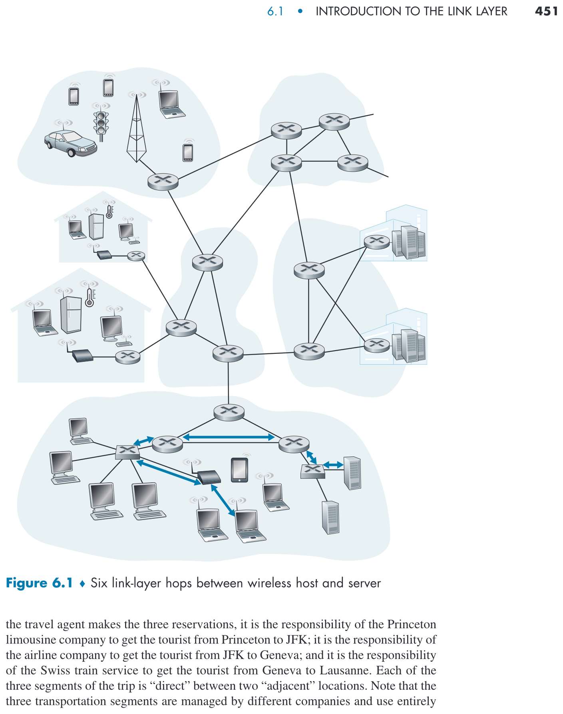

different transportation modes (limousine, plane, and train). Although the transportation modes are different, they each provide the basic service of moving passengers from one location to an adjacent location. In this transportation analogy, the tourist is a datagram, each transportation segment is a link, the transportation mode is a linklayer protocol, and the travel agent is a routing protocol.

## 6.1.1 The Services Provided by the Link Layer

Although the basic service of any link layer is to move a datagram from one node to an adjacent node over a single communication link, the details of the provided service can vary from one link-layer protocol to the next. Possible services that can be offered by a link-layer protocol include:

- Framing. Almost all link-layer protocols encapsulate each network-layer datagram within a link-layer frame before transmission over the link. A frame consists of a data field, in which the network-layer datagram is inserted, and a number of header fields. The structure of the frame is specified by the link-layer protocol. We'll see several different frame formats when we examine specific link-layer protocols in the second half of this chapter.

- Link access. A medium access control (MAC) protocol specifies the rules by which a frame is transmitted onto the link. For point-to-point links that have a single sender at one end of the link and a single receiver at the other end of the link, the MAC protocol is simple (or nonexistent)—the sender can send a frame whenever the link is idle. The more interesting case is when multiple nodes share a single broadcast link—the so-called multiple access problem. Here, the MAC protocol serves to coordinate the frame transmissions of the many nodes.

- Reliable delivery. When a link-layer protocol provides reliable delivery service, it guarantees to move each network-layer datagram across the link without error. Recall that certain transport-layer protocols (such as TCP) also provide a reliable delivery service. Similar to a transport-layer reliable delivery service, a link-layer reliable delivery service can be achieved with acknowledgments and retransmissions (see Section 3.4). A link-layer reliable delivery service is often used for links that are prone to high error rates, such as a wireless link, with the goal of correcting an error locally—on the link where the error occurs—rather than forcing an end-to-end retransmission of the data by a transport- or application-layer protocol. However, link-layer reliable delivery can be considered an unnecessary overhead for low bit-error links, including fiber, coax, and many twisted-pair copper links. For this reason, many wired link-layer protocols do not provide a reliable delivery service.

- Error detection and correction. The link-layer hardware in a receiving node can incorrectly decide that a bit in a frame is zero when it was transmitted as

6.1 • INTRODUCTION TO THE LINK LAYER **453**

a one, and vice versa. Such bit errors are introduced by signal attenuation and electromagnetic noise. Because there is no need to forward a datagram that has an error, many link-layer protocols provide a mechanism to detect such bit errors. This is done by having the transmitting node include error-detection bits in the frame, and having the receiving node perform an error check. Recall from Chapters 3 and 4 that the Internet's transport layer and network layer also provide a limited form of error detection—the Internet checksum. Error detection in the link layer is usually more sophisticated and is implemented in hardware. Error correction is similar to error detection, except that a receiver not only detects when bit errors have occurred in the frame but also determines exactly where in the frame the errors have occurred (and then corrects these errors).

## 6.1.2 Where Is the Link Layer Implemented?

Before diving into our detailed study of the link layer, let's conclude this introduction by considering the question of where the link layer is implemented. Is a host's link layer implemented in hardware or software? Is it implemented on a separate card or chip, and how does it interface with the rest of a host's hardware and operating system components?

Figure 6.2 shows a typical host architecture. The Ethernet capabilities are either integrated into the motherboard chipset or implemented via a low-cost dedicated Ethernet chip. For the most part, the link layer is implemented on a chip called the **network adapter,** also sometimes known as a **network interface controller (NIC).** The network adapter implements many link layer services including framing, link access, error detection, and so on. Thus, much of a link-layer controller's functionality is implemented in hardware. For example, Intel's 700 series adapters [Intel 2020] implements the Ethernet protocols we'll study in Section 6.5; the Atheros AR5006 [Atheros 2020] controller implements the 802.11 WiFi protocols we'll study in Chapter 7.

On the sending side, the controller takes a datagram that has been created and stored in host memory by the higher layers of the protocol stack, encapsulates the datagram in a link-layer frame (filling in the frame's various fields), and then transmits the frame into the communication link, following the link-access protocol. On the receiving side, a controller receives the entire frame, and extracts the networklayer datagram. If the link layer performs error detection, then it is the sending controller that sets the error-detection bits in the frame header and it is the receiving controller that performs error detection.

Figure 6.2 shows that while most of the link layer is implemented in hardware, part of the link layer is implemented in software that runs on the host's CPU. The software components of the link layer implement higher-level link-layer functionality such as assembling link-layer addressing information and activating the

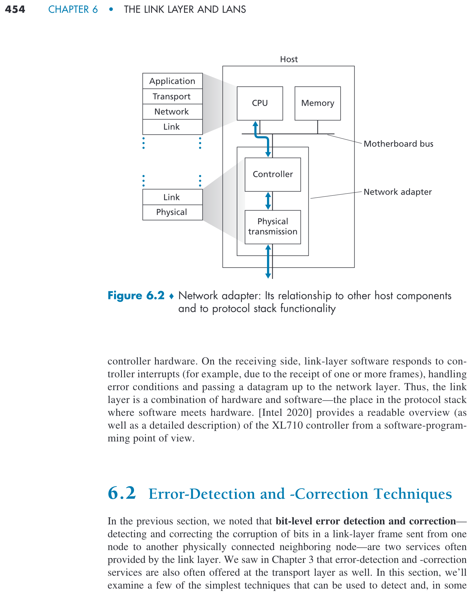

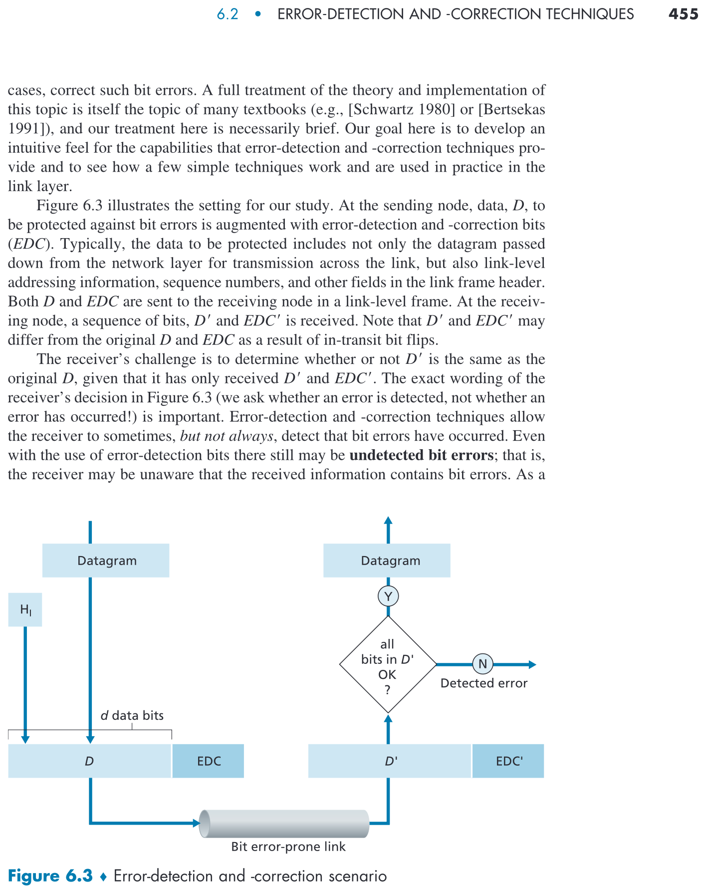

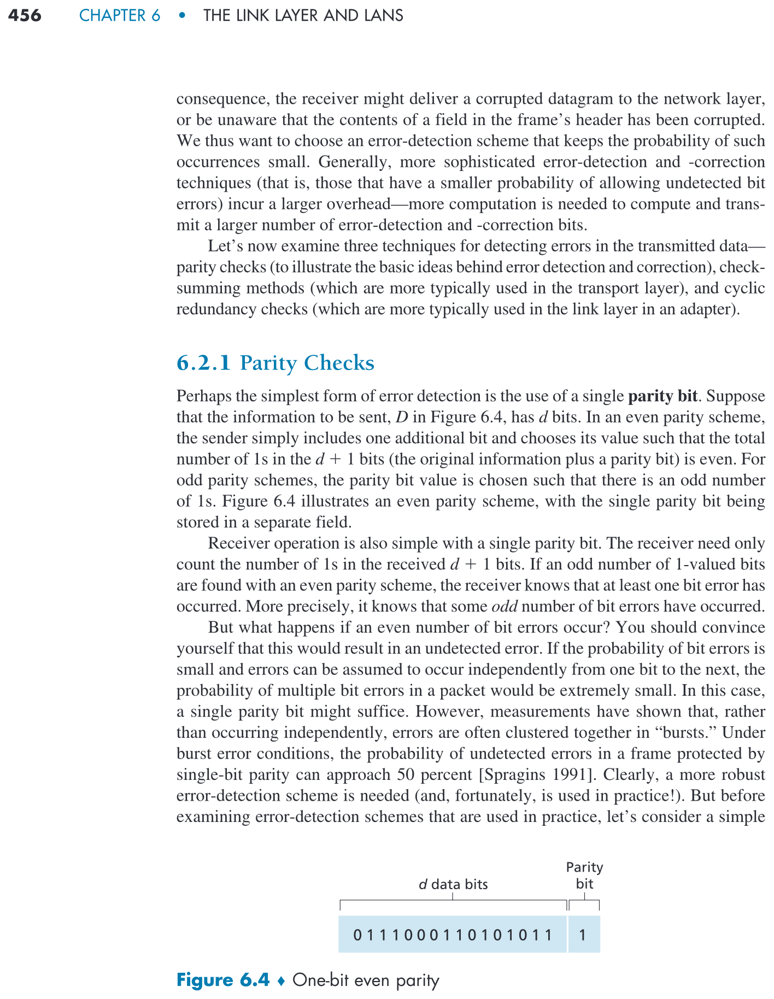

6.2 • ERROR-DETECTION AND -CORRECTION TECHNIQUES **457**

generalization of one-bit parity that will provide us with insight into error-correction techniques.

Figure 6.5 shows a two-dimensional generalization of the single-bit parity scheme. Here, the *d* bits in *D* are divided into *i* rows and *j* columns. A parity value is computed for each row and for each column. The resulting *i* + *j* + 1 parity bits comprise the link-layer frame's error-detection bits.

Suppose now that a single bit error occurs in the original *d* bits of information. With this **two-dimensional parity** scheme, the parity of both the column and the row containing the flipped bit will be in error. The receiver can thus not only *detect* the fact that a single bit error has occurred, but can use the column and row indices of the column and row with parity errors to actually identify the bit that was corrupted and *correct* that error! Figure 6.5 shows an example in which the 1-valued bit in position (2,2) is corrupted and switched to a 0—an error that is both detectable and correctable at the receiver. Although our discussion has focused on the original *d* bits of information, a single error in the parity bits themselves is also detectable and correctable. Two-dimensional parity can also detect (but not correct!) any combination of two errors in a packet. Other properties of the two-dimensional parity scheme are explored in the problems at the end of the chapter.

Row parity  
$d_{1,1}$. . . $d_{1,j}$ $d_{1,j+1}$  
$d_{2,1}$. . . $d_{2,j}$ $d_{2,j+1}$  
. . . . . . . . . . . .  
$d_{i,1}$. . . $d_{i,j}$ $d_{i,j+1}$  
$d_{i+1,1}$. . . $d_{i+1,j}$ $d_{i+1,j+1}$

**No errors Correctable** **single-bit error**

1 0 1 0 1 1 1 0 1 0 1 1

|  |  |  |  |  |  |  |  |  |  |  |  | Parity |
| --- | --- | --- | --- | --- | --- | --- | --- | --- | --- | --- | --- | --- |
| 1 | 1 | 1 | 1 | 0 | 0 | 1 | 0 | 1 | 1 | 0 | 0 | error |
| 0 | 1 | 1 | 1 | 0 | 1 | 0 | 1 | 1 | 1 | 0 | 1 |  |
| 0 | 0 | 1 | 0 | 1 | 0 | 0 | 0 | 1 | 0 | 1 | 0 |  |

Parity error

**Figure 6.5** ♦ Two-dimensional even parity

The ability of the receiver to both detect and correct errors is known as **forward** **error correction (FEC).** These techniques are commonly used in audio storage and playback devices such as audio CDs. In a network setting, FEC techniques can be used by themselves, or in conjunction with link-layer ARQ techniques similar to those we examined in Chapter 3. FEC techniques are valuable because they can decrease the number of sender retransmissions required. Perhaps more important, they allow for immediate correction of errors at the receiver. This avoids having to wait for the round-trip propagation delay needed for the sender to receive a NAK packet and for the retransmitted packet to propagate back to the receiver—a potentially important advantage for real-time network applications [Rubenstein 1998] or links (such as deep-space links) with long propagation delays. Research examining the use of FEC in error-control protocols includes [Biersack 1992; Nonnenmacher 1998; Byers 1998; Shacham 1990].

## 6.2.2 Checksumming Methods

In checksumming techniques, the *d* bits of data in Figure 6.4 are treated as a sequence of *k-bit* integers. One simple checksumming method is to simply sum these *k-bit* integers and use the resulting sum as the error-detection bits. The **Internet checksum** is based on this approach—bytes of data are treated as 16-bit integers and summed. The 1s complement of this sum then forms the Internet checksum that is carried in the segment header. As discussed in Section 3.3, the receiver checks the checksum by taking the 1s complement of the sum of the received data (including the checksum) and checking whether the result is all 0 bits. If any of the bits are 1, an error is indicated. RFC 1071 discusses the Internet checksum algorithm and its implementation in detail. In the TCP and UDP protocols, the Internet checksum is computed over all fields (header and data fields included). In IP, the checksum is computed over the IP header (since the UDP or TCP segment has its own checksum). In other protocols, for example, XTP [Strayer 1992], one checksum is computed over the header and another checksum is computed over the entire packet.

Checksumming methods require relatively little packet overhead. For example, the checksums in TCP and UDP use only 16 bits. However, they provide relatively weak protection against errors as compared with cyclic redundancy check, which is discussed below and which is often used in the link layer. A natural question at this point is, Why is checksumming used at the transport layer and cyclic redundancy check used at the link layer? Recall that the transport layer is typically implemented in software in a host as part of the host's operating system. Because transport-layer error detection is implemented in software, it is important to have a simple and fast error-detection scheme such as checksumming. On the other hand, error detection at the link layer is implemented in dedicated hardware in adapters, which can rapidly perform the more complex CRC operations. Feldmeier [Feldmeier 1995] presents fast software implementation techniques for not only weighted checksum codes, but CRC (see below) and other codes as well.

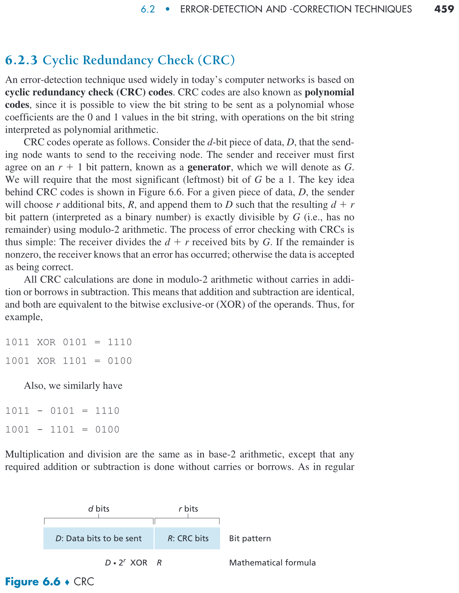

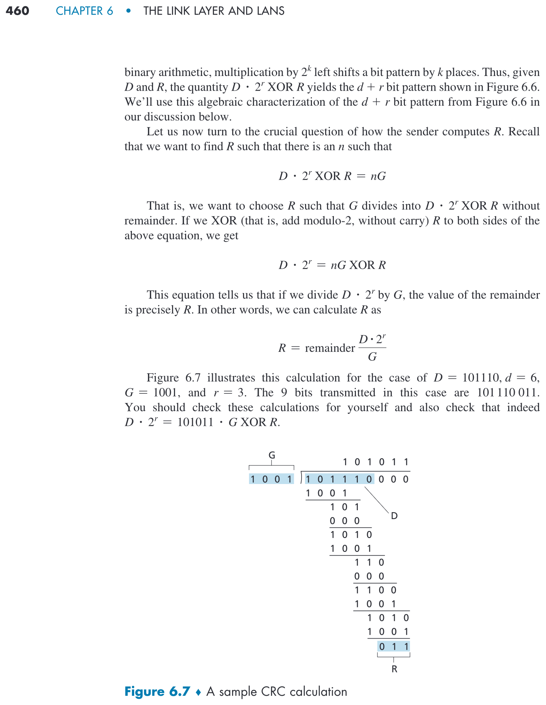

6.3 • MULTIPLE ACCESS LINKS AND PROTOCOLS **461**

International standards have been defined for 8-, 12-, 16-, and 32-bit generators,

G. The CRC-32 32-bit standard, which has been adopted in a number of link-level

IEEE protocols, uses a generator of

$$G_{CRC@32} = 100000100110000010001110110110111$$

Each of the CRC standards can detect burst errors of fewer than *r* + 1 bits. (This means that all consecutive bit errors of *r* bits or fewer will be detected.) Furthermore, under appropriate assumptions, a burst of length greater than *r* + 1 bits is detected with probability 1 - 0.5r. Also, each of the CRC standards can detect any odd number of bit errors. See [Williams 1993] for a discussion of implementing CRC checks. The theory behind CRC codes and even more powerful codes is beyond the scope of this text. The text [Schwartz 1980] provides an excellent introduction to this topic.

## 6.3 Multiple Access Links and Protocols

In the introduction to this chapter, we noted that there are two types of network links: point-to-point links and broadcast links. A **point-to-point link** consists of a single sender at one end of the link and a single receiver at the other end of the link. Many link-layer protocols have been designed for point-to-point links; the point-to-point protocol (PPP) and high-level data link control (HDLC) are two such protocols. The second type of link, a **broadcast link,** can have multiple sending and receiving nodes all connected to the same, single, shared broadcast channel. The term *broadcast* is used here because when any one node transmits a frame, the channel broadcasts the frame and each of the other nodes receives a copy. Ethernet and wireless LANs are examples of broadcast link-layer technologies. In this section, we'll take a step back from specific link-layer protocols and first examine a problem of central importance to the link layer: how to coordinate the access of multiple sending and receiving nodes to a shared broadcast channel—the **multiple access problem.** Broadcast channels are often used in LANs, networks that are geographically concentrated in a single building (or on a corporate or university campus). Thus, we'll look at how multiple access channels are used in LANs at the end of this section.

We are all familiar with the notion of broadcasting—television has been using it since its invention. But traditional television is a one-way broadcast (that is, one fixed node transmitting to many receiving nodes), while nodes on a computer network broadcast channel can both send and receive. Perhaps a more apt human analogy for a broadcast channel is a cocktail party, where many people gather in a large room (the air providing the broadcast medium) to talk and listen. A second good analogy is something many readers will be familiar with—a classroom—where teacher(s) and student(s) similarly share the same, single, broadcast medium. A central problem in

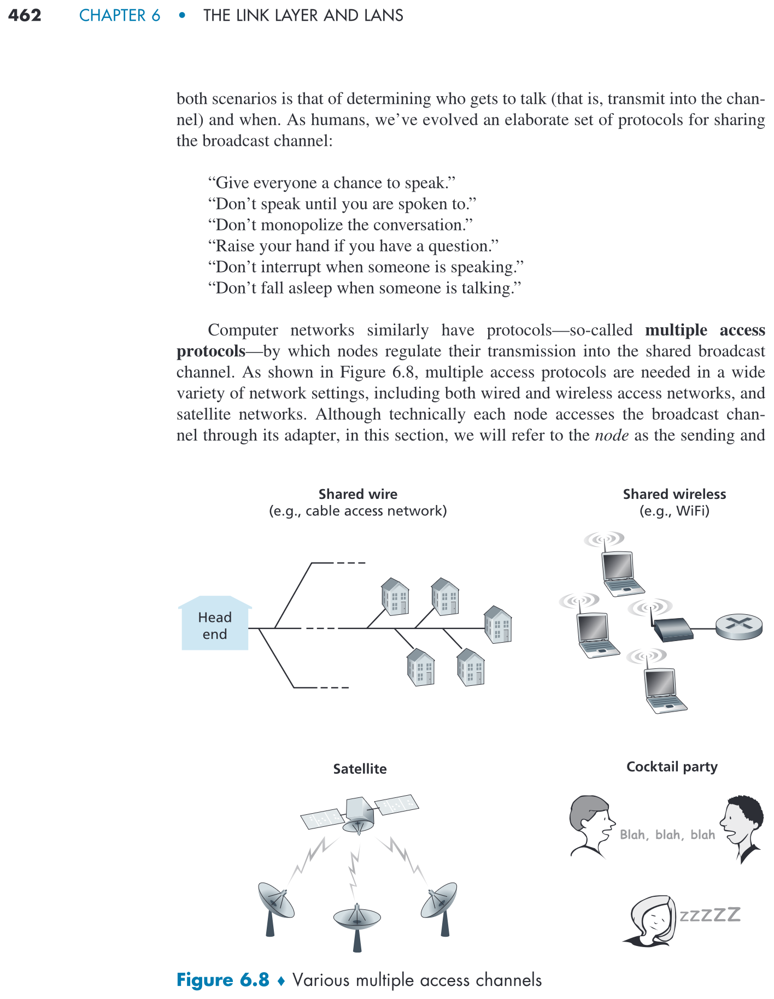

receiving device. In practice, hundreds or even thousands of nodes can directly communicate over a broadcast channel.

Because all nodes are capable of transmitting frames, more than two nodes can transmit frames at the same time. When this happens, all of the nodes receive multiple frames at the same time; that is, the transmitted frames **collide** at all of the receivers. Typically, when there is a collision, none of the receiving nodes can make any sense of any of the frames that were transmitted; in a sense, the signals of the colliding frames become inextricably tangled together. Thus, all the frames involved in the collision are lost, and the broadcast channel is wasted during the collision interval. Clearly, if many nodes want to transmit frames frequently, many transmissions will result in collisions, and much of the bandwidth of the broadcast channel will be wasted.

In order to ensure that the broadcast channel performs useful work when multiple nodes are active, it is necessary to somehow coordinate the transmissions of the active nodes. This coordination job is the responsibility of the multiple access protocol. Over the past 40 years, thousands of papers and hundreds of PhD dissertations have been written on multiple access protocols; a comprehensive survey of the first 20 years of this body of work is [Rom 1990]. Furthermore, active research in multiple access protocols continues due to the continued emergence of new types of links, particularly new wireless links.

Over the years, dozens of multiple access protocols have been implemented in a variety of link-layer technologies. Nevertheless, we can classify just about any multiple access protocol as belonging to one of three categories: **channel partition-** **ing protocols, random access protocols,** and **taking-turns protocols.** We'll cover these categories of multiple access protocols in the following three subsections.

Let's conclude this overview by noting that, ideally, a multiple access protocol for a broadcast channel of rate *R* bits per second should have the following desirable characteristics:

1. When only one node has data to send, that node has a throughput of R bps.

2. When M nodes have data to send, each of these nodes has a throughput of R/M bps. This need not necessarily imply that each of the *M* nodes always has an instantaneous rate of *R/M,* but rather that each node should have an average transmission rate of *R/M* over some suitably defined interval of time.

3. The protocol is decentralized; that is, there is no master node that represents a single point of failure for the network.

4. The protocol is simple, so that it is inexpensive to implement.

## 6.3.1 Channel Partitioning Protocols

Recall from our early discussion back in Section 1.3 that time-division multiplexing (TDM) and frequency-division multiplexing (FDM) are two techniques that can

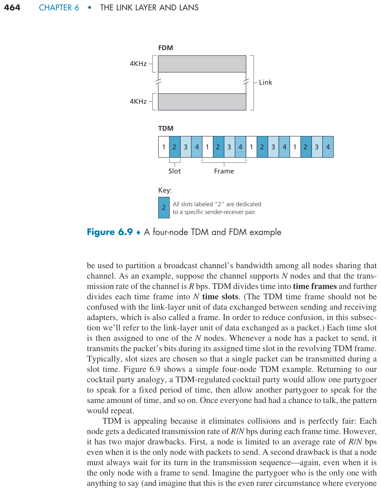

wants to hear what that one person has to say). Clearly, TDM would be a poor choice for a multiple access protocol for this particular party.

While TDM shares the broadcast channel in time, FDM divides the *R* bps channel into different frequencies (each with a bandwidth of *R/N)* and assigns each frequency to one of the *N* nodes. FDM thus creates *N* smaller channels of *R/N* bps out of the single, larger *R* bps channel. FDM shares both the advantages and drawbacks of TDM. It avoids collisions and divides the bandwidth fairly among the *N* nodes. However, FDM also shares a principal disadvantage with TDM—a node is limited to a bandwidth of *R/N,* even when it is the only node with packets to send.

A third channel partitioning protocol is **code division multiple access** **(CDMA).** While TDM and FDM assign time slots and frequencies, respectively, to the nodes, CDMA assigns a different *code* to each node. Each node then uses its unique code to encode the data bits it sends. If the codes are chosen carefully, CDMA networks have the wonderful property that different nodes can transmit *simultaneously* and yet have their respective receivers correctly receive a sender's encoded data bits (assuming the receiver knows the sender's code) in spite of interfering transmissions by other nodes. CDMA has been used in military systems for some time (due to its anti-jamming properties) and now has widespread civilian use, particularly in cellular telephony. Because CDMA's use is so tightly tied to wireless channels, we'll save our discussion of the technical details of CDMA until Chapter 7. For now, it will suffice to know that CDMA codes, like time slots in TDM and frequencies in FDM, can be allocated to the multiple access channel users.

## 6.3.2 Random Access Protocols

The second broad class of multiple access protocols are random access protocols. In a random access protocol, a transmitting node always transmits at the full rate of the channel, namely, *R* bps. When there is a collision, each node involved in the collision repeatedly retransmits its frame (that is, packet) until its frame gets through without a collision. But when a node experiences a collision, it doesn't necessarily retransmit the frame right away. *Instead it waits a random delay before retrans-* *mitting the frame.* Each node involved in a collision chooses independent random delays. Because the random delays are independently chosen, it is possible that one of the nodes will pick a delay that is sufficiently less than the delays of the other colliding nodes and will therefore be able to sneak its frame into the channel without a collision.

There are dozens if not hundreds of random access protocols described in the literature [Rom 1990; Bertsekas 1991]. In this section we'll describe a few of the most commonly used random access protocols—the ALOHA protocols [Abramson 1970; Abramson 1985; Abramson 2009] and the carrier sense multiple access (CSMA) protocols [Kleinrock 1975b]. Ethernet [Metcalfe 1976] is a popular and widely deployed CSMA protocol.

#### Slotted ALOHA

Let's begin our study of random access protocols with one of the simplest random access protocols, the slotted ALOHA protocol. In our description of slotted ALOHA, we assume the following:

- All frames consist of exactly L bits.

- Time is divided into slots of size L/R seconds (that is, a slot equals the time to transmit one frame).

- Nodes start to transmit frames only at the beginnings of slots.

- The nodes are synchronized so that each node knows when the slots begin.

- If two or more frames collide in a slot, then all the nodes detect the collision event before the slot ends.

Let *p* be a probability, that is, a number between 0 and 1. The operation of slotted ALOHA in each node is simple:

- When the node has a fresh frame to send, it waits until the beginning of the next slot and transmits the entire frame in the slot.

- If there isn't a collision, the node has successfully transmitted its frame and thus need not consider retransmitting the frame. (The node can prepare a new frame for transmission, if it has one.)

- If there is a collision, the node detects the collision before the end of the slot. The node retransmits its frame in each subsequent slot with probability *p* until the frame is transmitted without a collision. By retransmitting with probability *p,* we mean that the node effectively tosses

a biased coin; the event heads corresponds to "retransmit," which occurs with probability *p.* The event tails corresponds to "skip the slot and toss the coin again in the next slot"; this occurs with probability (1 - *p).* All nodes involved in the collision toss their coins independently.

Slotted ALOHA would appear to have many advantages. Unlike channel partitioning, slotted ALOHA allows a node to transmit continuously at the full rate, *R,* when that node is the only active node. (A node is said to be active if it has frames to send.) Slotted ALOHA is also highly decentralized, because each node detects collisions and independently decides when to retransmit. (Slotted ALOHA does, however, require the slots to be synchronized in the nodes; shortly we'll discuss an unslotted version of the ALOHA protocol, as well as CSMA protocols, none of which require such synchronization.) Slotted ALOHA is also an extremely simple protocol.

Slotted ALOHA works well when there is only one active node, but how efficient is it when there are multiple active nodes? There are two possible efficiency

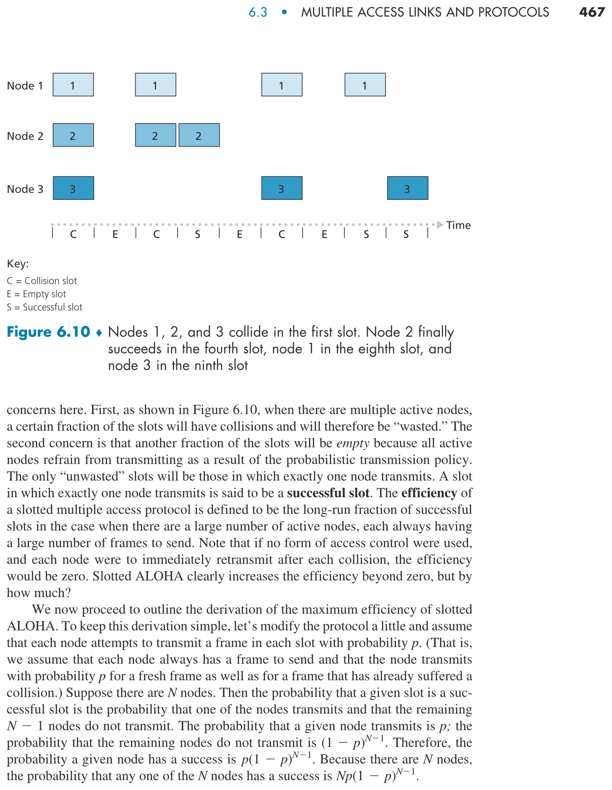

Thus, when there are *N* active nodes, the efficiency of slotted ALOHA is Np(1 - p)N-1. To obtain themaximumefficiency forNactive nodes, we have to find the p* that maximizes this expression. (See the homework problems for a general outline of this derivation.) And to obtain the maximum efficiency for a large number of active nodes, we take the limit of Np*(1 - p*)N-1 as N approaches infinity. (Again, see the homework problems.) After performing these calculations, we'll find that the maximum efficiency of the protocol is given by 1/e = 0.37. That is, when a large number of nodes have many frames to transmit, then (at best) only 37 percent of the slots do useful work. Thus, the effective transmission rate of the channel is not *R* bps but only 0.37 *R* bps! A similar analysis also shows that 37 percent of the slots go empty and 26 percent of slots have collisions. Imagine the poor network administrator who has purchased a 100-Mbps slotted ALOHA system, expecting to be able to use the network to transmit data among a large number of users at an aggregate rate of, say, 80 Mbps! Although the channel is capable of transmitting a given frame at the full channel rate of 100 Mbps, in the long run, the successful throughput of this channel will be less than 37 Mbps.

#### ALOHA

The slotted ALOHA protocol required that all nodes synchronize their transmissions to start at the beginning of a slot. The first ALOHA protocol [Abramson 1970] was actually an unslotted, fully decentralized protocol. In pure ALOHA, when a frame first arrives (that is, a network-layer datagram is passed down from the network layer at the sending node), the node immediately transmits the frame in its entirety into the broadcast channel. If a transmitted frame experiences a collision with one or more other transmissions, the node will then immediately (after completely transmitting its collided frame) retransmit the frame with probability *p.* Otherwise, the node waits for a frame transmission time. After this wait, it then transmits the frame with probability *p,* or waits (remaining idle) for another frame time with probability 1 – *p.*

To determine the maximum efficiency of pure ALOHA, we focus on an individual node. We'll make the same assumptions as in our slotted ALOHA analysis and take the frame transmission time to be the unit of time. At any given time, the probability that a node is transmitting a frame is p. Suppose this frame begins transmission at time $t_{0}$. As shown in Figure 6.11, in order for this frame to be successfully transmitted, no other nodes can begin their transmission in the interval of time [$t_{0}$ - 1, $t_{0}$]. Such a transmission would overlap with the beginning of the transmission of node *i's* frame. The probability that all other nodes do not begin a transmission in this interval is (1 - p)N-1. Similarly, no other node can begin a transmission while node *i* is transmitting, as such a transmission would overlap with the latter part of node *i's* transmission. The probability that all other nodes do not begin a transmission in this interval is also (1 - p)N-1. Thus, the probability that a given node has a successful transmission is p(1 - p)2(N-1). By taking limits as in the slotted ALOHA case, we find that the maximum efficiency of the pure ALOHA protocol is only 1/(2e)—exactly half that of slotted ALOHA. This then is the price to be paid for a fully decentralized ALOHA protocol.

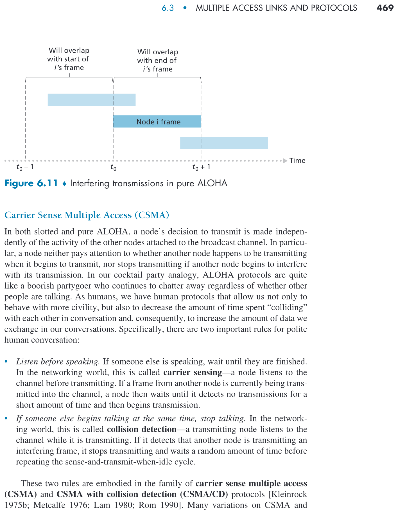

### CASE HISTORY

**NORM ABRAMSON AND ALOHANET**

Norm Abramson, a PhD engineer, had a passion for surfing and an interest in packet switching. This combination of interests brought him to the University of Hawaii in 1969. Hawaii consists of many mountainous islands, making it difficult to install and operate land-based networks. When not surfing, Abramson thought about how to design a network that does packet switching over radio. The network he designed had one central host and several secondary nodes scattered over the Hawaiian Islands. The network had two channels, each using a different frequency band. The downlink channel broadcasted packets from the central host to the secondary hosts; and the upstream channel sent packets from the secondary hosts to the central host. In addition to sending informational packets, the central host also sent on the downstream channel an acknowledgment for each packet successfully received from the secondary hosts.

Because the secondary hosts transmitted packets in a decentralized fashion, collisions on the upstream channel inevitably occurred. This observation led Abramson to devise the pure ALOHA protocol, as described in this chapter. In 1970, with continued funding from ARPA, Abramson connected his ALOHAnet to the ARPAnet. Abramson's work is important not only because it was the first example of a radio packet network, but also because it inspired Bob Metcalfe. A few years later, Metcalfe modified the ALOHA protocol to create the CSMA/CD protocol and the Ethernet LAN.

CSMA/CD have been proposed. Here, we'll consider a few of the most important, and fundamental, characteristics of CSMA and CSMA/CD.

The first question that you might ask about CSMA is why, if all nodes perform carrier sensing, do collisions occur in the first place? After all, a node will refrain from transmitting whenever it senses that another node is transmitting. The answer to the question can best be illustrated using space-time diagrams [Molle 1987]. Figure 6.12 shows a space-time diagram of four nodes (A, B, C, D) attached to a linear broadcast bus. The horizontal axis shows the position of each node in space; the vertical axis represents time.

At time $t_{0}$, node B senses the channel is idle, as no other nodes are currently transmitting. Node B thus begins transmitting, with its bits propagating in both directions along the broadcast medium. The downward propagation of B's bits in Figure 6.12 with increasing time indicates that a nonzero amount of time is needed for B's bits actually to propagate (albeit at near the speed of light) along the broadcast medium. At time $t_{1}$ ($t_{1}$ 7 $t_{0}$), node D has a frame to send. Although node B is currently transmitting at time $t_{1}$, the bits being transmitted by B have yet to reach D, and thus D senses

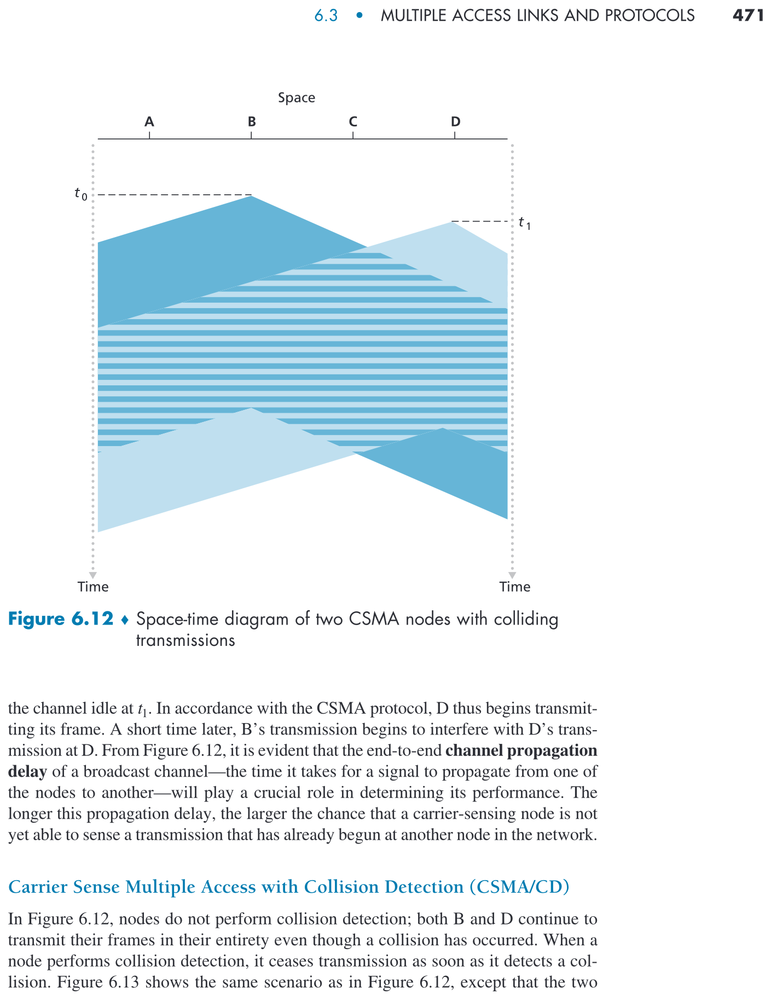

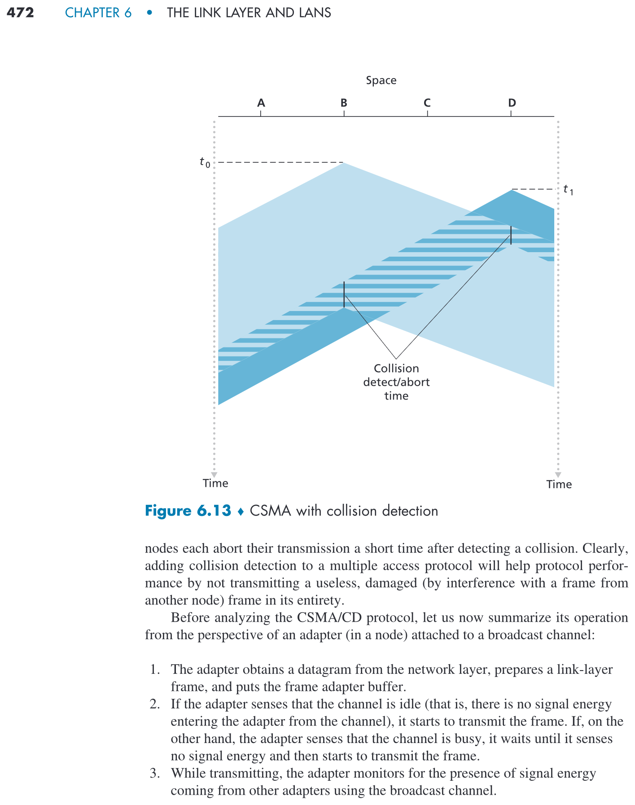

4. If the adapter transmits the entire frame without detecting signal energy from other adapters, the adapter is finished with the frame. If, on the other hand, the adapter detects signal energy from other adapters while transmitting, it aborts the transmission (that is, it stops transmitting its frame).

5. After aborting, the adapter waits a random amount of time and then returns to step 2.

The need to wait a random (rather than fixed) amount of time is hopefully clear—if two nodes transmitted frames at the same time and then both waited the same fixed amount of time, they'd continue colliding forever. But what is a good interval of time from which to choose the random backoff time? If the interval is large and the number of colliding nodes is small, nodes are likely to wait a large amount of time (with the channel remaining idle) before repeating the sense-and-transmit-whenidle step. On the other hand, if the interval is small and the number of colliding nodes is large, it's likely that the chosen random values will be nearly the same, and transmitting nodes will again collide. What we'd like is an interval that is short when the number of colliding nodes is small, and long when the number of colliding nodes is large.

The **binary exponential backoff** algorithm, used in Ethernet as well as in DOC- SIS cable network multiple access protocols [DOCSIS 3.1 2014], elegantly solves this problem. Specifically, when transmitting a frame that has already experienced *n* collisions, a node chooses the value of K at random from {0,1,2, . . . . 2n-1}. Thus, the more collisions experienced by a frame, the larger the interval from which# *K* is chosen. For Ethernet, the actual amount of time a node waits is K 512 bit times (i.e., *K* times the amount of time needed to send 512 bits into the Ethernet) and the maximum value that *n* can take is capped at 10.

Let's look at an example. Suppose that a node attempts to transmit a frame for the first time and while transmitting it detects a collision. The node then chooses *K* = 0 with probability 0.5 or chooses *K* = 1 with probability 0.5. If the node chooses *K* = 0, then it immediately begins sensing the channel. If the node chooses *K* = 1, it waits 512 bit times (e.g., 5.12 microseconds for a 100 Mbps Ethernet) before beginning the sense-and-transmit-when-idle cycle. After a second collision, *K* is chosen with equal probability from {0,1,2,3}. After three collisions, *K* is chosen with equal probability from {0,1,2,3,4,5,6,7}. After 10 or more collisions, *K* is chosen with equal probability from {0,1,2, . . . , 1023}. Thus, the size of the sets from which *K* is chosen grows exponentially with the number of collisions; for this reason this algorithm is referred to as binary exponential backoff.

We also note here that each time a node prepares a new frame for transmission, it runs the CSMA/CD algorithm, not taking into account any collisions that may have occurred in the recent past. So it is possible that a node with a new frame will immediately be able to sneak in a successful transmission while several other nodes are in the exponential backoff state.

#### CSMA/CD Efficiency

When only one node has a frame to send, the node can transmit at the full channel rate (e.g., for Ethernet typical rates are 10 Mbps, 100 Mbps, or 1 Gbps). However, if many nodes have frames to transmit, the effective transmission rate of the channel can be much less. We define the **efficiency of CSMA/CD** to be the long-run fraction of time during which frames are being transmitted on the channel without collisions when there is a large number of active nodes, with each node having a large number of frames to send. In order to present a closed-form approximation of the efficiency of Ethernet, let $d_{prop}$ denote the maximum time it takes signal energy to propagate between any two adapters. Let $d_{trans}$ be the time to transmit a maximum-size frame (approximately 1.2 msecs for a 10 Mbps Ethernet). A derivation of the efficiency of CSMA/CD is beyond the scope of this book (see [Lam 1980] and [Bertsekas 1991]). Here we simply state the following approximation:

$$1 Efficiency =$$

1 + 5$d_{prop}$>$d_{trans}$

We see from this formula that as $d_{prop}$ approaches 0, the efficiency approaches 1. This matches our intuition that if the propagation delay is zero, colliding nodes will abort immediately without wasting the channel. Also, as $d_{trans}$ becomes very large, efficiency approaches 1. This is also intuitive because when a frame grabs the channel, it will hold on to the channel for a very long time; thus, the channel will be doing productive work most of the time.

## 6.3.3 Taking-Turns Protocols

Recall that two desirable properties of a multiple access protocol are (1) when only one node is active, the active node has a throughput of *R* bps, and (2) when *M* nodes are active, then each active node has a throughput of nearly *R/M* bps. The ALOHA and CSMA protocols have this first property but not the second. This has motivated researchers to create another class of protocols—the **taking-turns protocols.** As with random access protocols, there are dozens of taking-turns protocols, and each one of these protocols has many variations. We'll discuss two of the more important protocols here. The first one is the **polling protocol.** The polling protocol requires one of the nodes to be designated as a master node. The master node **polls** each of the nodes in a round-robin fashion. In particular, the master node first sends a message to node 1, saying that it (node 1) can transmit up to some maximum number of frames. After node 1 transmits some frames, the master node tells node 2 it (node 2) can transmit up to the maximum number of frames. (The master node can determine when a node has finished sending its frames by observing the lack of a signal on the channel.) The procedure continues in this manner, with the master node polling each of the nodes in a cyclic manner.

The polling protocol eliminates the collisions and empty slots that plague random access protocols. This allows polling to achieve a much higher efficiency. But

it also has a few drawbacks. The first drawback is that the protocol introduces a polling delay—the amount of time required to notify a node that it can transmit. If, for example, only one node is active, then the node will transmit at a rate less than *R* bps, as the master node must poll each of the inactive nodes in turn each time the active node has sent its maximum number of frames. The second drawback, which is potentially more serious, is that if the master node fails, the entire channel becomes inoperative. The Bluetooth protocol, which we will study in Section 6.3, is an example of a polling protocol.

The second taking-turns protocol is the **token-passing protocol.** In this protocol there is no master node. A small, special-purpose frame known as a **token** is exchanged among the nodes in some fixed order. For example, node 1 might always send the token to node 2, node 2 might always send the token to node 3, and node *N* might always send the token to node 1. When a node receives a token, it holds onto the token only if it has some frames to transmit; otherwise, it immediately forwards the token to the next node. If a node does have frames to transmit when it receives the token, it sends up to a maximum number of frames and then forwards the token to the next node. Token passing is decentralized and highly efficient. But it has its problems as well. For example, the failure of one node can crash the entire channel. Or if a node accidentally neglects to release the token, then some recovery procedure must be invoked to get the token back in circulation. Over the years many token-passing protocols have been developed, including the fiber distributed data interface (FDDI) protocol [Jain 1994] and the IEEE 802.5 token ring protocol [IEEE 802.5 2012], and each one had to address these as well as other sticky issues.

## 6.3.4 DOCSIS: The Link-Layer Protocol for Cable

### Internet Access

In the previous three subsections, we've learned about three broad classes of multiple access protocols: channel partitioning protocols, random access protocols, and taking turns protocols. A cable access network will make for an excellent case study here, as we'll find aspects of *each* of these three classes of multiple access protocols with the cable access network!

Recall from Section 1.2.1 that a cable access network typically connects several thousand residential cable modems to a cable modem termination system (CMTS) at the cable network headend. The Data-Over-Cable Service Interface Specifications (DOCSIS) [DOCSIS 3.1 2014; Hamzeh 2015] specifies the cable data network architecture and its protocols. DOCSIS uses FDM to divide the downstream (CMTS to modem) and upstream (modem to CMTS) network segments into multiple frequency channels. Each downstream channel is between 24 MHz and 192 MHz wide, with a maximum throughput of approximately 1.6 Gbps per channel; each upstream channel has channel widths ranging from 6.4 MHz to 96 MHz, with a maximum upstream throughput of approximately 1 Gbps. Each upstream and downstream

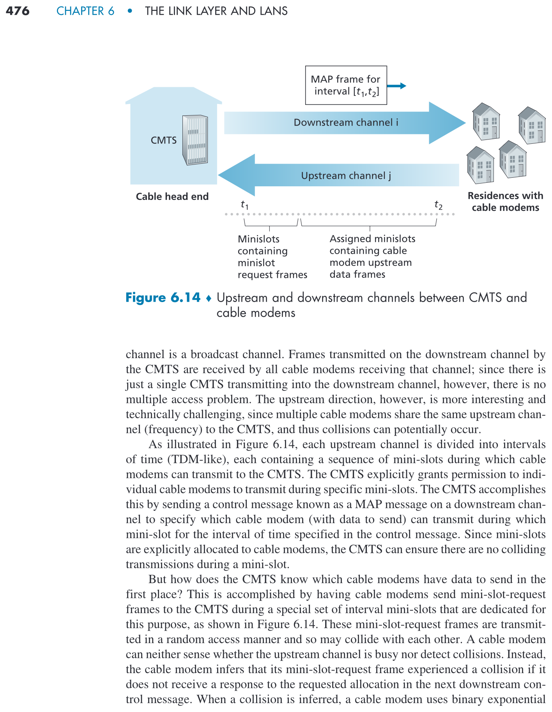

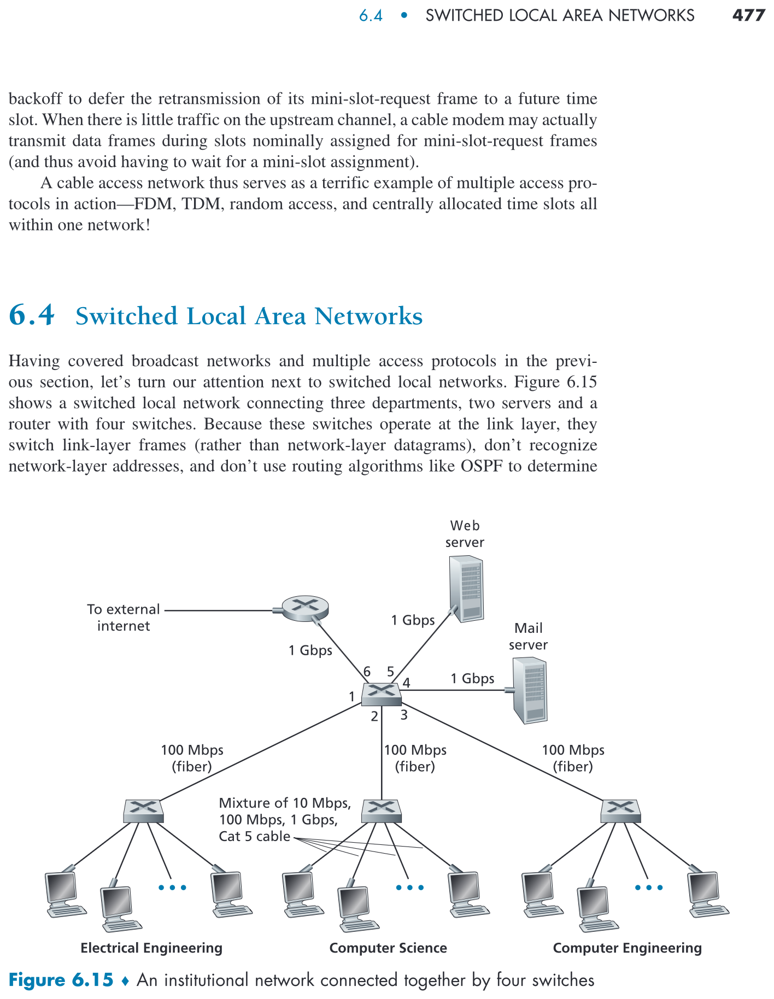

paths through the network of layer-2 switches. Instead of using IP addresses, we will soon see that they use link-layer addresses to forward link-layer frames through the network of switches. We'll begin our study of switched LANs by first covering linklayer addressing (Section 6.4.1). We then examine the celebrated Ethernet protocol (Section 6.4.2). After examining link-layer addressing and Ethernet, we'll look at how link-layer switches operate (Section 6.4.3), and then see (Section 6.4.4) how these switches are often used to build large-scale LANs.

## 6.4.1 Link-Layer Addressing and ARP

Hosts and routers have link-layer addresses. Now you might find this surprising, recalling from Chapter 4 that hosts and routers have network-layer addresses as well. You might be asking, why in the world do we need to have addresses at both the network and link layers? In addition to describing the syntax and function of the link-layer addresses, in this section we hope to shed some light on why the two layers of addresses are useful and, in fact, indispensable. We'll also cover the Address Resolution Protocol (ARP), which provides a mechanism to translate IP addresses to link-layer addresses.

#### MAC Addresses

In truth, it is not hosts and routers that have link-layer addresses but rather their adapters (that is, network interfaces) that have link-layer addresses. A host or router with multiple network interfaces will thus have multiple link-layer addresses associated with it, just as it would also have multiple IP addresses associated with it. It's important to note, however, that link-layer switches do not have link-layer addresses associated with their interfaces that connect to hosts and routers. This is because the job of the link-layer switch is to carry datagrams between hosts and routers; a switch does this job transparently, that is, without the host or router having to explicitly address the frame to the intervening switch. This is illustrated in Figure 6.16. A linklayer address is variously called a **LAN address,** a **physical address,** or a **MAC** **address.** Because MAC address seems to be the most popular term, we'll henceforth refer to link-layer addresses as MAC addresses. For most LANs (including Ethernet and 802.11 wireless LANs), the MAC address is 6 bytes long, giving $2^{48}$ possible MAC addresses. As shown in Figure 6.16, these 6-byte addresses are typically expressed in hexadecimal notation, with each byte of the address expressed as a pair of hexadecimal numbers. Although MAC addresses were designed to be permanent, it is now possible to change an adapter's MAC address via software. For the rest of this section, however, we'll assume that an adapter's MAC address is fixed.

One interesting property of MAC addresses is that no two adapters have the same address. This might seem surprising given that adapters are manufactured in many countries by many companies. How does a company manufacturing adapters in Taiwan make sure that it is using different addresses from a company manufacturing

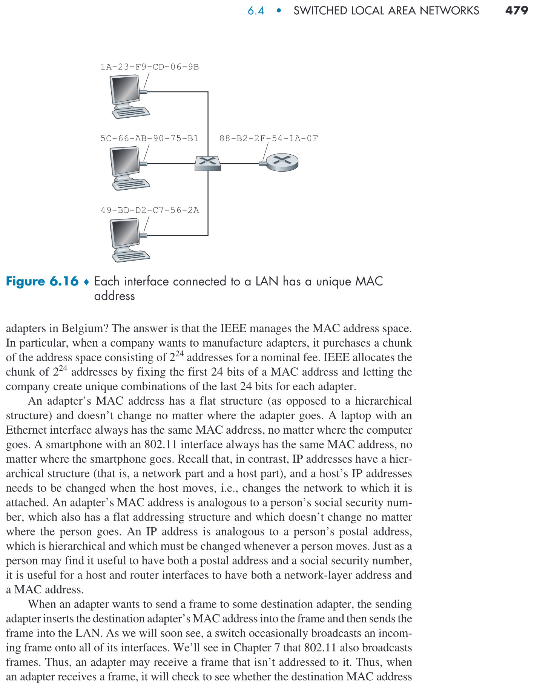

in the frame matches its own MAC address. If there is a match, the adapter extracts the enclosed datagram and passes the datagram up the protocol stack. If there isn't a match, the adapter discards the frame, without passing the network-layer datagram up. Thus, the destination only will be interrupted when the frame is received.

However, sometimes a sending adapter *does* want all the other adapters on the LAN to receive and *process* the frame it is about to send. In this case, the sending adapter inserts a special MAC **broadcast address** into the destination address field of the frame. For LANs that use 6-byte addresses (such as Ethernet and 802.11), the broadcast address is a string of 48 consecutive 1s (that is, FF-FF-FF-FF-FF-FF in hexadecimal notation).

#### Address Resolution Protocol (ARP)

Because there are both network-layer addresses (for example, Internet IP addresses) and link-layer addresses (that is, MAC addresses), there is a need to translate between them. For the Internet, this is the job of the **Address Resolution Protocol (ARP)** [RFC 826].

To understand the need for a protocol such as ARP, consider the network shown in Figure 6.17. In this simple example, each host and router has a single IP address and single MAC address. As usual, IP addresses are shown in dotted-decimal

### PRINCIPLES IN PRACTICE

**KEEPING THE LAYERS INDEPENDENT**

There are several reasons why hosts and router interfaces have MAC addresses in addition to network-layer addresses. First, LANs are designed for arbitrary network-layer protocols, not just for IP and the Internet. If adapters were assigned IP addresses rather than "neutral" MAC addresses, then adapters would not easily be able to support other network-layer protocols (for example, IPX or DECnet). Second, if adapters were to use network-layer addresses instead of MAC addresses, the network-layer address would have to be stored in the adapter RAM and reconfigured every time the adapter was moved (or powered up). Another option is to not use any addresses in the adapters and have each adapter pass the data (typically, an IP datagram) of each frame it receives up the protocol stack. The network layer could then check for a matching network-layer address. One problem with this option is that the host would be interrupted by every frame sent on the LAN, including by frames that were destined for other hosts on the same broadcast LAN. In summary, in order for the layers to be largely independent building blocks in a network architecture, different layers need to have their own addressing scheme. We have now seen three types of addresses: host names for the application layer, IP addresses for the network layer, and MAC addresses for the link layer.

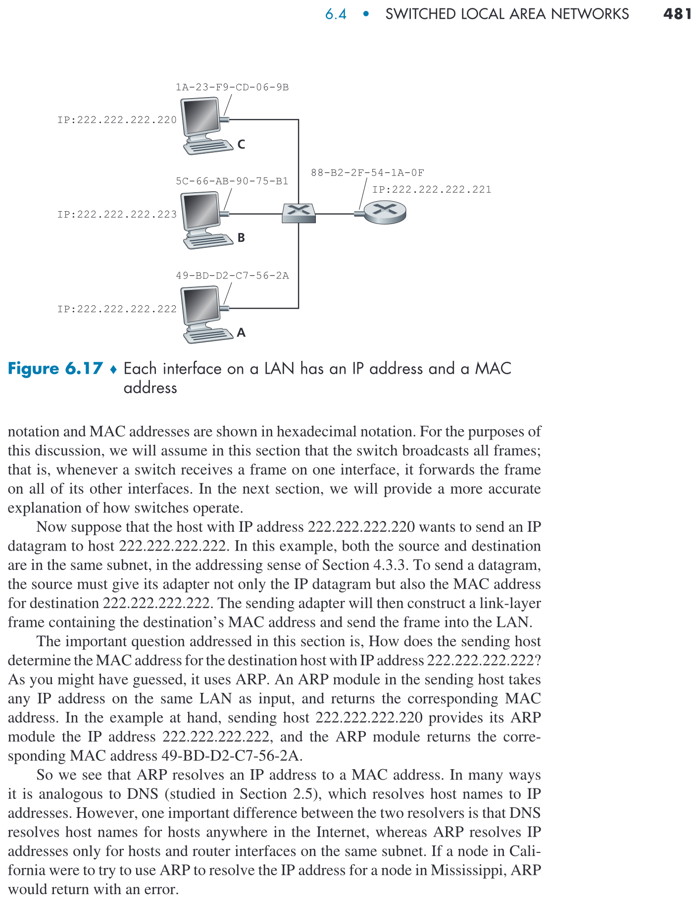

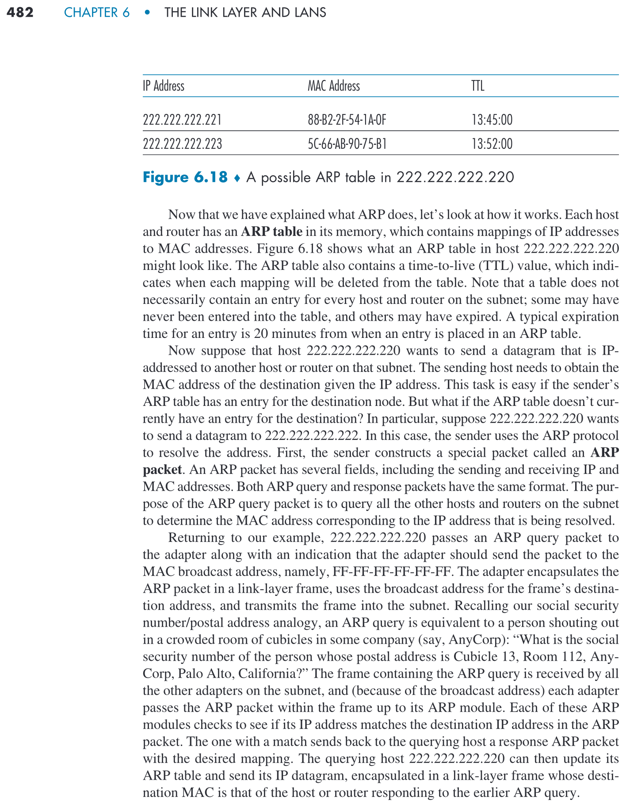

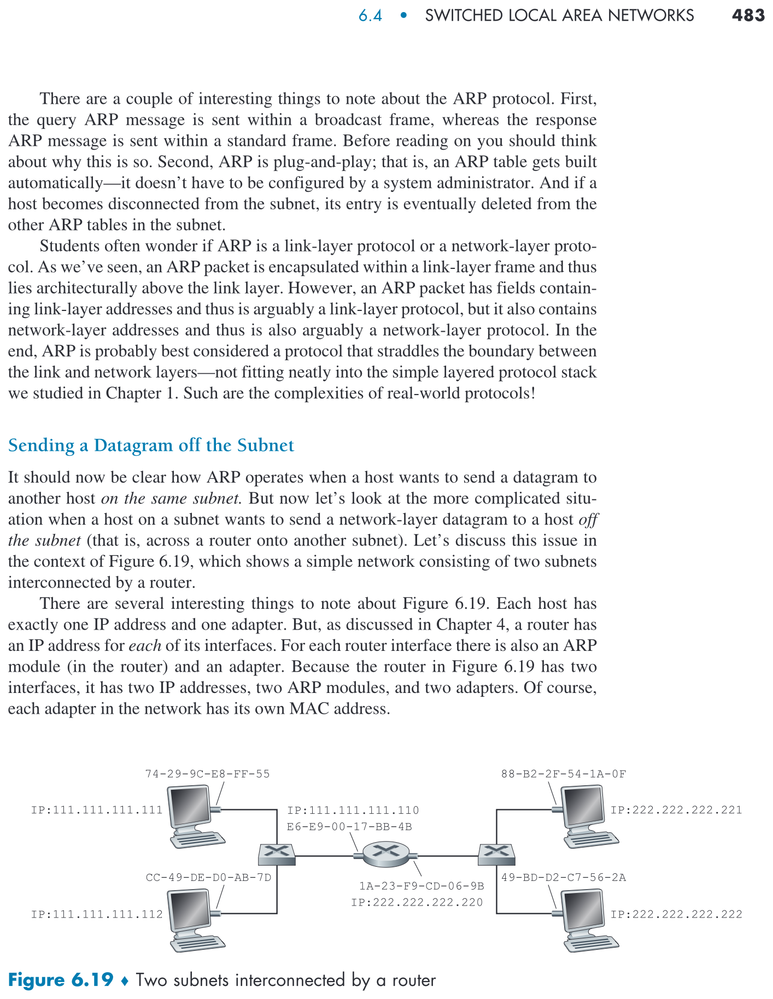

Also note that Subnet 1 has the network address 111.111.111/24 and that Subnet 2 has the network address 222.222.222/24. Thus, all of the interfaces connected to Subnet 1 have addresses of the form 111.111.111.xxx and all of the interfaces connected to Subnet 2 have addresses of the form 222.222.222.xxx.

Now let's examine how a host on Subnet 1 would send a datagram to a host on Subnet 2. Specifically, suppose that host 111.111.111.111 wants to send an IP datagram to a host 222.222.222.222. The sending host passes the datagram to its adapter, as usual. But the sending host must also indicate to its adapter an appropriate destination MAC address. What MAC address should the adapter use? One might be tempted to guess that the appropriate MAC address is that of the adapter for host 222.222.222.222, namely, 49-BD-D2-C7-56-2A. This guess, however, would be wrong! If the sending adapter were to use that MAC address, then none of the adapters on Subnet 1 would bother to pass the IP datagram up to its network layer, since the frame's destination address would not match the MAC address of any adapter on Subnet 1. The datagram would just die and go to datagram heaven.

If we look carefully at Figure 6.19, we see that in order for a datagram to go from 111.111.111.111 to a host on Subnet 2, the datagram must first be sent to the router interface 111.111.111.110, which is the IP address of the first-hop router on the path to the final destination. Thus, the appropriate MAC address for the frame is the address of the adapter for router interface 111.111.111.110, namely, E6-E9-00-17- BB-4B. How does the sending host acquire the MAC address for 111.111.111.110? By using ARP, of course! Once the sending adapter has this MAC address, it creates a frame (containing the datagram addressed to 222.222.222.222) and sends the frame into Subnet 1. The router adapter on Subnet 1 sees that the link-layer frame is addressed to it, and therefore passes the frame to the network layer of the router. Hooray—the IP datagram has successfully been moved from source host to the router! But we are not finished. We still have to move the datagram from the router to the destination. The router now has to determine the correct interface on which the datagram is to be forwarded. As discussed in Chapter 4, this is done by consulting a forwarding table in the router. The forwarding table tells the router that the datagram is to be forwarded via router interface 222.222.222.220. This interface then passes the datagram to its adapter, which encapsulates the datagram in a new frame and sends the frame into Subnet 2. This time, the destination MAC address of the frame is indeed the MAC address of the ultimate destination. And how does the router obtain this destination MAC address? From ARP, of course!

ARP for Ethernet is defined in RFC 826. A nice introduction to ARP is given in the TCP/IP tutorial, RFC 1180. We'll explore ARP in more detail in the homework problems.

## 6.4.2 Ethernet

Ethernet has pretty much taken over the wired LAN market. In the 1980s and the early 1990s, Ethernet faced many challenges from other LAN technologies, including

6.4 • SWITCHED LOCAL AREA NETWORKS **485**

token ring, FDDI, and ATM. Some of these other technologies succeeded in capturing a part of the LAN market for a few years. But since its invention in the mid- 1970s, Ethernet has continued to evolve and grow and has held on to its dominant position. Today, Ethernet is by far the most prevalent wired LAN technology, and it is likely to remain so for the foreseeable future. One might say that Ethernet has been to local area networking what the Internet has been to global networking.

There are many reasons for Ethernet's success. First, Ethernet was the first widely deployed high-speed LAN. Because it was deployed early, network administrators became intimately familiar with Ethernet—its wonders and its quirks—and were reluctant to switch over to other LAN technologies when they came on the scene. Second, token ring, FDDI, and ATM were more complex and expensive than Ethernet, which further discouraged network administrators from switching over. Third, the most compelling reason to switch to another LAN technology (such as FDDI or ATM) was usually the higher data rate of the new technology; however, Ethernet always fought back, producing versions that operated at equal data rates or higher. Switched Ethernet was also introduced in the early 1990s, which further increased its effective data rates. Finally, because Ethernet has been so popular, Ethernet hardware (in particular, adapters and switches) has become a commodity and is remarkably cheap.

The original Ethernet LAN was invented in the mid-1970s by Bob Metcalfe and David Boggs. The original Ethernet LAN used a coaxial bus to interconnect the nodes. Bus topologies for Ethernet actually persisted throughout the 1980s and into the mid-1990s. Ethernet with a bus topology is a broadcast LAN—all transmitted frames travel to and are processed by *all* adapters connected to the bus. Recall that we covered Ethernet's CSMA/CD multiple access protocol with binary exponential backoff in Section 6.3.2.

By the late 1990s, most companies and universities had replaced their LANs with Ethernet installations using a hub-based star topology. In such an installation the hosts (and routers) are directly connected to a hub with twisted-pair copper wire. A **hub** is a physical-layer device that acts on individual bits rather than frames. When a bit, representing a zero or a one, arrives from one interface, the hub simply re-creates the bit, boosts its energy strength, and transmits the bit onto all the other interfaces. Thus, Ethernet with a hub-based star topology is also a broadcast LAN—whenever a hub receives a bit from one of its interfaces, it sends a copy out on all of its other interfaces. In particular, if a hub receives frames from two different interfaces at the same time, a collision occurs and the nodes that created the frames must retransmit.

In the early 2000s, Ethernet experienced yet another major evolutionary change. Ethernet installations continued to use a star topology, but the hub at the center was replaced with a **switch.** We'll be examining switched Ethernet in depth later in this chapter. For now, we only mention that a switch is not only "collision-less" but is also a bona-fide store-and-forward packet switch; but unlike routers, which operate up through layer 3, a switch operates only up through layer 2.

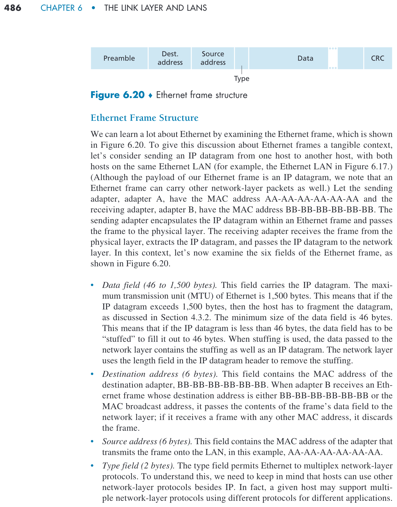

For this reason, when the Ethernet frame arrives at adapter B, adapter B needs to know to which network-layer protocol it should pass (that is, demultiplex) the contents of the data field. IP and other network-layer protocols (for example, Novell IPX or AppleTalk) each have their own, standardized type number. Furthermore, the ARP protocol (discussed in the previous section) has its own type number, and if the arriving frame contains an ARP packet (i.e., has a type field of 0806 hexadecimal), the ARP packet will be demultiplexed up to the ARP protocol. Note that the type field is analogous to the protocol field in the network-layer datagram and the port-number fields in the transport-layer segment; all of these fields serve to glue a protocol at one layer to a protocol at the layer above.

- Cyclic redundancy check (CRC) (4 bytes). As discussed in Section 6.2.3, the purpose of the CRC field is to allow the receiving adapter, adapter B, to detect bit errors in the frame.

- Preamble (8 bytes). The Ethernet frame begins with an 8-byte preamble field. Each of the first 7 bytes of the preamble has a value of 10101010; the last byte is 10101011. The first 7 bytes of the preamble serve to "wake up" the receiving adapters and to synchronize their clocks to that of the sender's clock. Why should the clocks be out of synchronization? Keep in mind that adapter A aims to transmit the frame at 10 Mbps, 100 Mbps, or 1 Gbps, depending on the type of Ethernet LAN. However, because nothing is absolutely perfect, adapter A will not transmit the frame at exactly the target rate; there will always be some *drift* from the target rate, a drift which is not known *a priori* by the other adapters on the LAN. A receiving adapter can lock onto adapter A's clock simply by locking onto the bits in the first 7 bytes of the preamble. The last 2 bits of the eighth byte of the preamble (the first two consecutive 1s) alert adapter B that the "important stuff" is about to come. All of the Ethernet technologies provide connectionless service to the network

layer. That is, when adapter A wants to send a datagram to adapter B, adapter A encapsulates the datagram in an Ethernet frame and sends the frame into the LAN, without first handshaking with adapter B. This layer-2 connectionless service is analogous to IP's layer-3 datagram service and UDP's layer-4 connectionless service. Ethernet technologies provide an unreliable service to the network layer. Specifically, when adapter B receives a frame from adapter A, it runs the frame through a CRC check, but neither sends an acknowledgment when a frame passes the CRC check nor sends a negative acknowledgment when a frame fails the CRC check. When a frame fails the CRC check, adapter B simply discards the frame. Thus, adapter A has no idea whether its transmitted frame reached adapter B and passed the CRC check. This lack of reliable transport (at the link layer) helps to make Ethernet simple and cheap. But it also means that the stream of datagrams passed to the network layer can have gaps.

### CASE HISTORY

**BOB METCALFE AND ETHERNET**

As a PhD student at Harvard University in the early 1970s, Bob Metcalfe worked on the ARPAnet at MIT. During his studies, he also became exposed to Abramson's work on ALOHA and random access protocols. After completing his PhD and just before beginning a job at Xerox Palo Alto Research Center (Xerox PARC), he visited Abramson and his University of Hawaii colleagues for three months, getting a firsthand look at ALOHAnet. At Xerox PARC, Metcalfe became exposed to Alto computers, which in many ways were the forerunners of the personal computers of the 1980s. Metcalfe saw the need to network these computers in an inexpensive manner. So armed with his knowledge about ARPAnet, ALOHAnet, and random access protocols, Metcalfe—along with colleague David Boggs—invented Ethernet.

Metcalfe and Boggs's original Ethernet ran at 2.94 Mbps and linked up to 256 hosts separated by up to one mile. Metcalfe and Boggs succeeded at getting most of the researchers at Xerox PARC to communicate through their Alto computers. Metcalfe then forged an alliance between Xerox, Digital, and Intel to establish Ethernet as a 10 Mbps Ethernet standard, ratified by the IEEE. Xerox did not show much interest in commercializing Ethernet. In 1979, Metcalfe formed his own company, 3Com, which developed and commercialized networking technology, including Ethernet technology. In particular, 3Com developed and marketed Ethernet cards in the early 1980s for the immensely popular IBM PCs.

If there are gaps due to discarded Ethernet frames, does the application at Host B see gaps as well? As we learned in Chapter 3, this depends on whether the application is using UDP or TCP. If the application is using UDP, then the application in Host B will indeed see gaps in the data. On the other hand, if the application is using TCP, then TCP in Host B will not acknowledge the data contained in discarded frames, causing TCP in Host A to retransmit. Note that when TCP retransmits data, the data will eventually return to the Ethernet adapter at which it was discarded. Thus, in this sense, Ethernet does retransmit data, although Ethernet is unaware of whether it is transmitting a brand-new datagram with brand-new data, or a datagram that contains data that has already been transmitted at least once.

#### Ethernet Technologies

In our discussion above, we've referred to Ethernet as if it were a single protocol standard. But in fact, Ethernet comes in *many* different flavors, with somewhat bewildering acronyms such as 10BASE-T, 10BASE-2, 100BASE-T, 1000BASE-LX,

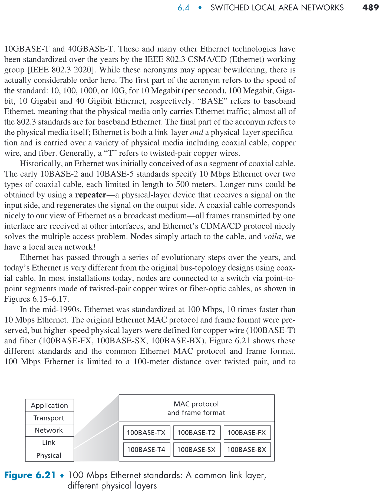

several kilometers over fiber, allowing Ethernet switches in different buildings to be connected.

Gigabit Ethernet is an extension to the highly successful 10 Mbps and 100 Mbps Ethernet standards. Offering a raw data rate of 40,000 Mbps, 40 Gigabit Ethernet maintains full compatibility with the huge installed base of Ethernet equipment. The standard for Gigabit Ethernet, referred to as IEEE 802.3z, does the following:

- Uses the standard Ethernet frame format (Figure 6.20) and is backward compatible with 10BASE-T and 100BASE-T technologies. This allows for easy integration of Gigabit Ethernet with the existing installed base of Ethernet equipment.

- Allows for point-to-point links as well as shared broadcast channels. Point-topoint links use switches while broadcast channels use hubs, as described earlier. In Gigabit Ethernet jargon, hubs are called *buffered distributors.*

- Uses CSMA/CD for shared broadcast channels. In order to have acceptable efficiency, the maximum distance between nodes must be severely restricted.

- Allows for full-duplex operation at 40 Gbps in both directions for point-to-point channels.

Initially operating over optical fiber, Gigabit Ethernet is now able to run over category 5 UTP cabling (for 1000BASE-T and 10GBASE-T).

Let's conclude our discussion of Ethernet technology by posing a question that may have begun troubling you. In the days of bus topologies and hub-based star topologies, Ethernet was clearly a broadcast link (as defined in Section 6.3) in which frame collisions occurred when nodes transmitted at the same time. To deal with these collisions, the Ethernet standard included the CSMA/CD protocol, which is particularly effective for a wired broadcast LAN spanning a small geographical region. But if the prevalent use of Ethernet today is a switch-based star topology, using store-and-forward packet switching, is there really a need anymore for an Ethernet MAC protocol? As we'll see shortly, a switch coordinates its transmissions and never forwards more than one frame onto the same interface at any time. Furthermore, modern switches are full-duplex, so that a switch and a node can each send frames to each other at the same time without interference. In other words, in a switch-based Ethernet LAN there are no collisions and, therefore, there is no need for a MAC protocol!

As we've seen, today's Ethernets are *very* different from the original Ethernet conceived by Metcalfe and Boggs more than 40 years ago—speeds have increased by three orders of magnitude, Ethernet frames are carried over a variety of media, switched-Ethernets have become dominant, and now even the MAC protocol is often unnecessary! Is all of this *really* still Ethernet? The answer, of course, is "yes, by definition." It is interesting to note, however, that through all of these changes, there

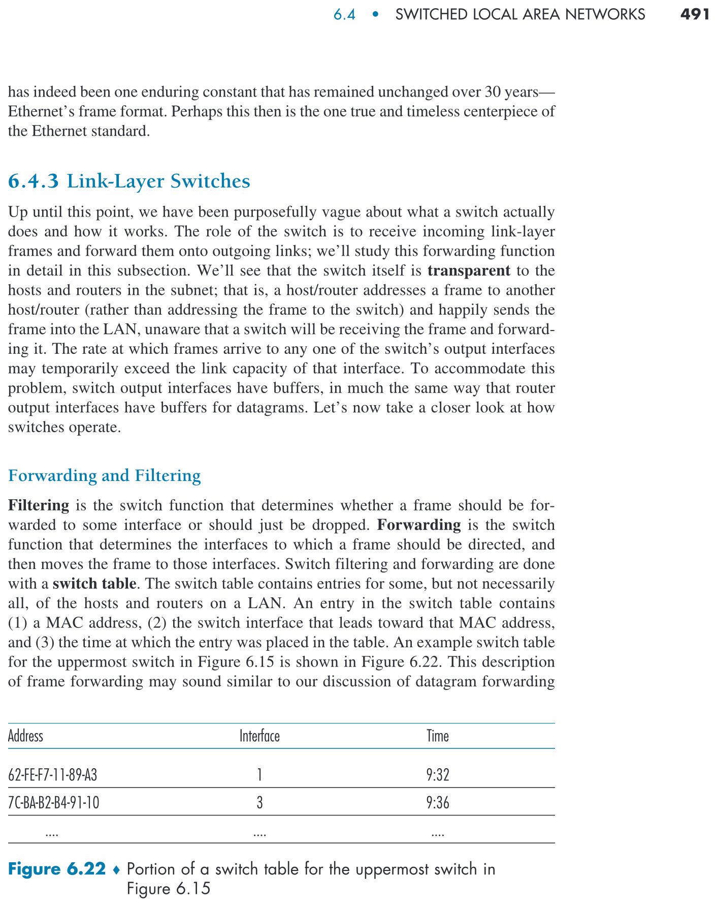

in Chapter 4. Indeed, in our discussion of generalized forwarding in Section 4.4, we learned that many modern packet switches can be configured to forward on the basis of layer-2 destination MAC addresses (i.e., function as a layer-2 switch) or layer-3 IP destination addresses (i.e., function as a layer-3 router). Nonetheless, we'll make the important distinction that switches forward packets based on MAC addresses rather than on IP addresses. We will also see that a traditional (i.e., in a non-SDN context) switch table is constructed in a very different manner from a router's forwarding table.

To understand how switch filtering and forwarding work, suppose a frame with destination address DD-DD-DD-DD-DD-DD arrives at the switch on interface *x.* The switch indexes its table with the MAC address DD-DD-DD-DD-DD-DD. There are three possible cases:

- There is no entry in the table for DD-DD-DD-DD-DD-DD. In this case, the switch forwards copies of the frame to the output buffers preceding *all* interfaces except for interface *x.* In other words, if there is no entry for the destination address, the switch broadcasts the frame.

- There is an entry in the table, associating DD-DD-DD-DD-DD-DD with interface

    x. In this case, the frame is coming from a LAN segment that contains adapter

DD-DD-DD-DD-DD-DD. There being no need to forward the frame to any of the other interfaces, the switch performs the filtering function by discarding the frame.

- There is an entry in the table, associating DD-DD-DD-DD-DD-DD with interface *y"x.* In this case, the frame needs to be forwarded to the LAN segment attached to interface *y.* The switch performs its forwarding function by putting the frame in an output buffer that precedes interface *y.* Let's walk through these rules for the uppermost switch in Figure 6.15 and its

switch table in Figure 6.22. Suppose that a frame with destination address 62-FE- F7-11-89-A3 arrives at the switch from interface 1. The switch examines its table and sees that the destination is on the LAN segment connected to interface 1 (that is, Electrical Engineering). This means that the frame has already been broadcast on the LAN segment that contains the destination. The switch therefore filters (that is, discards) the frame. Now suppose a frame with the same destination address arrives from interface 2. The switch again examines its table and sees that the destination is in the direction of interface 1; it therefore forwards the frame to the output buffer preceding interface 1. It should be clear from this example that as long as the switch table is complete and accurate, the switch forwards frames toward destinations without any broadcasting.

In this sense, a switch is "smarter" than a hub. But how does this switch table get configured in the first place? Are there link-layer equivalents to network-layer routing protocols? Or must an overworked manager manually configure the switch table?

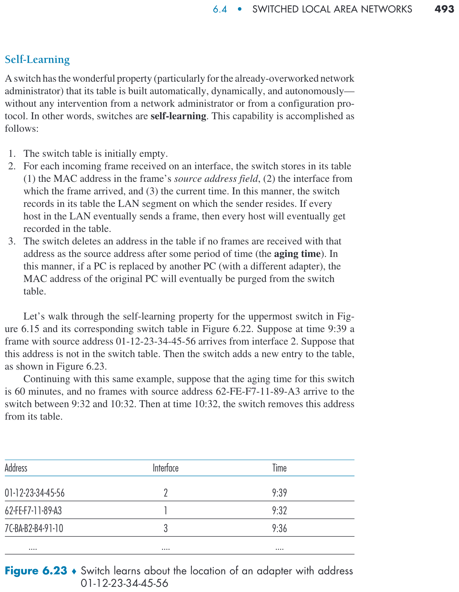

Switches are **plug-and-play devices** because they require no intervention from a network administrator or user. A network administrator wanting to install a switch need do nothing more than connect the LAN segments to the switch interfaces. The administrator need not configure the switch tables at the time of installation or when a host is removed from one of the LAN segments. Switches are also full-duplex, meaning any switch interface can send and receive at the same time.

#### Properties of Link-Layer Switching

Having described the basic operation of a link-layer switch, let's now consider their features and properties. We can identify several advantages of using switches, rather than broadcast links such as buses or hub-based star topologies:

- Elimination of collisions. In a LAN built from switches (and without hubs), there is no wasted bandwidth due to collisions! The switches buffer frames and never transmit more than one frame on a segment at any one time. As with a router, the maximum aggregate throughput of a switch is the sum of all the switch interface rates. Thus, switches provide a significant performance improvement over LANs with broadcast links.

- Heterogeneous links. Because a switch isolates one link from another, the different links in the LAN can operate at different speeds and can run over different media. For example, the uppermost switch in Figure 6.15 might have three1 Gbps 1000BASE-T copper links, two 100 Mbps 100BASE-FX fiber links, and one 100BASE-T copper link. Thus, a switch is ideal for mixing legacy equipment with new equipment.

- Management. In addition to providing enhanced security (see sidebar on Focus on Security), a switch also eases network management. For example, if an adapter malfunctions and continually sends Ethernet frames (called a jabbering adapter), a switch can detect the problem and internally disconnect the malfunctioning adapter. With this feature, the network administrator need not get out of bed and drive back to work in order to correct the problem. Similarly, a cable cut disconnects only that host that was using the cut cable to connect to the switch. In the days of coaxial cable, many a network manager spent hours "walking the line" (or more accurately, "crawling the floor") to find the cable break that brought down the entire network. Switches also gather statistics on bandwidth usage, collision rates, and traffic types, and make this information available to the network manager. This information can be used to debug and correct problems, and to plan how the LAN should evolve in the future. Researchers are exploring adding yet more management functionality into Ethernet LANs in prototype deployments [Casado 2007; Koponen 2011].

### FOCUS ON SECURITY

**SNIFFING A SWITCHED LAN: SWITCH POISONING**

When a host is connected to a switch, it typically only receives frames that are intended for it. For example, consider a switched LAN in Figure 6.17. When host A sends a frame to host B, and there is an entry for host B in the switch table, then the switch will forward the frame *only* to host B. If host C happens to be running a sniffer, host C will not be able to sniff this A-to-B frame. Thus, in a switched-LAN environment (in contrast to a broadcast link environment such as 802.11 LANs or hub–based Ethernet LANs), it is more difficult for an attacker to sniff frames. *However,* because the switch broadcasts frames that have destination addresses that are not in the switch table, the sniffer at C can still sniff some frames that are not intended for

C. Furthermore, a sniffer will be able sniff all Ethernet broadcast frames with broad-

cast destination address FF–FF–FF–FF–FF–FF. A well-known attack against a switch, called **switch poisoning,** is to send tons of packets to the switch with many different bogus source MAC addresses, thereby filling the switch table with bogus entries and leaving no room for the MAC addresses of the legitimate hosts. This causes the switch to broadcast most frames, which can then be picked up by the sniffer [Skoudis 2006]. As this attack is rather involved even for a sophisticated attacker, switches are significantly less vulnerable to sniffing than are hubs and wireless LANs.

#### Switches Versus Routers

As we learned in Chapter 4, routers are store-and-forward packet switches that forward packets using network-layer addresses. Although a switch is also a store-andforward packet switch, it is fundamentally different from a router in that it forwards packets using MAC addresses. Whereas a router is a layer-3 packet switch, a switch is a layer-2 packet switch. Recall, however, that we learned in Section 4.4 that modern switches using the "match plus action" operation can be used to forward a layer-2 frame based on the frame's destination MAC address, as well as a layer-3 datagram using the datagram's destination IP address. Indeed, we saw that switches using the OpenFlow standard can perform generalized packet forwarding based on any of eleven different frame, datagram, and transport-layer header fields.

Even though switches and routers are fundamentally different, network administrators must often choose between them when installing an interconnection device. For example, for the network in Figure 6.15, the network administrator could just as easily have used a router instead of a switch to connect the department LANs, servers, and internet gateway router. Indeed, a router would permit interdepartmental communication without creating collisions. Given that both switches and routers are candidates for interconnection devices, what are the pros and cons of the two approaches?

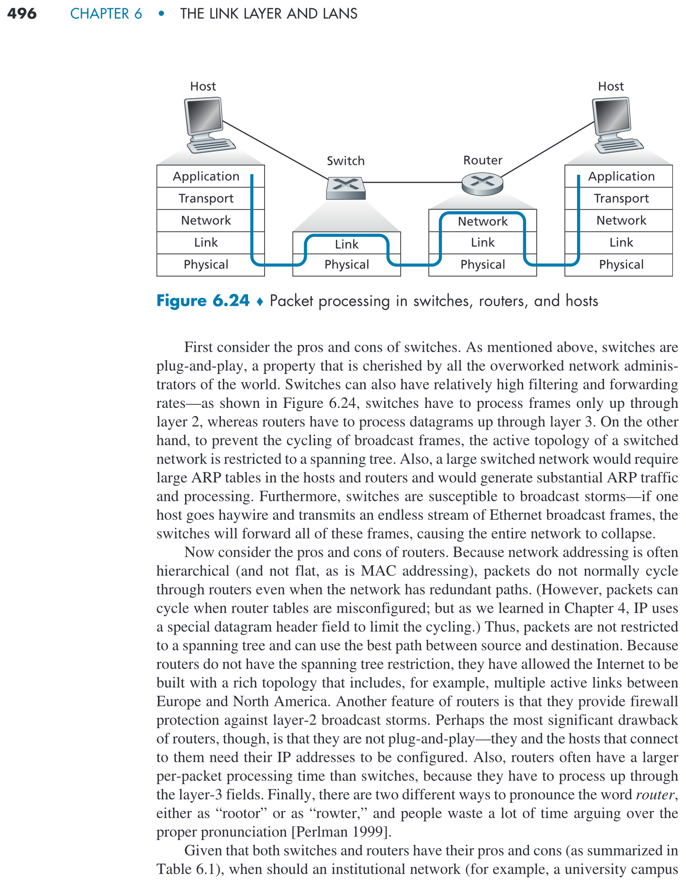

|  | Hubs | Routers | Switches |
| --- | --- | --- | --- |
| Traffic isolation | No | Yes | Yes |
| Plug and play | Yes | No | Yes |
| Optimal routing | No | Yes | No |

**Table 6.1** ♦ Comparison of the typical features of popular interconnection devices

network or a corporate campus network) use switches, and when should it use routers? Typically, small networks consisting of a few hundred hosts have a few LAN segments. Switches suffice for these small networks, as they localize traffic and increase aggregate throughput without requiring any configuration of IP addresses. But larger networks consisting of thousands of hosts typically include routers within the network (in addition to switches). The routers provide a more robust isolation of traffic, control broadcast storms, and use more "intelligent" routes among the hosts in the network.

For more discussion of the pros and cons of switched versus routed networks, as well as a discussion of how switched LAN technology can be extended to accommodate two orders of magnitude more hosts than today's Ethernets, see [Meyers 2004; Kim 2008].

## 6.4.4 Virtual Local Area Networks (VLANs)

In our earlier discussion of Figure 6.15, we noted that modern institutional LANs are often configured hierarchically, with each workgroup (department) having its own switched LAN connected to the switched LANs of other groups via a switch hierarchy. While such a configuration works well in an ideal world, the real world is often far from ideal. Three drawbacks can be identified in the configuration in Figure 6.15:

- Lack of traffic isolation. Although the hierarchy localizes group traffic to within a single switch, broadcast traffic (e.g., frames carrying ARP and DHCP messages or frames whose destination has not yet been learned by a self-learning switch) must still traverse the entire institutional network. Limiting the scope of such broadcast traffic would improve LAN performance. Perhaps more importantly, it also may be desirable to limit LAN broadcast traffic for security/privacy reasons. For example, if one group contains the company's executive management team and another group contains disgruntled employees running Wireshark packet sniffers, the network manager may well prefer that the executives' traffic never even reaches employee hosts. This type of isolation could be provided by

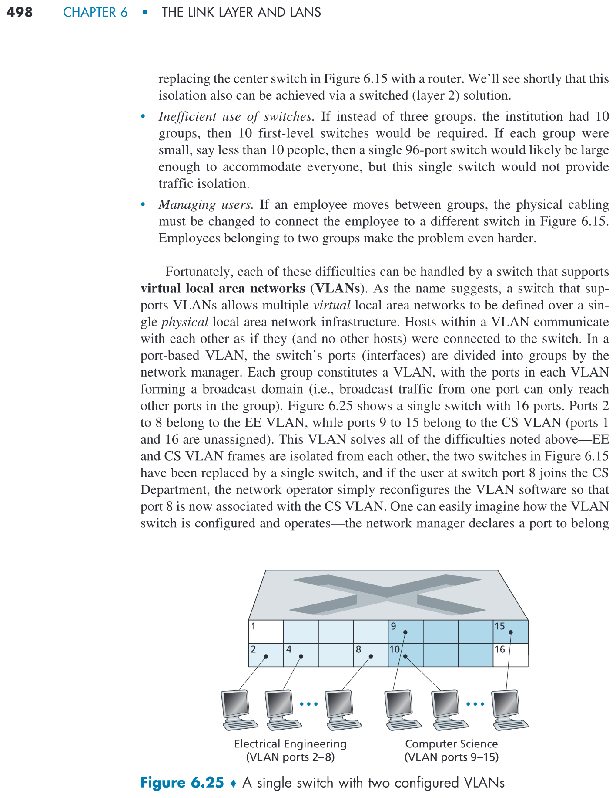

to a given VLAN (with undeclared ports belonging to a default VLAN) using switch management software, a table of port-to-VLAN mappings is maintained within the switch; and switch hardware only delivers frames between ports belonging to the same VLAN.

But by completely isolating the two VLANs, we have introduced a new difficulty! How can traffic from the EE Department be sent to the CS Department? One way to handle this would be to connect a VLAN switch port (e.g., port 1 in Figure 6.25) to an external router and configure that port to belong both the EE and CS VLANs. In this case, even though the EE and CS departments share the same physical switch, the logical configuration would look as if the EE and CS departments had separate switches connected via a router. An IP datagram going from the EE to the CS department would first cross the EE VLAN to reach the router and then be forwarded by the router back over the CS VLAN to the CS host. Fortunately, switch vendors make such configurations easy for the network manager by building a single device that contains both a VLAN switch *and* a router, so a separate external router is not needed. A homework problem at the end of the chapter explores this scenario in more detail.

Returning again to Figure 6.15, let's now suppose that rather than having a separate Computer Engineering department, some EE and CS faculty are housed in a separate building, where (of course!) they need network access, and (of course!) they'd like to be part of their department's VLAN. Figure 6.26 shows a second 8-port switch, where the switch ports have been defined as belonging to the EE or the CS VLAN, as needed. But how should these two switches be interconnected? One easy solution would be to define a port belonging to the CS VLAN on each switch (similarly for the EE VLAN) and to connect these ports to each other, as shown in Figure 6.26(a). This solution doesn't scale, however, since *N* VLANS would require *N* ports on each switch simply to interconnect the two switches.

A more scalable approach to interconnecting VLAN switches is known as **VLAN trunking.** In the VLAN trunking approach shown in Figure 6.26(b), a special port on each switch (port 16 on the left switch and port 1 on the right switch) is configured as a trunk port to interconnect the two VLAN switches. The trunk port belongs to all VLANs, and frames sent to any VLAN are forwarded over the trunk link to the other switch. But this raises yet another question: How does a switch know that a frame arriving on a trunk port belongs to a particular VLAN? The IEEE has defined an extended Ethernet frame format, 802.1Q, for frames crossing a VLAN trunk. As shown in Figure 6.27, the 802.1Q frame consists of the standard Ethernet frame with a four-byte **VLAN tag** added into the header that carries the identity of the VLAN to which the frame belongs. The VLAN tag is added into a frame by the switch at the sending side of a VLAN trunk, parsed, and removed by the switch at the receiving side of the trunk. The VLAN tag itself consists of a 2-byte Tag Protocol Identifier (TPID) field (with a fixed hexadecimal value of 81-00), a 2-byte Tag Control Information field that contains a 12-bit VLAN identifier field, and a 3-bit priority field that is similar in intent to the IP datagram TOS field.

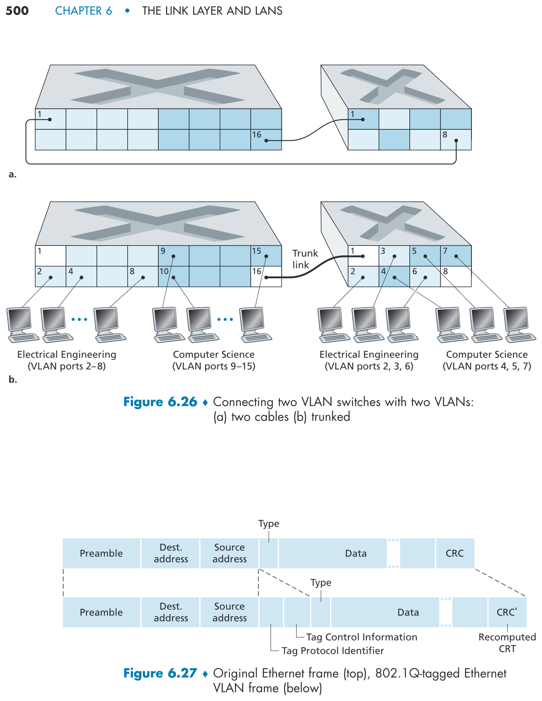

6.5 • LINK VIRTUALIZATION: A NETWORK AS A LINK LAYER **501**

In this discussion, we've only briefly touched on VLANs and have focused on portbased VLANs. We should also mention that VLANs can be defined in several other ways. In MAC-based VLANs, the network manager specifies the set of MAC addresses that belong to each VLAN; whenever a device attaches to a port, the port is connected into the appropriate VLAN based on the MAC address of the device. VLANs can also be defined based on network-layer protocols (e.g., IPv4, IPv6, or Appletalk) and other criteria. It is also possible for VLANs to be extended across IP routers, allowing islands of LANs to be connected together to form a single VLAN that could span the globe [Yu 2011]. See the 802.1Q standard [IEEE 802.1q 2005] for more details.

## 6.5 Link Virtualization: A Network

## as a Link Layer

Because this chapter concerns link-layer protocols, and given that we're now nearing the chapter's end, let's reflect on how our understanding of the term *link* has evolved. We began this chapter by viewing the link as a physical wire connecting two communicating hosts. In studying multiple access protocols, we saw that multiple hosts could be connected by a shared wire and that the "wire" connecting the hosts could be radio spectra or other media. This led us to consider the link a bit more abstractly as a channel, rather than as a wire. In our study of Ethernet LANs (Figure 6.15), we saw that the interconnecting media could actually be a rather complex switched infrastructure. Throughout this evolution, however, the hosts themselves maintained the view that the interconnecting medium was simply a link-layer channel connecting two or more hosts. We saw, for example, that an Ethernet host can be blissfully unaware of whether it is connected to other LAN hosts by a single short LAN segment (Figure 6.17) or by a geographically dispersed switched LAN (Figure 6.15) or by a VLAN (Figure 6.26).

In the case of a dialup modem connection between two hosts, the link connecting the two hosts is actually the telephone network—a logically separate, global telecommunications network with its own switches, links, and protocol stacks for data transfer and signaling. From the Internet link-layer point of view, however, the dial-up connection through the telephone network is viewed as a simple "wire." In this sense, the Internet virtualizes the telephone network, viewing the telephone network as a link-layer technology providing link-layer connectivity between two Internet hosts. You may recall from our discussion of overlay networks in Chapter 2 that an overlay network similarly views the Internet as a means for providing connectivity between overlay nodes, seeking to overlay the Internet in the same way that the Internet overlays the telephone network.

In this section, we'll consider Multiprotocol Label Switching (MPLS) networks. Unlike the circuit-switched telephone network, MPLS is a packet-switched,

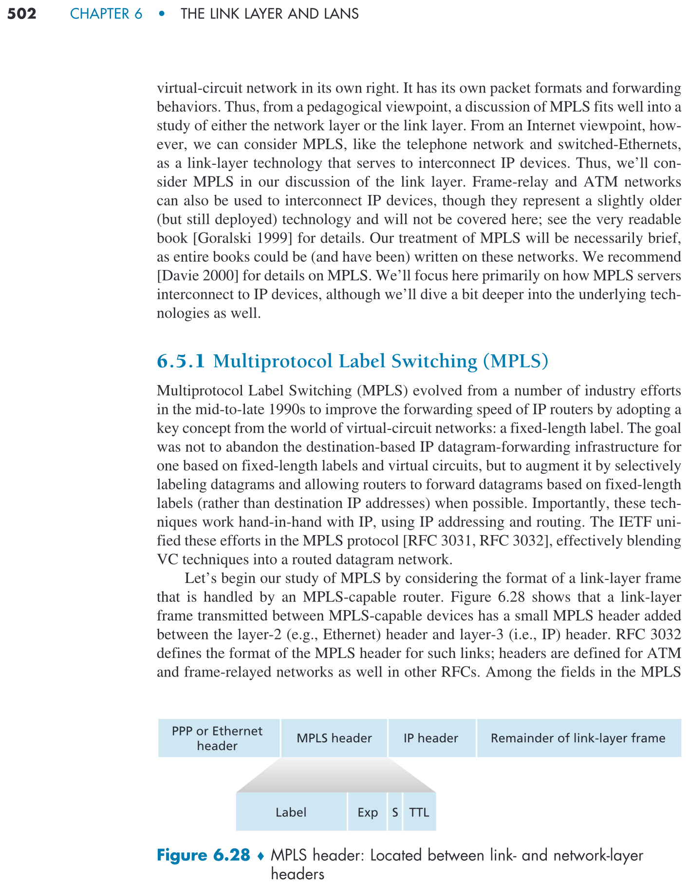

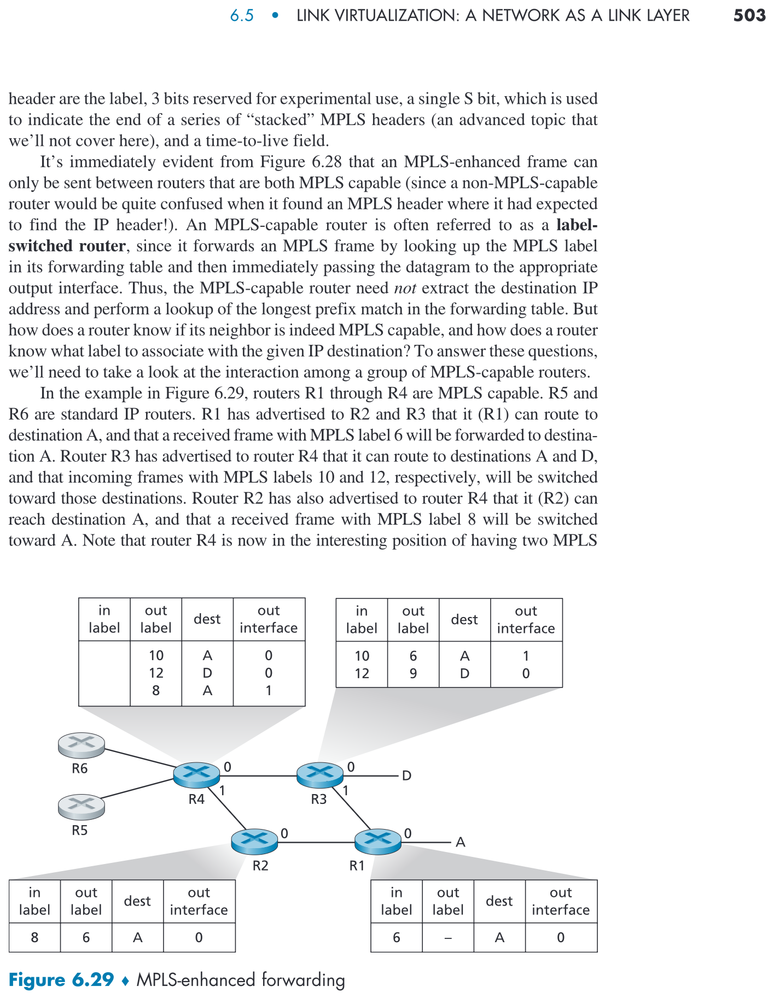

paths to reach A: via interface 0 with outbound MPLS label 10, and via interface 1 with an MPLS label of 8. The broad picture painted in Figure 6.29 is that IP devices R5, R6, A, and D are connected together via an MPLS infrastructure (MPLS-capable routers R1, R2, R3, and R4) in much the same way that a switched LAN or an ATM network can connect together IP devices. And like a switched LAN or ATM network, the MPLScapable routers R1 through R4 do so *without ever touching the IP header of a packet.*

In our discussion above, we've not specified the specific protocol used to distribute labels among the MPLS-capable routers, as the details of this signaling are well beyond the scope of this book. We note, however, that the IETF working group on MPLS has specified in [RFC 3468] that an extension of the RSVP protocol, known as RSVP-TE [RFC 3209], will be the focus of its efforts for MPLS signaling. We've also not discussed how MPLS actually computes the paths for packets among MPLS capable routers, nor how it gathers link-state information (e.g., amount of link bandwidth unreserved by MPLS) to use in these path computations. Existing link-state routing algorithms (e.g., OSPF) have been extended to flood this information to MPLS-capable routers. Interestingly, the actual path computation algorithms are not standardized, and are currently vendor-specific.

Thus far, the emphasis of our discussion of MPLS has been on the fact that MPLS performs switching based on labels, without needing to consider the IP address of a packet. The true advantages of MPLS and the reason for current interest in MPLS, however, lie not in the potential increases in switching speeds, but rather in the new traffic management capabilities that MPLS enables. As noted above, R4 has *two* MPLS paths to A. If forwarding were performed up at the IP layer on the basis of IP address, the IP routing protocols we studied in Chapter 5 would specify only a single, least-cost path to A. Thus, MPLS provides the ability to forward packets along routes that would not be possible using standard IP routing protocols. This is one simple form of **traffic** **engineering** using MPLS [RFC 3346; RFC 3272; RFC 2702; Xiao 2000], in which a network operator can override normal IP routing and force some of the traffic headed toward a given destination along one path, and other traffic destined toward the same destination along another path (whether for policy, performance, or some other reason).

It is also possible to use MPLS for many other purposes as well. It can be used to perform fast restoration of MPLS forwarding paths, e.g., to reroute traffic over a precomputed failover path in response to link failure [Kar 2000; Huang 2002; RFC 3469]. Finally, we note that MPLS can, and has, been used to implement so-called **virtual private networks** (VPNs). In implementing a VPN for a customer, an ISP uses its MPLS-enabled network to connect together the customer's various networks. MPLS can be used to isolate both the resources and addressing used by the customer's VPN from that of other users crossing the ISP's network; see [DeClercq 2002] for details.

Our discussion of MPLS has been brief, and we encourage you to consult the references we've mentioned. We note that MPLS rose to prominence before the development of software-defined networking, which we studied in Chapter 5, and that many of MPLS' traffic engineering capabilities can also be achieved via SDN and the generalized forwarding paradigm we studied in Chapter 4. Only the future will tell whether MPLS and SDN will continue to co-exist, or whether newer technologies (such as SDN) will eventually replace MPLS.

6.6 •

## 6.6 Data Center Networking

DATA CENTER NETWORKING **505**

Internet companies such as Google, Microsoft, Amazon, and Alibaba have built massive data centers, each housing tens to hundreds of thousands of hosts. As briefly discussed in the sidebar in Section 1.2, data centers are not only connected to the Internet, but also internally include complex computer networks, called **data center** **networks,** which interconnect their internal hosts. In this section, we provide a brief introduction to data center networking for cloud applications.

Broadly speaking, data centers serve three purposes. First, they provide content such as Web pages, search results, e-mail, or streaming video to users. Second, they serve as massively-parallel computing infrastructures for specific data processing tasks, such as distributed index computations for search engines. Third, they provide **cloud computing** to other companies. Indeed, today a major trend in computing is for companies to use a cloud provider such as Amazon Web Services, Microsoft Azure, and Alibaba Cloud to handle essentially *all* of their IT needs.

## 6.6.1 Data Center Architectures

Data center designs are carefully kept company secrets, as they often provide critical competitive advantages to leading cloud computing companies. The cost of a large data center is huge, exceeding $12 million per month for a 100,000 host data center in 2009 [Greenberg 2009a]. Of these costs, about 45 percent can be attributed to the hosts themselves (which need to be replaced every 3–4 years); 25 percent to infrastructure, including transformers, uninterruptable power supplies (UPS) systems, generators for long-term outages, and cooling systems; 15 percent for electric utility costs for the power draw; and 15 percent for networking, including network gear (switches, routers, and load balancers), external links, and transit traffic costs. (In these percentages, costs for equipment are amortized so that a common cost metric is applied for one-time purchases and ongoing expenses such as power.) While networking is not the largest cost, networking innovation is the key to reducing overall cost and maximizing performance [Greenberg 2009a].

The worker bees in a data center are the hosts. The hosts in data centers, called **blades** and resembling pizza boxes, are generally commodity hosts that include CPU, memory, and disk storage. The hosts are stacked in racks, with each rack typically having 20 to 40 blades. At the top of each rack, there is a switch, aptly named the **Top of Rack (TOR) switch,** that interconnects the hosts in the rack with each other and with other switches in the data center. Specifically, each host in the rack has a network interface that connects to its TOR switch, and each TOR switch has additional ports that can be connected to other switches. Today, hosts typically have 40 Gbps or 100 Gbps Ethernet connections to their TOR switches [FB 2019; Greenberg 2015; Roy 2015; Singh 2015]. Each host is also assigned its own data-centerinternal IP address.

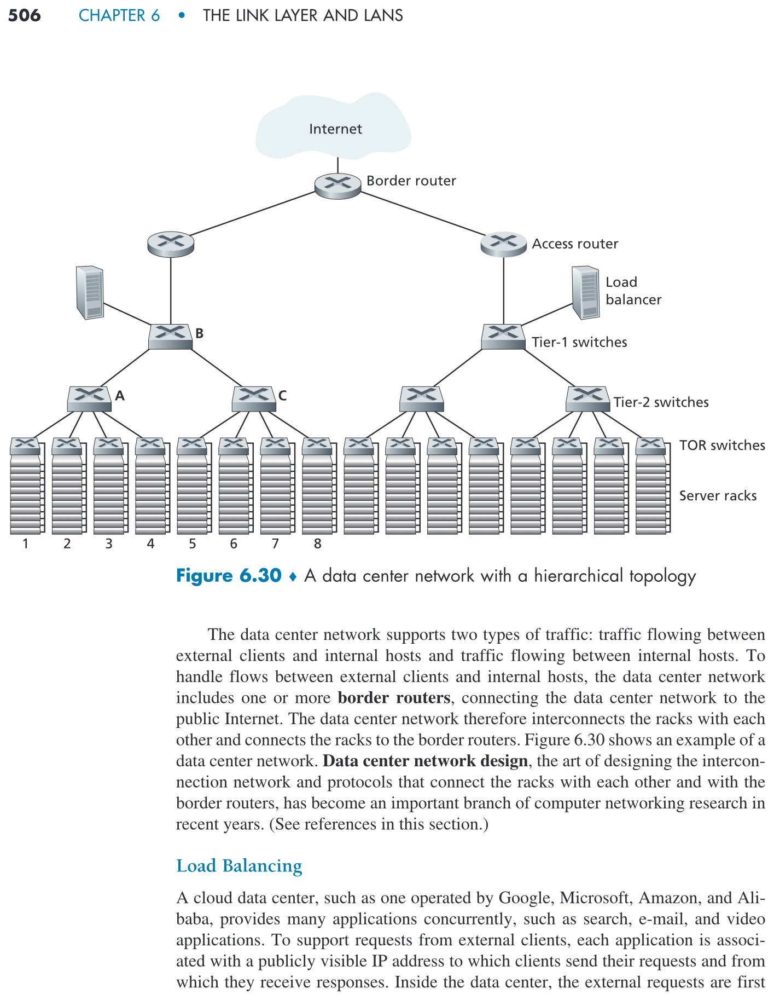

6.6 • DATA CENTER NETWORKING **507**

directed to a load balancer whose job it is to distribute requests to the hosts, balancing the load across the hosts as a function of their current load [Patel 2013; Eisenbud 2016]. A large data center will often have several load balancers, each one devoted to a set of specific cloud applications. Such a load balancer is sometimes referred to as a "layer-4 switch" since it makes decisions based on the destination port number (layer 4) as well as destination IP address in the packet. Upon receiving a request for a particular application, the load balancer forwards it to one of the hosts that handles the application. (A host may then invoke the services of other hosts to help process the request.) The load balancer not only balances the work load across hosts, but also provides a NAT-like function, translating the public external IP address to the internal IP address of the appropriate host, and then translating back for packets traveling in the reverse direction back to the clients. This prevents clients from contacting hosts directly, which has the security benefit of hiding the internal network structure and preventing clients from directly interacting with the hosts.

#### Hierarchical Architecture

For a small data center housing only a few thousand hosts, a simple network consisting of a border router, a load balancer, and a few tens of racks all interconnected by a single Ethernet switch could possibly suffice. But to scale to tens to hundreds of thousands of hosts, a data center often employs a hierarchy of routers and switches, such as the topology shown in Figure 6.30. At the top of the hierarchy, the border router connects to access routers (only two are shown in Figure 6.30, but there can be many more). Below each access router, there are three tiers of switches. Each access router connects to a top-tier switch, and each top-tier switch connects to multiple second-tier switches and a load balancer. Each second-tier switch in turn connects to multiple racks via the racks' TOR switches (third-tier switches). All links typically use Ethernet for their link-layer and physical-layer protocols, with a mix of copper and fiber cabling. With such a hierarchical design, it is possible to scale a data center to hundreds of thousands of hosts.

Because it is critical for a cloud application provider to continually provide applications with high availability, data centers also include redundant network equipment and redundant links in their designs (not shown in Figure 6.30). For example, each TOR switch can connect to two tier-2 switches, and each access router, tier-1 switch, and tier-2 switch can be duplicated and integrated into the design [Cisco 2012; Greenberg 2009b]. In the hierarchical design in Figure 6.30, observe that the hosts below each access router form a single subnet. In order to localize ARP broadcast traffic, each of these subnets is further partitioned into smaller VLAN subnets, each comprising a few hundred hosts [Greenberg 2009a].

Although the conventional hierarchical architecture just described solves the problem of scale, it suffers from limited host-to-host capacity [Greenberg 2009b]. To understand this limitation, consider again Figure 6.30, and suppose each host connects to its TOR switch with a 10 Gbps link, whereas the links between switches

are 100 Gbps Ethernet links. Two hosts in the same rack can always communicate at a full 10 Gbps, limited only by the rate of the hosts' network interface controllers. However, if there are many simultaneous flows in the data center network, the maximum rate between two hosts in different racks can be much less. To gain insight into this issue, consider a traffic pattern consisting of 40 simultaneous flows between 40 pairs of hosts in different racks. Specifically, suppose each of 10 hosts in rack 1 in Figure 6.30 sends a flow to a corresponding host in rack 5. Similarly, there are ten simultaneous flows between pairs of hosts in racks 2 and 6, ten simultaneous flows between racks 3 and 7, and ten simultaneous flows between racks 4 and 8. If each flow evenly shares a link's capacity with other flows traversing that link, then the 40 flows crossing the 100 Gbps A-to-B link (as well as the 100 Gbps B-to-C link) will each only receive 100 Gbps / 40 = 2.5 Gbps, which is significantly less than the 10 Gbps network interface rate. The problem becomes even more acute for flows between hosts that need to travel higher up the hierarchy. There are several possible solutions to this problem:

- One possible solution to this limitation is to deploy higher-rate switches and routers. But this would significantly increase the cost of the data center, because switches and routers with high port speeds are very expensive.

- A second solution to this problem, which can be adopted whenever possible, is to co-locate related services and data as close to one another as possible (e.g., in the same rack or in a nearby rack) [Roy 2015; Singh 2015] in order to minimize inter-rack communication via tier-2 or tier-1 switches. But this can only go so far, as a key requirement in data centers is flexibility in placement of computation and services [Greenberg 2009b; Farrington 2010]. For example, a large-scale Internet search engine may run on thousands of hosts spread across multiple racks with significant bandwidth requirements between all pairs of hosts. Similarly, a cloud computing service (such Amazon Web Services or Microsoft Azure) may wish to place the multiple virtual machines comprising a customer's service on the physical hosts with the most capacity irrespective of their location in the data center. If these physical hosts are spread across multiple racks, network bottlenecks as described above may result in poor performance.

- A final piece of the solution is to provide increased connectivity between the TOR switches and tier-2 switches, and between tier-2 switches and tier-1 switches. For example, as shown in Figure 6.31, each TOR switch could be connected to two tier-2 switches, which then provide for multiple link- and switch-disjoint paths between racks. In Figure 6.31, there are four distinct paths between the first tier-2 switch and the second tier-2 switch, together providing an aggregate capacity of 400 Gbps between the first two tier-2 switches. Increasing the degree of connectivity between tiers has two significant benefits: there is both increased capacity and increased reliability (because of path diversity) between switches. In Facebook's data center [FB 2014; FB 2019], each TOR is connected to four different tier-2 switches, and each tier-2 switch is connected to four different tier-1 switches.

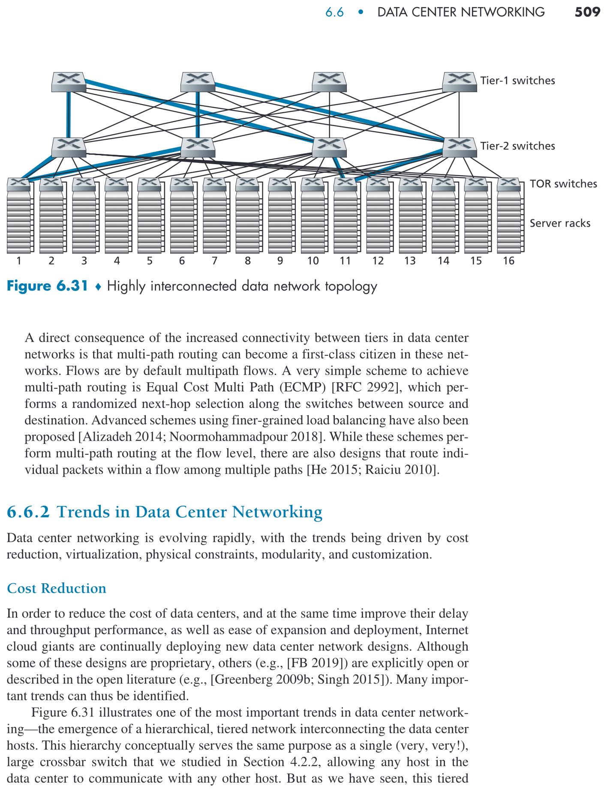

interconnection network has many advantages over a conceptual crossbar switch, including multiple paths from source to destination and the increased capacity (due to multipath routing) and reliability (due to multiple switch- and link-disjoint paths between any two hosts).

The data center interconnection network is comprised of a large number of smallsized switches. For example, in Google's Jupiter datacenter fabric, one configuration has 48 links between the ToR switch and its servers below, and connections up to 8 tier-2 switches; a tier-2 switch has links to 256 ToR switches and links up to 16 tier-1 switches [Singh 2015]. In Facebook's data center architecture, each ToR switch connects up to four different tier-2 switches (each in a different "spline plane"), and each tier-2 switch connects up to 4 of the 48 tier-1 switches in its spline plane; there are four spline planes. Tier-1 and tier-2 switches connect down to a larger, scalable number of tier-2 or ToR switches, respectively, below [FB 2019]. For some of the largest data center operators, these switches are being built in-house from commodity, off-the-shelf, merchant silicon [Greenberg 2009b; Roy 2015; Singh 2015] rather than being purchased from switch vendors.

A multi-switch layered (tiered, multistage) interconnection network such as that in Figure 6.31 and as implemented in the data center architectures discussed above is known as Clos networks, named after Charles Clos, who studied such networks [Clos 1953] in the context of telephony switching. Since then, a rich theory of Clos networks has been developed, finding additional use in data center networking and in multiprocessor interconnection networks.

#### Centralized SDN Control and Management

Because a data center is managed by a single organization, it is perhaps natural that a number of the largest data center operators, including Google, Microsoft, and Facebook, are embracing the notion of SDN-like logically centralized control. Their architectures also reflect a clear separation of a data plane (comprised of relatively simple, commodity switches) and a software-based control plane, as we saw in Section 5.5. Due to the immense-scale of their data centers, automated configuration and operational state management, as we encountered in Section 5.7, are also crucial.

#### Virtualization

Virtualization has been a driving force for much of the growth of cloud computing and data center networks more generally. Virtual Machines (VMs) decouple software running applications from the physical hardware. This decoupling also allows seamless migration of VMs between physical servers, which might be located on different racks. Standard Ethernet and IP protocols have limitations in enabling the movement of VMs while maintaining active network connections across servers. Since all data center networks are managed by a single administrative authority, an elegant solution to the problem is to treat the entire data center network as a single, flat, layer-2 network. Recall that in a typical Ethernet network, the ARP protocol maintains the binding between the IP address and hardware (MAC) address on an

6.6 • DATA CENTER NETWORKING **511**

interface. To emulate the effect of having all hosts connect to a "single" switch, the ARP mechanism is modified to use a DNS style query system instead of a broadcast, and the directory maintains a mapping of the IP address assigned to a VM and which physical switch the VM is currently connected to in the data center network. Scalable schemes that implement this basic design have been proposed in [Mysore 2009; Greenberg 2009b] and have been successfully deployed in modern data centers.

#### Physical Constraints

Unlike the wide area Internet, data center networks operate in environments that not only have very high capacity (40 Gbps and 100 Gbps links are now commonplace) but also have extremely low delays (microseconds). Consequently, buffer sizes are small and congestion control protocols such as TCP and its variants do not scale well in data centers. In data centers, congestion control protocols have to react fast and operate in extremely low loss regimes, as loss recovery and timeouts can lead to extreme inefficiency. Several approaches to tackle this issue have been proposed and deployed, ranging from data center-specific TCP variants [Alizadeh 2010] to implementing Remote Direct Memory Access (RDMA) technologies on standard Ethernet [Zhu 2015; Moshref 2016; Guo 2016]. Scheduling theory has also been applied to develop mechanisms that decouple flow scheduling from rate control, enabling very simple congestion control protocols while maintaining high utilization of the links [Alizadeh 2013; Hong 2012].

#### Hardware Modularity and Customization

Another major trend is to employ shipping container–based modular data centers (MDCs) [YouTube 2009; Waldrop 2007]. In an MDC, a factory builds, within a standard 12-meter shipping container, a "mini data center" and ships the container to the data center location. Each container has up to a few thousand hosts, stacked in tens of racks, which are packed closely together. At the data center location, multiple containers are interconnected with each other and also with the Internet. Once a prefabricated container is deployed at a data center, it is often difficult to service. Thus, each container is designed for graceful performance degradation: as components (servers and switches) fail over time, the container continues to operate but with degraded performance. When many components have failed and performance has dropped below a threshold, the entire container is removed and replaced with a fresh one.

Building a data center out of containers creates new networking challenges. With an MDC, there are two types of networks: the container-internal networks within each of the containers and the core network connecting each container [Guo 2009; Farrington 2010]. Within each container, at the scale of up to a few thousand hosts, it is possible to build a fully connected network using inexpensive commodity Gigabit Ethernet switches. However, the design of the core network, interconnecting hundreds to thousands of containers while providing high host-to-host bandwidth across containers for typical workloads, remains a challenging problem. A hybrid

electrical/optical switch architecture for interconnecting the containers is described in [Farrington 2010].

Another important trend is that large cloud providers are increasingly building or customizing just about everything that is in their data centers, including network adapters, switches routers, TORs, software, and networking protocols [Greenberg 2015; Singh 2015]. Another trend, pioneered by Amazon, is to improve reliability with "availability zones," which essentially replicate distinct data centers in different nearby buildings. By having the buildings nearby (a few kilometers apart), transactional data can be synchronized across the data centers in the same availability zone while providing fault tolerance [Amazon 2014]. Many more innovations in data center design are likely to continue to come.

## 6.7 Retrospective: A Day in the Life of a Web

## Page Request

Now that we've covered the link layer in this chapter, and the network, transport and application layers in earlier chapters, our journey down the protocol stack is complete! In the very beginning of this book (Section 1.1), we wrote "much of this book is concerned with computer network protocols," and in the first five chapters, we've certainly seen that this is indeed the case! Before heading into the topical chapters in second part of this book, we'd like to wrap up our journey down the protocol stack by taking an integrated, holistic view of the protocols we've learned about so far. One way then to take this "big picture" view is to identify the many (many!) protocols that are involved in satisfying even the simplest request: downloading a Web page. Figure 6.32 illustrates our setting: a student, Bob, connects a laptop to his school's Ethernet switch and downloads a Web page (say the home page of www.google.com). As we now know, there's a *lot* going on "under the hood" to satisfy this seemingly simple request. A Wireshark lab at the end of this chapter examines trace files containing a number of the packets involved in similar scenarios in more detail.

## 6.7.1 Getting Started: DHCP, UDP, IP, and Ethernet

Let's suppose that Bob boots up his laptop and then connects it to an Ethernet cable connected to the school's Ethernet switch, which in turn is connected to the school's router, as shown in Figure 6.32. The school's router is connected to an ISP, in this example, comcast.net. In this example, comcast.net is providing the DNS service for the school; thus, the DNS server resides in the Comcast network rather than the school network. We'll assume that the DHCP server is running within the router, as is often the case.

When Bob first connects his laptop to the network, he can't do anything (e.g., download a Web page) without an IP address. Thus, the first network-related

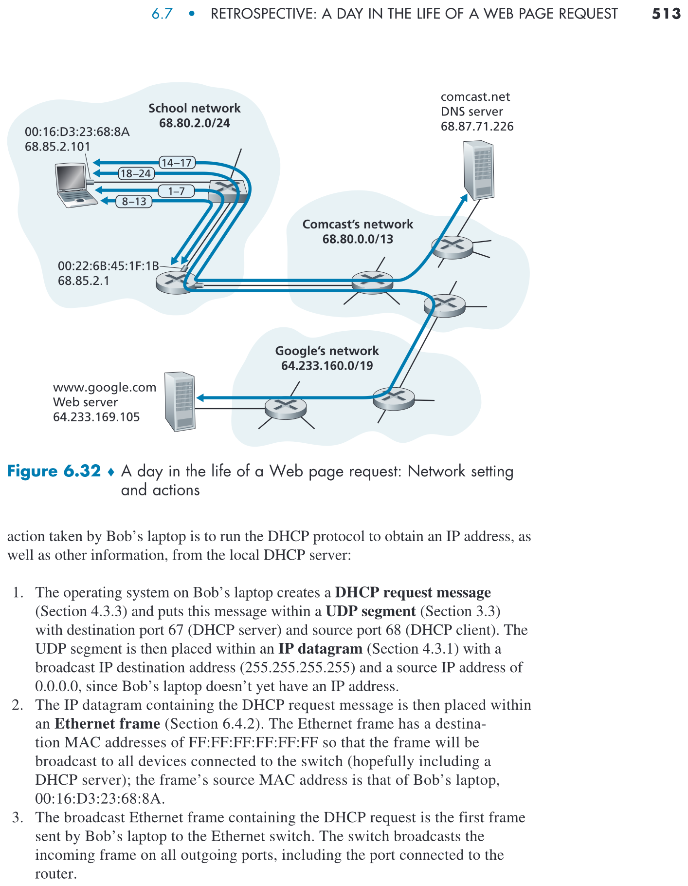

4. The router receives the broadcast Ethernet frame containing the DHCP request on its interface with MAC address 00:22:6B:45:1F:1B and the IP datagram is extracted from the Ethernet frame. The datagram's broadcast IP destination address indicates that this IP datagram should be processed by upper layer protocols at this node, so the datagram's payload (a UDP segment) is thus **demultiplexed** (Section 3.2) up to UDP, and the DHCP request message is extracted from the UDP segment. The DHCP server now has the DHCP request message.

5. Let's suppose that the DHCP server running within the router can allocate IP addresses in the **CIDR** (Section 4.3.3) block 68.85.2.0/24. In this example, all IP addresses used within the school are thus within Comcast's address block. Let's suppose the DHCP server allocates address 68.85.2.101 to Bob's laptop. The DHCP server creates a **DHCP ACK message** (Section 4.3.3) containing this IP address, as well as the IP address of the DNS server (68.87.71.226), the IP address for the default gateway router (68.85.2.1), and the subnet block (68.85.2.0/24) (equivalently, the "network mask"). The DHCP message is put inside a UDP segment, which is put inside an IP datagram, which is put inside an Ethernet frame. The Ethernet frame has a source MAC address of the router's interface to the home network (00:22:6B:45:1F:1B) and a destination MAC address of Bob's laptop (00:16:D3:23:68:8A).

6. The Ethernet frame containing the DHCP ACK is sent (unicast) by the router to the switch. Because the switch is **self-learning** (Section 6.4.3) and previously received an Ethernet frame (containing the DHCP request) from Bob's laptop, the switch knows to forward a frame addressed to 00:16:D3:23:68:8A only to the output port leading to Bob's laptop.

7. Bob's laptop receives the Ethernet frame containing the DHCP ACK, extracts the IP datagram from the Ethernet frame, extracts the UDP segment from the IP datagram, and extracts the DHCP ACK message from the UDP segment. Bob's DHCP client then records its IP address and the IP address of its DNS server. It also installs the address of the default gateway into its **IP forward-** **ing table** (Section 4.1). Bob's laptop will send all datagrams with destination address outside of its subnet 68.85.2.0/24 to the default gateway. At this point, Bob's laptop has initialized its networking components and is ready to begin processing the Web page fetch. (Note that only the last two DHCP steps of the four presented in Chapter 4 are actually necessary.)

## 6.7.2 Still Getting Started: DNS and ARP

When Bob types the URL for www.google.com into his Web browser, he begins the long chain of events that will eventually result in Google's home page being displayed by his Web browser. Bob's Web browser begins the process by creating a **TCP socket** (Section 2.7) that will be used to send the **HTTP request** (Section 2.2) to www.google.com. In order to create the socket, Bob's laptop will need to know

6.7 • RETROSPECTIVE: A DAY IN THE LIFE OF A WEB PAGE REQUEST **515**

the IP address of www.google.com. We learned in Section 2.5, that the **DNS protocol** is used to provide this name-to-IP-address translation service.

8. The operating system on Bob's laptop thus creates a DNS query message (Section 2.5.3), putting the string "www.google.com" in the question section of the DNS message. This DNS message is then placed within a UDP segment with a destination port of 53 (DNS server). The UDP segment is then placed within an IP datagram with an IP destination address of 68.87.71.226 (the address of the DNS server returned in the DHCP ACK in step 5) and a source IP address of 68.85.2.101.

9. Bob's laptop then places the datagram containing the DNS query message in an Ethernet frame. This frame will be sent (addressed, at the link layer) to the gateway router in Bob's school's network. However, even though Bob's laptop knows the IP address of the school's gateway router (68.85.2.1) via the DHCP ACK message in step 5 above, it doesn't know the gateway router's MAC address. In order to obtain the MAC address of the gateway router, Bob's laptop will need to use the **ARP protocol** (Section 6.4.1).

10. Bob's laptop creates an ARP query message with a target IP address of 68.85.2.1 (the default gateway), places the ARP message within an Ethernet frame with a broadcast destination address (FF:FF:FF:FF:FF:FF) and sends the Ethernet frame to the switch, which delivers the frame to all connected devices, including the gateway router.

11. The gateway router receives the frame containing the ARP query message on the interface to the school network, and finds that the target IP address of 68.85.2.1 in the ARP message matches the IP address of its interface. The gateway router thus prepares an **ARP reply,** indicating that its MAC address of 00:22:6B:45:1F:1B corresponds to IP address 68.85.2.1. It places the ARP reply message in an Ethernet frame, with a destination address of 00:16:D3:23:68:8A (Bob's laptop) and sends the frame to the switch, which delivers the frame to Bob's laptop.

12. Bob's laptop receives the frame containing the ARP reply message and extracts the MAC address of the gateway router (00:22:6B:45:1F:1B) from the ARP reply message.

13. Bob's laptop can now (finally!) address the Ethernet frame containing the DNS query to the gateway router's MAC address. Note that the IP datagram in this frame has an IP destination address of 68.87.71.226 (the DNS server), while the frame has a destination address of 00:22:6B:45:1F:1B (the gateway router). Bob's laptop sends this frame to the switch, which delivers the frame to the gateway router.

## 6.7.3 Still Getting Started: Intra-Domain Routing to the

### DNS Server

14. The gateway router receives the frame and extracts the IP datagram containing the DNS query. The router looks up the destination address of this datagram

(68.87.71.226) and determines from its forwarding table that the datagram should be sent to the leftmost router in the Comcast network in Figure 6.32. The IP datagram is placed inside a link-layer frame appropriate for the link connecting the school's router to the leftmost Comcast router and the frame is sent over this link.

15. The leftmost router in the Comcast network receives the frame, extracts the IP datagram, examines the datagram's destination address (68.87.71.226) and determines the outgoing interface on which to forward the datagram toward the DNS server from its forwarding table, which has been filled in by Comcast's intra-domain protocol (such as **RIP, OSPF** or **IS-IS,** Section 5.3) as well as the **Internet's inter-domain protocol, BGP** (Section 5.4).

16. Eventually the IP datagram containing the DNS query arrives at the DNS server. The DNS server extracts the DNS query message, looks up the name www.google.com in its DNS database (Section 2.5), and finds the **DNS resource** **record** that contains the IP address (64.233.169.105) for www.google.com. (assuming that it is currently cached in the DNS server). Recall that this cached data originated in the **authoritative DNS server** (Section 2.5.2) for google.com. The DNS server forms a **DNS reply message** containing this hostname-to-IPaddress mapping, and places the DNS reply message in a UDP segment, and the segment within an IP datagram addressed to Bob's laptop (68.85.2.101). This datagram will be forwarded back through the Comcast network to the school's router and from there, via the Ethernet switch to Bob's laptop.

17. Bob's laptop extracts the IP address of the server www.google.com from the DNS message. *Finally,* after a *lot* of work, Bob's laptop is now ready to contact the www.google.com server!

## 6.7.4 Web Client-Server Interaction: TCP and HTTP

18. Now that Bob's laptop has the IP address of www.google.com, it can create the **TCP socket** (Section 2.7) that will be used to send the **HTTP GET** message (Section 2.2.3) to www.google.com. When Bob creates the TCP socket, the TCP in Bob's laptop must first perform a **three-way handshake** (Section 3.5.6) with the TCP in www.google.com. Bob's laptop thus first creates a **TCP SYN** segment with destination port 80 (for HTTP), places the TCP segment inside an IP datagram with a destination IP address of 64.233.169.105 (www.google.com), places the datagram inside a frame with a destination MAC address of 00:22:6B:45:1F:1B (the gateway router) and sends the frame to the switch.

19. The routers in the school network, Comcast's network, and Google's network forward the datagram containing the TCP SYN toward www.google.com, using the forwarding table in each router, as in steps 14–16 above. Recall that the router forwarding table entries governing forwarding of packets over the inter-domain link between the Comcast and Google networks are determined by the **BGP** protocol (Chapter 5).

6.7 • RETROSPECTIVE: A DAY IN THE LIFE OF A WEB PAGE REQUEST **517**

20. Eventually, the datagram containing the TCP SYN arrives at www.google.com. The TCP SYN message is extracted from the datagram and demultiplexed to the welcome socket associated with port 80. A connection socket (Section 2.7) is created for the TCP connection between the Google HTTP server and Bob's laptop. A TCP SYNACK (Section 3.5.6) segment is generated, placed inside a datagram addressed to Bob's laptop, and finally placed inside a link-layer frame appropriate for the link connecting www.google.com to its first-hop router.

21. The datagram containing the TCP SYNACK segment is forwarded through the Google, Comcast, and school networks, eventually arriving at the Ethernet controller in Bob's laptop. The datagram is demultiplexed within the operating system to the TCP socket created in step 18, which enters the connected state.

22. With the socket on Bob's laptop now (finally!) ready to send bytes to www.google.com, Bob's browser creates the HTTP GET message (Section 2.2.3) containing the URL to be fetched. The HTTP GET message is then written into the socket, with the GET message becoming the payload of a TCP segment. The TCP segment is placed in a datagram and sent and delivered to www.google.com as in steps 18–20 above.

23. The HTTP server at www.google.com reads the HTTP GET message from the TCP socket, creates an **HTTP response** message (Section 2.2), places the requested Web page content in the body of the HTTP response message, and sends the message into the TCP socket.

24. The datagram containing the HTTP reply message is forwarded through the Google, Comcast, and school networks, and arrives at Bob's laptop. Bob's Web browser program reads the HTTP response from the socket, extracts the html for the Web page from the body of the HTTP response, and finally *(finally!)* displays the Web page! Our scenario above has covered a lot of networking ground! If you've understood

most or all of the above example, then you've also covered a lot of ground since you first read Section 1.1, where we wrote "much of this book is concerned with computer network protocols" and you may have wondered what a protocol actually was! As detailed as the above example might seem, we've omitted a number of possible additional protocols (e.g., NAT running in the school's gateway router, wireless access to the school's network, security protocols for accessing the school network or encrypting segments or datagrams, network management protocols), and considerations (Web caching, the DNS hierarchy) that one would encounter in the public Internet. We'll cover a number of these topics and more in the second part of this book. Lastly, we note that our example above was an integrated and holistic, but also very "nuts and bolts," view of many of the protocols that we've studied in the first part of this book. The example focused more on the "how" than the "why." For a broader, more reflective view on the design of network protocols in general, you might want to re-read the "Architectural Principles of the Internet" in Section 4.5, and the references therein.

## 6.8 Summary

In this chapter, we've examined the link layer—its services, the principles underlying its operation, and a number of important specific protocols that use these principles in implementing link-layer services.

We saw that the basic service of the link layer is to move a network-layer datagram from one node (host, switch, router, WiFi access point) to an adjacent node. We saw that all link-layer protocols operate by encapsulating a network-layer datagram within a link-layer frame before transmitting the frame over the link to the adjacent node. Beyond this common framing function, however, we learned that different link-layer protocols provide very different link access, delivery, and transmission services. These differences are due in part to the wide variety of link types over which link-layer protocols must operate. A simple point-to-point link has a single sender and receiver communicating over a single "wire." A multiple access link is shared among many senders and receivers; consequently, the link-layer protocol for a multiple access channel has a protocol (its multiple access protocol) for coordinating link access. In the case of MPLS, the "link" connecting two adjacent nodes (for example, two IP routers that are adjacent in an IP sense—that they are next-hop IP routers toward some destination) may actually be a *network* in and of itself. In one sense, the idea of a network being considered as a link should not seem odd. A telephone link connecting a home modem/computer to a remote modem/router, for example, is actually a path through a sophisticated and complex telephone *network.*

Among the principles underlying link-layer communication, we examined errordetection and -correction techniques, multiple access protocols, link-layer addressing, virtualization (VLANs), and the construction of extended switched LANs and data center networks. Much of the focus today at the link layer is on these switched networks. In the case of error detection/correction, we examined how it is possible to add additional bits to a frame's header in order to detect, and in some cases correct, bit-flip errors that might occur when the frame is transmitted over the link. We covered simple parity and checksumming schemes, as well as the more robust cyclic redundancy check. We then moved on to the topic of multiple access protocols. We identified and studied three broad approaches for coordinating access to a broadcast channel: channel partitioning approaches (TDM, FDM), random access approaches (the ALOHA protocols and CSMA protocols), and taking-turns approaches (polling and token passing). We studied the cable access network and found that it uses many of these multiple access methods. We saw that a consequence of having multiple nodes share a single broadcast channel was the need to provide node addresses at the link layer. We learned that link-layer addresses were quite different from network-layer addresses and that, in the case of the Internet, a special protocol (ARP—the Address Resolution Protocol) is used to translate between these two forms of addressing and studied the hugely successful Ethernet protocol in detail. We then examined how nodes sharing a broadcast channel form a LAN and how multiple LANs can be connected together to form larger LANs—all *without* the intervention

HOMEWORK PROBLEMS AND QUESTIONS **519**

of network-layer routing to interconnect these local nodes. We also learned how multiple virtual LANs can be created on a single physical LAN infrastructure.

We ended our study of the link layer by focusing on how MPLS networks provide link-layer services when they interconnect IP routers and an overview of the network designs for today's massive data centers. We wrapped up this chapter (and indeed the first five chapters) by identifying the many protocols that are needed to fetch a simple Web page. Having covered the link layer, *our journey down the pro-* *tocol stack is now over!* Certainly, the physical layer lies below the link layer, but the details of the physical layer are probably best left for another course (e.g., in communication theory, rather than computer networking). We have, however, touched upon several aspects of the physical layer in this chapter and in Chapter 1 (our discussion of physical media in Section 1.2). We'll consider the physical layer again when we study wireless link characteristics in the next chapter.

Although our journey down the protocol stack is over, our study of computer networking is not yet at an end. In the following three chapters, we cover wireless networking, network security, and multimedia networking. These four topics do not fit conveniently into any one layer; indeed, each topic crosscuts many layers. Understanding these topics (billed as advanced topics in some networking texts) thus requires a firm foundation in all layers of the protocol stack—a foundation that our study of the link layer has now completed!

## Homework Problems and Questions

### Chapter 6 Review Questions

SECTIONS 6.1–6.2

R1. Consider the transportation analogy in Section 6.1.1. If the passenger is analagous to a datagram, what is analogous to the link layer frame?

R2. If all the links in the Internet were to provide reliable delivery service, would the TCP reliable delivery service be redundant? Why or why not?

R3. What are some of the possible services that a link-layer protocol can offer to the network layer? Which of these link-layer services have corresponding services in IP? In TCP?

SECTION 6.3

R4. Suppose two nodes start to transmit at the same time a packet of length *L* over a broadcast channel of rate *R.* Denote the propagation delay between the two nodes as $d_{prop}$. Will there be a collision if $d_{prop}$ 6 L/R? Why or why not? R5. In Section 6.3, we listed four desirable characteristics of a broadcast channel.

Which of these characteristics does slotted ALOHA have? Which of these characteristics does token passing have?

---

## Repeated content (headers / footers / watermarks)

> The following appeared on most pages and was moved out of the body to keep reading order clean — kept here, not deleted.

- 450 CHAPTER 6 • THE LINK LAYER AND LANS · 452 CHAPTER 6 • THE LINK LAYER AND LANS · 458 CHAPTER 6 • THE LINK LAYER AND LANS · 466 CHAPTER 6 • THE LINK LAYER AND LANS · 468 CHAPTER 6 • THE LINK LAYER AND LANS · 470 CHAPTER 6 • THE LINK LAYER AND LANS · 474 CHAPTER 6 • THE LINK LAYER AND LANS · 478 CHAPTER 6 • THE LINK LAYER AND LANS · 480 CHAPTER 6 • THE LINK LAYER AND LANS · 484 CHAPTER 6 • THE LINK LAYER AND LANS · 488 CHAPTER 6 • THE LINK LAYER AND LANS · 490 CHAPTER 6 • THE LINK LAYER AND LANS · 492 CHAPTER 6 • THE LINK LAYER AND LANS · 494 CHAPTER 6 • THE LINK LAYER AND LANS · 504 CHAPTER 6 • THE LINK LAYER AND LANS · 508 CHAPTER 6 • THE LINK LAYER AND LANS · 510 CHAPTER 6 • THE LINK LAYER AND LANS · 512 CHAPTER 6 • THE LINK LAYER AND LANS · 514 CHAPTER 6 • THE LINK LAYER AND LANS · 516 CHAPTER 6 • THE LINK LAYER AND LANS · 518 CHAPTER 6 • THE LINK LAYER AND LANS  *(pp.2, 4, 10, 18, 20, 22, 26, 30, 32, 36, 40, 42, 44, 46, 56, 60, 62, 64, 66, 68, 70)*
- 6.3 • MULTIPLE ACCESS LINKS AND PROTOCOLS 461 · 6.3 • MULTIPLE ACCESS LINKS AND PROTOCOLS 463 · 6.3 • MULTIPLE ACCESS LINKS AND PROTOCOLS 465 · 6.3 • MULTIPLE ACCESS LINKS AND PROTOCOLS 473 · 6.3 • MULTIPLE ACCESS LINKS AND PROTOCOLS 475  *(pp.13, 15, 17, 25, 27)*
- 6.4 • SWITCHED LOCAL AREA NETWORKS 485 · 6.4 • SWITCHED LOCAL AREA NETWORKS 487 · 6.4 • SWITCHED LOCAL AREA NETWORKS 495 · 6.4 • SWITCHED LOCAL AREA NETWORKS 497 · 6.4 • SWITCHED LOCAL AREA NETWORKS 499  *(pp.37, 39, 47, 49, 51)*
- Column parity  *(p.9)*